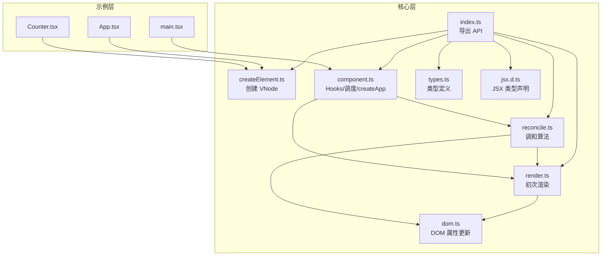
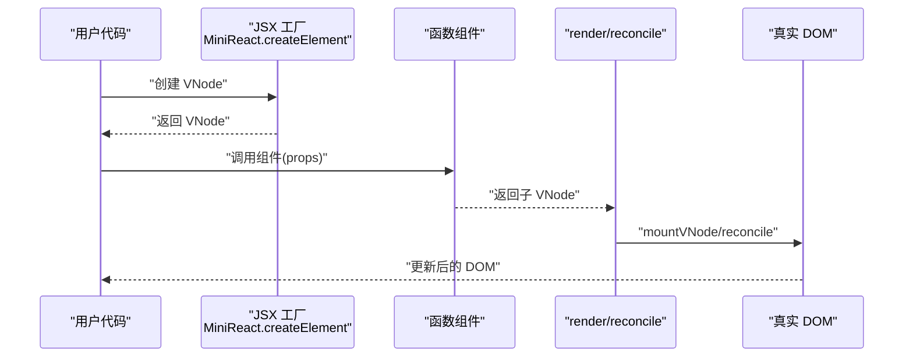
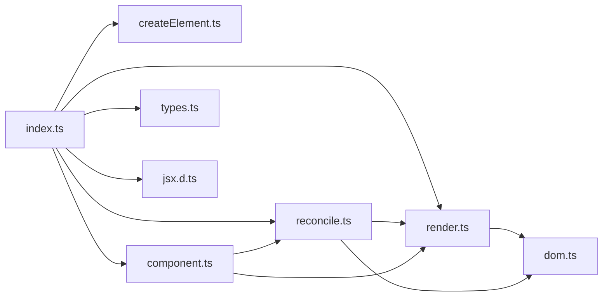

# API 参考手册

<cite>
**本文档引用的文件**
- [src/mini-react/index.ts](file://src/mini-react/index.ts)
- [src/mini-react/createElement.ts](file://src/mini-react/createElement.ts)
- [src/mini-react/render.ts](file://src/mini-react/render.ts)
- [src/mini-react/reconcile.ts](file://src/mini-react/reconcile.ts)
- [src/mini-react/component.ts](file://src/mini-react/component.ts)
- [src/mini-react/dom.ts](file://src/mini-react/dom.ts)
- [src/mini-react/types.ts](file://src/mini-react/types.ts)
- [src/mini-react/jsx.d.ts](file://src/mini-react/jsx.d.ts)
- [src/app/App.tsx](file://src/app/App.tsx)
- [src/app/Counter.tsx](file://src/app/Counter.tsx)
- [src/main.tsx](file://src/main.tsx)
- [package.json](file://package.json)
</cite>

## 目录
1. [简介](#简介)
2. [项目结构](#项目结构)
3. [核心组件](#核心组件)
4. [架构总览](#架构总览)
5. [详细组件分析](#详细组件分析)
6. [依赖关系分析](#依赖关系分析)
7. [性能考量](#性能考量)
8. [故障排除指南](#故障排除指南)
9. [结论](#结论)
10. [附录](#附录)

## 简介
本参考手册面向使用 mini-react 的开发者，系统性地介绍 mini-react 的公开 API，包括 createElement、render、reconcile、useState、createApp 等核心函数。文档提供参数说明、返回值类型、调用约定与限制、错误处理机制、类型定义、版本兼容性与迁移建议，并结合实际示例与常见用法模式帮助开发者高效使用。

## 项目结构
mini-react 采用按功能模块划分的组织方式：
- mini-react 核心层：负责虚拟 DOM、渲染、调和、DOM 属性更新、Hooks 与调度等
- app 示例层：提供示例组件与入口，演示如何使用 mini-react
- 类型与 JSX 声明：提供 VNode、Props、ComponentFunction 等类型定义以及 JSX 全局类型声明

图表来源
- [src/mini-react/index.ts:1-12](file://src/mini-react/index.ts#L1-L12)
- [src/mini-react/createElement.ts:1-58](file://src/mini-react/createElement.ts#L1-L58)
- [src/mini-react/render.ts:1-49](file://src/mini-react/render.ts#L1-L49)
- [src/mini-react/reconcile.ts:1-110](file://src/mini-react/reconcile.ts#L1-L110)
- [src/mini-react/component.ts:1-137](file://src/mini-react/component.ts#L1-L137)
- [src/mini-react/dom.ts:1-97](file://src/mini-react/dom.ts#L1-L97)
- [src/mini-react/types.ts:1-26](file://src/mini-react/types.ts#L1-L26)
- [src/mini-react/jsx.d.ts:1-14](file://src/mini-react/jsx.d.ts#L1-L14)
- [src/app/App.tsx:1-33](file://src/app/App.tsx#L1-L33)
- [src/app/Counter.tsx:1-52](file://src/app/Counter.tsx#L1-L52)
- [src/main.tsx:1-6](file://src/main.tsx#L1-L6)

章节来源
- [src/mini-react/index.ts:1-12](file://src/mini-react/index.ts#L1-L12)
- [src/mini-react/types.ts:1-26](file://src/mini-react/types.ts#L1-L26)
- [src/mini-react/jsx.d.ts:1-14](file://src/mini-react/jsx.d.ts#L1-L14)

## 核心组件
本节概述 mini-react 的公开 API，包括导出与默认导出，以及各函数的作用范围与典型用途。

- 导出 API
  - createElement：创建虚拟 DOM 节点（VNode），支持字符串标签与函数组件
  - render：将 VNode 首次挂载到容器
  - reconcile：对比新旧 VNode，增量更新真实 DOM
  - createApp：创建应用实例并执行首次渲染
  - useState：函数组件状态 Hook
  - TEXT_ELEMENT：文本节点常量
  - 类型别名：VNode、Props、ComponentFunction
- 默认导出
  - MiniReact：默认导出对象，包含 createElement 方法，便于作为 JSX 工厂使用

章节来源
- [src/mini-react/index.ts:1-12](file://src/mini-react/index.ts#L1-L12)

## 架构总览
mini-react 的运行流程从 JSX 语法开始，经由 createElement 生成 VNode，随后 render 或 reconcile 将其挂载/更新为真实 DOM。函数组件通过 useState 维护内部状态，createApp 提供应用级调度与批量更新。

图表来源
- [src/mini-react/index.ts:8-11](file://src/mini-react/index.ts#L8-L11)
- [src/mini-react/createElement.ts:9-25](file://src/mini-react/createElement.ts#L9-L25)
- [src/mini-react/render.ts:9-40](file://src/mini-react/render.ts#L9-L40)
- [src/mini-react/reconcile.ts:14-81](file://src/mini-react/reconcile.ts#L14-L81)
- [src/mini-react/component.ts:16-32](file://src/mini-react/component.ts#L16-L32)

## 详细组件分析

### createElement
- 功能：创建虚拟 DOM 节点（VNode），支持字符串标签与函数组件；规范化 children，过滤无效值，将字符串/数字转为文本节点
- 参数
  - type：字符串标签或函数组件
  - props：属性对象（可选）
  - ...rawChildren：任意数量的子节点
- 返回值：VNode
- 关键行为
  - 从 props 中移除 key 并保留 key 值
  - children 规范化：扁平化、过滤 null/undefined/boolean、字符串/数字转文本节点
- 使用建议
  - 优先使用 JSX 语法，编译器会自动调用 createElement
  - 自定义组件请使用函数签名：(props) => VNode
- 错误处理
  - 无显式抛错；非法 children 会被过滤
- 性能特性
  - O(n) 规范化 children，n 为子节点数量
- 示例路径
  - [src/app/Counter.tsx:17-48](file://src/app/Counter.tsx#L17-L48)
  - [src/app/App.tsx:5-31](file://src/app/App.tsx#L5-L31)

章节来源
- [src/mini-react/createElement.ts:9-25](file://src/mini-react/createElement.ts#L9-L25)
- [src/mini-react/createElement.ts:33-48](file://src/mini-react/createElement.ts#L33-L48)
- [src/mini-react/createElement.ts:50-57](file://src/mini-react/createElement.ts#L50-L57)

### render
- 功能：将 VNode 首次挂载到容器，返回真实 DOM 节点
- 参数
  - vnode：VNode
  - container：HTMLElement 容器
- 返回值：void
- 调用约定
  - 仅用于首次渲染；后续更新使用 reconcile 或 createApp 驱动的调度
- 内部流程
  - 函数组件：设置 Hooks 上下文、调用组件函数、清理上下文、递归挂载子 VNode
  - 文本节点：创建 Text 节点
  - 原生元素：创建 DOM、更新属性、递归挂载子节点
- 错误处理
  - 无显式抛错；若容器无效，appendChild 会触发 DOM 异常
- 性能特性
  - 递归挂载，时间复杂度 O(N)，N 为 VNode 节点数
- 示例路径
  - [src/mini-react/render.ts:45-48](file://src/mini-react/render.ts#L45-L48)

章节来源
- [src/mini-react/render.ts:9-40](file://src/mini-react/render.ts#L9-L40)
- [src/mini-react/render.ts:45-48](file://src/mini-react/render.ts#L45-L48)

### reconcile
- 功能：对比新旧 VNode，直接增量更新真实 DOM
- 参数
  - parentDom：父真实 DOM 节点
  - oldVNode：旧 VNode（可为 null，表示新增）
  - newVNode：新 VNode（可为 null，表示删除）
- 返回值：更新后的真实 DOM 节点（或 null）
- 算法分支
  1) 新增：oldVNode 为空，mountVNode 并 append
  2) 删除：newVNode 为空，移除旧 DOM
  3) 类型不同：替换整棵子树
  4) 文本节点：直接更新 nodeValue
  5) 函数组件：设置 Hooks 上下文，调用组件函数，递归 reconcile 子树
  6) 原生元素：增量更新属性，逐索引 reconcile 子节点
- 子流程 reconcileChildren
  - 按索引对比，递归 reconcile
- getDom
  - 透传函数组件，获取最终真实 DOM
- 错误处理
  - 无显式抛错；异常由 DOM 操作抛出
- 性能特性
  - 时间复杂度 O(N)，N 为变更子树节点数；空间复杂度 O(H)，H 为递归深度
- 示例路径
  - [src/mini-react/reconcile.ts:14-81](file://src/mini-react/reconcile.ts#L14-L81)
  - [src/mini-react/reconcile.ts:86-99](file://src/mini-react/reconcile.ts#L86-L99)
  - [src/mini-react/reconcile.ts:105-109](file://src/mini-react/reconcile.ts#L105-L109)

章节来源
- [src/mini-react/reconcile.ts:14-81](file://src/mini-react/reconcile.ts#L14-L81)
- [src/mini-react/reconcile.ts:86-99](file://src/mini-react/reconcile.ts#L86-L99)
- [src/mini-react/reconcile.ts:105-109](file://src/mini-react/reconcile.ts#L105-L109)

### useState
- 功能：函数组件状态 Hook，与 React 用法一致
- 参数
  - initialValue：初始状态值（泛型 T）
- 返回值：元组 [T, (val: T | (prev: T) => T) => void]
- 调用约定
  - 必须在函数组件渲染期间调用；否则抛出错误
  - 每次渲染按声明顺序递增 hookIndex，复用旧状态或初始化
- setter 支持
  - 直接赋值或函数式更新（接收旧值）
- 内部机制
  - 每个 VNode 维护 _hooks 数组；通过 Hooks 上下文 set/clear 管理
  - 触发 setter 后，scheduleUpdate 以微任务批量合并更新
- 错误处理
  - 非组件内调用抛出错误
- 性能特性
  - O(1) 访问与更新；批量更新避免重复渲染
- 示例路径
  - [src/app/Counter.tsx:4-5](file://src/app/Counter.tsx#L4-L5)
  - [src/app/Counter.tsx:19-47](file://src/app/Counter.tsx#L19-L47)

章节来源
- [src/mini-react/component.ts:51-83](file://src/mini-react/component.ts#L51-L83)
- [src/mini-react/component.ts:16-32](file://src/mini-react/component.ts#L16-L32)

### createApp
- 功能：创建应用实例并执行首次渲染；提供应用级调度与批量更新
- 参数
  - rootComponent：根组件函数
  - container：HTMLElement 容器
- 返回值：void
- 内部流程
  - 初始化应用实例，保存 rootComponent、container、currentVNode、pendingUpdate
  - 首次渲染：调用 rootComponent 生成 VNode，清空容器，mountVNode 并追加
  - 调度：scheduleUpdate 使用微任务批量合并多次 setState
- 错误处理
  - 无显式抛错；异常由 render/reconcile 抛出
- 性能特性
  - 微任务批处理减少重渲染次数
- 示例路径
  - [src/main.tsx:1-6](file://src/main.tsx#L1-L6)
  - [src/mini-react/component.ts:99-117](file://src/mini-react/component.ts#L99-L117)
  - [src/mini-react/component.ts:122-136](file://src/mini-react/component.ts#L122-L136)

章节来源
- [src/mini-react/component.ts:99-117](file://src/mini-react/component.ts#L99-L117)
- [src/mini-react/component.ts:122-136](file://src/mini-react/component.ts#L122-L136)
- [src/main.tsx:1-6](file://src/main.tsx#L1-L6)

### 类型定义与接口规范
- 常量
  - TEXT_ELEMENT：文本节点标识
- 类型
  - Props：字符串到任意值的映射
  - VNode：包含 type、props、children、key，以及内部字段 _dom、_rendered、_hooks
  - Hook：单个 Hook 存储，包含 state
  - ComponentFunction：(props) => VNode
- JSX 类型声明
  - 全局 JSX.Element 映射为 VNode
  - 内置元素映射为任意属性

章节来源
- [src/mini-react/types.ts:1-26](file://src/mini-react/types.ts#L1-L26)
- [src/mini-react/jsx.d.ts:1-14](file://src/mini-react/jsx.d.ts#L1-L14)

### DOM 属性更新（内部）
- createDom：根据 VNode 创建真实 DOM（不递归子节点）
- updateProps：增量更新 DOM 属性，包括事件绑定/解绑、style、className、value 等
- removeProp：移除属性（事件/样式/普通属性）
- setStyle：差量更新 style
- 事件命名转换：onClick → click

章节来源
- [src/mini-react/dom.ts:6-14](file://src/mini-react/dom.ts#L6-L14)
- [src/mini-react/dom.ts:19-53](file://src/mini-react/dom.ts#L19-L53)
- [src/mini-react/dom.ts:55-65](file://src/mini-react/dom.ts#L55-L65)
- [src/mini-react/dom.ts:67-86](file://src/mini-react/dom.ts#L67-L86)
- [src/mini-react/dom.ts:89-96](file://src/mini-react/dom.ts#L89-L96)

## 依赖关系分析

图表来源
- [src/mini-react/index.ts:1-6](file://src/mini-react/index.ts#L1-L6)
- [src/mini-react/render.ts:1-2](file://src/mini-react/render.ts#L1-L2)
- [src/mini-react/reconcile.ts:1-4](file://src/mini-react/reconcile.ts#L1-L4)
- [src/mini-react/component.ts:1-3](file://src/mini-react/component.ts#L1-L3)

章节来源
- [src/mini-react/index.ts:1-6](file://src/mini-react/index.ts#L1-L6)

## 性能考量
- 渲染策略
  - render 与 reconcile 均为递归遍历，时间复杂度 O(N)，N 为节点数
  - reconcile 通过类型比较与子节点索引对比，尽量减少 DOM 操作
- 批处理
  - createApp 使用微任务队列合并多次 setState，降低重渲染频率
- 属性更新
  - updateProps 仅对变化的属性进行更新，事件通过 removeEventListener/addEventListener 差量处理
- 建议
  - 合理拆分组件，避免不必要的整体重渲染
  - 使用 key 优化列表渲染（虽然 reconcile 未实现基于 key 的匹配，但保持稳定顺序有助于最小化变更）

[本节为通用性能指导，无需特定文件来源]

## 故障排除指南
- 在非函数组件中调用 useState
  - 现象：抛出错误
  - 原因：未设置 Hooks 上下文
  - 解决：确保在函数组件渲染期间调用
  - 参考：[src/mini-react/component.ts:54-56](file://src/mini-react/component.ts#L54-L56)
- 事件处理异常
  - 现象：事件未生效或报错
  - 原因：事件名格式或绑定方式不正确
  - 解决：使用 onXxx 形式的属性名，遵循 updateProps 的事件处理逻辑
  - 参考：[src/mini-react/dom.ts:37-42](file://src/mini-react/dom.ts#L37-L42)
- 文本节点更新无效
  - 现象：文本内容未更新
  - 原因：非文本节点类型或 props.nodeValue 未变化
  - 解决：确认类型为 TEXT_ELEMENT，且 nodeValue 发生变化
  - 参考：[src/mini-react/reconcile.ts:47-54](file://src/mini-react/reconcile.ts#L47-L54)
- 首次渲染失败
  - 现象：容器无内容或报错
  - 原因：容器元素不存在或 render 调用错误
  - 解决：确保容器存在且仅首次使用 render；后续使用 createApp
  - 参考：[src/mini-react/render.ts:45-48](file://src/mini-react/render.ts#L45-L48)

章节来源
- [src/mini-react/component.ts:54-56](file://src/mini-react/component.ts#L54-L56)
- [src/mini-react/dom.ts:37-42](file://src/mini-react/dom.ts#L37-L42)
- [src/mini-react/reconcile.ts:47-54](file://src/mini-react/reconcile.ts#L47-L54)
- [src/mini-react/render.ts:45-48](file://src/mini-react/render.ts#L45-L48)

## 结论
mini-react 提供了简洁而完整的虚拟 DOM 与调和机制，配合函数组件与 useState，能够满足中小型应用的开发需求。通过 createApp 的应用级调度与微任务批处理，可有效提升性能。建议开发者遵循函数组件的调用约定与 Hooks 使用规则，合理组织组件结构，以获得最佳的开发体验与运行效率。

[本节为总结性内容，无需特定文件来源]

## 附录

### 版本兼容性与迁移指南
- 版本信息
  - 当前版本：1.0.0
  - 类型系统：TypeScript
- 迁移建议
  - 从 React 迁移：API 行为与 React Hooks 基本一致，注意 mini-react 不支持并发特性与严格模式差异
  - JSX 使用：通过 MiniReact 作为工厂，或使用默认导出对象
  - DOM 差异：部分属性处理（如 className/value）与浏览器原生略有差异，详见 DOM 属性更新
- 示例路径
  - [package.json:1-17](file://package.json#L1-L17)
  - [src/main.tsx:1-6](file://src/main.tsx#L1-L6)

章节来源
- [package.json:1-17](file://package.json#L1-L17)
- [src/main.tsx:1-6](file://src/main.tsx#L1-L6)

### 常见用法模式
- JSX 语法
  - 使用 JSX 编写组件，编译器会调用 createElement
  - 示例路径：[src/app/App.tsx:5-31](file://src/app/App.tsx#L5-L31)、[src/app/Counter.tsx:17-48](file://src/app/Counter.tsx#L17-L48)
- 函数组件与状态
  - 在函数组件中使用 useState 管理本地状态
  - 示例路径：[src/app/Counter.tsx:4-5](file://src/app/Counter.tsx#L4-L5)
- 应用启动
  - 使用 createApp 创建应用实例并挂载根组件
  - 示例路径：[src/main.tsx:1-6](file://src/main.tsx#L1-L6)

章节来源
- [src/app/App.tsx:5-31](file://src/app/App.tsx#L5-L31)
- [src/app/Counter.tsx:4-5](file://src/app/Counter.tsx#L4-L5)
- [src/main.tsx:1-6](file://src/main.tsx#L1-L6)