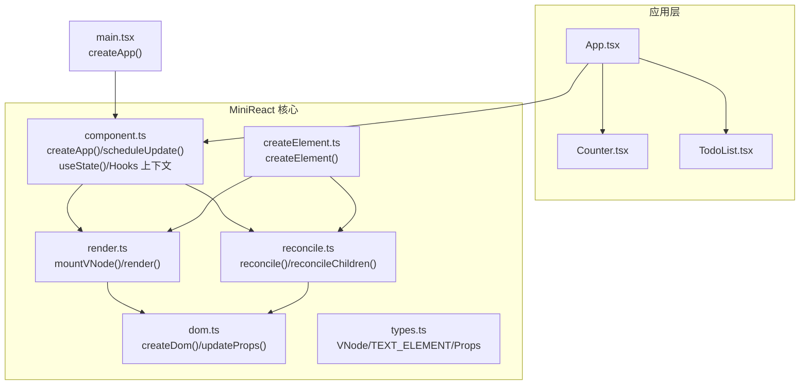
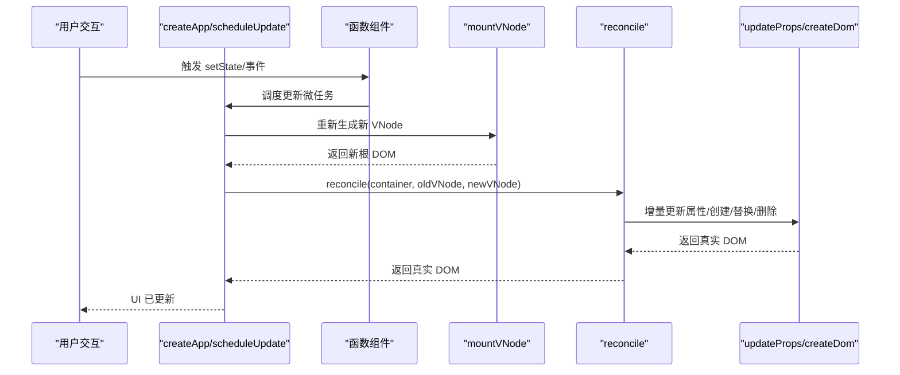
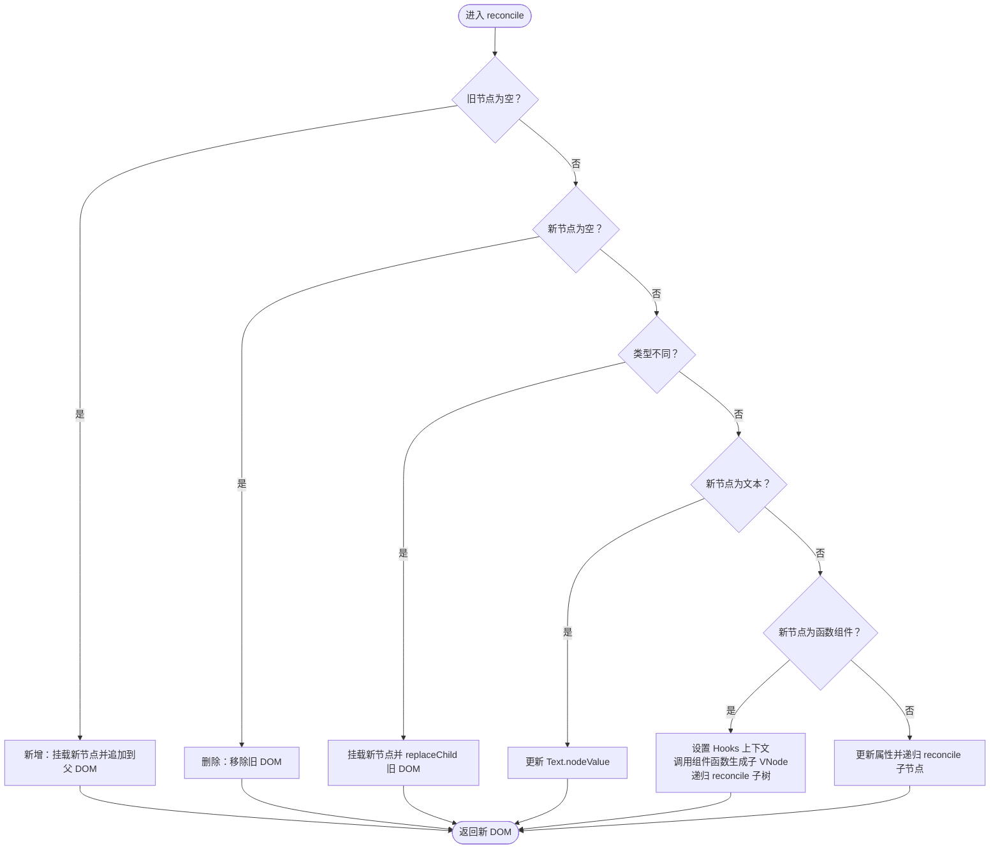
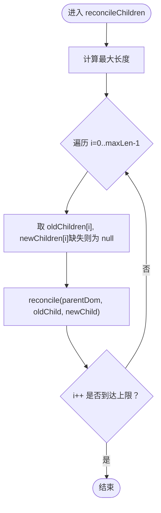
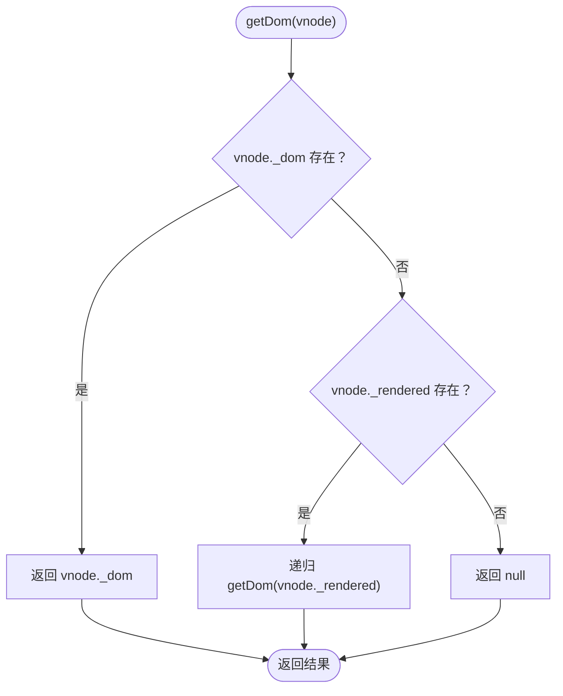
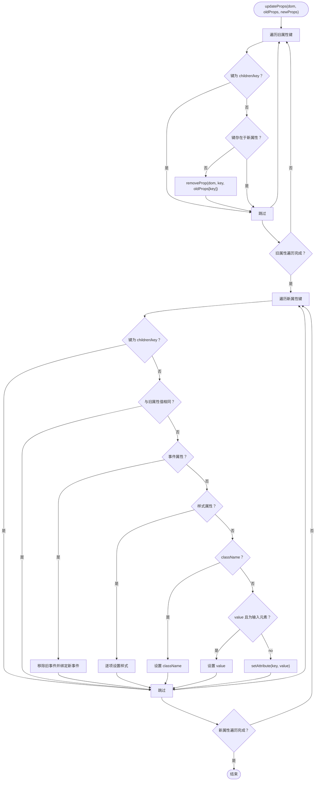
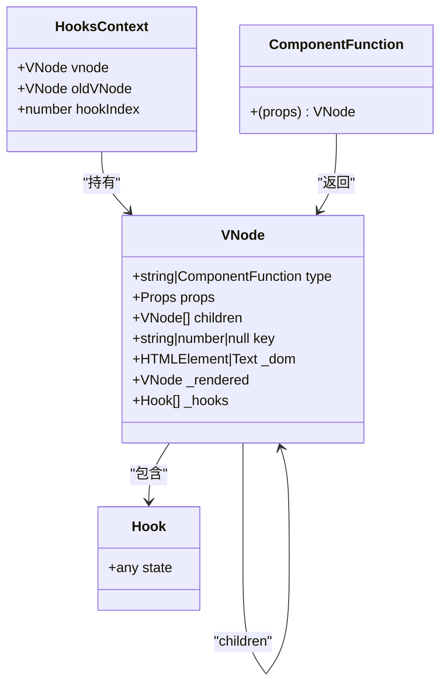
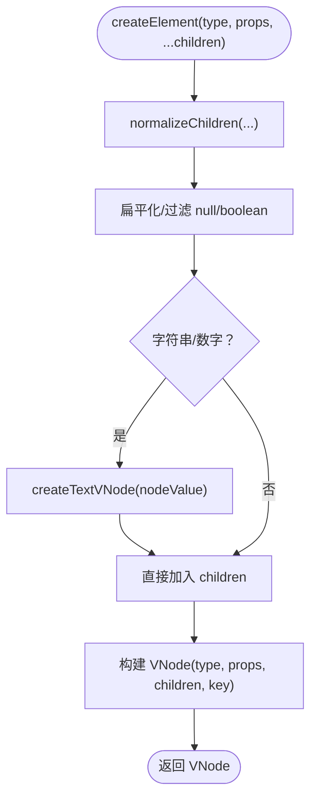
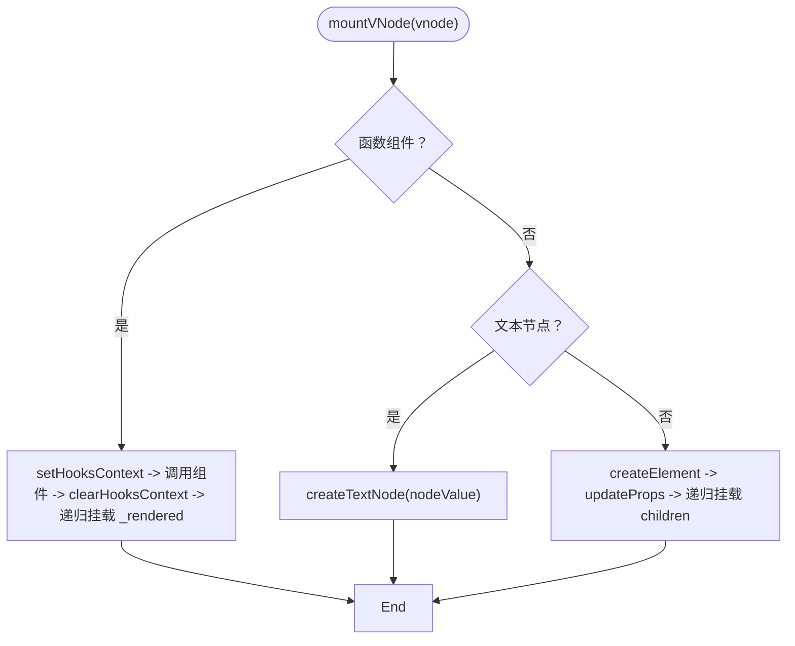
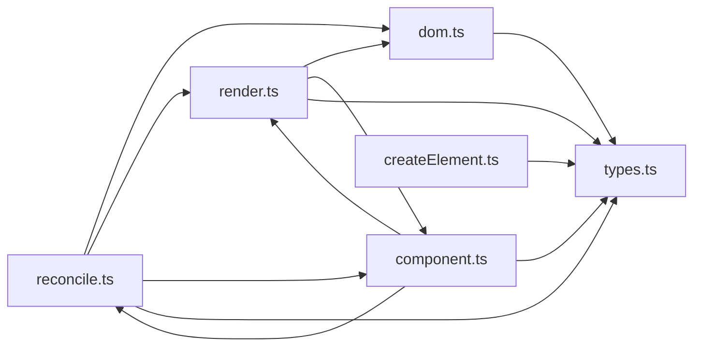

# 协调算法

<cite>
**本文引用的文件**
- [reconcile.ts](file://src/mini-react/reconcile.ts)
- [render.ts](file://src/mini-react/render.ts)
- [dom.ts](file://src/mini-react/dom.ts)
- [types.ts](file://src/mini-react/types.ts)
- [createElement.ts](file://src/mini-react/createElement.ts)
- [component.ts](file://src/mini-react/component.ts)
- [main.tsx](file://src/main.tsx)
- [App.tsx](file://src/app/App.tsx)
- [Counter.tsx](file://src/app/Counter.tsx)
- [TodoList.tsx](file://src/app/TodoList.tsx)
</cite>

## 目录
1. [简介](#简介)
2. [项目结构](#项目结构)
3. [核心组件](#核心组件)
4. [架构总览](#架构总览)
5. [详细组件分析](#详细组件分析)
6. [依赖关系分析](#依赖关系分析)
7. [性能考量](#性能考量)
8. [故障排查指南](#故障排查指南)
9. [结论](#结论)
10. [附录](#附录)

## 简介
本文件围绕协调算法（Diff/Reconcile）进行系统性技术文档编写，目标是帮助读者深入理解从旧虚拟树到新虚拟树的增量更新流程，涵盖节点比较、类型判断、更新策略、同级节点比较、最小化 DOM 操作与性能优化等主题。本文以仓库中的实现为基础，结合类型定义、DOM 属性更新、组件调度与渲染挂载等模块，给出可操作的流程图与类图，并对时间复杂度与常见问题进行分析。

## 项目结构
该项目采用“按功能分层”的组织方式：
- mini-react 核心库：负责虚拟 DOM、协调算法、渲染挂载、DOM 属性更新、组件与 Hooks、应用调度。
- app 示例：提供计数器与待办列表两个示例组件，演示协调算法在真实场景中的行为。
- 入口：main.tsx 负责创建应用实例并首次渲染。

图表来源
- [main.tsx:1-6](file://src/main.tsx#L1-L6)
- [component.ts:99-136](file://src/mini-react/component.ts#L99-L136)
- [render.ts:9-48](file://src/mini-react/render.ts#L9-L48)
- [reconcile.ts:14-81](file://src/mini-react/reconcile.ts#L14-L81)
- [dom.ts:6-53](file://src/mini-react/dom.ts#L6-L53)
- [types.ts:7-25](file://src/mini-react/types.ts#L7-L25)
- [createElement.ts:9-25](file://src/mini-react/createElement.ts#L9-L25)

章节来源
- [main.tsx:1-6](file://src/main.tsx#L1-L6)
- [App.tsx:5-32](file://src/app/App.tsx#L5-L32)
- [Counter.tsx:4-51](file://src/app/Counter.tsx#L4-L51)
- [TodoList.tsx:11-112](file://src/app/TodoList.tsx#L11-L112)

## 核心组件
- 虚拟节点与常量：VNode 接口、TEXT_ELEMENT 常量、Props 类型，统一描述节点类型、属性、子节点、key 以及内部缓存字段。
- 渲染挂载：mountVNode 实现初次挂载，递归创建真实 DOM 并设置 _dom/_rendered。
- 协调算法：reconcile 主函数负责节点比较与增量更新；reconcileChildren 负责同级节点逐索引对比。
- DOM 属性更新：updateProps 实现属性/事件/样式/className/value 的最小化更新。
- 组件与调度：createApp 首次渲染；scheduleUpdate 通过微任务批量合并更新；useState 与 Hooks 上下文保证函数组件状态复用。
- JSX 工厂：createElement 规范化 children、提取 key 并生成 VNode。

章节来源
- [types.ts:1-26](file://src/mini-react/types.ts#L1-L26)
- [render.ts:9-40](file://src/mini-react/render.ts#L9-L40)
- [reconcile.ts:14-99](file://src/mini-react/reconcile.ts#L14-L99)
- [dom.ts:19-53](file://src/mini-react/dom.ts#L19-L53)
- [component.ts:22-83](file://src/mini-react/component.ts#L22-L83)
- [createElement.ts:9-57](file://src/mini-react/createElement.ts#L9-L57)

## 架构总览
协调算法贯穿“渲染—调度—协调—DOM 更新”链路，整体流程如下：

图表来源
- [component.ts:122-136](file://src/mini-react/component.ts#L122-L136)
- [render.ts:45-48](file://src/mini-react/render.ts#L45-L48)
- [reconcile.ts:14-81](file://src/mini-react/reconcile.ts#L14-L81)
- [dom.ts:19-53](file://src/mini-react/dom.ts#L19-L53)

## 详细组件分析

### 协调主函数 reconcile 的实现与策略
reconcile 是协调算法的核心，负责对比旧 VNode 与新 VNode，并执行最小化的真实 DOM 更新。其策略分为以下几类：

- 新增节点：当旧节点为空而新节点存在时，直接挂载新节点并追加到父 DOM。
- 删除节点：当旧节点存在而新节点为空时，移除旧节点对应的真实 DOM。
- 类型不同：当节点类型不相等时，直接用新节点挂载并替换旧节点的真实 DOM。
- 文本节点：当新节点为文本类型时，仅更新 Text 节点的 nodeValue。
- 函数组件：进入函数组件渲染流程，设置 Hooks 上下文，调用组件函数生成子 VNode，然后递归 reconcile 子树。
- 原生元素：更新属性并递归 reconcile 子节点列表。

图表来源
- [reconcile.ts:14-81](file://src/mini-react/reconcile.ts#L14-L81)

章节来源
- [reconcile.ts:14-81](file://src/mini-react/reconcile.ts#L14-L81)

### reconcileChildren：同级节点的逐索引比较
reconcileChildren 对齐两个子节点数组，按相同索引位置进行 reconcile，从而实现“同级节点的比较”。该实现未引入 key 映射，而是基于索引顺序进行对比，属于“按序比对”的策略。

图表来源
- [reconcile.ts:86-99](file://src/mini-react/reconcile.ts#L86-L99)

章节来源
- [reconcile.ts:86-99](file://src/mini-react/reconcile.ts#L86-L99)

### getDom：穿透式获取真实 DOM
getDom 支持从函数组件的中间层 VNode 向下穿透，最终定位到真实 DOM 或文本节点，保证 reconcile 可以正确替换/更新节点。

图表来源
- [reconcile.ts:105-109](file://src/mini-react/reconcile.ts#L105-L109)

章节来源
- [reconcile.ts:105-109](file://src/mini-react/reconcile.ts#L105-L109)

### DOM 属性更新：最小化变更
updateProps 实现了对属性、事件、样式、className、value 的最小化更新，避免不必要的 DOM 操作。它会：
- 移除旧属性中不存在于新属性的项；
- 为新属性设置或更新；
- 事件属性通过 removeEventListener/addEventListener 进行替换；
- 样式通过逐项对比设置；
- className/value 特殊处理；
- 其他属性通过 setAttribute/removeAttribute。

图表来源
- [dom.ts:19-53](file://src/mini-react/dom.ts#L19-L53)

章节来源
- [dom.ts:19-53](file://src/mini-react/dom.ts#L19-L53)

### 组件与 Hooks：状态复用与调度
- Hooks 上下文：setHooksContext/clearHooksContext 在函数组件渲染前后设置/清理上下文，确保 useState 能按声明顺序复用状态。
- useState：首次渲染初始化状态，后续渲染从旧 VNode 的 _hooks 复用；setter 通过 scheduleUpdate 触发微任务批量更新。
- 应用调度：createApp 首次渲染；scheduleUpdate 通过 queueMicrotask 合并多次 setState，减少重渲染次数。

图表来源
- [component.ts:7-32](file://src/mini-react/component.ts#L7-L32)
- [types.ts:7-25](file://src/mini-react/types.ts#L7-L25)

章节来源
- [component.ts:22-83](file://src/mini-react/component.ts#L22-L83)
- [types.ts:7-25](file://src/mini-react/types.ts#L7-L25)

### JSX 工厂与 VNode 规范化
createElement 将 JSX 语法转换为 VNode，规范化 children：
- 扁平化嵌套数组；
- 字符串/数字转为文本节点；
- 过滤 null/undefined/boolean；
- 提取 key 并从 props 中移除。

图表来源
- [createElement.ts:9-57](file://src/mini-react/createElement.ts#L9-L57)

章节来源
- [createElement.ts:9-57](file://src/mini-react/createElement.ts#L9-L57)

### 渲染挂载：从 VNode 到真实 DOM
mountVNode 支持三种节点类型：
- 函数组件：设置 Hooks 上下文，调用组件函数生成子 VNode，递归挂载；
- 文本节点：创建 TextNode；
- 原生元素：创建元素并设置属性，递归挂载子节点。

图表来源
- [render.ts:9-40](file://src/mini-react/render.ts#L9-L40)

章节来源
- [render.ts:9-40](file://src/mini-react/render.ts#L9-L40)

## 依赖关系分析
- reconcile 依赖：
  - dom.ts：createDom/updateProps/getDom
  - render.ts：mountVNode
  - component.ts：setHooksContext/clearHooksContext
  - types.ts：TEXT_ELEMENT/VNode
- render.ts 依赖：
  - dom.ts：createDom/updateProps
  - component.ts：setHooksContext/clearHooksContext
  - types.ts：TEXT_ELEMENT/VNode
- dom.ts 依赖：
  - types.ts：TEXT_ELEMENT
- component.ts 依赖：
  - render.ts/reconcile.ts：mountVNode/reconcile
  - types.ts：VNode/Hook
- createElement.ts 依赖：
  - types.ts：TEXT_ELEMENT/VNode

图表来源
- [reconcile.ts:1-4](file://src/mini-react/reconcile.ts#L1-L4)
- [render.ts:1-3](file://src/mini-react/render.ts#L1-L3)
- [dom.ts:1](file://src/mini-react/dom.ts#L1)
- [component.ts:1-3](file://src/mini-react/component.ts#L1-L3)
- [createElement.ts:1](file://src/mini-react/createElement.ts#L1)

章节来源
- [reconcile.ts:1-4](file://src/mini-react/reconcile.ts#L1-L4)
- [render.ts:1-3](file://src/mini-react/render.ts#L1-L3)
- [dom.ts:1](file://src/mini-react/dom.ts#L1)
- [component.ts:1-3](file://src/mini-react/component.ts#L1-L3)
- [createElement.ts:1](file://src/mini-react/createElement.ts#L1)

## 性能考量
- 时间复杂度
  - reconcile 主流程为 O(N)（N 为节点数量），因为每个节点最多被访问一次。
  - reconcileChildren 逐索引对比，对每一对兄弟节点执行 reconcile，整体复杂度 O(N)。
  - updateProps 对属性进行线性扫描，事件/样式/className/value 分支处理，整体 O(P)（P 为属性数量）。
- 空间复杂度
  - 递归深度取决于树的高度 h，空间复杂度 O(h)。
  - VNode 缓存 _dom/_rendered 降低 DOM 查询成本。
- 最小化 DOM 操作
  - 仅在必要时替换节点（类型不同或新增/删除）。
  - 文本节点仅更新 nodeValue。
  - 属性更新采用增量策略，避免全量覆盖。
- 批处理与调度
  - 微任务队列合并多次 setState，减少重复渲染。
- 关于 key 的说明
  - 当前实现未使用 key 进行跨索引映射，而是按序比对。若需要更精确的移动/重排语义，可在 reconcileChildren 中引入 key 到索引的映射与最长递增子序列优化，但当前版本未实现该逻辑。

[本节为通用性能讨论，无需特定文件来源]

## 故障排查指南
- 无法找到真实 DOM
  - 现象：getDom 返回 null。
  - 可能原因：函数组件尚未渲染出真实 DOM；或 VNode 未正确挂载。
  - 处理：确认已执行 mountVNode/reconcile；检查 _dom/_rendered 是否被正确赋值。
  - 参考路径：[reconcile.ts:105-109](file://src/mini-react/reconcile.ts#L105-L109)
- 事件未生效或重复绑定
  - 现象：点击无响应或事件被重复绑定。
  - 可能原因：updateProps 未正确移除旧事件或绑定新事件。
  - 处理：检查事件键名格式（如 onClick）、旧值是否存在。
  - 参考路径：[dom.ts:38-42](file://src/mini-react/dom.ts#L38-L42)
- 样式未更新
  - 现象：样式未按预期变化。
  - 可能原因：旧样式属性未被清除或新样式未设置。
  - 处理：检查 setStyle 的旧/新样式对象。
  - 参考路径：[dom.ts:67-86](file://src/mini-react/dom.ts#L67-L86)
- 函数组件状态错位
  - 现象：状态与 UI 不一致或错位。
  - 可能原因：Hooks 上下文未正确设置/清理；useState 调用顺序不一致。
  - 处理：确保按声明顺序调用；检查 setHooksContext/clearHooksContext 的配对。
  - 参考路径：[component.ts:22-32](file://src/mini-react/component.ts#L22-L32), [component.ts:51-83](file://src/mini-react/component.ts#L51-L83)
- 首次渲染失败
  - 现象：页面空白或报错。
  - 可能原因：createApp 未正确传入容器或组件。
  - 处理：确认 main.tsx 中 createApp 的参数。
  - 参考路径：[main.tsx:1-6](file://src/main.tsx#L1-L6), [component.ts:99-117](file://src/mini-react/component.ts#L99-L117)

章节来源
- [reconcile.ts:105-109](file://src/mini-react/reconcile.ts#L105-L109)
- [dom.ts:38-86](file://src/mini-react/dom.ts#L38-L86)
- [component.ts:22-83](file://src/mini-react/component.ts#L22-L83)
- [main.tsx:1-6](file://src/main.tsx#L1-L6)
- [component.ts:99-117](file://src/mini-react/component.ts#L99-L117)

## 结论
本实现以简洁明确的策略实现了 React 风格的协调算法：按序比对同级节点、最小化 DOM 操作、增量更新属性与文本、函数组件状态复用与微任务批处理。虽然未引入 key 映射与最长递增子序列优化，但已具备良好的可读性与可扩展性。对于需要更精细移动语义的场景，可在 reconcileChildren 中引入 key 到索引映射与 LIS 优化，以进一步提升性能与正确性。

[本节为总结性内容，无需特定文件来源]

## 附录
- 示例组件与使用场景
  - 计数器：演示 useState 与按钮点击触发的更新。
  - 待办列表：演示列表渲染、key 的使用与动态增删。
- 入口与应用创建
  - main.tsx 通过 createApp 初始化应用并首次渲染 App 组件。

章节来源
- [Counter.tsx:4-51](file://src/app/Counter.tsx#L4-L51)
- [TodoList.tsx:11-112](file://src/app/TodoList.tsx#L11-L112)
- [main.tsx:1-6](file://src/main.tsx#L1-L6)
- [App.tsx:5-32](file://src/app/App.tsx#L5-L32)