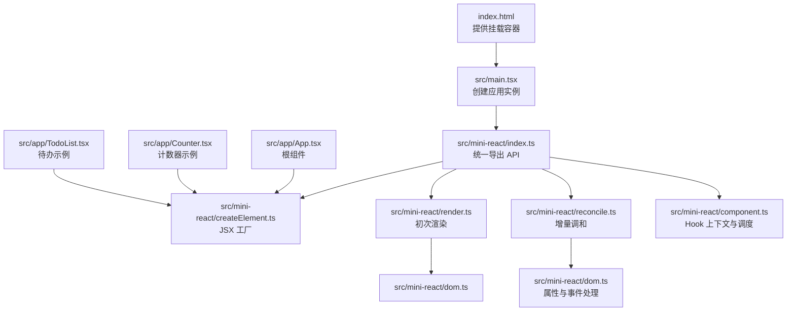
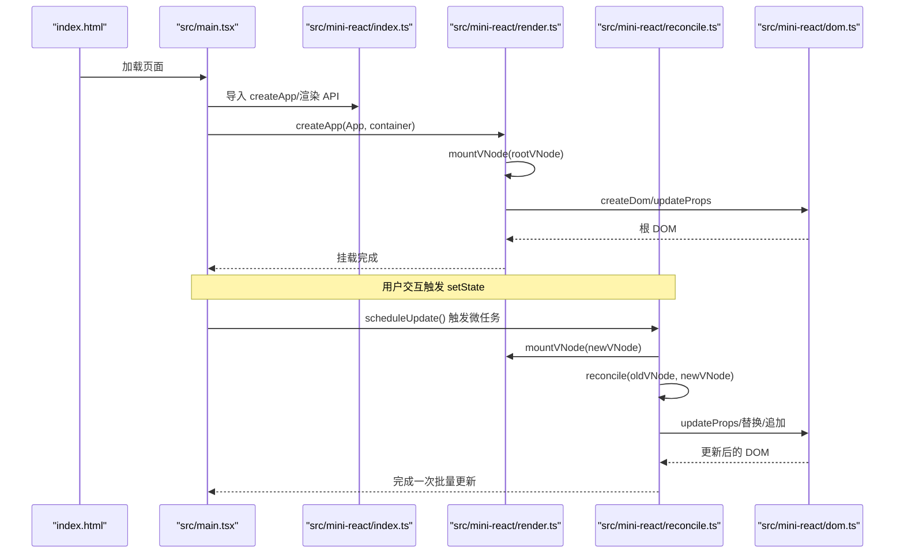
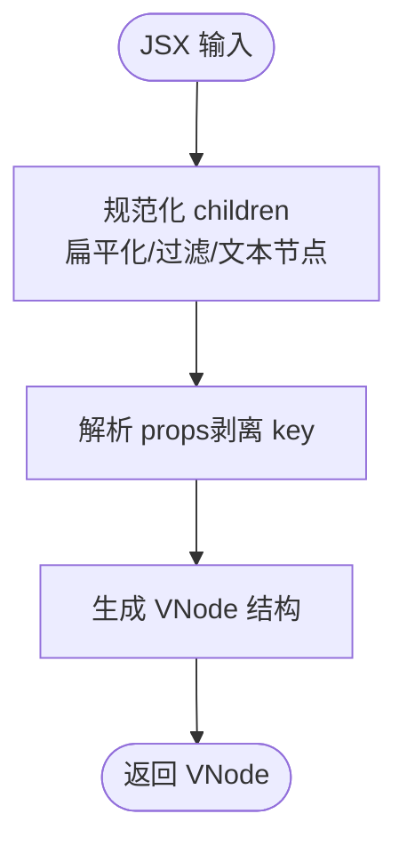
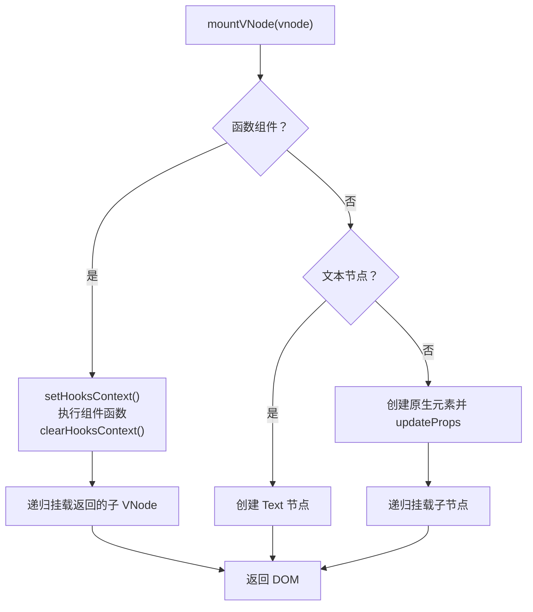
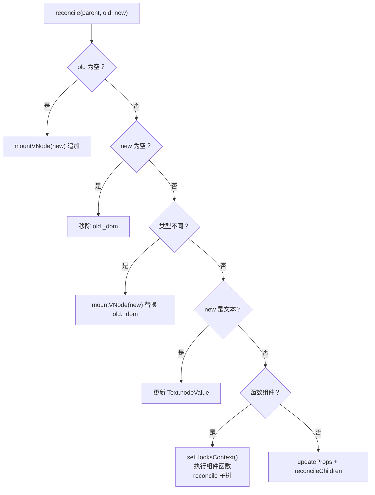
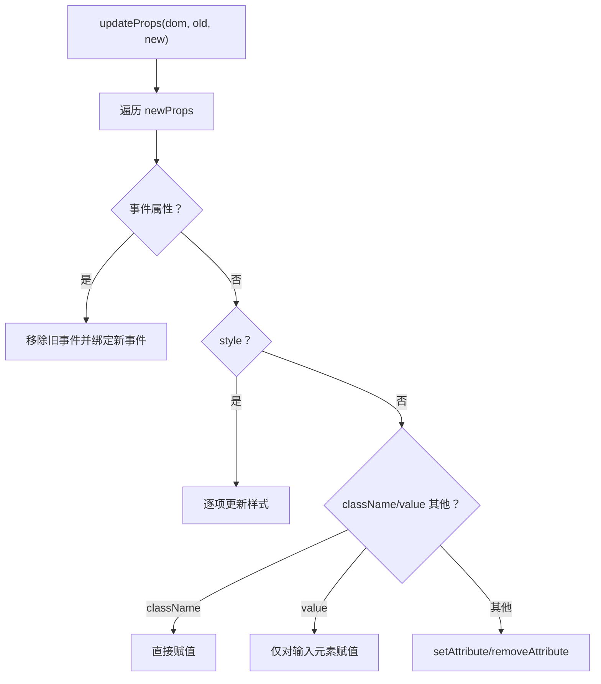
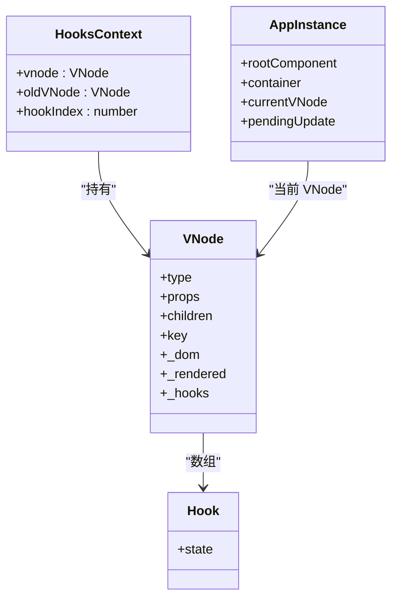
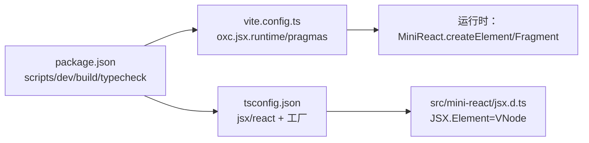

# 开发指南

<cite>
**本文引用的文件**
- [package.json](file://package.json)
- [tsconfig.json](file://tsconfig.json)
- [vite.config.ts](file://vite.config.ts)
- [index.html](file://index.html)
- [src/main.tsx](file://src/main.tsx)
- [src/app/App.tsx](file://src/app/App.tsx)
- [src/app/Counter.tsx](file://src/app/Counter.tsx)
- [src/app/TodoList.tsx](file://src/app/TodoList.tsx)
- [src/mini-react/index.ts](file://src/mini-react/index.ts)
- [src/mini-react/createElement.ts](file://src/mini-react/createElement.ts)
- [src/mini-react/render.ts](file://src/mini-react/render.ts)
- [src/mini-react/reconcile.ts](file://src/mini-react/reconcile.ts)
- [src/mini-react/dom.ts](file://src/mini-react/dom.ts)
- [src/mini-react/component.ts](file://src/mini-react/component.ts)
- [src/mini-react/types.ts](file://src/mini-react/types.ts)
- [src/mini-react/jsx.d.ts](file://src/mini-react/jsx.d.ts)
</cite>

## 目录
1. [简介](#简介)
2. [项目结构](#项目结构)
3. [核心组件](#核心组件)
4. [架构总览](#架构总览)
5. [详细组件分析](#详细组件分析)
6. [依赖关系分析](#依赖关系分析)
7. [性能考虑](#性能考虑)
8. [故障排查指南](#故障排查指南)
9. [结论](#结论)
10. [附录](#附录)

## 简介
本指南面向希望参与 mini-react 项目开发与扩展的工程师，系统讲解开发环境配置（TypeScript、Vite、自定义 JSX 工厂）、构建与部署流程（开发/生产模式差异）、代码规范与最佳实践、扩展与定制框架能力（新增 Hook、组件类型与功能模块）、调试技巧与工具使用，以及贡献与代码审查建议。

## 项目结构
项目采用“示例应用 + 自研迷你 React 内核”的分层组织方式：
- 示例应用位于 src/app，包含 App、Counter、TodoList 等演示组件
- 自研内核位于 src/mini-react，包含 JSX 工厂、渲染、调和、DOM 工具、组件与 Hook、类型定义等
- 入口文件 src/main.tsx 负责创建应用实例并挂载根组件
- 根页面 index.html 提供挂载容器

图表来源
- [index.html](file://index.html)
- [src/main.tsx](file://src/main.tsx)
- [src/mini-react/index.ts](file://src/mini-react/index.ts)
- [src/mini-react/createElement.ts](file://src/mini-react/createElement.ts)
- [src/mini-react/render.ts](file://src/mini-react/render.ts)
- [src/mini-react/reconcile.ts](file://src/mini-react/reconcile.ts)
- [src/mini-react/dom.ts](file://src/mini-react/dom.ts)
- [src/mini-react/component.ts](file://src/mini-react/component.ts)
- [src/app/App.tsx](file://src/app/App.tsx)
- [src/app/Counter.tsx](file://src/app/Counter.tsx)
- [src/app/TodoList.tsx](file://src/app/TodoList.tsx)

章节来源
- [src/main.tsx:1-6](file://src/main.tsx#L1-L6)
- [src/app/App.tsx:1-33](file://src/app/App.tsx#L1-L33)
- [src/mini-react/index.ts:1-12](file://src/mini-react/index.ts#L1-L12)

## 核心组件
- JSX 工厂与类型：通过自定义工厂将 JSX 转换为虚拟节点，并提供全局 JSX.Element 类型声明
- 渲染与挂载：将 VNode 树递归挂载为真实 DOM
- 调和算法：对比新旧 VNode 树，进行最小化 DOM 更新
- DOM 工具：负责属性/样式/事件的增量更新
- 组件与 Hook：函数组件渲染、useState Hook、应用级调度
- 类型系统：统一的 VNode、Props、ComponentFunction 定义

章节来源
- [src/mini-react/createElement.ts:1-58](file://src/mini-react/createElement.ts#L1-L58)
- [src/mini-react/render.ts:1-49](file://src/mini-react/render.ts#L1-L49)
- [src/mini-react/reconcile.ts:1-110](file://src/mini-react/reconcile.ts#L1-L110)
- [src/mini-react/dom.ts:1-97](file://src/mini-react/dom.ts#L1-L97)
- [src/mini-react/component.ts:1-137](file://src/mini-react/component.ts#L1-L137)
- [src/mini-react/types.ts:1-26](file://src/mini-react/types.ts#L1-L26)
- [src/mini-react/jsx.d.ts:1-14](file://src/mini-react/jsx.d.ts#L1-L14)

## 架构总览
下面的序列图展示了从入口到渲染再到更新的关键流程：

图表来源
- [src/main.tsx:1-6](file://src/main.tsx#L1-L6)
- [src/mini-react/index.ts:1-12](file://src/mini-react/index.ts#L1-L12)
- [src/mini-react/render.ts:1-49](file://src/mini-react/render.ts#L1-L49)
- [src/mini-react/reconcile.ts:1-110](file://src/mini-react/reconcile.ts#L1-L110)
- [src/mini-react/dom.ts:1-97](file://src/mini-react/dom.ts#L1-L97)

## 详细组件分析

### JSX 工厂与类型系统
- 自定义 JSX 工厂：在 TypeScript 编译期将 JSX 转换为对 MiniReact.createElement 的调用；运行时由 Vite oxc 插件配合配置确保运行时 pragma/pragmaFrag 正确
- 类型声明：通过全局 JSX 命名空间声明 Element 为 VNode，使 TS 能识别 JSX 并进行类型检查
- 关键点：JSX 属性中的 key 会被剥离并存储在 VNode 上；文本节点被规范化为特殊类型

图表来源
- [src/mini-react/createElement.ts:1-58](file://src/mini-react/createElement.ts#L1-L58)
- [src/mini-react/jsx.d.ts:1-14](file://src/mini-react/jsx.d.ts#L1-L14)
- [tsconfig.json:7-9](file://tsconfig.json#L7-L9)
- [vite.config.ts:4-10](file://vite.config.ts#L4-L10)

章节来源
- [src/mini-react/createElement.ts:1-58](file://src/mini-react/createElement.ts#L1-L58)
- [src/mini-react/jsx.d.ts:1-14](file://src/mini-react/jsx.d.ts#L1-L14)
- [tsconfig.json:7-9](file://tsconfig.json#L7-L9)
- [vite.config.ts:4-10](file://vite.config.ts#L4-L10)

### 渲染与初次挂载
- mountVNode：根据 VNode 类型分别处理函数组件、文本节点与原生元素；函数组件会设置 Hook 上下文并递归挂载其返回的子 VNode
- render：将根 DOM 追加到容器中

图表来源
- [src/mini-react/render.ts:1-49](file://src/mini-react/render.ts#L1-L49)
- [src/mini-react/dom.ts:1-97](file://src/mini-react/dom.ts#L1-L97)
- [src/mini-react/component.ts:1-32](file://src/mini-react/component.ts#L1-L32)

章节来源
- [src/mini-react/render.ts:1-49](file://src/mini-react/render.ts#L1-L49)
- [src/mini-react/dom.ts:1-97](file://src/mini-react/dom.ts#L1-L97)
- [src/mini-react/component.ts:1-32](file://src/mini-react/component.ts#L1-L32)

### 调和算法与增量更新
- reconcile：对比新旧 VNode，按场景选择新增、删除、替换、文本更新、函数组件递归或原生元素属性增量更新
- reconcileChildren：按索引对齐比较子节点，递归调和
- getDom：函数组件穿透到真实 DOM

图表来源
- [src/mini-react/reconcile.ts:1-110](file://src/mini-react/reconcile.ts#L1-L110)
- [src/mini-react/dom.ts:1-97](file://src/mini-react/dom.ts#L1-L97)
- [src/mini-react/render.ts:1-49](file://src/mini-react/render.ts#L1-L49)

章节来源
- [src/mini-react/reconcile.ts:1-110](file://src/mini-react/reconcile.ts#L1-L110)

### DOM 属性与事件处理
- updateProps：增量更新属性，区分事件、style、className、value 等；事件通过 removeEventListener/addEventListener 替换
- setStyle：逐项比对并更新样式
- 事件名转换：onClick → click

图表来源
- [src/mini-react/dom.ts:1-97](file://src/mini-react/dom.ts#L1-L97)

章节来源
- [src/mini-react/dom.ts:1-97](file://src/mini-react/dom.ts#L1-L97)

### 组件与 Hook
- setHooksContext/clearHooksContext：在函数组件渲染前后设置/清理 Hook 上下文
- useState：按调用顺序在 VNode._hooks 中保存状态；setter 支持函数式更新；通过微任务批量触发应用级重渲染
- createApp：创建应用实例，首次渲染并挂载根组件；scheduleUpdate：去抖合并多次更新

图表来源
- [src/mini-react/component.ts:1-137](file://src/mini-react/component.ts#L1-L137)
- [src/mini-react/types.ts:1-26](file://src/mini-react/types.ts#L1-L26)

章节来源
- [src/mini-react/component.ts:1-137](file://src/mini-react/component.ts#L1-L137)
- [src/mini-react/types.ts:1-26](file://src/mini-react/types.ts#L1-L26)

### 示例应用与使用方式
- src/main.tsx：导入 MiniReact 与 createApp，挂载 App
- src/app/App.tsx：根组件，组合 Counter 与 TodoList
- src/app/Counter.tsx/TodoList.tsx：展示 useState 的典型用法与事件处理

章节来源
- [src/main.tsx:1-6](file://src/main.tsx#L1-L6)
- [src/app/App.tsx:1-33](file://src/app/App.tsx#L1-L33)
- [src/app/Counter.tsx:1-52](file://src/app/Counter.tsx#L1-L52)
- [src/app/TodoList.tsx:1-113](file://src/app/TodoList.tsx#L1-L113)

## 依赖关系分析
- 构建工具链：Vite 作为开发服务器与打包工具；oxc 插件启用经典 JSX 运行时并配置 pragma/pragmaFrag
- 类型系统：TypeScript 编译选项启用 react JSX 工厂与 Fragment 工厂，结合全局 JSX 类型声明
- 运行时：JSX 在编译期映射到 MiniReact.createElement，运行时由 Vite oxc 插件保证正确性

图表来源
- [package.json:1-17](file://package.json#L1-L17)
- [vite.config.ts:1-12](file://vite.config.ts#L1-L12)
- [tsconfig.json:1-19](file://tsconfig.json#L1-L19)
- [src/mini-react/jsx.d.ts:1-14](file://src/mini-react/jsx.d.ts#L1-L14)

章节来源
- [package.json:1-17](file://package.json#L1-L17)
- [vite.config.ts:1-12](file://vite.config.ts#L1-L12)
- [tsconfig.json:1-19](file://tsconfig.json#L1-L19)

## 性能考虑
- 批处理更新：通过微任务队列合并多次 setState，减少重复渲染
- 增量更新：调和算法仅对变更部分进行 DOM 操作，避免全量重绘
- 属性更新：updateProps 仅在值变化时更新，事件通过替换监听器避免累积
- 子节点对齐：reconcileChildren 按索引对齐，便于稳定 diff

章节来源
- [src/mini-react/component.ts:122-136](file://src/mini-react/component.ts#L122-L136)
- [src/mini-react/reconcile.ts:86-99](file://src/mini-react/reconcile.ts#L86-L99)
- [src/mini-react/dom.ts:19-53](file://src/mini-react/dom.ts#L19-L53)

## 故障排查指南
- JSX 无法识别或类型报错
  - 检查 tsconfig.json 的 jsx/react 与 jsxFactory/jsxFragment 是否指向 MiniReact
  - 确认全局 JSX.Element 类型声明存在
  - 参考路径：[tsconfig.json:7-9](file://tsconfig.json#L7-L9)、[src/mini-react/jsx.d.ts:1-14](file://src/mini-react/jsx.d.ts#L1-L14)
- 运行时报错“必须在函数组件内调用 useState”
  - 确保在函数组件渲染期间调用，且已通过 setHooksContext 建立上下文
  - 参考路径：[src/mini-react/component.ts:54-56](file://src/mini-react/component.ts#L54-L56)
- 事件未生效或重复绑定
  - 检查事件属性命名（onXxx）与事件名转换逻辑
  - 参考路径：[src/mini-react/dom.ts:88-96](file://src/mini-react/dom.ts#L88-L96)
- 样式未更新
  - 确认 updateProps 中样式字段的逐项更新逻辑
  - 参考路径：[src/mini-react/dom.ts:67-86](file://src/mini-react/dom.ts#L67-L86)
- 构建/开发异常
  - 确认 vite.config.ts 的 oxc.jsx.runtime 与 pragma/pragmaFrag 配置
  - 参考路径：[vite.config.ts:4-10](file://vite.config.ts#L4-L10)

章节来源
- [tsconfig.json:7-9](file://tsconfig.json#L7-L9)
- [src/mini-react/jsx.d.ts:1-14](file://src/mini-react/jsx.d.ts#L1-L14)
- [src/mini-react/component.ts:54-56](file://src/mini-react/component.ts#L54-L56)
- [src/mini-react/dom.ts:88-96](file://src/mini-react/dom.ts#L88-L96)
- [src/mini-react/dom.ts:67-86](file://src/mini-react/dom.ts#L67-L86)
- [vite.config.ts:4-10](file://vite.config.ts#L4-L10)

## 结论
mini-react 通过自定义 JSX 工厂与精简的渲染/调和机制，实现了类 React 的开发体验与性能特征。遵循本文档的开发与扩展指引，可快速上手、稳定迭代并安全地引入新的 Hook 与功能模块。

## 附录

### 开发环境配置与脚本
- TypeScript 配置要点
  - 目标与模块：ES2020 与 ESNext
  - 严格模式与 noEmit
  - JSX：react；jsxFactory/jsxFragment 指向 MiniReact
  - 参考路径：[tsconfig.json:1-19](file://tsconfig.json#L1-L19)
- Vite 配置要点
  - oxc 插件启用 classic JSX 运行时
  - 配置运行时 pragma/pragmaFrag 与运行时工厂一致
  - 参考路径：[vite.config.ts:1-12](file://vite.config.ts#L1-L12)
- 包脚本
  - dev：启动开发服务器
  - build：构建产物
  - typecheck：仅类型检查
  - 参考路径：[package.json:7-11](file://package.json#L7-L11)

章节来源
- [tsconfig.json:1-19](file://tsconfig.json#L1-L19)
- [vite.config.ts:1-12](file://vite.config.ts#L1-L12)
- [package.json:7-11](file://package.json#L7-L11)

### 构建与部署策略
- 开发模式
  - 使用 Vite 开发服务器，热更新与源码映射便于调试
  - JSX 由 oxc 在运行时按配置转换
- 生产模式
  - 使用 vite build 生成静态资源
  - 建议在生产环境保持与开发一致的 tsconfig 与 vite 配置，确保产物一致性
- 部署
  - 将构建产物放入 Web 服务器根目录，index.html 作为入口
  - 参考路径：[index.html](file://index.html)

章节来源
- [package.json:7-11](file://package.json#L7-L11)
- [vite.config.ts:1-12](file://vite.config.ts#L1-L12)

### 代码规范与最佳实践
- 命名约定
  - 文件：功能模块小写，组件首字母大写
  - 类型：接口与类型首字母大写（如 VNode、Props）
  - 常量：全大写下划线（如 TEXT_ELEMENT）
- 代码组织
  - 功能模块按目录划分（如 src/app、src/mini-react）
  - 类型定义集中于 types.ts，便于复用
- 注释标准
  - 公共 API 与复杂逻辑需提供清晰注释，说明输入输出与行为边界
  - JSX 工厂与 Hook 实现需标注关键流程与约束（如 useState 必须在函数组件内调用）

### 扩展与定制指南
- 添加新的 Hook
  - 参照 useState 的实现模式：维护 Hook 上下文、按调用序号存取状态、触发应用级重渲染
  - 参考路径：[src/mini-react/component.ts:34-83](file://src/mini-react/component.ts#L34-L83)
- 新增组件类型
  - 在 types.ts 中扩展 Props/VNode 接口或新增常量，确保 JSX 类型声明与之匹配
  - 参考路径：[src/mini-react/types.ts:1-26](file://src/mini-react/types.ts#L1-L26)、[src/mini-react/jsx.d.ts:1-14](file://src/mini-react/jsx.d.ts#L1-L14)
- 新增功能模块
  - 在 src/mini-react 下新增文件并统一导出至 index.ts，保持 API 稳定
  - 参考路径：[src/mini-react/index.ts:1-12](file://src/mini-react/index.ts#L1-L12)

### 调试技巧与工具使用
- 使用浏览器开发者工具观察 DOM 变更与事件绑定
- 在 reconcile/mountVNode 中插入日志定位渲染路径
- 通过微任务队列合并更新，可在 scheduleUpdate 处断点观察批处理效果
- 参考路径：[src/mini-react/reconcile.ts:14-81](file://src/mini-react/reconcile.ts#L14-L81)、[src/mini-react/component.ts:122-136](file://src/mini-react/component.ts#L122-L136)

### 贡献指南与代码审查标准
- 提交前
  - 运行类型检查与构建验证
  - 补充必要的单元/集成测试（建议）
- 代码审查关注点
  - JSX 工厂与类型声明一致性
  - Hook 使用是否符合调用顺序与上下文约束
  - DOM 更新是否遵循增量更新原则
  - 错误处理与边界条件覆盖
- 参考路径：[package.json:7-11](file://package.json#L7-L11)、[tsconfig.json:1-19](file://tsconfig.json#L1-L19)、[vite.config.ts:1-12](file://vite.config.ts#L1-L12)