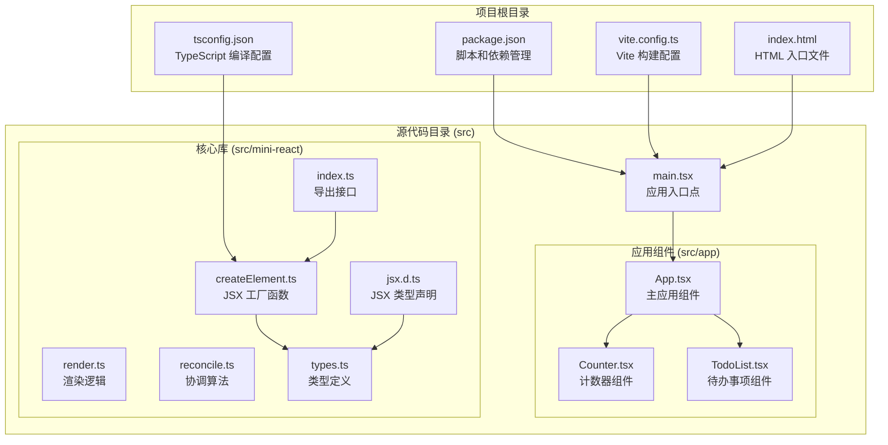
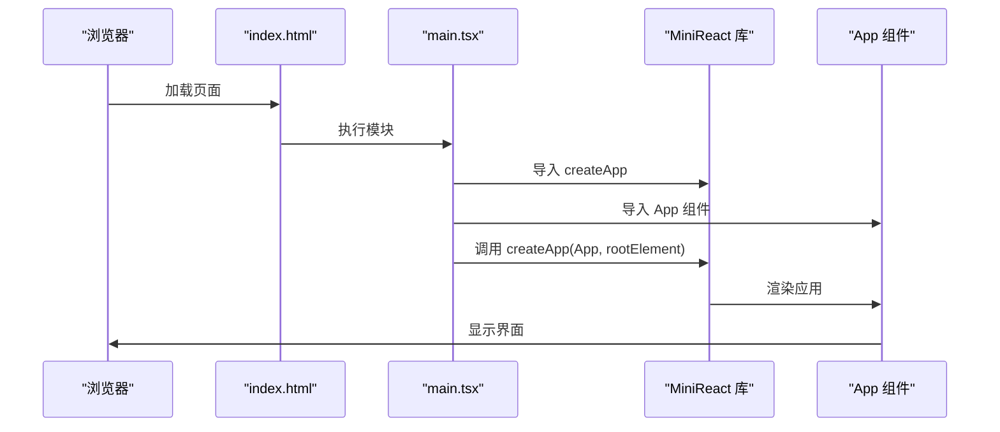
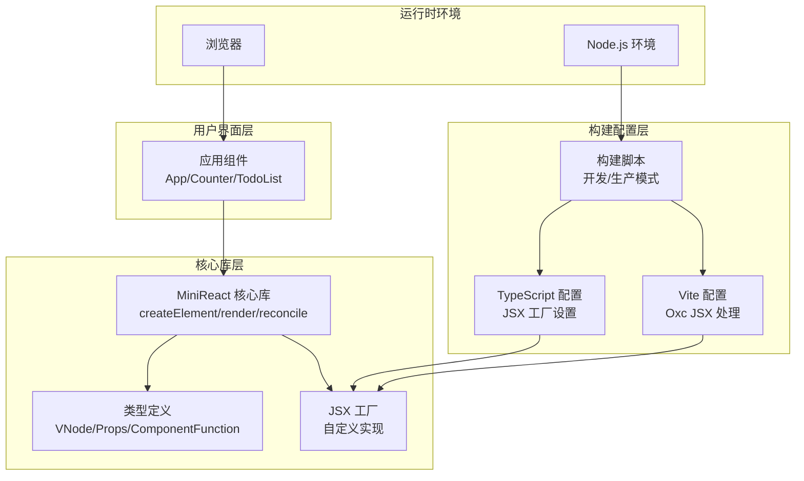
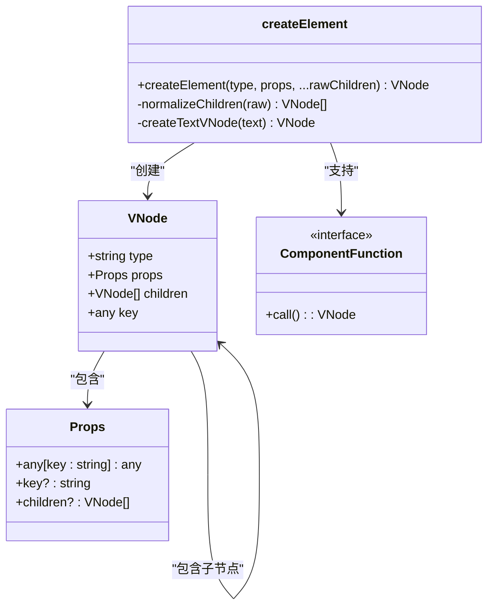
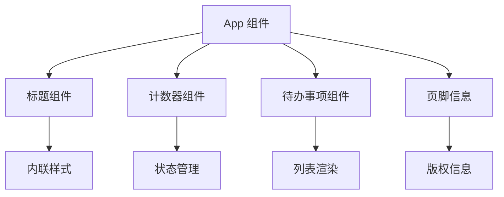
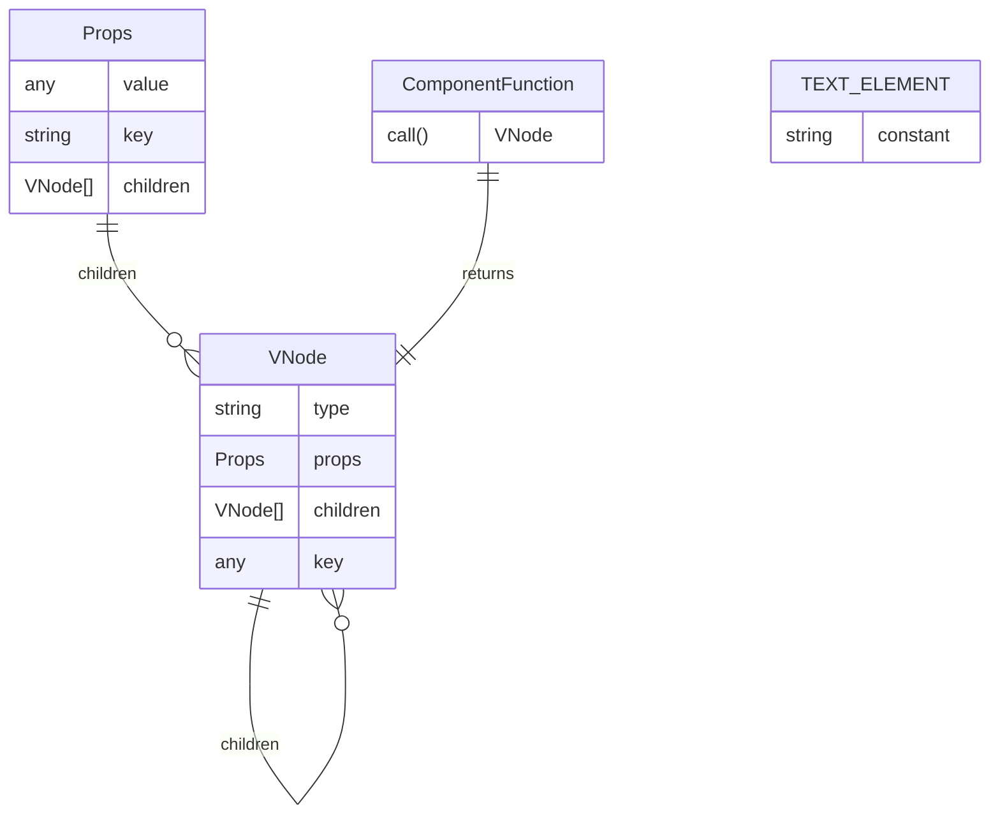
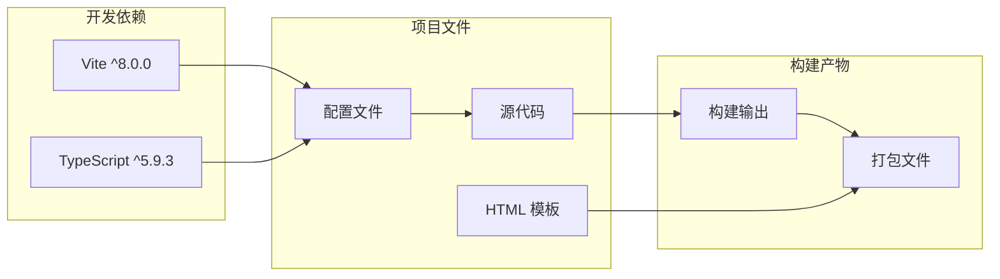

# 开发环境配置

<cite>
**本文档引用的文件**
- [tsconfig.json](file://tsconfig.json)
- [vite.config.ts](file://vite.config.ts)
- [package.json](file://package.json)
- [src/mini-react/jsx.d.ts](file://src/mini-react/jsx.d.ts)
- [src/main.tsx](file://src/main.tsx)
- [src/app/App.tsx](file://src/app/App.tsx)
- [src/mini-react/index.ts](file://src/mini-react/index.ts)
- [src/mini-react/createElement.ts](file://src/mini-react/createElement.ts)
- [index.html](file://index.html)
</cite>

## 目录
1. [简介](#简介)
2. [项目结构](#项目结构)
3. [核心组件](#核心组件)
4. [架构概览](#架构概览)
5. [详细组件分析](#详细组件分析)
6. [依赖关系分析](#依赖关系分析)
7. [性能考虑](#性能考虑)
8. [故障排除指南](#故障排除指南)
9. [结论](#结论)

## 简介

mini-react 是一个轻量级的 React 实现，旨在帮助开发者理解虚拟 DOM 和协调算法的工作原理。本指南专注于项目的开发环境配置，包括 TypeScript 配置、Vite 构建工具设置以及完整的环境搭建流程。

## 项目结构

该项目采用模块化的目录结构，主要包含以下关键组件：

**图表来源**
- [package.json:1-17](file://package.json#L1-L17)
- [tsconfig.json:1-19](file://tsconfig.json#L1-L19)
- [vite.config.ts:1-12](file://vite.config.ts#L1-L12)
- [index.html:1-17](file://index.html#L1-L17)

**章节来源**
- [package.json:1-17](file://package.json#L1-L17)
- [tsconfig.json:1-19](file://tsconfig.json#L1-L19)
- [vite.config.ts:1-12](file://vite.config.ts#L1-L12)
- [index.html:1-17](file://index.html#L1-L17)

## 核心组件

### TypeScript 配置详解

项目使用了专门针对自定义 JSX 工厂的 TypeScript 配置。以下是关键配置项的详细说明：

#### JSX 工厂配置
- **jsx**: 设置为 "react"，启用 React 风格的 JSX 语法处理
- **jsxFactory**: 指定为 "MiniReact.createElement"，这是自定义的 JSX 工厂函数
- **jsxFragmentFactory**: 指定为 "MiniReact.Fragment"，用于 Fragment 支持

#### 模块解析策略
- **moduleResolution**: 设置为 "bundler"，与现代打包工具兼容
- **module**: 设置为 "ESNext"，支持最新的 ECMAScript 特性

#### 编译选项
- **strict**: 启用严格模式，提高代码质量
- **noEmit**: 禁止 TypeScript 编译器生成 JavaScript 文件
- **isolatedModules**: 支持单文件编译，便于热重载
- **esModuleInterop**: 提供 ES 模块与 CommonJS 的互操作性

**章节来源**
- [tsconfig.json:2-16](file://tsconfig.json#L2-L16)
- [src/mini-react/jsx.d.ts:1-14](file://src/mini-react/jsx.d.ts#L1-L14)

### Vite 构建配置

Vite 配置专注于自定义 JSX 工厂的支持：

#### Oxc 配置
- **runtime**: 设置为 "classic"，与 React JSX 运行时兼容
- **pragma**: 指定为 "MiniReact.createElement"
- **pragmaFrag**: 指定为 "MiniReact.Fragment"

**章节来源**
- [vite.config.ts:3-11](file://vite.config.ts#L3-L11)

### 应用入口点

应用通过 main.tsx 文件启动，该文件导入了自定义的 MiniReact 库和应用组件：

**图表来源**
- [index.html:14](file://index.html#L14)
- [src/main.tsx:1-6](file://src/main.tsx#L1-L6)
- [src/mini-react/index.ts:8-12](file://src/mini-react/index.ts#L8-L12)

**章节来源**
- [src/main.tsx:1-6](file://src/main.tsx#L1-L6)
- [src/mini-react/index.ts:1-12](file://src/mini-react/index.ts#L1-L12)

## 架构概览

项目采用分层架构设计，清晰分离了核心库、应用组件和构建配置：

**图表来源**
- [src/app/App.tsx:1-33](file://src/app/App.tsx#L1-L33)
- [src/mini-react/createElement.ts:1-58](file://src/mini-react/createElement.ts#L1-L58)
- [src/mini-react/jsx.d.ts:1-14](file://src/mini-react/jsx.d.ts#L1-L14)
- [tsconfig.json:7-9](file://tsconfig.json#L7-L9)
- [vite.config.ts:4-10](file://vite.config.ts#L4-L10)

## 详细组件分析

### JSX 工厂实现

自定义 JSX 工厂是项目的核心创新点，它实现了 React 风格的 JSX 到虚拟 DOM 的转换：

**图表来源**
- [src/mini-react/createElement.ts:9-25](file://src/mini-react/createElement.ts#L9-L25)
- [src/mini-react/types.ts](file://src/mini-react/types.ts)

#### 核心功能特性

1. **虚拟 DOM 节点创建**: 将 JSX 语法转换为轻量级的 VNode 对象
2. **子节点规范化**: 处理嵌套数组、文本节点和条件渲染
3. **键值支持**: 支持 React 风格的 key 属性用于列表优化
4. **类型安全**: 完整的 TypeScript 类型定义确保编译时检查

**章节来源**
- [src/mini-react/createElement.ts:1-58](file://src/mini-react/createElement.ts#L1-L58)
- [src/mini-react/jsx.d.ts:1-14](file://src/mini-react/jsx.d.ts#L1-L14)

### 应用组件结构

应用由多个独立的组件组成，展示了不同的功能特性：

#### 主应用组件
App.tsx 展示了完整的应用结构，包含样式属性、嵌套组件和条件渲染：

**图表来源**
- [src/app/App.tsx:5-32](file://src/app/App.tsx#L5-L32)

**章节来源**
- [src/app/App.tsx:1-33](file://src/app/App.tsx#L1-L33)

### 类型系统设计

项目使用了完整的 TypeScript 类型系统来确保类型安全：

**图表来源**
- [src/mini-react/types.ts](file://src/mini-react/types.ts)

**章节来源**
- [src/mini-react/jsx.d.ts:1-14](file://src/mini-react/jsx.d.ts#L1-L14)

## 依赖关系分析

项目依赖关系简洁明了，主要依赖于 Vite 和 TypeScript：

**图表来源**
- [package.json:12-15](file://package.json#L12-L15)

**章节来源**
- [package.json:1-17](file://package.json#L1-L17)

## 性能考虑

### 开发模式优化

1. **快速启动**: Vite 提供即时的模块热替换(HMR)功能
2. **按需编译**: TypeScript 只进行类型检查，不生成 JavaScript
3. **内存缓存**: 利用浏览器缓存加速开发体验

### 生产模式优化

虽然当前配置主要面向开发，但可以轻松扩展以支持生产构建：

1. **Tree Shaking**: 通过 ES 模块导入实现无用代码消除
2. **代码分割**: 支持动态导入和懒加载
3. **压缩优化**: 生产构建时自动进行代码压缩

## 故障排除指南

### 常见配置问题

#### TypeScript JSX 错误
**问题**: JSX 找不到类型定义
**解决方案**: 确保已正确配置 jsx.d.ts 文件，并在 tsconfig.json 中启用了 JSX 支持

#### Vite 构建失败
**问题**: 自定义 JSX 工厂无法被识别
**解决方案**: 检查 vite.config.ts 中的 oxc 配置是否与 tsconfig.json 保持一致

#### 模块导入错误
**问题**: 相对路径导入失败
**解决方案**: 确保 package.json 中的 type 字段设置为 "module"

### 环境兼容性问题

#### Node.js 版本要求
- **最低版本**: Node.js 16+
- **推荐版本**: Node.js 18+ 以获得最佳性能

#### 浏览器兼容性
- **现代浏览器**: Chrome 90+, Firefox 95+, Safari 14+
- **IE 支持**: 不支持 Internet Explorer

### 调试技巧

1. **TypeScript 类型检查**: 使用 `npm run typecheck` 进行类型验证
2. **开发服务器**: 使用 `npm run dev` 启动热重载开发服务器
3. **构建验证**: 使用 `npm run build` 验证生产构建

**章节来源**
- [package.json:7-11](file://package.json#L7-L11)
- [tsconfig.json:15](file://tsconfig.json#L15)

## 结论

mini-react 项目提供了完整的开发环境配置示例，展示了如何在现代前端开发中集成自定义 JSX 工厂。通过精心设计的 TypeScript 配置和 Vite 构建设置，项目实现了高效的开发体验和清晰的代码结构。

关键优势包括：
- **类型安全**: 完整的 TypeScript 类型系统确保代码质量
- **开发效率**: 快速的热重载和即时反馈
- **学习价值**: 清晰的架构展示了 React 内部工作原理
- **可扩展性**: 简洁的配置易于理解和修改

建议开发者根据具体需求调整配置参数，如添加更多的 TypeScript 编译选项或扩展 Vite 的构建功能。