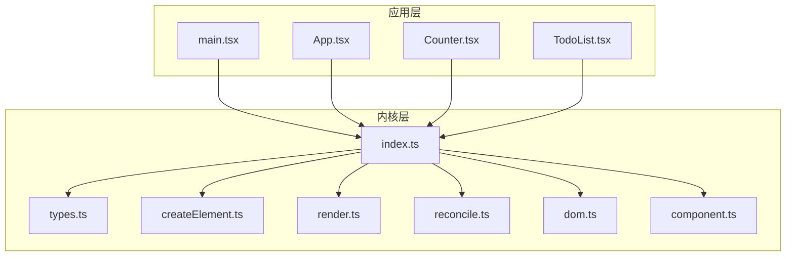
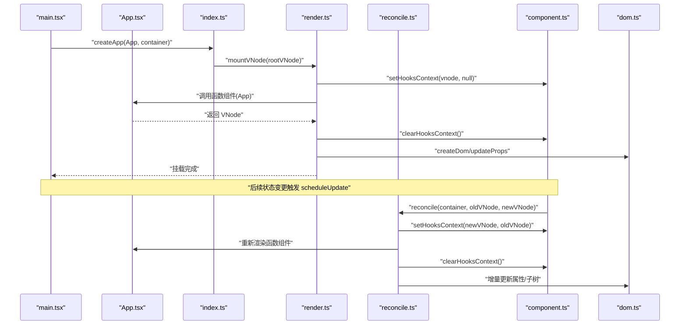
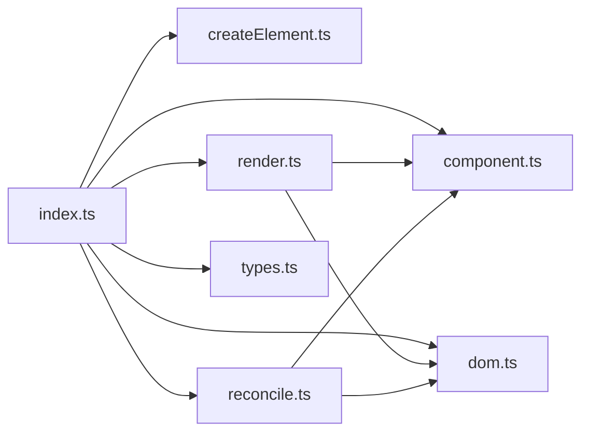

# 扩展开发指南

<cite>
**本文引用的文件**
- [src/main.tsx](file://src/main.tsx)
- [src/app/App.tsx](file://src/app/App.tsx)
- [src/app/Counter.tsx](file://src/app/Counter.tsx)
- [src/app/TodoList.tsx](file://src/app/TodoList.tsx)
- [src/mini-react/index.ts](file://src/mini-react/index.ts)
- [src/mini-react/types.ts](file://src/mini-react/types.ts)
- [src/mini-react/createElement.ts](file://src/mini-react/createElement.ts)
- [src/mini-react/component.ts](file://src/mini-react/component.ts)
- [src/mini-react/render.ts](file://src/mini-react/render.ts)
- [src/mini-react/reconcile.ts](file://src/mini-react/reconcile.ts)
- [src/mini-react/dom.ts](file://src/mini-react/dom.ts)
- [package.json](file://package.json)
- [tsconfig.json](file://tsconfig.json)
- [vite.config.ts](file://vite.config.ts)
</cite>

## 目录
1. [简介](#简介)
2. [项目结构](#项目结构)
3. [核心组件](#核心组件)
4. [架构总览](#架构总览)
5. [详细组件分析](#详细组件分析)
6. [依赖关系分析](#依赖关系分析)
7. [性能考量](#性能考量)
8. [故障排查指南](#故障排查指南)
9. [结论](#结论)
10. [附录](#附录)

## 简介
本指南面向希望在 mini-react 项目上进行扩展开发的工程师，重点围绕以下目标展开：
- 扩展 Hook 系统：新增自定义 Hook 的最佳实践与实现模式
- 扩展组件类型与功能模块：组件生命周期管理与状态管理模式
- 扩展虚拟 DOM 系统：新增节点类型与渲染机制
- 组件系统扩展：高阶组件、上下文系统与组件组合模式
- 提供可操作的实现步骤与参考路径，帮助快速落地

mini-react 是一个极简的 React 风格实现，包含 JSX 工厂、虚拟 DOM、调和算法与基础 Hook 支持。本文将基于现有源码，给出扩展方案与注意事项。

## 项目结构
项目采用“应用层 + mini-react 内核”分层组织：
- 应用层：src/app 下包含示例组件（App、Counter、TodoList）
- 内核层：src/mini-react 下包含核心实现（createElement、render、reconcile、dom、component、types 等）

图表来源
- [src/main.tsx:1-6](file://src/main.tsx#L1-L6)
- [src/app/App.tsx:1-33](file://src/app/App.tsx#L1-L33)
- [src/mini-react/index.ts:1-12](file://src/mini-react/index.ts#L1-L12)

章节来源
- [src/main.tsx:1-6](file://src/main.tsx#L1-L6)
- [src/app/App.tsx:1-33](file://src/app/App.tsx#L1-L33)
- [src/mini-react/index.ts:1-12](file://src/mini-react/index.ts#L1-L12)

## 核心组件
本节梳理 mini-react 的关键模块及其职责与交互关系。

- JSX 工厂与默认导出
  - 通过 createElement 构建 VNode；默认导出 MiniReact 以适配 JSX 工厂配置
  - 参考路径：[src/mini-react/index.ts:1-12](file://src/mini-react/index.ts#L1-L12)

- 类型系统
  - 定义 VNode、Props、ComponentFunction、Hook 等核心类型
  - 参考路径：[src/mini-react/types.ts:1-26](file://src/mini-react/types.ts#L1-L26)

- 虚拟 DOM 与渲染
  - createElement：规范化 children、创建文本节点常量
  - render/mountVNode：递归挂载函数组件、文本节点与原生元素
  - 参考路径：
    - [src/mini-react/createElement.ts:1-58](file://src/mini-react/createElement.ts#L1-L58)
    - [src/mini-react/render.ts:1-49](file://src/mini-react/render.ts#L1-L49)

- 调和算法
  - reconcile：对比新旧 VNode，执行替换、文本更新、函数组件 reconcile、原生元素增量更新
  - reconcileChildren：按索引对齐子节点
  - 参考路径：
    - [src/mini-react/reconcile.ts:1-110](file://src/mini-react/reconcile.ts#L1-L110)

- DOM 属性与事件
  - createDom：创建真实 DOM
  - updateProps：增量更新属性、事件绑定与解绑、样式与 className、表单控件 value
  - 参考路径：
    - [src/mini-react/dom.ts:1-97](file://src/mini-react/dom.ts#L1-L97)

- Hook 系统
  - HooksContext：记录当前渲染的 VNode、旧 VNode 与 hookIndex
  - useState：按顺序复用/初始化 hook，触发调度更新
  - createApp/scheduleUpdate：应用实例与微任务批量更新
  - 参考路径：
    - [src/mini-react/component.ts:1-137](file://src/mini-react/component.ts#L1-L137)

章节来源
- [src/mini-react/index.ts:1-12](file://src/mini-react/index.ts#L1-L12)
- [src/mini-react/types.ts:1-26](file://src/mini-react/types.ts#L1-L26)
- [src/mini-react/createElement.ts:1-58](file://src/mini-react/createElement.ts#L1-L58)
- [src/mini-react/render.ts:1-49](file://src/mini-react/render.ts#L1-L49)
- [src/mini-react/reconcile.ts:1-110](file://src/mini-react/reconcile.ts#L1-L110)
- [src/mini-react/dom.ts:1-97](file://src/mini-react/dom.ts#L1-L97)
- [src/mini-react/component.ts:1-137](file://src/mini-react/component.ts#L1-L137)

## 架构总览
下面的序列图展示了从应用启动到首次渲染与后续更新的整体流程。

图表来源
- [src/main.tsx:1-6](file://src/main.tsx#L1-L6)
- [src/app/App.tsx:1-33](file://src/app/App.tsx#L1-L33)
- [src/mini-react/index.ts:1-12](file://src/mini-react/index.ts#L1-L12)
- [src/mini-react/render.ts:1-49](file://src/mini-react/render.ts#L1-L49)
- [src/mini-react/reconcile.ts:1-110](file://src/mini-react/reconcile.ts#L1-L110)
- [src/mini-react/component.ts:1-137](file://src/mini-react/component.ts#L1-L137)
- [src/mini-react/dom.ts:1-97](file://src/mini-react/dom.ts#L1-L97)

## 详细组件分析

### Hook 系统扩展指南
- 设计原则
  - Hook 必须在函数组件渲染期间按固定顺序调用，且与 VNode 的 _hooks 数组一一对应
  - 每个函数组件拥有独立的 HooksContext，包含当前 VNode、旧 VNode 与 hookIndex
  - setState 通过微任务批量更新，避免重复渲染

- 扩展步骤
  1) 在 component.ts 中新增 Hook 实现（例如 useEffect、useMemo 等），遵循现有 useState 的模式：
     - 通过 setHooksContext/clearHooksContext 管理上下文
     - 在 hookIndex 递增的同时，按需复用旧状态或初始化新状态
     - 触发 scheduleUpdate 以驱动 reconcile
     - 参考路径：[src/mini-react/component.ts:1-137](file://src/mini-react/component.ts#L1-L137)

  2) 在 index.ts 中导出新 Hook，并保持与 React 用法一致的签名
     - 参考路径：[src/mini-react/index.ts:1-12](file://src/mini-react/index.ts#L1-L12)

  3) 在应用中使用新 Hook
     - 示例组件中已展示 useState 的用法，可参照其模式引入新 Hook
     - 参考路径：
       - [src/app/Counter.tsx:1-52](file://src/app/Counter.tsx#L1-L52)
       - [src/app/TodoList.tsx:1-113](file://src/app/TodoList.tsx#L1-L113)

- 最佳实践
  - 严格遵守“在顶层调用 Hook”的规则，不要在循环、条件或嵌套函数中调用
  - Hook 内部的闭包捕获应指向当前 hook 的槽位，避免跨调用污染
  - setState 回调支持函数式更新，便于基于旧状态计算新状态
  - 通过微任务合并多次更新，提升性能

章节来源
- [src/mini-react/component.ts:1-137](file://src/mini-react/component.ts#L1-L137)
- [src/mini-react/index.ts:1-12](file://src/mini-react/index.ts#L1-L12)
- [src/app/Counter.tsx:1-52](file://src/app/Counter.tsx#L1-L52)
- [src/app/TodoList.tsx:1-113](file://src/app/TodoList.tsx#L1-L113)

### 组件生命周期与状态管理
- 生命周期
  - 函数组件无传统生命周期钩子，但可通过 Hook 模拟：
    - 初始化：在首次渲染时设置初始状态
    - 更新：通过 setState 触发 reconcile，按索引复用 hook
    - 销毁：可在自定义 Hook 中清理副作用（如定时器、订阅）
  - 参考路径：[src/mini-react/component.ts:1-137](file://src/mini-react/component.ts#L1-L137)

- 状态管理
  - useState：支持基础状态与函数式更新
  - 自定义 Hook：封装可复用的状态逻辑，暴露稳定 API
  - 参考路径：
    - [src/mini-react/component.ts:34-83](file://src/mini-react/component.ts#L34-L83)
    - [src/mini-react/index.ts:1-12](file://src/mini-react/index.ts#L1-L12)

- 调度与批处理
  - scheduleUpdate 使用微任务队列合并多次更新，减少不必要的 reconcile
  - 参考路径：[src/mini-react/component.ts:119-137](file://src/mini-react/component.ts#L119-L137)

章节来源
- [src/mini-react/component.ts:1-137](file://src/mini-react/component.ts#L1-L137)
- [src/mini-react/index.ts:1-12](file://src/mini-react/index.ts#L1-L12)

### 虚拟 DOM 系统扩展指南
- 新增节点类型
  - 文本节点：通过 TEXT_ELEMENT 常量标识，render/reconcile 中有专门分支处理
    - 参考路径：[src/mini-react/types.ts:1-26](file://src/mini-react/types.ts#L1-L26)
  - 自定义原生元素：createElement 支持字符串类型，createDom/updateProps 会创建并更新 DOM
    - 参考路径：
      - [src/mini-react/createElement.ts:1-58](file://src/mini-react/createElement.ts#L1-L58)
      - [src/mini-react/dom.ts:1-97](file://src/mini-react/dom.ts#L1-L97)

- 渲染机制修改
  - mountVNode：递归挂载函数组件、文本节点与原生元素
  - reconcile：根据类型差异决定替换、文本更新或增量更新
  - reconcileChildren：按索引对齐子节点，保证最小化更新
  - 参考路径：
    - [src/mini-react/render.ts:1-49](file://src/mini-react/render.ts#L1-L49)
    - [src/mini-react/reconcile.ts:1-110](file://src/mini-react/reconcile.ts#L1-L110)

- 扩展建议
  - 若需新增特殊节点类型（如注释、文档片段等），可在 types.ts 中定义常量并在 render/reconcile 中增加分支
  - 修改属性更新策略时，优先在 updateProps 中扩展，确保事件、样式、表单控件等场景覆盖完整
  - 参考路径：[src/mini-react/dom.ts:19-53](file://src/mini-react/dom.ts#L19-L53)

章节来源
- [src/mini-react/types.ts:1-26](file://src/mini-react/types.ts#L1-L26)
- [src/mini-react/createElement.ts:1-58](file://src/mini-react/createElement.ts#L1-L58)
- [src/mini-react/dom.ts:1-97](file://src/mini-react/dom.ts#L1-L97)
- [src/mini-react/render.ts:1-49](file://src/mini-react/render.ts#L1-L49)
- [src/mini-react/reconcile.ts:1-110](file://src/mini-react/reconcile.ts#L1-L110)

### 组件系统扩展指南
- 高阶组件（HOC）
  - 可通过函数包装组件，注入额外 props 或行为
  - 注意：HOC 不改变原组件的内部 Hook 行为，仍需遵循 Hook 调用规则
  - 参考路径：[src/mini-react/createElement.ts:9-25](file://src/mini-react/createElement.ts#L9-L25)

- 上下文系统
  - 可通过自定义 Hook 与 props 传递实现轻量上下文
  - 若需全局状态，建议结合 useState/useReducer 与自定义 Hook 组合
  - 参考路径：
    - [src/mini-react/component.ts:34-83](file://src/mini-react/component.ts#L34-L83)
    - [src/mini-react/index.ts:1-12](file://src/mini-react/index.ts#L1-L12)

- 组件组合模式
  - 使用 createElement 的 children 参数与 normalizeChildren 规范化逻辑，支持复杂嵌套与条件渲染
  - 参考路径：
    - [src/mini-react/createElement.ts:27-48](file://src/mini-react/createElement.ts#L27-L48)
    - [src/app/App.tsx:1-33](file://src/app/App.tsx#L1-L33)

章节来源
- [src/mini-react/createElement.ts:1-58](file://src/mini-react/createElement.ts#L1-L58)
- [src/mini-react/component.ts:34-83](file://src/mini-react/component.ts#L34-L83)
- [src/mini-react/index.ts:1-12](file://src/mini-react/index.ts#L1-L12)
- [src/app/App.tsx:1-33](file://src/app/App.tsx#L1-L33)

## 依赖关系分析
mini-react 的模块间依赖清晰，内核模块相互协作，应用层仅通过 index.ts 导出的 API 使用框架能力。

图表来源
- [src/mini-react/index.ts:1-12](file://src/mini-react/index.ts#L1-L12)
- [src/mini-react/render.ts:1-49](file://src/mini-react/render.ts#L1-L49)
- [src/mini-react/reconcile.ts:1-110](file://src/mini-react/reconcile.ts#L1-L110)
- [src/mini-react/component.ts:1-137](file://src/mini-react/component.ts#L1-L137)
- [src/mini-react/dom.ts:1-97](file://src/mini-react/dom.ts#L1-L97)
- [src/mini-react/types.ts:1-26](file://src/mini-react/types.ts#L1-L26)

章节来源
- [src/mini-react/index.ts:1-12](file://src/mini-react/index.ts#L1-L12)
- [src/mini-react/render.ts:1-49](file://src/mini-react/render.ts#L1-L49)
- [src/mini-react/reconcile.ts:1-110](file://src/mini-react/reconcile.ts#L1-L110)
- [src/mini-react/component.ts:1-137](file://src/mini-react/component.ts#L1-L137)
- [src/mini-react/dom.ts:1-97](file://src/mini-react/dom.ts#L1-L97)
- [src/mini-react/types.ts:1-26](file://src/mini-react/types.ts#L1-L26)

## 性能考量
- 微任务批处理
  - scheduleUpdate 使用 queueMicrotask 合并多次 setState，避免频繁 reconcile
  - 参考路径：[src/mini-react/component.ts:119-137](file://src/mini-react/component.ts#L119-L137)

- 调和算法优化
  - reconcileChildren 按索引对齐子节点，减少不必要的替换
  - updateProps 增量更新属性，避免全量重绘
  - 参考路径：
    - [src/mini-react/reconcile.ts:83-99](file://src/mini-react/reconcile.ts#L83-L99)
    - [src/mini-react/dom.ts:19-53](file://src/mini-react/dom.ts#L19-L53)

- 文本节点优化
  - TEXT_ELEMENT 专用分支，直接更新 nodeValue，避免重建 DOM
  - 参考路径：[src/mini-react/reconcile.ts:47-55](file://src/mini-react/reconcile.ts#L47-L55)

[本节为通用性能建议，无需特定文件引用]

## 故障排查指南
- 常见错误与定位
  - “必须在函数组件内部调用 Hook”
    - 触发原因：在条件、循环或嵌套函数中调用 Hook
    - 解决方案：确保 Hook 在函数组件顶层调用，顺序固定
    - 参考路径：[src/mini-react/component.ts:54-56](file://src/mini-react/component.ts#L54-L56)

  - 更新未生效
    - 检查 setState 是否被微任务合并，确认回调函数式更新正确
    - 参考路径：[src/mini-react/component.ts:73-83](file://src/mini-react/component.ts#L73-L83)

  - 事件未触发
    - 检查事件名格式（onXxx）、updateProps 中事件绑定逻辑
    - 参考路径：[src/mini-react/dom.ts:37-42](file://src/mini-react/dom.ts#L37-L42)

  - 样式/类名未更新
    - 检查 style 与 className 的增量更新逻辑
    - 参考路径：[src/mini-react/dom.ts:67-86](file://src/mini-react/dom.ts#L67-L86)

- 调试建议
  - 在 setHooksContext/clearHooksContext 周围打印上下文信息，验证 hookIndex 与 _hooks 状态
  - 在 reconcile 流程中输出类型判断与子节点对齐结果，定位更新异常
  - 参考路径：
    - [src/mini-react/component.ts:22-32](file://src/mini-react/component.ts#L22-L32)
    - [src/mini-react/reconcile.ts:14-81](file://src/mini-react/reconcile.ts#L14-L81)

章节来源
- [src/mini-react/component.ts:54-56](file://src/mini-react/component.ts#L54-L56)
- [src/mini-react/component.ts:73-83](file://src/mini-react/component.ts#L73-L83)
- [src/mini-react/dom.ts:37-42](file://src/mini-react/dom.ts#L37-L42)
- [src/mini-react/dom.ts:67-86](file://src/mini-react/dom.ts#L67-L86)
- [src/mini-react/component.ts:22-32](file://src/mini-react/component.ts#L22-L32)
- [src/mini-react/reconcile.ts:14-81](file://src/mini-react/reconcile.ts#L14-L81)

## 结论
mini-react 提供了清晰的扩展边界与实现路径。通过遵循 Hook 调用顺序、合理利用微任务批处理与增量更新策略，可以安全地扩展 Hook 系统、组件类型与虚拟 DOM 功能。建议在新增功能时，优先在 types.ts、component.ts、dom.ts 与 reconcile.ts 中进行最小改动，确保与现有架构保持一致。

[本节为总结性内容，无需特定文件引用]

## 附录
- 开发环境配置
  - TypeScript：启用严格模式与 JSX 编译
  - Vite：配置 oxc 与 JSX 工厂
  - 参考路径：
    - [tsconfig.json:1-19](file://tsconfig.json#L1-L19)
    - [vite.config.ts:1-12](file://vite.config.ts#L1-L12)
    - [package.json:1-17](file://package.json#L1-L17)

- 示例应用
  - main.tsx：应用入口，调用 createApp
  - App/Counter/TodoList：演示函数组件与 Hook 使用
  - 参考路径：
    - [src/main.tsx:1-6](file://src/main.tsx#L1-L6)
    - [src/app/App.tsx:1-33](file://src/app/App.tsx#L1-L33)
    - [src/app/Counter.tsx:1-52](file://src/app/Counter.tsx#L1-L52)
    - [src/app/TodoList.tsx:1-113](file://src/app/TodoList.tsx#L1-L113)

章节来源
- [tsconfig.json:1-19](file://tsconfig.json#L1-L19)
- [vite.config.ts:1-12](file://vite.config.ts#L1-L12)
- [package.json:1-17](file://package.json#L1-L17)
- [src/main.tsx:1-6](file://src/main.tsx#L1-L6)
- [src/app/App.tsx:1-33](file://src/app/App.tsx#L1-L33)
- [src/app/Counter.tsx:1-52](file://src/app/Counter.tsx#L1-L52)
- [src/app/TodoList.tsx:1-113](file://src/app/TodoList.tsx#L1-L113)