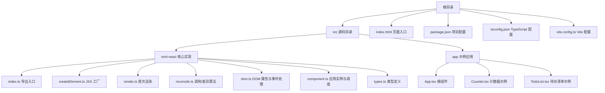
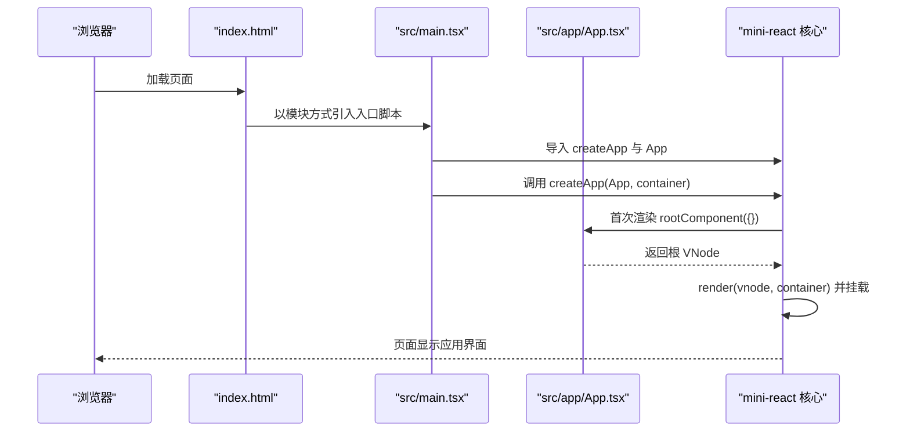
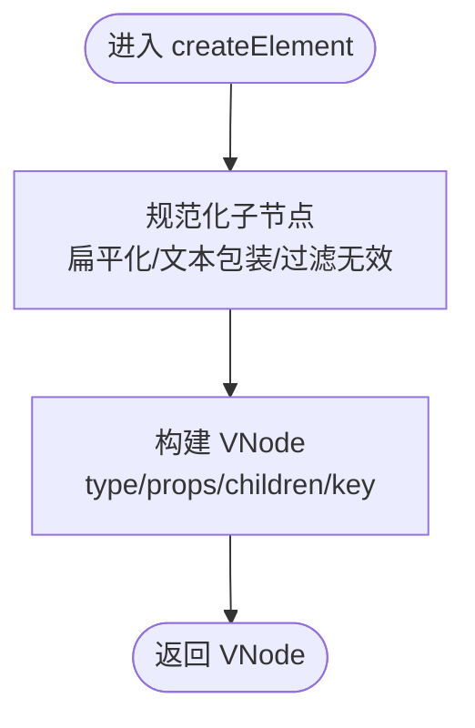
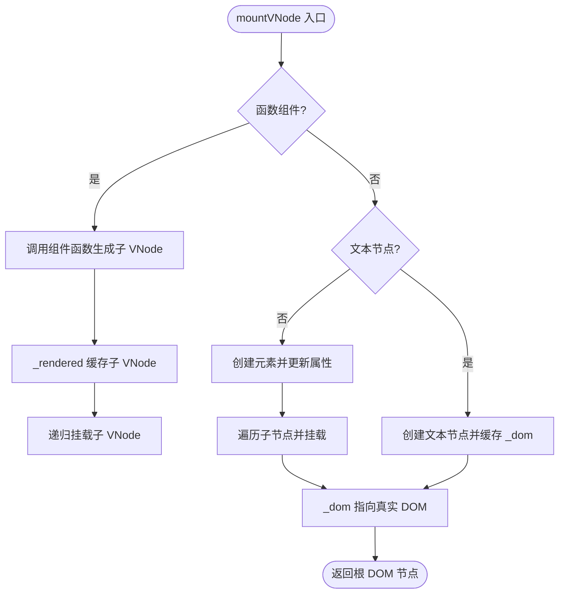
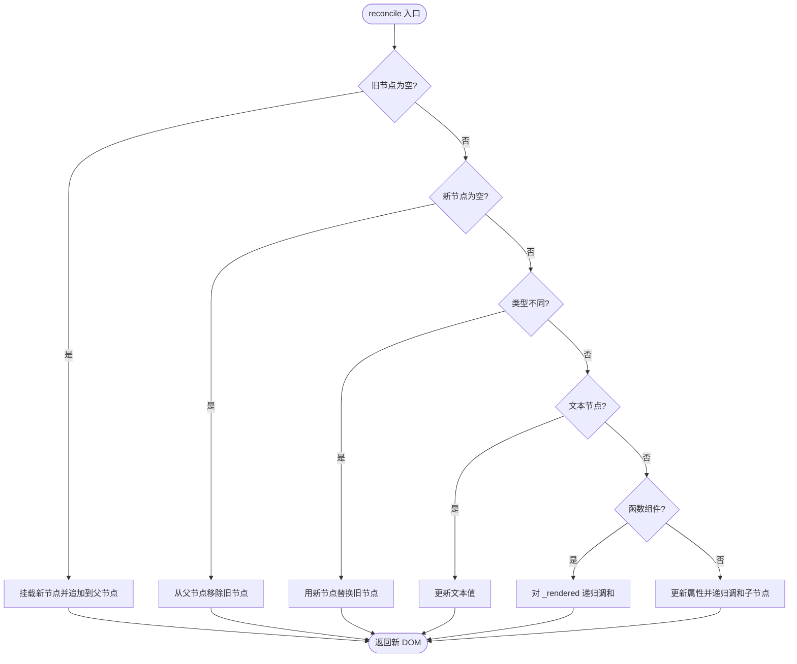
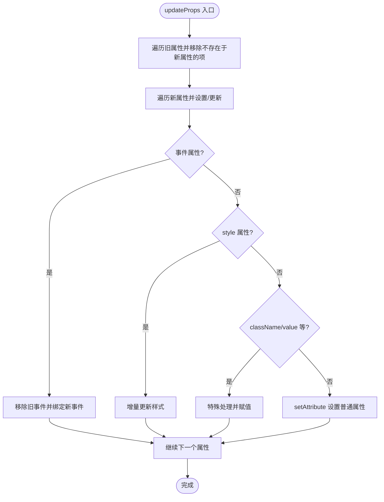
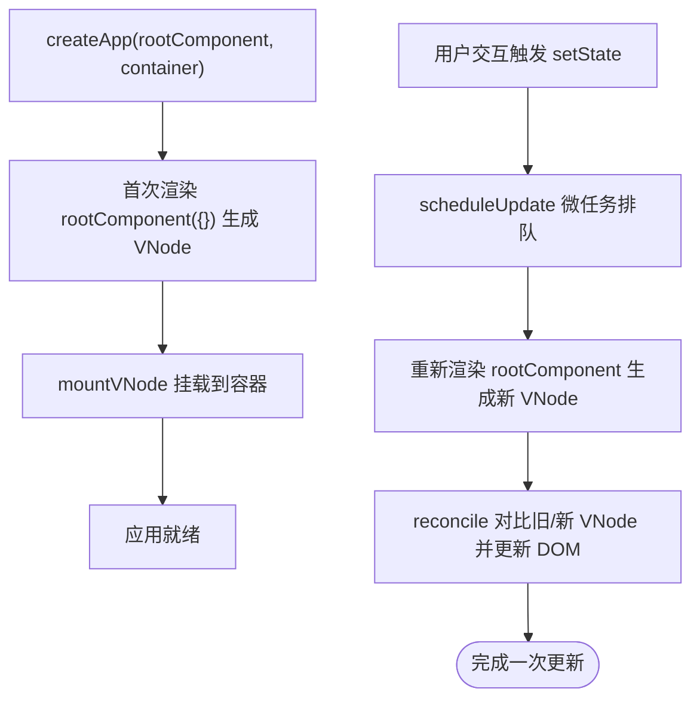
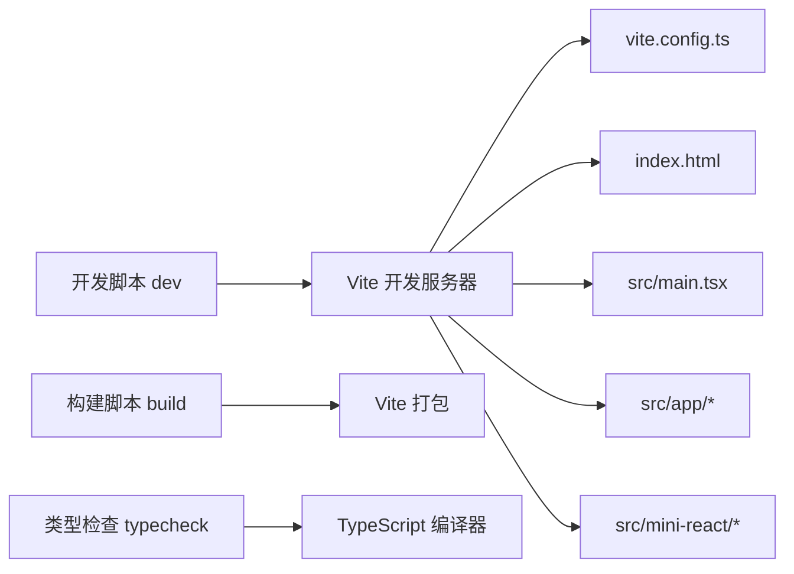

# 快速开始

<cite>
**本文引用的文件**
- [package.json](file://package.json)
- [vite.config.ts](file://vite.config.ts)
- [tsconfig.json](file://tsconfig.json)
- [index.html](file://index.html)
- [src/main.tsx](file://src/main.tsx)
- [src/app/App.tsx](file://src/app/App.tsx)
- [src/app/Counter.tsx](file://src/app/Counter.tsx)
- [src/app/TodoList.tsx](file://src/app/TodoList.tsx)
- [src/mini-react/index.ts](file://src/mini-react/index.ts)
- [src/mini-react/createElement.ts](file://src/mini-react/createElement.ts)
- [src/mini-react/render.ts](file://src/mini-react/render.ts)
- [src/mini-react/reconcile.ts](file://src/mini-react/reconcile.ts)
- [src/mini-react/dom.ts](file://src/mini-react/dom.ts)
- [src/mini-react/types.ts](file://src/mini-react/types.ts)
- [src/mini-react/component.ts](file://src/mini-react/component.ts)
</cite>

## 目录
1. [简介](#简介)
2. [项目结构](#项目结构)
3. [核心组件](#核心组件)
4. [架构总览](#架构总览)
5. [详细组件分析](#详细组件分析)
6. [依赖分析](#依赖分析)
7. [性能考虑](#性能考虑)
8. [故障排除指南](#故障排除指南)
9. [结论](#结论)
10. [附录](#附录)

## 简介
本指南面向希望快速上手并深入理解 mini-react 的开发者。内容涵盖环境准备、安装与启动、目录结构说明、核心工作原理、示例运行方法以及常见问题排查。通过本指南，你将能够：
- 在本地正确搭建开发环境并运行示例应用
- 理解 mini-react 的核心模块与数据流
- 掌握开发、构建与类型检查等常用命令
- 面向实际开发进行调试与优化

## 项目结构
该项目采用“源码集中 + 构建工具集成”的组织方式，核心源码位于 src 目录，入口 HTML 与构建配置分别位于根目录。下面给出与实际文件对应的结构图。

图表来源
- [index.html:1-17](file://index.html#L1-L17)
- [package.json:1-17](file://package.json#L1-L17)
- [tsconfig.json:1-19](file://tsconfig.json#L1-L19)
- [vite.config.ts:1-12](file://vite.config.ts#L1-L12)
- [src/main.tsx:1-6](file://src/main.tsx#L1-L6)
- [src/app/App.tsx:1-33](file://src/app/App.tsx#L1-L33)
- [src/app/Counter.tsx:1-52](file://src/app/Counter.tsx#L1-L52)
- [src/app/TodoList.tsx:1-113](file://src/app/TodoList.tsx#L1-L113)
- [src/mini-react/index.ts:1-12](file://src/mini-react/index.ts#L1-L12)
- [src/mini-react/createElement.ts:1-58](file://src/mini-react/createElement.ts#L1-L58)
- [src/mini-react/render.ts:1-49](file://src/mini-react/render.ts#L1-L49)
- [src/mini-react/reconcile.ts:1-110](file://src/mini-react/reconcile.ts#L1-L110)
- [src/mini-react/dom.ts:1-97](file://src/mini-react/dom.ts#L1-L97)
- [src/mini-react/types.ts:1-26](file://src/mini-react/types.ts#L1-L26)
- [src/mini-react/component.ts:1-137](file://src/mini-react/component.ts#L1-L137)

章节来源
- [index.html:1-17](file://index.html#L1-L17)
- [package.json:1-17](file://package.json#L1-L17)
- [tsconfig.json:1-19](file://tsconfig.json#L1-L19)
- [vite.config.ts:1-12](file://vite.config.ts#L1-L12)
- [src/main.tsx:1-6](file://src/main.tsx#L1-L6)

## 核心组件
本节概述 mini-react 的核心模块及其职责，帮助你快速把握系统脉络。

- mini-react 导出入口：统一导出 JSX 工厂、渲染、调和、应用实例与类型，同时提供默认导出以适配经典 JSX 工厂调用。
- JSX 工厂：负责将 JSX 语法转换为虚拟 DOM 结构，并规范化子节点与键值。
- 首次渲染：将虚拟 DOM 树递归挂载为真实 DOM，并建立节点映射。
- 调和算法：对比新旧虚拟 DOM 树，执行最小化的真实 DOM 更新。
- DOM 属性与事件：负责属性增删改、事件绑定与样式更新。
- 组件与调度：管理函数组件的 hooks 上下文、状态复用与批量更新调度。
- 类型系统：定义虚拟节点、属性、组件函数与 hooks 存储结构。

章节来源
- [src/mini-react/index.ts:1-12](file://src/mini-react/index.ts#L1-L12)
- [src/mini-react/createElement.ts:1-58](file://src/mini-react/createElement.ts#L1-L58)
- [src/mini-react/render.ts:1-49](file://src/mini-react/render.ts#L1-L49)
- [src/mini-react/reconcile.ts:1-110](file://src/mini-react/reconcile.ts#L1-L110)
- [src/mini-react/dom.ts:1-97](file://src/mini-react/dom.ts#L1-L97)
- [src/mini-react/types.ts:1-26](file://src/mini-react/types.ts#L1-L26)
- [src/mini-react/component.ts:1-137](file://src/mini-react/component.ts#L1-L137)

## 架构总览
下图展示了从页面加载到应用渲染的关键流程，包括入口脚本、应用实例创建、首次渲染与后续更新调度。

图表来源
- [index.html:13-14](file://index.html#L13-L14)
- [src/main.tsx:1-6](file://src/main.tsx#L1-L6)
- [src/app/App.tsx:1-33](file://src/app/App.tsx#L1-L33)
- [src/mini-react/index.ts:1-12](file://src/mini-react/index.ts#L1-L12)
- [src/mini-react/render.ts:45-49](file://src/mini-react/render.ts#L45-L49)

## 详细组件分析

### JSX 工厂与虚拟 DOM
- 职责：将 JSX 转换为虚拟节点，规范化子节点（扁平化、文本节点、过滤无效值），并处理键值。
- 关键点：支持字符串/数字文本节点、布尔/空值过滤、可选键值传递与移除。
- 复杂度：规范化过程线性遍历子节点，时间复杂度 O(n)，空间复杂度与子节点数量相关。

图表来源
- [src/mini-react/createElement.ts:9-25](file://src/mini-react/createElement.ts#L9-L25)
- [src/mini-react/createElement.ts:33-48](file://src/mini-react/createElement.ts#L33-L48)
- [src/mini-react/createElement.ts:50-57](file://src/mini-react/createElement.ts#L50-L57)

章节来源
- [src/mini-react/createElement.ts:1-58](file://src/mini-react/createElement.ts#L1-L58)
- [src/mini-react/types.ts:7-18](file://src/mini-react/types.ts#L7-L18)

### 首次渲染与 DOM 挂载
- 职责：递归挂载函数组件、文本节点与原生元素；建立 _dom 映射；首次渲染入口。
- 关键点：函数组件通过调用组件函数生成子 VNode；文本节点直接创建文本节点；原生元素创建并更新属性。
- 复杂度：深度优先遍历，时间复杂度 O(N)，N 为虚拟节点总数。

图表来源
- [src/mini-react/render.ts:9-40](file://src/mini-react/render.ts#L9-L40)

章节来源
- [src/mini-react/render.ts:1-49](file://src/mini-react/render.ts#L1-L49)

### 调和算法与增量更新
- 职责：对比新旧虚拟节点树，执行最小化的真实 DOM 更新（新增、删除、替换、属性更新、子节点同步）。
- 关键点：函数组件通过比较 _rendered 的子 VNode 进行递归调和；同类型元素仅更新变更的属性与子节点。
- 复杂度：对每个层级的节点进行常数次比较与更新，整体复杂度与变更节点数量成正比。

图表来源
- [src/mini-react/reconcile.ts:14-81](file://src/mini-react/reconcile.ts#L14-L81)
- [src/mini-react/reconcile.ts:86-99](file://src/mini-react/reconcile.ts#L86-L99)
- [src/mini-react/reconcile.ts:105-109](file://src/mini-react/reconcile.ts#L105-L109)

章节来源
- [src/mini-react/reconcile.ts:1-110](file://src/mini-react/reconcile.ts#L1-L110)

### DOM 属性与事件处理
- 职责：负责属性增删改、事件绑定与解绑、样式更新与清理。
- 关键点：事件名解析（onXxx → 事件类型）、className/value 的特殊处理、style 的增量更新。
- 复杂度：按属性键集合线性处理，时间复杂度 O(P)，P 为属性数量。

图表来源
- [src/mini-react/dom.ts:19-53](file://src/mini-react/dom.ts#L19-L53)
- [src/mini-react/dom.ts:67-86](file://src/mini-react/dom.ts#L67-L86)
- [src/mini-react/dom.ts:89-96](file://src/mini-react/dom.ts#L89-L96)

章节来源
- [src/mini-react/dom.ts:1-97](file://src/mini-react/dom.ts#L1-L97)

### 组件与状态调度
- 职责：维护函数组件的 hooks 上下文、状态复用与批量更新调度；提供应用实例创建与首次渲染。
- 关键点：hooks 上下文在渲染前后设置与清理；useState 通过 _hooks 数组保存状态槽位；scheduleUpdate 使用微任务合并多次更新。
- 复杂度：单次更新的时间复杂度与变更节点数量相关，批量更新避免重复渲染。

图表来源
- [src/mini-react/component.ts:99-117](file://src/mini-react/component.ts#L99-L117)
- [src/mini-react/component.ts:122-136](file://src/mini-react/component.ts#L122-L136)

章节来源
- [src/mini-react/component.ts:1-137](file://src/mini-react/component.ts#L1-L137)

### 示例应用与使用
- 根组件 App：组合 Counter 与 TodoList 两个示例组件，演示基础布局与跨组件协作。
- 计数器 Counter：使用 useState 维护计数值，提供自增自减按钮。
- 待办清单 TodoList：使用 useState 维护待办数组与输入框值，支持添加、删除与回车提交。

章节来源
- [src/app/App.tsx:1-33](file://src/app/App.tsx#L1-L33)
- [src/app/Counter.tsx:1-52](file://src/app/Counter.tsx#L1-L52)
- [src/app/TodoList.tsx:1-113](file://src/app/TodoList.tsx#L1-L113)

## 依赖分析
- 构建与开发：Vite 提供开发服务器与打包能力；oxc 配置启用 classic JSX 运行时与指定工厂函数。
- 类型系统：TypeScript 配置启用严格模式、ESNext 模块解析与 noEmit，确保类型安全且不输出 JS。
- 项目脚本：提供 dev、build、typecheck 三类常用命令，覆盖开发、构建与类型检查。

图表来源
- [package.json:7-11](file://package.json#L7-L11)
- [vite.config.ts:3-11](file://vite.config.ts#L3-L11)
- [tsconfig.json:2-16](file://tsconfig.json#L2-L16)
- [index.html:13-14](file://index.html#L13-L14)
- [src/main.tsx:1-6](file://src/main.tsx#L1-L6)

章节来源
- [package.json:1-17](file://package.json#L1-L17)
- [vite.config.ts:1-12](file://vite.config.ts#L1-L12)
- [tsconfig.json:1-19](file://tsconfig.json#L1-L19)

## 性能考虑
- 批量更新：通过微任务队列合并多次 setState，减少重复渲染与 DOM 变更。
- 增量更新：调和算法仅对变更节点进行操作，避免全量重绘。
- 属性更新：按需移除与设置属性，降低不必要的 DOM 修改。
- 子节点遍历：按索引同步子节点，避免多余比较与重建。

## 故障排除指南
- 无法启动开发服务器
  - 确认已安装 Node.js 与包管理器（建议使用 npm 或 yarn）。
  - 在项目根目录执行安装依赖后再启动开发服务器。
  - 若端口被占用，请调整 Vite 配置中的端口或释放端口。
- 构建失败或产物异常
  - 使用类型检查命令验证类型错误后再进行构建。
  - 确认 TypeScript 配置未输出 JS（noEmit），构建由 Vite 负责。
- JSX 无法识别或报错
  - 确认 TypeScript 的 jsx 选项与 jsxFactory/FragmentFactory 配置正确。
  - 确认 Vite 的 oxc jsx 配置与工厂函数一致。
- 样式或事件不生效
  - 检查 className/value/style 的特殊处理逻辑是否符合预期。
  - 确认事件名格式（onXxx）与监听函数一致。
- 运行示例无显示
  - 确认入口脚本路径与容器元素存在。
  - 确认 createApp 调用参数与容器元素匹配。

章节来源
- [package.json:7-11](file://package.json#L7-L11)
- [tsconfig.json:2-16](file://tsconfig.json#L2-L16)
- [vite.config.ts:3-11](file://vite.config.ts#L3-L11)
- [index.html:13-14](file://index.html#L13-L14)
- [src/main.tsx:1-6](file://src/main.tsx#L1-L6)

## 结论
mini-react 通过简洁的模块划分与清晰的数据流，实现了从 JSX 到真实 DOM 的完整渲染链路。借助 Vite 与 TypeScript 的现代化配置，项目具备良好的开发体验与类型保障。按照本指南完成环境准备与示例运行后，你可以在此基础上扩展更多组件与功能，深入理解前端框架的核心机制。

## 附录

### 环境准备与安装
- Node.js 版本要求
  - 建议使用 LTS 版本（如 18.x 或 20.x），以获得最佳兼容性与性能。
- 包管理器
  - 推荐使用 npm 或 yarn。若使用 yarn，请确保版本满足项目依赖。
- 克隆与安装
  - 克隆仓库后，在项目根目录执行安装命令以下载依赖。
- 启动开发服务器
  - 执行开发脚本以启动本地服务，默认在浏览器中打开页面。

章节来源
- [package.json:7-11](file://package.json#L7-L11)
- [index.html:13-14](file://index.html#L13-L14)

### 目录与文件说明
- 根目录
  - package.json：项目元信息与脚本命令
  - tsconfig.json：TypeScript 编译配置
  - vite.config.ts：Vite 与 oxc 配置
  - index.html：页面入口与挂载容器
- 源码目录 src
  - main.tsx：应用入口，调用 createApp 初始化应用
  - app：示例应用组件
  - mini-react：核心实现模块

章节来源
- [src/main.tsx:1-6](file://src/main.tsx#L1-L6)
- [src/app/App.tsx:1-33](file://src/app/App.tsx#L1-L33)
- [src/app/Counter.tsx:1-52](file://src/app/Counter.tsx#L1-L52)
- [src/app/TodoList.tsx:1-113](file://src/app/TodoList.tsx#L1-L113)
- [src/mini-react/index.ts:1-12](file://src/mini-react/index.ts#L1-L12)

### 常用开发命令
- 开发模式：启动本地开发服务器，自动热更新
- 构建模式：打包生产资源
- 类型检查：仅进行类型校验，不输出 JS

章节来源
- [package.json:7-11](file://package.json#L7-L11)

### 运行示例应用
- 步骤
  - 安装依赖后启动开发服务器
  - 在浏览器中访问页面，即可看到示例应用界面
  - 交互示例：计数器按钮、待办清单输入与删除
- 验证要点
  - 确认根容器存在且挂载成功
  - 确认组件渲染与状态更新正常

章节来源
- [index.html:13-14](file://index.html#L13-L14)
- [src/main.tsx:1-6](file://src/main.tsx#L1-L6)
- [src/app/App.tsx:1-33](file://src/app/App.tsx#L1-L33)
- [src/app/Counter.tsx:1-52](file://src/app/Counter.tsx#L1-L52)
- [src/app/TodoList.tsx:1-113](file://src/app/TodoList.tsx#L1-L113)