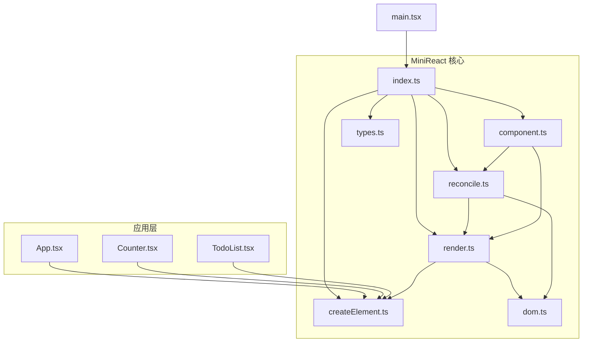
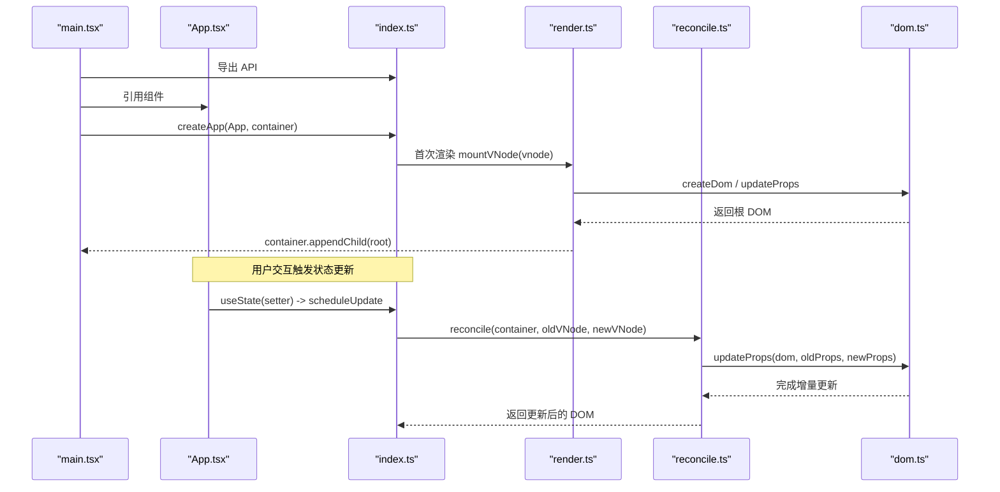
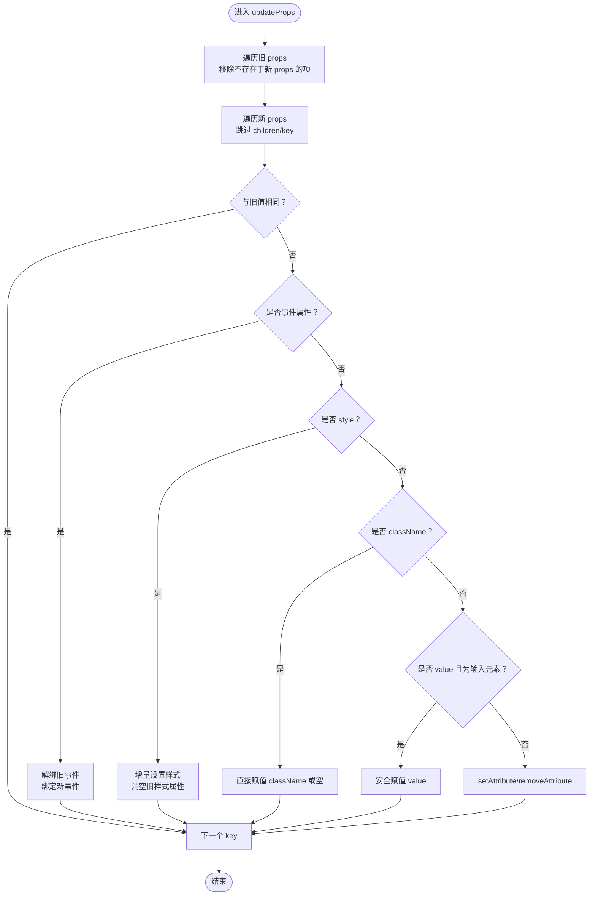
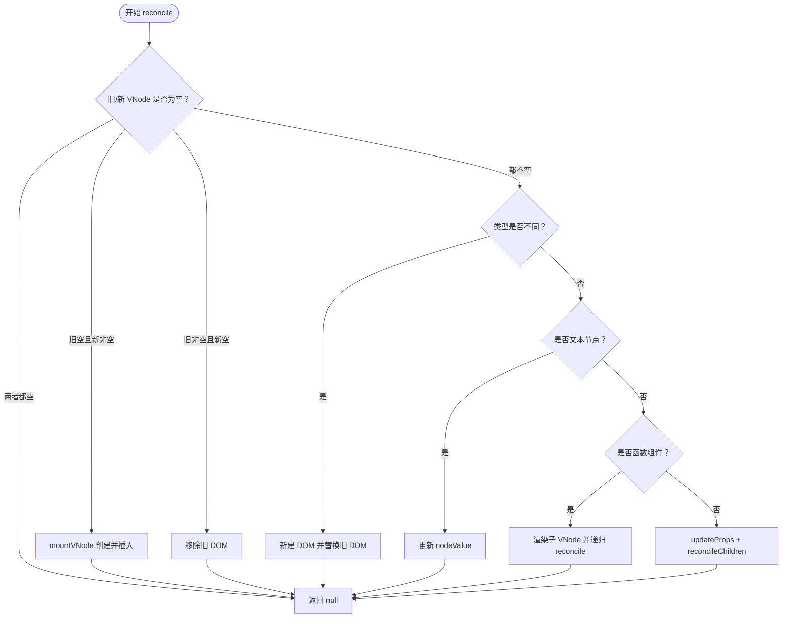
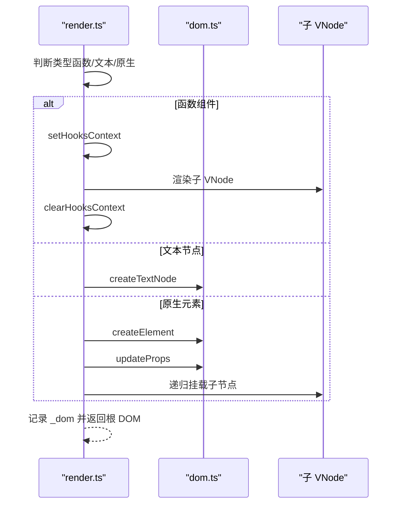
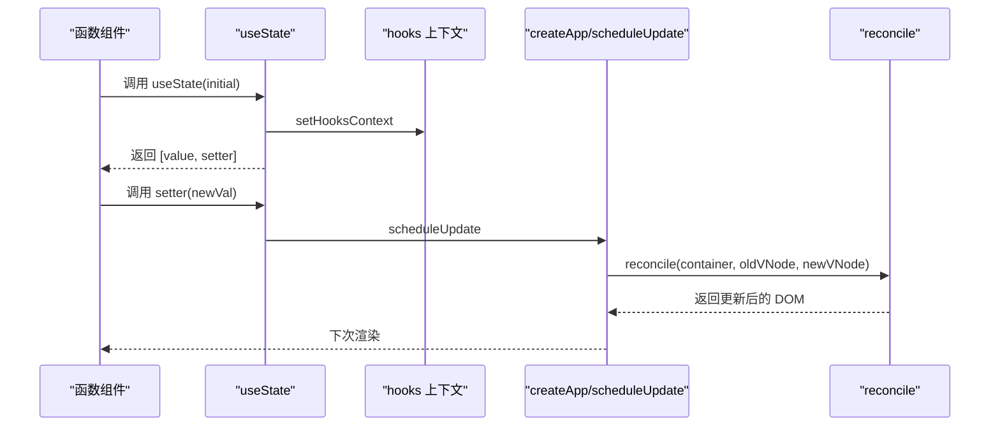
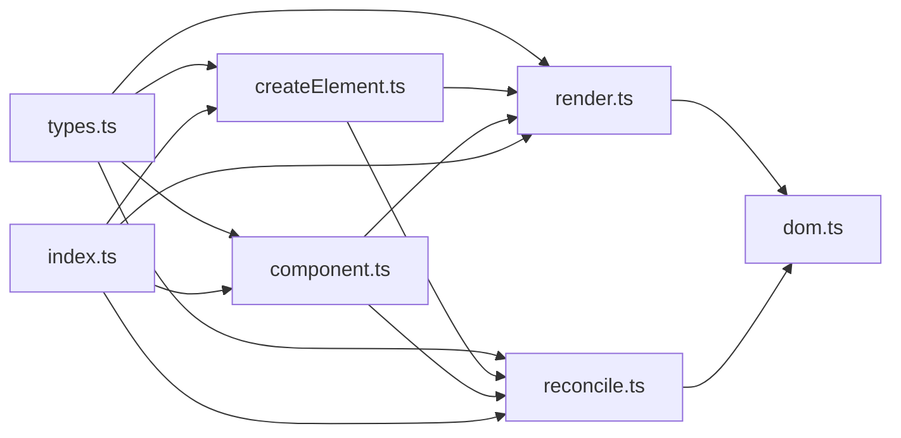

# DOM 操作系统

<cite>
**本文引用的文件**
- [dom.ts](file://src/mini-react/dom.ts)
- [reconcile.ts](file://src/mini-react/reconcile.ts)
- [render.ts](file://src/mini-react/render.ts)
- [createElement.ts](file://src/mini-react/createElement.ts)
- [component.ts](file://src/mini-react/component.ts)
- [types.ts](file://src/mini-react/types.ts)
- [index.ts](file://src/mini-react/index.ts)
- [main.tsx](file://src/main.tsx)
- [App.tsx](file://src/app/App.tsx)
- [Counter.tsx](file://src/app/Counter.tsx)
- [TodoList.tsx](file://src/app/TodoList.tsx)
- [package.json](file://package.json)
</cite>

## 目录
1. [简介](#简介)
2. [项目结构](#项目结构)
3. [核心组件](#核心组件)
4. [架构总览](#架构总览)
5. [详细组件分析](#详细组件分析)
6. [依赖关系分析](#依赖关系分析)
7. [性能考量](#性能考量)
8. [故障排查指南](#故障排查指南)
9. [结论](#结论)
10. [附录](#附录)

## 简介
本项目是一个轻量级的 DOM 操作系统，基于虚拟 DOM 与调和（diff/reconcile）算法，提供安全高效的 DOM 属性更新、事件处理与样式管理能力。系统以增量更新为核心，避免不必要的 DOM 操作，同时通过统一的属性更新流程保证事件绑定与解绑的安全性，防止内存泄漏。本文档将深入解析 DOM 属性设置与更新机制（内联样式、类名、数据属性）、事件委托与解绑策略、以及在函数组件中如何通过 hooks 实现状态驱动的高效更新。

## 项目结构
该系统采用模块化设计，核心文件位于 src/mini-react 目录，应用示例位于 src/app，入口文件位于 src/main.tsx。主要模块职责如下：
- types.ts：定义虚拟节点与类型别名，统一数据结构
- createElement.ts：JSX 工厂函数，负责规范化 children 并生成 VNode
- render.ts：初次挂载 VNode 树为真实 DOM
- reconcile.ts：调和算法，对比新旧 VNode，执行增量更新
- dom.ts：真实 DOM 的创建与属性更新，含事件、样式、类名等处理
- component.ts：函数组件与 hooks 支持，调度与状态管理
- index.ts：对外统一导出 API
- 示例应用：App.tsx、Counter.tsx、TodoList.tsx 展示典型 DOM 操作场景

图表来源
- [index.ts:1-12](file://src/mini-react/index.ts#L1-L12)
- [render.ts:1-49](file://src/mini-react/render.ts#L1-L49)
- [reconcile.ts:1-110](file://src/mini-react/reconcile.ts#L1-L110)
- [dom.ts:1-97](file://src/mini-react/dom.ts#L1-L97)
- [component.ts:1-137](file://src/mini-react/component.ts#L1-L137)
- [types.ts:1-26](file://src/mini-react/types.ts#L1-L26)
- [main.tsx:1-6](file://src/main.tsx#L1-L6)

章节来源
- [index.ts:1-12](file://src/mini-react/index.ts#L1-L12)
- [main.tsx:1-6](file://src/main.tsx#L1-L6)

## 核心组件
- 虚拟节点与类型：VNode 定义了 type、props、children、key 以及内部挂载的 _dom/_rendered/_hooks 等字段，统一了文本节点、原生元素与函数组件的抽象。
- JSX 工厂：createElement 规范化 children，移除 key 并生成 VNode；createTextVNode 用于字符串/数字转文本节点。
- 初次渲染：mountVNode 递归创建真实 DOM，处理函数组件、文本节点与原生元素。
- 调和算法：reconcile 对比新旧 VNode，执行新增、删除、替换、文本更新、函数组件渲染与子节点增量更新。
- DOM 属性更新：updateProps 统一处理事件、样式、类名、表单值与普通属性，确保安全与高效。
- 函数组件与 hooks：useState 提供状态管理，scheduleUpdate 通过微任务批量合并更新，避免重复渲染。

章节来源
- [types.ts:7-26](file://src/mini-react/types.ts#L7-L26)
- [createElement.ts:9-58](file://src/mini-react/createElement.ts#L9-L58)
- [render.ts:9-40](file://src/mini-react/render.ts#L9-L40)
- [reconcile.ts:14-110](file://src/mini-react/reconcile.ts#L14-L110)
- [dom.ts:6-97](file://src/mini-react/dom.ts#L6-L97)
- [component.ts:51-137](file://src/mini-react/component.ts#L51-L137)

## 架构总览
系统以“虚拟 DOM + 调和”为核心，通过增量更新最小化真实 DOM 变更。渲染流程分为初次挂载与后续更新两部分：初次挂载由 mountVNode 完成，后续更新由 reconcile 驱动，二者均依赖 updateProps 完成属性与事件的统一处理。

图表来源
- [main.tsx:1-6](file://src/main.tsx#L1-L6)
- [index.ts:1-12](file://src/mini-react/index.ts#L1-L12)
- [render.ts:45-49](file://src/mini-react/render.ts#L45-L49)
- [reconcile.ts:14-81](file://src/mini-react/reconcile.ts#L14-L81)
- [dom.ts:19-53](file://src/mini-react/dom.ts#L19-L53)

## 详细组件分析

### DOM 属性更新与事件处理
- 增量更新策略：遍历新旧 props，分别处理移除、新增/变更与事件绑定/解绑，避免全量替换。
- 事件处理：识别以 on 开头的属性名，转换为标准事件名后进行 addEventListener/removeEventListener，确保同名事件只保留最新回调，防止重复绑定与内存泄漏。
- 样式管理：setStyle 仅对新增或变更的样式属性赋值，对旧样式中不存在的新样式属性进行清空，避免残留。
- 类名与表单值：className 直接赋空字符串或新值；value 在 HTMLInputElement 上进行安全赋值，避免非输入元素误操作。
- 普通属性：通过 setAttribute/removeAttribute 统一处理，确保自定义属性与数据属性正确更新。

图表来源
- [dom.ts:19-86](file://src/mini-react/dom.ts#L19-L86)

章节来源
- [dom.ts:19-97](file://src/mini-react/dom.ts#L19-L97)

### 调和算法与子节点对比
- 新增/删除/替换：当旧节点为空或新节点为空，或类型不同时，执行新增、删除或替换真实 DOM。
- 文本节点：直接更新 nodeValue，避免重建节点。
- 函数组件：设置 hooks 上下文，渲染子 VNode，递归 reconcile。
- 原生元素：调用 updateProps 增量更新属性，并逐索引对比子节点列表，递归 reconcile。

图表来源
- [reconcile.ts:14-110](file://src/mini-react/reconcile.ts#L14-L110)

章节来源
- [reconcile.ts:14-110](file://src/mini-react/reconcile.ts#L14-L110)

### 初次渲染与挂载
- 函数组件：设置 hooks 上下文，渲染子 VNode，递归挂载，记录 _dom 与 _rendered。
- 文本节点：直接创建 Text 节点。
- 原生元素：创建元素并一次性 updateProps，然后递归挂载子节点。

图表来源
- [render.ts:9-40](file://src/mini-react/render.ts#L9-L40)
- [dom.ts:6-14](file://src/mini-react/dom.ts#L6-L14)
- [dom.ts:19-53](file://src/mini-react/dom.ts#L19-L53)

章节来源
- [render.ts:9-40](file://src/mini-react/render.ts#L9-L40)

### 函数组件与 hooks 调度
- hooks 上下文：setHooksContext/clearHooksContext 确保 useState 在正确组件与渲染阶段执行。
- 状态存储：每个 VNode 维护 _hooks 数组，按 hookIndex 顺序存取状态。
- 状态更新：setter 支持函数式更新，调用 scheduleUpdate 合并多次 setState，通过微任务批量执行 reconcile。

图表来源
- [component.ts:22-32](file://src/mini-react/component.ts#L22-L32)
- [component.ts:51-83](file://src/mini-react/component.ts#L51-L83)
- [component.ts:122-136](file://src/mini-react/component.ts#L122-L136)
- [reconcile.ts:14-81](file://src/mini-react/reconcile.ts#L14-L81)

章节来源
- [component.ts:22-83](file://src/mini-react/component.ts#L22-L83)
- [component.ts:122-136](file://src/mini-react/component.ts#L122-L136)

### 示例场景与最佳实践
- 内联样式：通过 style 属性对象进行增量设置，避免全量替换；删除旧样式属性时确保清空。
- 类名与数据属性：className 直接赋值；自定义属性使用 setAttribute/removeAttribute。
- 表单值：仅在 HTMLInputElement 上设置 value，避免对非输入元素产生副作用。
- 事件绑定：以 on 开头的属性自动识别为事件，先解绑旧回调再绑定新回调，防止重复绑定与内存泄漏。
- 条件渲染与列表：使用 key 标识唯一性，配合 normalizeChildren 过滤无效值，减少不必要更新。

章节来源
- [dom.ts:43-51](file://src/mini-react/dom.ts#L43-L51)
- [dom.ts:72-85](file://src/mini-react/dom.ts#L72-L85)
- [createElement.ts:33-48](file://src/mini-react/createElement.ts#L33-L48)
- [App.tsx:7-31](file://src/app/App.tsx#L7-L31)
- [Counter.tsx:19-47](file://src/app/Counter.tsx#L19-L47)
- [TodoList.tsx:39-104](file://src/app/TodoList.tsx#L39-L104)

## 依赖关系分析
- 模块耦合：render.ts 与 reconcile.ts 依赖 dom.ts 的属性更新；component.ts 依赖 render.ts 与 reconcile.ts 提供的上下文与调度；index.ts 统一导出 API。
- 数据流：VNode 作为数据载体贯穿整个流程，_dom/_rendered/_hooks 字段承载渲染状态与 DOM 关联。
- 外部依赖：系统无运行时外部依赖，构建工具为 Vite，开发语言为 TypeScript。

图表来源
- [types.ts:1-26](file://src/mini-react/types.ts#L1-L26)
- [index.ts:1-12](file://src/mini-react/index.ts#L1-L12)
- [render.ts:1-49](file://src/mini-react/render.ts#L1-L49)
- [reconcile.ts:1-110](file://src/mini-react/reconcile.ts#L1-L110)
- [dom.ts:1-97](file://src/mini-react/dom.ts#L1-L97)
- [component.ts:1-137](file://src/mini-react/component.ts#L1-L137)

章节来源
- [index.ts:1-12](file://src/mini-react/index.ts#L1-L12)
- [types.ts:1-26](file://src/mini-react/types.ts#L1-L26)

## 性能考量
- 增量更新：updateProps 仅对变更的属性进行操作，避免全量替换，降低 DOM 重排与重绘成本。
- 微任务批处理：scheduleUpdate 使用 queueMicrotask 合并多次 setState，减少重复渲染次数。
- 子节点索引对比：reconcileChildren 逐索引对比，避免复杂 diff 算法带来的额外开销。
- 事件解绑：每次事件更新先移除旧事件监听，再绑定新回调，避免重复绑定导致的性能与内存问题。
- 文本节点快速路径：文本节点直接更新 nodeValue，无需重建 DOM。

章节来源
- [dom.ts:19-53](file://src/mini-react/dom.ts#L19-L53)
- [reconcile.ts:86-99](file://src/mini-react/reconcile.ts#L86-L99)
- [component.ts:122-136](file://src/mini-react/component.ts#L122-L136)

## 故障排查指南
- 事件未触发或重复触发：检查事件属性命名是否以 on 开头，确认旧事件已解绑再绑定新回调。
- 样式未生效或残留：确认 style 对象的键值是否正确，关注旧样式属性是否被清空。
- 表单值不更新：确认目标元素为 HTMLInputElement，避免在非输入元素上设置 value。
- 内存泄漏：确保每次更新都先移除旧事件监听，避免闭包持有旧引用。
- key 缺失导致列表错乱：为列表项提供稳定 key，避免索引作为 key 导致的错误复用。
- hooks 使用位置错误：useState 必须在函数组件内部调用，否则会抛出错误。

章节来源
- [dom.ts:38-42](file://src/mini-react/dom.ts#L38-L42)
- [dom.ts:56-64](file://src/mini-react/dom.ts#L56-L64)
- [dom.ts:72-85](file://src/mini-react/dom.ts#L72-L85)
- [component.ts:54-56](file://src/mini-react/component.ts#L54-L56)

## 结论
本 DOM 操作系统通过虚拟 DOM 与增量更新实现了安全高效的 DOM 操作，统一的属性更新流程确保事件绑定与解绑的安全性，防止内存泄漏。结合 hooks 的微任务批处理与子节点索引对比，系统在保持简洁的同时具备良好的性能表现。开发者可依据本文档的最佳实践与示例场景，安全地进行属性更新、事件处理与样式管理。

## 附录
- 构建与运行：使用 Vite 进行开发与构建，TypeScript 提供类型保障。
- 入口与示例：main.tsx 通过 createApp 初始化应用，App.tsx、Counter.tsx、TodoList.tsx 展示典型 DOM 操作场景。

章节来源
- [package.json:1-17](file://package.json#L1-L17)
- [main.tsx:1-6](file://src/main.tsx#L1-L6)
- [App.tsx:5-32](file://src/app/App.tsx#L5-L32)
- [Counter.tsx:4-51](file://src/app/Counter.tsx#L4-L51)
- [TodoList.tsx:11-112](file://src/app/TodoList.tsx#L11-L112)