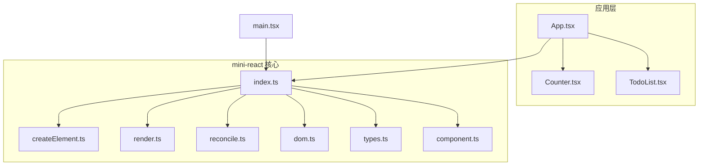
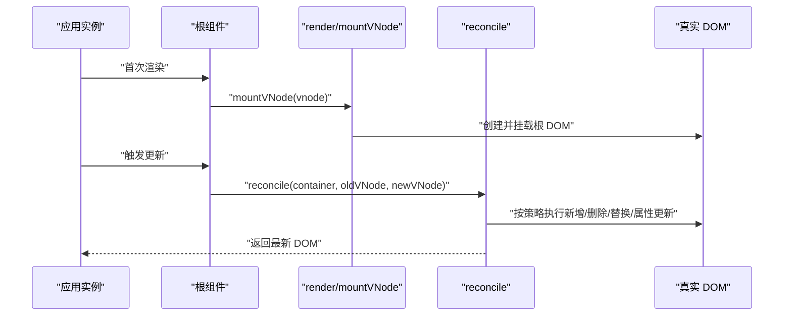
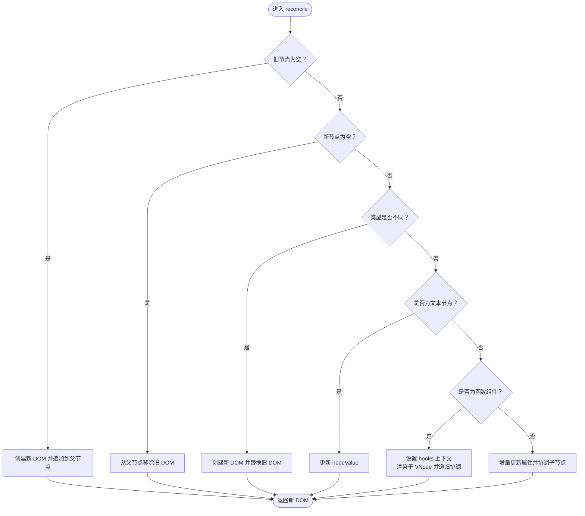
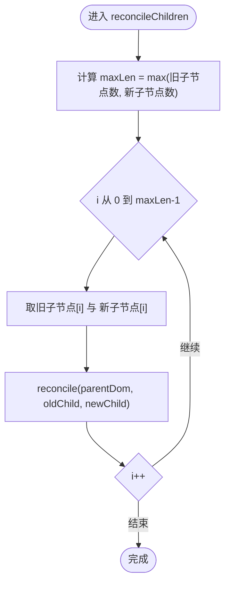
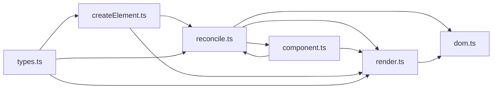

# 协调算法

<cite>
**本文引用的文件**
- [reconcile.ts](file://src/mini-react/reconcile.ts)
- [render.ts](file://src/mini-react/render.ts)
- [dom.ts](file://src/mini-react/dom.ts)
- [types.ts](file://src/mini-react/types.ts)
- [createElement.ts](file://src/mini-react/createElement.ts)
- [component.ts](file://src/mini-react/component.ts)
- [index.ts](file://src/mini-react/index.ts)
- [main.tsx](file://src/main.tsx)
- [App.tsx](file://src/app/App.tsx)
- [Counter.tsx](file://src/app/Counter.tsx)
- [TodoList.tsx](file://src/app/TodoList.tsx)
</cite>

## 目录
1. [简介](#简介)
2. [项目结构](#项目结构)
3. [核心组件](#核心组件)
4. [架构总览](#架构总览)
5. [详细组件分析](#详细组件分析)
6. [依赖关系分析](#依赖关系分析)
7. [性能考量](#性能考量)
8. [故障排查指南](#故障排查指南)
9. [结论](#结论)
10. [附录](#附录)

## 简介
本文件围绕“协调算法”展开，系统性阐述该 mini-react 实现中 React 风格的 diff/reconcile 算法。重点覆盖：
- 增量更新策略与实现路径
- 不同节点类型的对比逻辑（新增、删除、替换、文本节点）
- key 在节点复用中的作用与最佳实践
- 时间与空间复杂度分析
- 面向真实场景的流程图与序列图，帮助读者快速理解协调过程

## 项目结构
该项目采用“功能分层 + 类型定义”的组织方式：
- mini-react 层：负责虚拟 DOM、渲染、协调、DOM 属性更新、组件与 hooks、调度等
- app 层：示例应用与组件，演示 key、列表渲染、事件绑定等
- 入口层：main.tsx 负责创建应用实例并挂载根组件

图表来源
- [index.ts:1-12](file://src/mini-react/index.ts#L1-L12)
- [main.tsx:1-6](file://src/main.tsx#L1-L6)
- [App.tsx:1-33](file://src/app/App.tsx#L1-L33)
- [Counter.tsx:1-52](file://src/app/Counter.tsx#L1-L52)
- [TodoList.tsx:1-113](file://src/app/TodoList.tsx#L1-L113)

章节来源
- [index.ts:1-12](file://src/mini-react/index.ts#L1-L12)
- [main.tsx:1-6](file://src/main.tsx#L1-L6)

## 核心组件
- VNode 类型与常量：统一描述虚拟节点，支持原生元素、文本节点、函数组件、children、key、_dom、_rendered、_hooks 等字段
- createElement：JSX 工厂函数，规范化 children、剥离 key 并生成 VNode
- render/mountVNode：首次渲染，递归创建真实 DOM 并挂载
- reconcile：协调算法主入口，对比新旧 VNode，执行增量更新
- reconcileChildren：按索引对齐子节点，递归协调
- getDom：穿透函数组件，定位真实 DOM
- updateProps：增量更新 DOM 属性（含事件、样式、类名、表单值等）

章节来源
- [types.ts:1-26](file://src/mini-react/types.ts#L1-L26)
- [createElement.ts:1-58](file://src/mini-react/createElement.ts#L1-L58)
- [render.ts:1-49](file://src/mini-react/render.ts#L1-L49)
- [reconcile.ts:1-110](file://src/mini-react/reconcile.ts#L1-L110)
- [dom.ts:1-97](file://src/mini-react/dom.ts#L1-L97)

## 架构总览
协调算法贯穿“创建 -> 协调 -> 更新”的完整生命周期。整体流程如下：

图表来源
- [component.ts:96-136](file://src/mini-react/component.ts#L96-L136)
- [render.ts:45-49](file://src/mini-react/render.ts#L45-L49)
- [reconcile.ts:14-81](file://src/mini-react/reconcile.ts#L14-L81)
- [dom.ts:19-53](file://src/mini-react/dom.ts#L19-L53)

## 详细组件分析

### 协调算法 reconcile：核心流程与策略
reconcile 是协调算法的中枢，负责：
- 新增：旧节点为空，直接挂载新节点并追加到父 DOM
- 删除：新节点为空，移除旧 DOM
- 类型不同：直接替换整棵子树
- 文本节点：仅更新 nodeValue
- 函数组件：设置 hooks 上下文，渲染子 VNode，递归协调
- 原生元素：增量更新属性，逐索引协调子节点

图表来源
- [reconcile.ts:14-81](file://src/mini-react/reconcile.ts#L14-L81)

章节来源
- [reconcile.ts:14-81](file://src/mini-react/reconcile.ts#L14-L81)

### reconcileChildren：逐索引对比子节点
- 以最大长度为界，按索引对齐旧子节点与新子节点
- 递归调用 reconcile，实现深度优先的增量更新
- 该策略天然支持“同位置替换”，但不进行跨位匹配（即不基于 key 的重排）

图表来源
- [reconcile.ts:86-99](file://src/mini-react/reconcile.ts#L86-L99)

章节来源
- [reconcile.ts:86-99](file://src/mini-react/reconcile.ts#L86-L99)

### getDom：函数组件穿透与真实 DOM 定位
- 若 VNode._dom 存在则直接返回
- 否则若存在 _rendered，则递归穿透到真实 DOM
- 用于在替换、更新属性等场景中定位真实 DOM

章节来源
- [reconcile.ts:105-109](file://src/mini-react/reconcile.ts#L105-L109)

### mountVNode：首次渲染与递归挂载
- 函数组件：设置 hooks 上下文，渲染子 VNode，递归挂载
- 文本节点：创建 Text 节点
- 原生元素：创建 DOM，更新属性，递归挂载子节点

章节来源
- [render.ts:9-40](file://src/mini-react/render.ts#L9-L40)

### updateProps：增量属性更新
- 移除旧属性（children/key 除外）
- 设置/更新新属性，特殊处理事件、样式、className、value 等
- 事件处理：先移除旧事件监听，再绑定新监听

章节来源
- [dom.ts:19-53](file://src/mini-react/dom.ts#L19-L53)

### VNode 类型与 key 字段
- VNode 支持 type（字符串或函数）、props、children、key
- key 由 createElement 提取并从 props 中剔除，不传递给组件
- key 在协调中未被使用，协调策略基于“同索引对齐”的线性扫描

章节来源
- [types.ts:7-18](file://src/mini-react/types.ts#L7-L18)
- [createElement.ts:14-25](file://src/mini-react/createElement.ts#L14-L25)

### 组件与 hooks 上下文
- createApp 首次渲染后保存 currentVNode
- scheduleUpdate 通过微任务批量合并多次 setState
- reconcile 与 render 在函数组件渲染前后设置/清理 hooks 上下文
- useState 通过 _hooks 数组按顺序复用状态

章节来源
- [component.ts:96-136](file://src/mini-react/component.ts#L96-L136)

## 依赖关系分析
- reconcile 依赖 render（首次挂载）、dom（属性更新、真实 DOM 定位）、component（hooks 上下文）
- render 依赖 dom（创建 DOM、更新属性）
- component 依赖 reconcile（更新调度）、render（首次挂载）
- createElement 为 JSX 工厂，输出 VNode，供 render/reconcile 使用

图表来源
- [reconcile.ts:1-8](file://src/mini-react/reconcile.ts#L1-L8)
- [render.ts:1-4](file://src/mini-react/render.ts#L1-L4)
- [dom.ts:1-4](file://src/mini-react/dom.ts#L1-L4)
- [component.ts:1-4](file://src/mini-react/component.ts#L1-L4)
- [createElement.ts:1-4](file://src/mini-react/createElement.ts#L1-L4)
- [types.ts:1-4](file://src/mini-react/types.ts#L1-L4)

章节来源
- [reconcile.ts:1-8](file://src/mini-react/reconcile.ts#L1-L8)
- [render.ts:1-4](file://src/mini-react/render.ts#L1-L4)
- [dom.ts:1-4](file://src/mini-react/dom.ts#L1-L4)
- [component.ts:1-4](file://src/mini-react/component.ts#L1-L4)
- [createElement.ts:1-4](file://src/mini-react/createElement.ts#L1-L4)
- [types.ts:1-4](file://src/mini-react/types.ts#L1-L4)

## 性能考量
- 时间复杂度
  - reconcileChildren：对每个层级的节点进行一次线性扫描，时间复杂度 O(n)，n 为该层节点总数
  - reconcile：对每个节点最多执行一次属性更新与一次子节点协调，整体复杂度 O(N)，N 为所有节点数
  - 由于未实现基于 key 的跨位匹配，当列表发生插入/删除/重排时，可能导致非必要的替换与重排
- 空间复杂度
  - reconcile 与 reconcileChildren 为原地递归，栈深取决于树高 h，空间复杂度 O(h)
  - updateProps 为就地属性更新，额外空间 O(1)
  - hooks 状态数组按顺序存储，空间 O(k)，k 为组件内 hooks 数量
- 优化建议
  - 为列表添加稳定 key，可显著减少不必要的替换与重排
  - 合理拆分组件，缩小协调范围
  - 使用微任务批量更新，避免频繁重渲染

## 故障排查指南
- 问题：列表更新时出现闪烁或重复渲染
  - 可能原因：未设置 key 导致同索引对齐误判
  - 解决方案：为列表项提供稳定且唯一的 key
- 问题：事件监听未生效或重复绑定
  - 可能原因：updateProps 会先移除旧事件再绑定新事件
  - 解决方案：确保事件处理器引用稳定；避免在渲染期间创建新的函数对象
- 问题：函数组件状态错位
  - 可能原因：hooks 调用顺序与上一次不一致
  - 解决方案：保证 hooks 调用顺序恒定；不要在条件分支中调用 hooks
- 问题：文本节点未更新
  - 可能原因：文本节点的 nodeValue 未变化
  - 解决方案：确认传入的 nodeValue 是否发生变化

章节来源
- [dom.ts:38-42](file://src/mini-react/dom.ts#L38-L42)
- [component.ts:51-83](file://src/mini-react/component.ts#L51-L83)
- [reconcile.ts:47-55](file://src/mini-react/reconcile.ts#L47-L55)

## 结论
本实现以“逐索引对齐 + 增量更新”为核心策略，具备以下特点：
- 简洁清晰：逻辑集中在 reconcile 与 reconcileChildren，易于理解和扩展
- 性能可控：O(N) 复杂度，适合中小型应用；通过 key 与组件拆分可进一步优化
- 易于学习：与 React 的 diff 思想一致，便于迁移与教学

## 附录

### 关键流程示例（无代码片段，仅路径）
- 新增节点
  - 路径参考：[reconcile.ts:19-24](file://src/mini-react/reconcile.ts#L19-L24)
- 删除节点
  - 路径参考：[reconcile.ts:26-32](file://src/mini-react/reconcile.ts#L26-L32)
- 替换节点（类型不同）
  - 路径参考：[reconcile.ts:39-45](file://src/mini-react/reconcile.ts#L39-L45)
- 文本节点更新
  - 路径参考：[reconcile.ts:47-55](file://src/mini-react/reconcile.ts#L47-L55)
- 函数组件协调
  - 路径参考：[reconcile.ts:57-71](file://src/mini-react/reconcile.ts#L57-L71)
- 原生元素属性更新与子节点协调
  - 路径参考：[reconcile.ts:73-81](file://src/mini-react/reconcile.ts#L73-L81)
- 首次渲染
  - 路径参考：[render.ts:45-49](file://src/mini-react/render.ts#L45-L49)
- 属性更新（事件、样式、类名、表单值）
  - 路径参考：[dom.ts:19-53](file://src/mini-react/dom.ts#L19-L53)
- hooks 状态复用与调度
  - 路径参考：[component.ts:51-83](file://src/mini-react/component.ts#L51-L83), [component.ts:122-136](file://src/mini-react/component.ts#L122-L136)