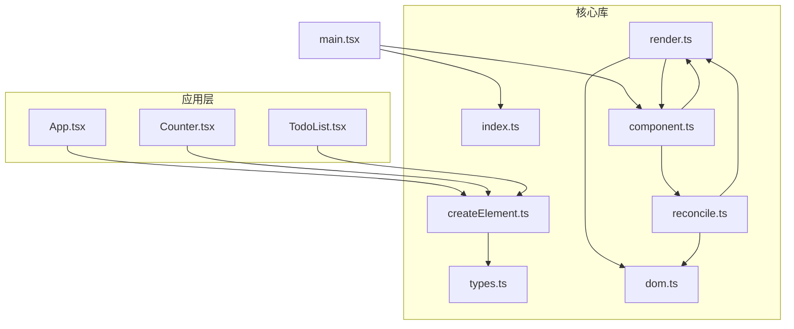
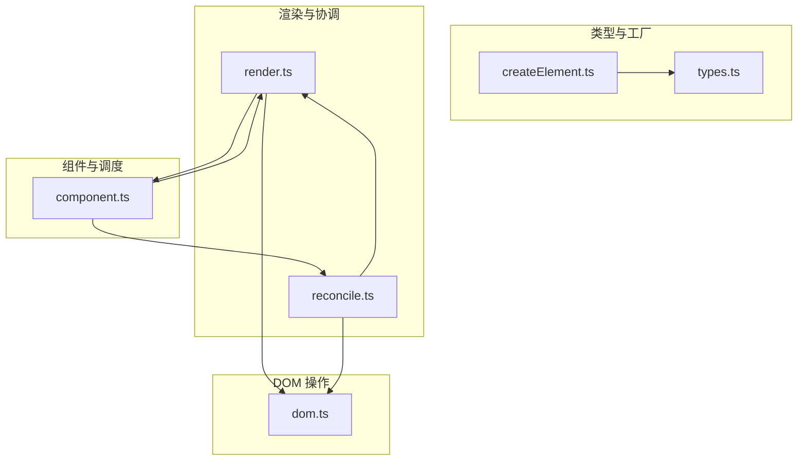
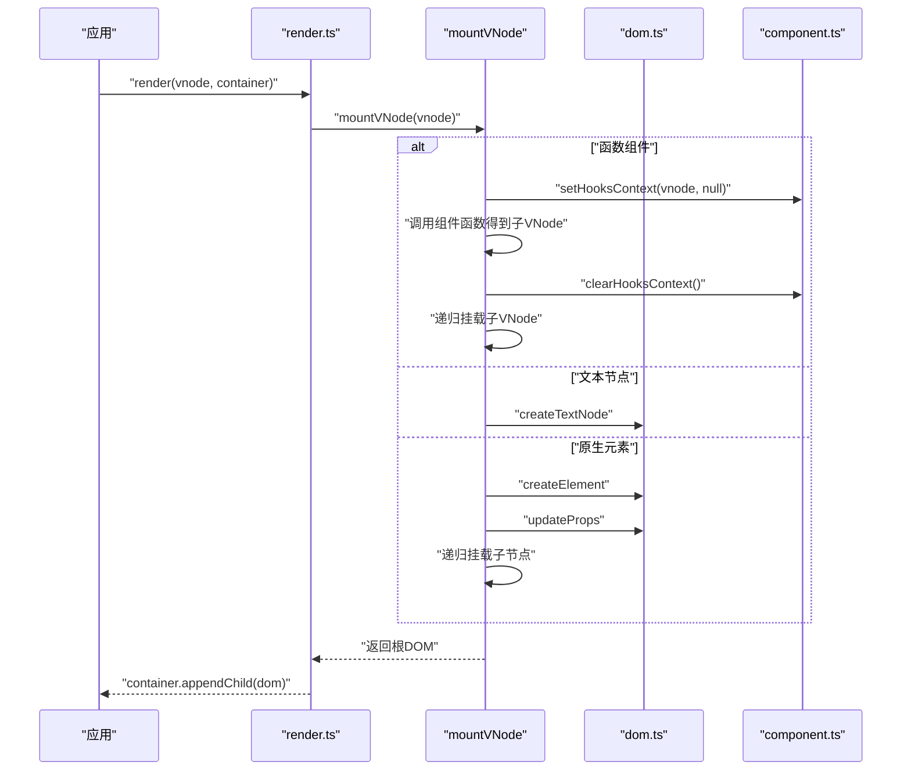
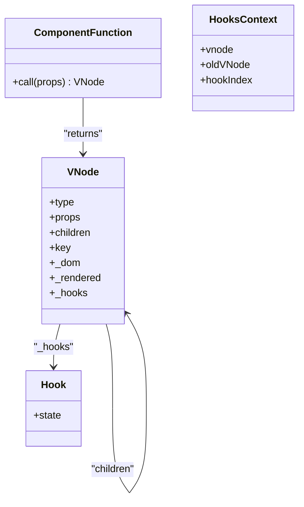
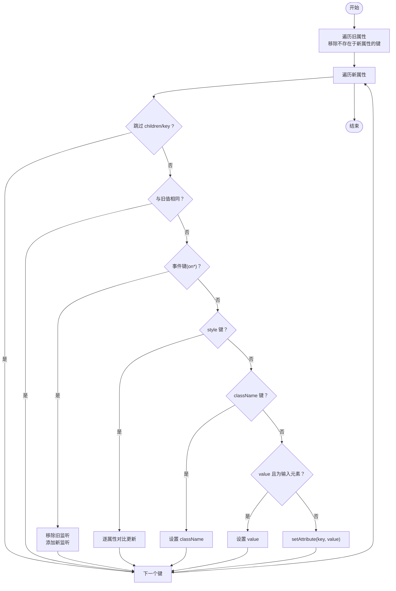
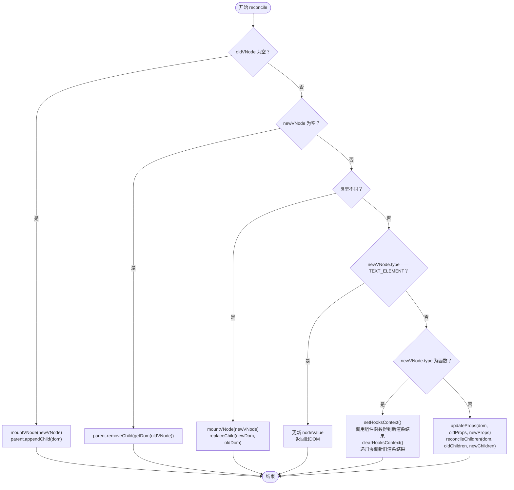
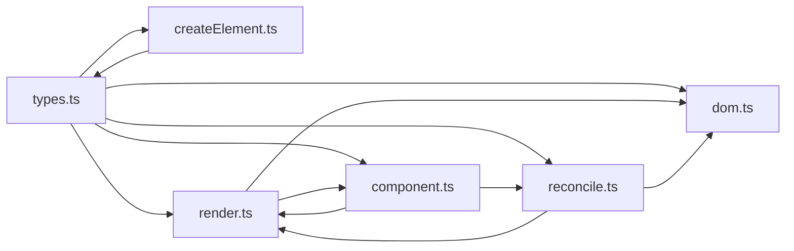

# 核心架构

<cite>
**本文引用的文件**
- [src/mini-react/index.ts](file://src/mini-react/index.ts)
- [src/mini-react/types.ts](file://src/mini-react/types.ts)
- [src/mini-react/createElement.ts](file://src/mini-react/createElement.ts)
- [src/mini-react/render.ts](file://src/mini-react/render.ts)
- [src/mini-react/reconcile.ts](file://src/mini-react/reconcile.ts)
- [src/mini-react/dom.ts](file://src/mini-react/dom.ts)
- [src/mini-react/component.ts](file://src/mini-react/component.ts)
- [src/app/App.tsx](file://src/app/App.tsx)
- [src/app/Counter.tsx](file://src/app/Counter.tsx)
- [src/app/TodoList.tsx](file://src/app/TodoList.tsx)
- [src/main.tsx](file://src/main.tsx)
- [package.json](file://package.json)
</cite>

## 目录
1. [简介](#简介)
2. [项目结构](#项目结构)
3. [核心组件](#核心组件)
4. [架构总览](#架构总览)
5. [详细组件分析](#详细组件分析)
6. [依赖关系分析](#依赖关系分析)
7. [性能考量](#性能考量)
8. [故障排查指南](#故障排查指南)
9. [结论](#结论)
10. [附录](#附录)

## 简介
本文件面向 mini-react 的核心架构，系统性阐述其模块化设计、函数式编程风格与类型驱动开发方法；深入解析虚拟 DOM 系统的节点创建、渲染流程与协调算法；说明组件系统（函数式组件、Hook 系统与状态管理）的实现；解释 DOM 操作系统（属性更新、事件处理、样式管理）的策略；并提供架构图与组件关系图，帮助开发者快速理解系统整体设计。

## 项目结构
项目采用按功能域划分的模块化组织方式：
- 核心库位于 src/mini-react，包含虚拟 DOM、渲染、协调、DOM 操作、组件与 Hook、应用调度等能力
- 示例应用位于 src/app，展示函数式组件与 Hook 的使用
- 入口文件 src/main.tsx 负责创建应用实例并挂载根组件
- package.json 定义了构建与类型检查脚本

图表来源
- [src/main.tsx:1-6](file://src/main.tsx#L1-L6)
- [src/mini-react/index.ts:1-12](file://src/mini-react/index.ts#L1-L12)
- [src/mini-react/createElement.ts:1-58](file://src/mini-react/createElement.ts#L1-L58)
- [src/mini-react/render.ts:1-49](file://src/mini-react/render.ts#L1-L49)
- [src/mini-react/reconcile.ts:1-110](file://src/mini-react/reconcile.ts#L1-L110)
- [src/mini-react/dom.ts:1-97](file://src/mini-react/dom.ts#L1-L97)
- [src/mini-react/component.ts:1-137](file://src/mini-react/component.ts#L1-L137)
- [src/app/App.tsx:1-33](file://src/app/App.tsx#L1-L33)
- [src/app/Counter.tsx:1-52](file://src/app/Counter.tsx#L1-L52)
- [src/app/TodoList.tsx:1-113](file://src/app/TodoList.tsx#L1-L113)

章节来源
- [src/main.tsx:1-6](file://src/main.tsx#L1-L6)
- [package.json:1-17](file://package.json#L1-L17)

## 核心组件
本节聚焦 mini-react 的核心模块及其职责边界与协作方式。

- 类型与常量定义
  - 统一的虚拟节点类型 VNode、属性 Props、组件函数签名 ComponentFunction
  - 文本元素常量 TEXT_ELEMENT，用于统一文本节点的识别与处理
  - Hook 接口 Hook，承载单个 Hook 的状态槽位
- 虚拟 DOM 工厂
  - createElement：将 JSX 语法转换为 VNode，规范化 children（扁平化、过滤无效值、文本节点包装）
- 渲染与挂载
  - mountVNode：递归挂载 VNode 树，区分函数组件、文本节点与原生元素；为函数组件设置/清理 Hook 上下文
- 协调与增量更新
  - reconcile：对比新旧 VNode 树，执行新增、删除、替换、文本更新、函数组件渲染、原生元素属性与子节点增量更新
- DOM 操作系统
  - createDom：创建真实 DOM 节点（不递归）
  - updateProps：增量更新属性，支持事件绑定/解绑、样式对象、className、value 等
- 组件与 Hook
  - setHooksContext/clearHooksContext：函数组件渲染期间的 Hook 上下文管理
  - useState：与 React 一致的状态 Hook，按声明顺序复用状态槽位
  - createApp/scheduleUpdate：应用实例与微任务批量调度，触发从根组件重新渲染并进行协调

章节来源
- [src/mini-react/types.ts:1-26](file://src/mini-react/types.ts#L1-L26)
- [src/mini-react/createElement.ts:1-58](file://src/mini-react/createElement.ts#L1-L58)
- [src/mini-react/render.ts:1-49](file://src/mini-react/render.ts#L1-L49)
- [src/mini-react/reconcile.ts:1-110](file://src/mini-react/reconcile.ts#L1-L110)
- [src/mini-react/dom.ts:1-97](file://src/mini-react/dom.ts#L1-L97)
- [src/mini-react/component.ts:1-137](file://src/mini-react/component.ts#L1-L137)

## 架构总览
mini-react 采用“类型驱动 + 函数式 + 虚拟 DOM + 协调”的架构设计：
- 类型系统贯穿始终，保证 VNode 结构、属性与 Hook 状态的一致性
- 渲染与协调以纯函数为主，避免副作用扩散
- DOM 操作被封装在独立模块中，便于统一管理与优化
- 组件系统通过 Hook 上下文与微任务调度实现状态管理与批量更新

图表来源
- [src/mini-react/types.ts:1-26](file://src/mini-react/types.ts#L1-L26)
- [src/mini-react/createElement.ts:1-58](file://src/mini-react/createElement.ts#L1-L58)
- [src/mini-react/render.ts:1-49](file://src/mini-react/render.ts#L1-L49)
- [src/mini-react/reconcile.ts:1-110](file://src/mini-react/reconcile.ts#L1-L110)
- [src/mini-react/dom.ts:1-97](file://src/mini-react/dom.ts#L1-L97)
- [src/mini-react/component.ts:1-137](file://src/mini-react/component.ts#L1-L137)

## 详细组件分析

### 虚拟 DOM 系统
- 节点创建
  - createElement 将 JSX 转换为 VNode，规范化 children 并生成文本 VNode（类型为 TEXT_ELEMENT）
- 渲染流程
  - mountVNode 递归挂载：函数组件先设置 Hook 上下文，调用组件函数得到子 VNode，再递归挂载；原生元素创建 DOM 并一次性更新属性；文本节点直接创建 Text 节点
- 协调算法
  - reconcile 实现增量更新：新增/删除/替换、文本节点更新、函数组件渲染、原生元素属性与子节点逐索引对比
  - reconcileChildren 以索引为基准，对齐新旧子节点序列，逐项递归协调

图表来源
- [src/mini-react/render.ts:45-49](file://src/mini-react/render.ts#L45-L49)
- [src/mini-react/render.ts:9-40](file://src/mini-react/render.ts#L9-L40)
- [src/mini-react/dom.ts:6-14](file://src/mini-react/dom.ts#L6-L14)
- [src/mini-react/dom.ts:19-53](file://src/mini-react/dom.ts#L19-L53)
- [src/mini-react/component.ts:22-32](file://src/mini-react/component.ts#L22-L32)

章节来源
- [src/mini-react/createElement.ts:9-25](file://src/mini-react/createElement.ts#L9-L25)
- [src/mini-react/render.ts:9-40](file://src/mini-react/render.ts#L9-L40)
- [src/mini-react/reconcile.ts:14-81](file://src/mini-react/reconcile.ts#L14-L81)

### 组件系统与 Hook
- 函数式组件
  - 组件函数签名统一，接收 props 与 children，返回 VNode
- Hook 系统
  - setHooksContext/clearHooksContext 在组件渲染期间建立/释放上下文
  - useState 按声明顺序分配状态槽位，首次渲染初始化，后续渲染从旧 VNode 复用
  - scheduleUpdate 通过微任务批量合并多次 setState，避免重复渲染
- 应用实例
  - createApp 首次渲染根组件，保存 currentVNode，并在后续更新中以 reconcile 对比新旧 VNode

图表来源
- [src/mini-react/types.ts:7-25](file://src/mini-react/types.ts#L7-L25)
- [src/mini-react/component.ts:7-32](file://src/mini-react/component.ts#L7-L32)

章节来源
- [src/mini-react/types.ts:7-25](file://src/mini-react/types.ts#L7-L25)
- [src/mini-react/component.ts:22-83](file://src/mini-react/component.ts#L22-L83)
- [src/mini-react/component.ts:99-136](file://src/mini-react/component.ts#L99-L136)

### DOM 操作系统
- createDom
  - 文本节点：创建 Text 节点
  - 原生元素：创建元素并一次性应用属性
- updateProps
  - 增量更新：移除旧属性、设置新属性
  - 事件：统一事件名转换（onClick → click），先移除旧监听再绑定新监听
  - 样式：逐属性对比，仅更新变化部分
  - 特殊属性：className、value 等做专门处理

图表来源
- [src/mini-react/dom.ts:19-53](file://src/mini-react/dom.ts#L19-L53)
- [src/mini-react/dom.ts:67-86](file://src/mini-react/dom.ts#L67-L86)
- [src/mini-react/dom.ts:88-96](file://src/mini-react/dom.ts#L88-L96)

章节来源
- [src/mini-react/dom.ts:6-14](file://src/mini-react/dom.ts#L6-L14)
- [src/mini-react/dom.ts:19-53](file://src/mini-react/dom.ts#L19-L53)

### 协调算法（reconcile）
- 场景覆盖
  - 新增：旧节点为空，直接挂载新节点并追加到父 DOM
  - 删除：新节点为空，移除旧 DOM
  - 替换：类型不同，先挂载新节点，再替换旧 DOM
  - 文本节点：直接更新 nodeValue
  - 函数组件：设置 Hook 上下文，调用组件函数得到新渲染结果，递归协调
  - 原生元素：增量更新属性，逐索引协调子节点
- 子节点协调
  - reconcileChildren 以最大长度为界，逐索引对比，递归 reconcile

图表来源
- [src/mini-react/reconcile.ts:14-81](file://src/mini-react/reconcile.ts#L14-L81)
- [src/mini-react/reconcile.ts:86-99](file://src/mini-react/reconcile.ts#L86-L99)
- [src/mini-react/reconcile.ts:105-109](file://src/mini-react/reconcile.ts#L105-L109)

章节来源
- [src/mini-react/reconcile.ts:14-81](file://src/mini-react/reconcile.ts#L14-L81)
- [src/mini-react/reconcile.ts:86-99](file://src/mini-react/reconcile.ts#L86-L99)

## 依赖关系分析
- 模块内聚与耦合
  - types.ts 提供统一类型定义，被 createElement、render、reconcile、dom、component 广泛引用
  - createElement 仅依赖 types.ts，保持低耦合
  - render 依赖 dom.ts 与 component.ts，负责挂载与初次渲染
  - reconcile 依赖 dom.ts、render.ts 与 component.ts，负责增量更新
  - dom.ts 独立封装 DOM 操作，职责单一
  - component.ts 管理 Hook 上下文与应用调度，依赖 render 与 reconcile
- 外部依赖
  - 无第三方运行时依赖，仅使用浏览器原生 API 与微任务机制

图表来源
- [src/mini-react/types.ts:1-26](file://src/mini-react/types.ts#L1-L26)
- [src/mini-react/createElement.ts:1](file://src/mini-react/createElement.ts#L1)
- [src/mini-react/render.ts:1](file://src/mini-react/render.ts#L1)
- [src/mini-react/reconcile.ts:1](file://src/mini-react/reconcile.ts#L1)
- [src/mini-react/dom.ts:1](file://src/mini-react/dom.ts#L1)
- [src/mini-react/component.ts:1](file://src/mini-react/component.ts#L1)

章节来源
- [src/mini-react/index.ts:1-12](file://src/mini-react/index.ts#L1-L12)

## 性能考量
- 批量更新
  - scheduleUpdate 使用微任务合并多次 setState，减少重复渲染次数
- 增量更新
  - reconcile 以类型与索引为依据，避免整树重建
  - updateProps 仅更新变化的属性，事件统一解绑/绑定策略降低泄漏风险
- 子节点对齐
  - reconcileChildren 以索引对齐，适合频繁插入/删除场景
- 注意事项
  - 当前未实现 key 支持的跨索引匹配，若需要跨位置移动，请扩展 reconcile 以支持基于 key 的匹配策略

## 故障排查指南
- useState 必须在函数组件内部调用
  - 若在非组件上下文中调用，会抛出错误；请确认已通过 setHooksContext 建立上下文
- 事件处理
  - 事件键需以 on 开头（如 onClick），否则不会作为事件处理
  - 事件更新遵循“先移除旧监听，再绑定新监听”，避免重复绑定
- 样式与属性
  - className 与 value 有专门处理逻辑；style 为对象时按属性粒度更新
- 文本节点
  - 文本节点类型为 TEXT_ELEMENT，直接更新 nodeValue，无需额外属性

章节来源
- [src/mini-react/component.ts:54-56](file://src/mini-react/component.ts#L54-L56)
- [src/mini-react/dom.ts:37-52](file://src/mini-react/dom.ts#L37-L52)
- [src/mini-react/dom.ts:67-86](file://src/mini-react/dom.ts#L67-L86)
- [src/mini-react/reconcile.ts:48-55](file://src/mini-react/reconcile.ts#L48-L55)

## 结论
mini-react 通过类型驱动与函数式设计，实现了清晰的虚拟 DOM 生命周期与协调机制；组件系统以 Hook 上下文为核心，提供与 React 一致的 useState 体验；DOM 操作被集中封装，便于维护与优化。该架构在保持简洁的同时，具备良好的可扩展性，适合进一步引入 key 匹配、Fiber 化、并发更新等高级特性。

## 附录
- 入口与示例
  - main.tsx 调用 createApp 挂载根组件 App
  - App.tsx 组合 Counter 与 TodoList 两个示例组件
- 关键 API
  - 导出：createElement、render、reconcile、createApp、useState、TEXT_ELEMENT、VNode、Props、ComponentFunction
  - 默认导出 MiniReact，便于 JSX 工厂使用

章节来源
- [src/main.tsx:1-6](file://src/main.tsx#L1-L6)
- [src/app/App.tsx:1-33](file://src/app/App.tsx#L1-L33)
- [src/mini-react/index.ts:1-12](file://src/mini-react/index.ts#L1-L12)