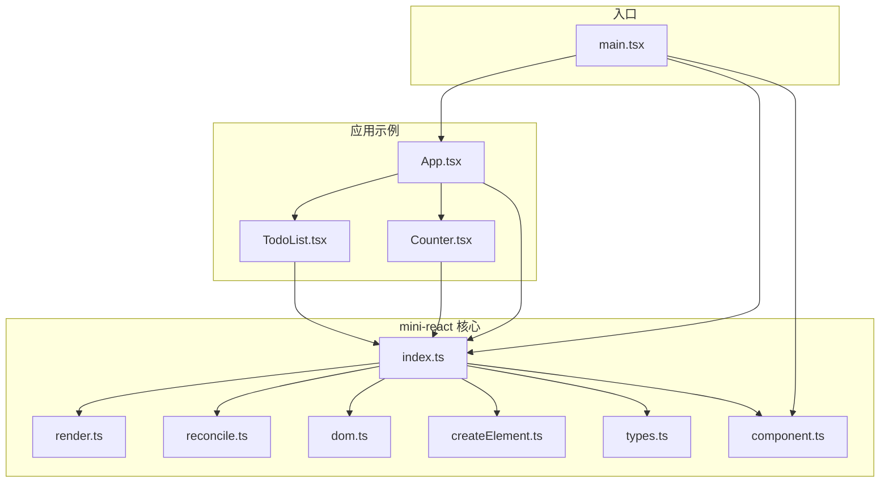
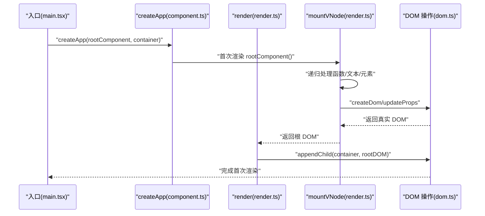
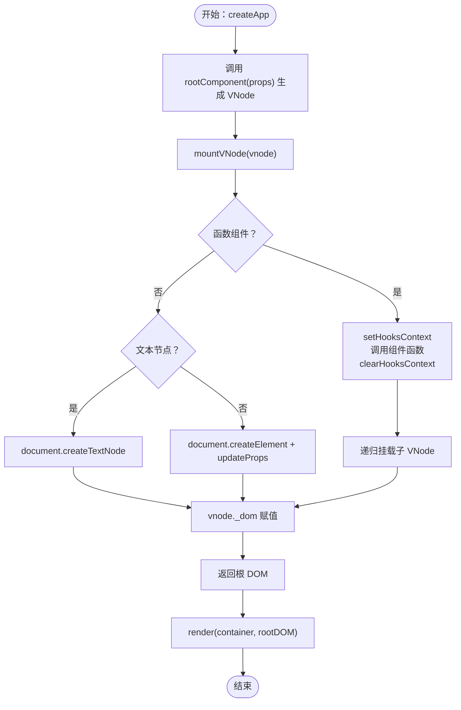
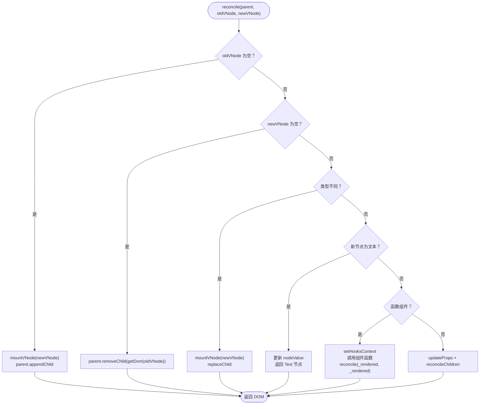
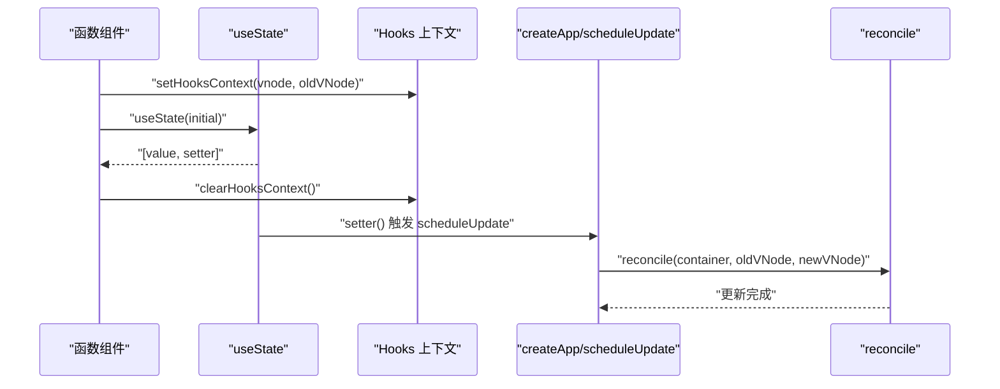
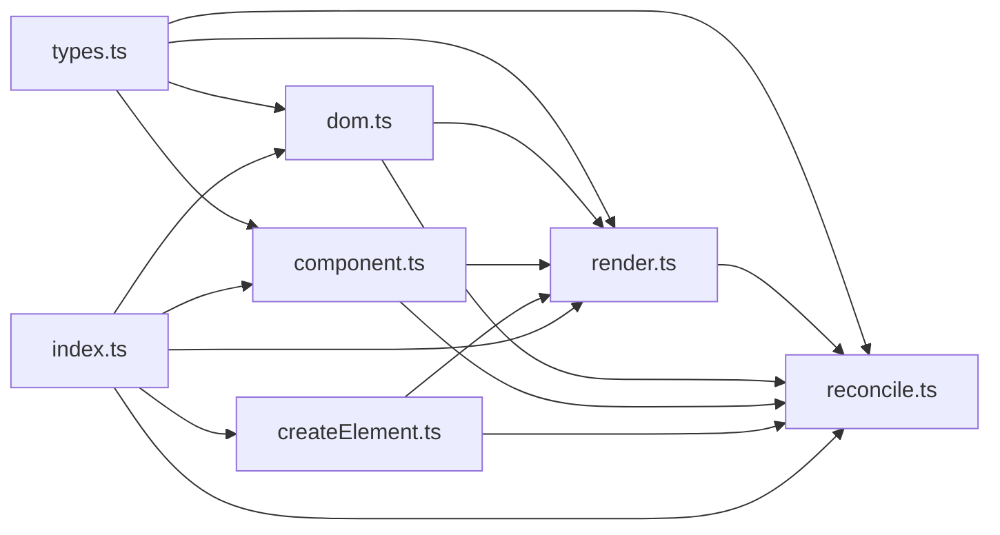

# 渲染系统

<cite>
**本文引用的文件**
- [render.ts](file://src/mini-react/render.ts)
- [reconcile.ts](file://src/mini-react/reconcile.ts)
- [dom.ts](file://src/mini-react/dom.ts)
- [createElement.ts](file://src/mini-react/createElement.ts)
- [types.ts](file://src/mini-react/types.ts)
- [component.ts](file://src/mini-react/component.ts)
- [index.ts](file://src/mini-react/index.ts)
- [main.tsx](file://src/main.tsx)
- [App.tsx](file://src/app/App.tsx)
- [Counter.tsx](file://src/app/Counter.tsx)
- [TodoList.tsx](file://src/app/TodoList.tsx)
</cite>

## 目录
1. [简介](#简介)
2. [项目结构](#项目结构)
3. [核心组件](#核心组件)
4. [架构总览](#架构总览)
5. [详细组件分析](#详细组件分析)
6. [依赖关系分析](#依赖关系分析)
7. [性能考量](#性能考量)
8. [故障排查指南](#故障排查指南)
9. [结论](#结论)
10. [附录](#附录)

## 简介
本技术文档围绕“渲染系统”的首次渲染流程进行深入解析，涵盖 render 函数的实现逻辑、DOM 挂载机制、从虚拟 DOM 到真实 DOM 的转换过程（递归渲染、节点创建与属性设置）、DOM 操作的安全性保障与性能优化策略、错误处理与边界情况处理方案，并结合复杂嵌套组件结构的实际示例路径，帮助读者全面理解该迷你 React 渲染内核的工作原理。

## 项目结构
该项目采用“功能模块化 + 类型定义”的组织方式：
- mini-react 核心层：负责虚拟 DOM、渲染、调和、DOM 操作、组件与 Hooks、类型定义等
- app 示例层：提供可运行的组件示例（计数器、待办列表）
- 入口层：main.tsx 负责创建应用实例并触发首次渲染

图表来源
- [main.tsx:1-6](file://src/main.tsx#L1-L6)
- [index.ts:1-12](file://src/mini-react/index.ts#L1-L12)
- [App.tsx:1-33](file://src/app/App.tsx#L1-L33)
- [Counter.tsx:1-52](file://src/app/Counter.tsx#L1-L52)
- [TodoList.tsx:1-113](file://src/app/TodoList.tsx#L1-L113)
- [render.ts:1-49](file://src/mini-react/render.ts#L1-L49)
- [reconcile.ts:1-110](file://src/mini-react/reconcile.ts#L1-L110)
- [dom.ts:1-97](file://src/mini-react/dom.ts#L1-L97)
- [createElement.ts:1-58](file://src/mini-react/createElement.ts#L1-L58)
- [types.ts:1-26](file://src/mini-react/types.ts#L1-L26)
- [component.ts:1-137](file://src/mini-react/component.ts#L1-L137)

章节来源
- [main.tsx:1-6](file://src/main.tsx#L1-L6)
- [index.ts:1-12](file://src/mini-react/index.ts#L1-L12)

## 核心组件
- 虚拟 DOM 与类型
  - VNode 结构：包含 type、props、children、key，以及挂载后指向真实 DOM 的 _dom 与函数组件上次渲染结果 _rendered
  - TEXT_ELEMENT 常量用于文本节点
- 渲染与挂载
  - render：首次渲染入口，将 VNode 挂载到容器
  - mountVNode：递归挂载 VNode，处理函数组件、文本节点与原生元素
- 调和与增量更新
  - reconcile：对比新旧 VNode，执行新增、删除、替换、文本更新、函数组件更新、元素属性与子节点增量更新
  - reconcileChildren：按索引逐项对比子节点
- DOM 操作
  - createDom：创建真实 DOM（不递归子节点）
  - updateProps：增量更新属性（含事件、样式、类名、表单值等）
- 组件与 Hooks
  - createApp：应用实例管理与首次渲染
  - useState：基于索引的状态复用与调度
  - Hooks 上下文：setHooksContext/clearHooksContext 保证函数组件渲染期间的 hooks 状态正确复用

章节来源
- [types.ts:1-26](file://src/mini-react/types.ts#L1-L26)
- [render.ts:1-49](file://src/mini-react/render.ts#L1-L49)
- [reconcile.ts:1-110](file://src/mini-react/reconcile.ts#L1-L110)
- [dom.ts:1-97](file://src/mini-react/dom.ts#L1-L97)
- [component.ts:1-137](file://src/mini-react/component.ts#L1-L137)

## 架构总览
渲染系统由“应用实例 -> 首次渲染 -> DOM 挂载 -> 交互驱动更新 -> 调和差异”构成闭环。首次渲染通过 render/mountVNode 完成，后续更新通过 reconcile 实现最小化 DOM 变更。

图表来源
- [main.tsx:1-6](file://src/main.tsx#L1-L6)
- [component.ts:99-117](file://src/mini-react/component.ts#L99-L117)
- [render.ts:45-49](file://src/mini-react/render.ts#L45-L49)
- [dom.ts:6-14](file://src/mini-react/dom.ts#L6-L14)

## 详细组件分析

### 首次渲染流程与 render 函数
- 入口：createApp 在内部调用 rootComponent 生成 VNode，随后通过 mountVNode 递归创建真实 DOM，并将根节点追加到容器中
- 关键点：
  - 函数组件：设置 Hooks 上下文，调用组件函数得到子 VNode，递归挂载
  - 文本节点：直接创建 Text 节点
  - 原生元素：创建元素并一次性设置所有属性
  - 返回根 DOM 并 append 到容器

图表来源
- [component.ts:99-117](file://src/mini-react/component.ts#L99-L117)
- [render.ts:9-40](file://src/mini-react/render.ts#L9-L40)
- [dom.ts:6-14](file://src/mini-react/dom.ts#L6-L14)

章节来源
- [component.ts:99-117](file://src/mini-react/component.ts#L99-L117)
- [render.ts:45-49](file://src/mini-react/render.ts#L45-L49)

### mountVNode：从 VNode 到真实 DOM 的递归转换
- 函数组件
  - 设置 Hooks 上下文，调用组件函数得到子 VNode，清空上下文
  - 递归挂载子 VNode，并将子 VNode 的 _dom 作为自身 _dom
- 文本节点
  - 直接创建 Text 节点并缓存到 _dom
- 原生元素
  - 创建元素，调用 updateProps 设置初始属性
  - 递归挂载子节点并追加到父 DOM
  - 缓存根 DOM 到 _dom

章节来源
- [render.ts:9-40](file://src/mini-react/render.ts#L9-L40)

### DOM 操作与属性设置：安全与性能
- createDom
  - 文本节点：使用 document.createTextNode
  - 元素节点：使用 document.createElement
- updateProps
  - 事件：以 onXxx 命名，自动移除旧事件并绑定新事件
  - 样式：逐项对比并设置 style 对象
  - 类名：直接设置 className
  - 表单值：针对 HTMLInputElement 设置 value
  - 其他属性：使用 setAttribute/removeAttribute
  - 性能：仅对变更的属性进行更新，避免全量覆盖

章节来源
- [dom.ts:6-97](file://src/mini-react/dom.ts#L6-L97)

### 调和算法：reconcile 与 reconcileChildren
- 新增：旧节点为空，直接挂载新节点并追加
- 删除：新节点为空，移除旧节点
- 类型不同：直接替换整棵子树
- 文本节点：仅更新 nodeValue
- 函数组件：复用旧 _rendered，递归 reconcile 子树
- 原生元素：增量更新属性，逐项 reconcile 子节点

图表来源
- [reconcile.ts:14-81](file://src/mini-react/reconcile.ts#L14-L81)
- [dom.ts:19-53](file://src/mini-react/dom.ts#L19-L53)

章节来源
- [reconcile.ts:14-110](file://src/mini-react/reconcile.ts#L14-L110)

### 组件与 Hooks：状态复用与调度
- createApp
  - 初始化应用实例，清空容器，首次渲染并保存 currentVNode
- useState
  - 通过 setHooksContext/clearHooksContext 在渲染期间维护 hookIndex
  - 首次渲染初始化状态，后续渲染从旧 VNode 复用状态
  - setter 支持函数式更新，触发微任务批量调度
- 调度
  - scheduleUpdate 使用 queueMicrotask 合并多次 setState
  - 在微任务中重新渲染并调用 reconcile

图表来源
- [component.ts:22-32](file://src/mini-react/component.ts#L22-L32)
- [component.ts:51-83](file://src/mini-react/component.ts#L51-L83)
- [component.ts:122-136](file://src/mini-react/component.ts#L122-L136)
- [reconcile.ts:14-81](file://src/mini-react/reconcile.ts#L14-L81)

章节来源
- [component.ts:99-137](file://src/mini-react/component.ts#L99-L137)

### JSX 工厂与 VNode 规范化
- createElement
  - 提取 key 并从 props 中移除，避免传递给组件
  - 规范化 children：扁平化数组、字符串/数字转文本节点、过滤 null/undefined/boolean
- 默认导出 MiniReact 以支持 JSX 工厂

章节来源
- [createElement.ts:9-58](file://src/mini-react/createElement.ts#L9-L58)
- [index.ts:1-12](file://src/mini-react/index.ts#L1-L12)

### 复杂嵌套组件结构的渲染示例
- App.tsx 包含 Counter 与 TodoList 两个子组件，演示多层嵌套与条件渲染
- Counter.tsx 展示 useState 的基础用法与事件绑定
- TodoList.tsx 展示数组映射、key 的使用、输入与键盘事件

章节来源
- [App.tsx:1-33](file://src/app/App.tsx#L1-L33)
- [Counter.tsx:1-52](file://src/app/Counter.tsx#L1-L52)
- [TodoList.tsx:1-113](file://src/app/TodoList.tsx#L1-L113)

## 依赖关系分析
- 模块耦合
  - render.ts 依赖 dom.ts 与 component.ts（Hooks 上下文）
  - reconcile.ts 依赖 render.ts（新增分支）、dom.ts（属性更新）、component.ts（函数组件）
  - dom.ts 仅依赖 types.ts
  - component.ts 依赖 render.ts 与 reconcile.ts（调度）
  - index.ts 汇聚导出，供外部使用
- 数据流
  - VNode 通过 mountVNode 生成真实 DOM，随后被 render 或 reconcile 操作
  - 函数组件通过 _rendered 与 _dom 连接父子关系

图表来源
- [types.ts:1-26](file://src/mini-react/types.ts#L1-L26)
- [render.ts:1-4](file://src/mini-react/render.ts#L1-L4)
- [reconcile.ts:1-4](file://src/mini-react/reconcile.ts#L1-L4)
- [dom.ts:1-2](file://src/mini-react/dom.ts#L1-L2)
- [component.ts:1-4](file://src/mini-react/component.ts#L1-L4)
- [createElement.ts:1-2](file://src/mini-react/createElement.ts#L1-L2)
- [index.ts:1-6](file://src/mini-react/index.ts#L1-L6)

## 性能考量
- 属性更新最小化
  - updateProps 仅比较变更的属性，避免全量覆盖
  - 事件处理先移除旧监听再绑定新监听，防止重复绑定
- 子节点增量对比
  - reconcileChildren 按索引逐项对比，减少不必要的 DOM 操作
- 微任务批处理
  - scheduleUpdate 使用 queueMicrotask 合并多次 setState，降低重渲染频率
- 文本节点快速更新
  - 文本节点仅更新 nodeValue，无需重建 DOM

章节来源
- [dom.ts:19-53](file://src/mini-react/dom.ts#L19-L53)
- [reconcile.ts:86-99](file://src/mini-react/reconcile.ts#L86-L99)
- [component.ts:122-136](file://src/mini-react/component.ts#L122-L136)

## 故障排查指南
- 错误场景与定位
  - 在非函数组件中调用 useState：抛出异常，提示必须在函数组件内部调用
  - 未设置容器或容器为空：首次渲染会将容器内容清空后再追加根节点
  - 事件处理异常：检查事件名格式（onXxx），确保回调函数存在
  - 样式/类名更新异常：确认传入的是对象而非字符串
- 边界情况
  - 条件渲染：支持 {flag && <X />}，normalizeChildren 会过滤布尔值
  - key 作用：用于列表稳定化，reconcileChildren 以索引对比为主，建议为列表项提供 key
  - 空 children：normalizeChildren 会过滤 null/undefined/boolean，避免创建无效节点

章节来源
- [component.ts:54-56](file://src/mini-react/component.ts#L54-L56)
- [component.ts:114-116](file://src/mini-react/component.ts#L114-L116)
- [createElement.ts:33-48](file://src/mini-react/createElement.ts#L33-L48)
- [dom.ts:38-52](file://src/mini-react/dom.ts#L38-L52)

## 结论
该渲染系统以简洁清晰的模块划分实现了从 VNode 到真实 DOM 的完整渲染链路。首次渲染通过 mountVNode 递归挂载，配合 createDom 与 updateProps 完成节点创建与属性设置；后续更新通过 reconcile 实现最小化差异计算与 DOM 变更。系统在安全性（事件与属性处理）与性能（增量更新、微任务批处理）方面均有良好设计，并通过 Hooks 机制支持函数组件状态管理与复杂嵌套结构的渲染。

## 附录
- 入口与示例
  - 入口：main.tsx 调用 createApp(App, container)
  - 示例：App.tsx -> Counter.tsx / TodoList.tsx
- 导出与使用
  - index.ts 汇总导出 createElement、render、reconcile、createApp、useState、类型等

章节来源
- [main.tsx:1-6](file://src/main.tsx#L1-L6)
- [index.ts:1-12](file://src/mini-react/index.ts#L1-L12)
- [App.tsx:1-33](file://src/app/App.tsx#L1-L33)
- [Counter.tsx:1-52](file://src/app/Counter.tsx#L1-L52)
- [TodoList.tsx:1-113](file://src/app/TodoList.tsx#L1-L113)