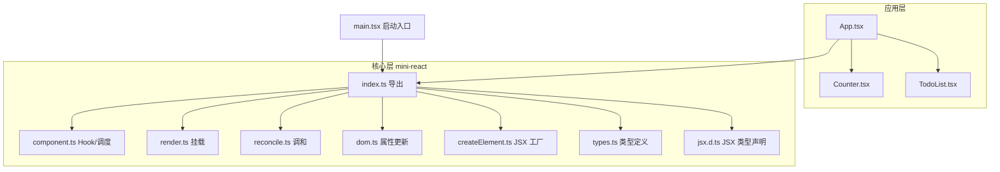
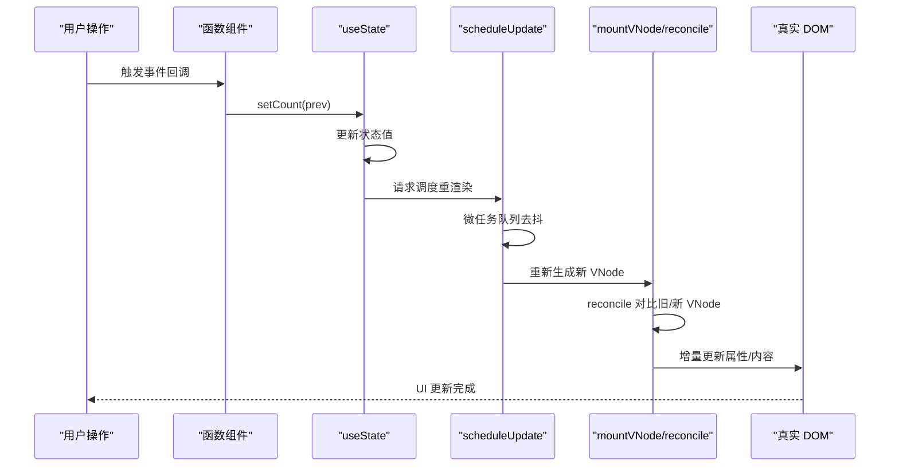
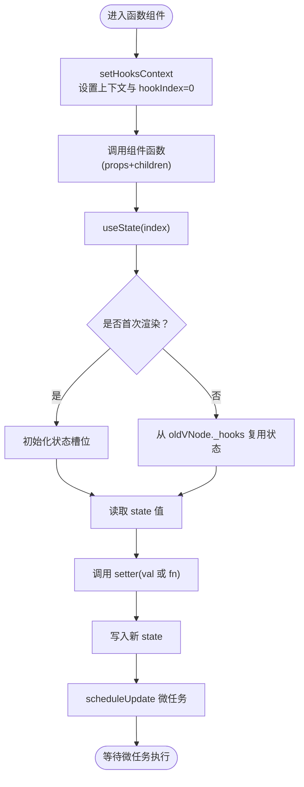
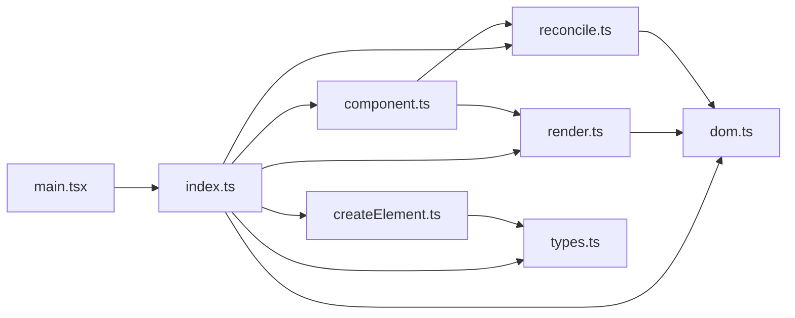

# 组件系统

<cite>
**本文引用的文件**
- [src/mini-react/index.ts](file://src/mini-react/index.ts)
- [src/mini-react/component.ts](file://src/mini-react/component.ts)
- [src/mini-react/createElement.ts](file://src/mini-react/createElement.ts)
- [src/mini-react/render.ts](file://src/mini-react/render.ts)
- [src/mini-react/reconcile.ts](file://src/mini-react/reconcile.ts)
- [src/mini-react/dom.ts](file://src/mini-react/dom.ts)
- [src/mini-react/types.ts](file://src/mini-react/types.ts)
- [src/mini-react/jsx.d.ts](file://src/mini-react/jsx.d.ts)
- [src/app/App.tsx](file://src/app/App.tsx)
- [src/app/Counter.tsx](file://src/app/Counter.tsx)
- [src/app/TodoList.tsx](file://src/app/TodoList.tsx)
- [src/main.tsx](file://src/main.tsx)
- [package.json](file://package.json)
</cite>

## 目录
1. [简介](#简介)
2. [项目结构](#项目结构)
3. [核心组件](#核心组件)
4. [架构总览](#架构总览)
5. [详细组件分析](#详细组件分析)
6. [依赖关系分析](#依赖关系分析)
7. [性能考量](#性能考量)
8. [故障排查指南](#故障排查指南)
9. [结论](#结论)
10. [附录](#附录)

## 简介
本组件系统是一个轻量级的函数式组件框架，采用虚拟 DOM + 调和（diff/reconcile）算法实现，提供最小可用的状态管理能力（useState）与基础的 DOM 属性更新机制。系统以函数式组件为核心，通过 Hook 上下文在渲染期间维护每个函数组件的内部状态，并通过微任务批量调度实现状态更新与重新渲染。该系统适合学习 React 的核心思想与实现路径，同时可作为教学或小型项目的原型工具。

## 项目结构
项目采用按功能模块划分的目录组织：
- mini-react 核心层：负责虚拟 DOM、渲染、调和、DOM 属性更新、Hook 系统与类型定义
- app 示例层：提供示例组件（计数器、待办列表），演示函数式组件与 Hook 的使用
- 入口层：main.tsx 作为应用启动入口，通过 createApp 初始化根组件并挂载到容器

图表来源
- [src/main.tsx:1-6](file://src/main.tsx#L1-L6)
- [src/mini-react/index.ts:1-12](file://src/mini-react/index.ts#L1-L12)
- [src/mini-react/component.ts:1-137](file://src/mini-react/component.ts#L1-L137)
- [src/mini-react/render.ts:1-49](file://src/mini-react/render.ts#L1-L49)
- [src/mini-react/reconcile.ts:1-110](file://src/mini-react/reconcile.ts#L1-L110)
- [src/mini-react/dom.ts:1-97](file://src/mini-react/dom.ts#L1-L97)
- [src/mini-react/createElement.ts:1-58](file://src/mini-react/createElement.ts#L1-L58)
- [src/mini-react/types.ts:1-26](file://src/mini-react/types.ts#L1-L26)
- [src/mini-react/jsx.d.ts:1-14](file://src/mini-react/jsx.d.ts#L1-L14)
- [src/app/App.tsx:1-33](file://src/app/App.tsx#L1-L33)
- [src/app/Counter.tsx:1-52](file://src/app/Counter.tsx#L1-L52)
- [src/app/TodoList.tsx:1-113](file://src/app/TodoList.tsx#L1-L113)

章节来源
- [src/main.tsx:1-6](file://src/main.tsx#L1-L6)
- [src/mini-react/index.ts:1-12](file://src/mini-react/index.ts#L1-L12)

## 核心组件
- 虚拟 DOM 与 JSX 工厂
  - createElement：将 JSX 语法转换为 VNode 结构，规范化 children，支持文本节点与组件节点
  - JSX 类型声明：为 TS 提供 JSX.Element 类型识别
- 渲染与挂载
  - mountVNode：递归挂载 VNode，处理函数组件、文本节点与原生元素
  - render：首次渲染入口，将根 VNode 挂载到容器
- 调和算法
  - reconcile：对比新旧 VNode，执行最小化 DOM 变更（新增、删除、替换、属性更新、子节点调和）
- DOM 属性更新
  - updateProps：增量更新属性，支持事件绑定/解绑、样式、className、value 等
- Hook 系统与调度
  - setHooksContext/clearHooksContext：在函数组件渲染前后设置/清理 Hook 上下文
  - useState：状态钩子，支持初始值与函数式更新；更新后通过微任务批量调度重渲染
  - createApp/scheduleUpdate：应用实例与更新调度，合并多次 setState 为一次重渲染

章节来源
- [src/mini-react/createElement.ts:1-58](file://src/mini-react/createElement.ts#L1-L58)
- [src/mini-react/jsx.d.ts:1-14](file://src/mini-react/jsx.d.ts#L1-L14)
- [src/mini-react/render.ts:1-49](file://src/mini-react/render.ts#L1-L49)
- [src/mini-react/reconcile.ts:1-110](file://src/mini-react/reconcile.ts#L1-L110)
- [src/mini-react/dom.ts:1-97](file://src/mini-react/dom.ts#L1-L97)
- [src/mini-react/component.ts:1-137](file://src/mini-react/component.ts#L1-L137)

## 架构总览
系统采用“函数式组件 + Hook 上下文 + 调和算法”的架构模式：
- 函数式组件通过 createElement 产出 VNode
- 渲染阶段为函数组件设置 Hook 上下文，执行组件函数，得到子 VNode
- reconcile 对比新旧 VNode，增量更新真实 DOM
- useState 在组件内部维护状态，更新时触发微任务调度，完成批量重渲染

图表来源
- [src/mini-react/component.ts:119-137](file://src/mini-react/component.ts#L119-L137)
- [src/mini-react/reconcile.ts:14-81](file://src/mini-react/reconcile.ts#L14-L81)
- [src/mini-react/render.ts:9-40](file://src/mini-react/render.ts#L9-L40)
- [src/mini-react/dom.ts:19-53](file://src/mini-react/dom.ts#L19-L53)

## 详细组件分析

### 函数式组件与 Hook 系统
- 设计理念
  - 函数式组件无类实例，状态通过 Hook 在渲染期间注入到 VNode 上
  - Hook 通过“索引”绑定到函数组件的 VNode，保证多次渲染中状态稳定
- Hook 上下文
  - setHooksContext：在渲染开始时为当前 VNode 初始化 _hooks 数组，记录 oldVNode 以便复用状态
  - clearHooksContext：渲染结束后清理上下文，避免跨组件污染
- useState 实现要点
  - 首次渲染：根据初始值创建状态槽位
  - 后续渲染：从 oldVNode._hooks 复用状态槽位，保持引用稳定
  - setter 支持两种形式：直接值与函数式更新；更新后调用 scheduleUpdate 触发重渲染
- 生命周期说明
  - 创建：首次渲染时执行组件函数，生成子 VNode 并挂载
  - 更新：通过 scheduleUpdate 重新生成新 VNode，reconcile 对比差异并增量更新
  - 销毁：当 VNode 从树中移除时，reconcile 会删除对应 DOM 节点
- 参数传递机制
  - 组件函数接收 props（含 children），props 中的 key 会被移除并忽略传递
  - 事件通过 onXxx 属性绑定，内部统一转为标准事件名

图表来源
- [src/mini-react/component.ts:22-83](file://src/mini-react/component.ts#L22-L83)
- [src/mini-react/render.ts:10-19](file://src/mini-react/render.ts#L10-L19)
- [src/mini-react/reconcile.ts:57-71](file://src/mini-react/reconcile.ts#L57-L71)

章节来源
- [src/mini-react/component.ts:1-137](file://src/mini-react/component.ts#L1-L137)
- [src/mini-react/render.ts:1-49](file://src/mini-react/render.ts#L1-L49)
- [src/mini-react/reconcile.ts:1-110](file://src/mini-react/reconcile.ts#L1-L110)

### 虚拟 DOM 与 JSX 工厂
- createElement
  - 规范化 children：扁平化数组、过滤无效值、字符串/数字转文本节点
  - 处理 key：从 props 中提取但不传递给组件，避免污染组件 props
- VNode 结构
  - 包含 type、props、children、key，以及渲染过程中的内部字段（_dom、_rendered、_hooks）

章节来源
- [src/mini-react/createElement.ts:1-58](file://src/mini-react/createElement.ts#L1-L58)
- [src/mini-react/types.ts:7-26](file://src/mini-react/types.ts#L7-L26)

### 渲染与挂载流程
- mountVNode
  - 函数组件：设置 Hook 上下文，执行组件函数，递归挂载子 VNode
  - 文本节点：创建 Text 节点
  - 原生元素：创建 DOM 并一次性更新所有属性
- render
  - 首次渲染入口，将根 VNode 挂载到容器

章节来源
- [src/mini-react/render.ts:1-49](file://src/mini-react/render.ts#L1-L49)

### 调和算法（Diff/Reconcile）
- reconcile 主要分支
  - 新增/删除：当旧/新 VNode 之一为空时，直接挂载或移除
  - 类型变更：直接替换整棵子树
  - 文本节点：仅更新 nodeValue
  - 函数组件：设置 Hook 上下文，递归调和其子 VNode
  - 原生元素：增量更新属性并逐索引调和子节点
- reconcileChildren
  - 以最大长度为界，逐项对比并递归调和

章节来源
- [src/mini-react/reconcile.ts:1-110](file://src/mini-react/reconcile.ts#L1-L110)

### DOM 属性更新机制
- updateProps
  - 事件：统一移除旧事件并绑定新事件
  - 样式：逐项对比并更新/移除
  - className/value：特殊属性单独处理
  - 其他属性：setAttribute/removeAttribute
- getDom
  - 函数组件穿透到实际 DOM 节点

章节来源
- [src/mini-react/dom.ts:1-97](file://src/mini-react/dom.ts#L1-L97)
- [src/mini-react/reconcile.ts:105-109](file://src/mini-react/reconcile.ts#L105-L109)

### 应用实例与调度
- createApp
  - 初始化应用实例，保存根组件、容器、当前 VNode 与更新标记
  - 首次渲染：生成根 VNode 并挂载
- scheduleUpdate
  - 通过微任务批量合并多次 setState，避免频繁重渲染
  - 重渲染流程：生成新 VNode，调用 reconcile 完成增量更新

章节来源
- [src/mini-react/component.ts:87-137](file://src/mini-react/component.ts#L87-L137)

### 示例组件与使用方式
- App
  - 组合多个子组件，演示组件间组合与样式
- Counter
  - 展示 useState 的基本用法与函数式更新
- TodoList
  - 展示复杂状态管理与事件处理，包含输入框、列表渲染与删除

章节来源
- [src/app/App.tsx:1-33](file://src/app/App.tsx#L1-L33)
- [src/app/Counter.tsx:1-52](file://src/app/Counter.tsx#L1-L52)
- [src/app/TodoList.tsx:1-113](file://src/app/TodoList.tsx#L1-L113)

## 依赖关系分析
- 模块耦合
  - component.ts 依赖 render.ts（mountVNode）与 reconcile.ts（调用），负责 Hook 上下文与调度
  - render.ts 与 reconcile.ts 依赖 dom.ts（属性更新）与 component.ts（Hook 上下文）
  - createElement.ts 与 types.ts 为通用基础设施
- 关键依赖链
  - main.tsx → index.ts → component.ts（createApp/useState）、render.ts、reconcile.ts、createElement.ts、dom.ts、types.ts
  - 示例组件 → index.ts（MiniReact 默认导出与命名导出）

图表来源
- [src/main.tsx:1-6](file://src/main.tsx#L1-L6)
- [src/mini-react/index.ts:1-12](file://src/mini-react/index.ts#L1-L12)
- [src/mini-react/component.ts:1-4](file://src/mini-react/component.ts#L1-L4)
- [src/mini-react/render.ts:1-3](file://src/mini-react/render.ts#L1-L3)
- [src/mini-react/reconcile.ts:1-4](file://src/mini-react/reconcile.ts#L1-L4)
- [src/mini-react/createElement.ts:1](file://src/mini-react/createElement.ts#L1)
- [src/mini-react/dom.ts:1](file://src/mini-react/dom.ts#L1)
- [src/mini-react/types.ts:1](file://src/mini-react/types.ts#L1)

章节来源
- [src/mini-react/index.ts:1-12](file://src/mini-react/index.ts#L1-L12)

## 性能考量
- 批量更新
  - 通过微任务队列合并多次 setState，减少不必要的重渲染
- 最小化 DOM 变更
  - reconcile 逐项对比子节点，仅在必要时进行替换或更新
  - updateProps 增量更新属性，避免全量重绘
- Hook 稳定性
  - 通过索引绑定状态槽位，避免重复创建对象导致的额外开销

## 故障排查指南
- 常见错误
  - 在非函数组件内调用 useState：抛出异常，需确保在函数组件内部调用
  - 未设置 Hook 上下文：渲染阶段未正确设置/清理上下文会导致状态错乱
- 调试建议
  - 在组件函数中打印 props 与 children，确认传参正确
  - 在 scheduleUpdate 前后输出日志，观察微任务是否被正确调度
  - 检查事件绑定是否成功，确认 onXxx 属性名与事件名映射正确

章节来源
- [src/mini-react/component.ts:54-56](file://src/mini-react/component.ts#L54-L56)
- [src/mini-react/render.ts:10-19](file://src/mini-react/render.ts#L10-L19)
- [src/mini-react/reconcile.ts:57-71](file://src/mini-react/reconcile.ts#L57-L71)

## 结论
该组件系统以函数式组件为核心，结合 Hook 上下文与调和算法，实现了简洁而高效的 UI 更新机制。通过微任务批量调度与增量属性更新，系统在保证易用性的同时兼顾了性能。示例组件展示了如何在实践中使用 useState 与事件处理，为进一步扩展（如 useEffect、context 等）提供了清晰的演进路径。

## 附录
- 安装与运行
  - 使用包管理器安装依赖后，可通过开发服务器启动项目
- 类型与 JSX
  - jsx.d.ts 提供全局 JSX.Element 类型声明，使 TS 能识别 JSX 语法

章节来源
- [package.json:1-17](file://package.json#L1-L17)
- [src/mini-react/jsx.d.ts:1-14](file://src/mini-react/jsx.d.ts#L1-L14)