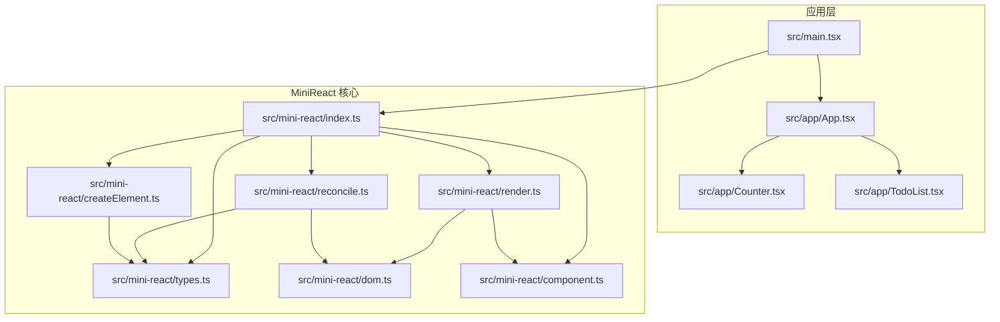
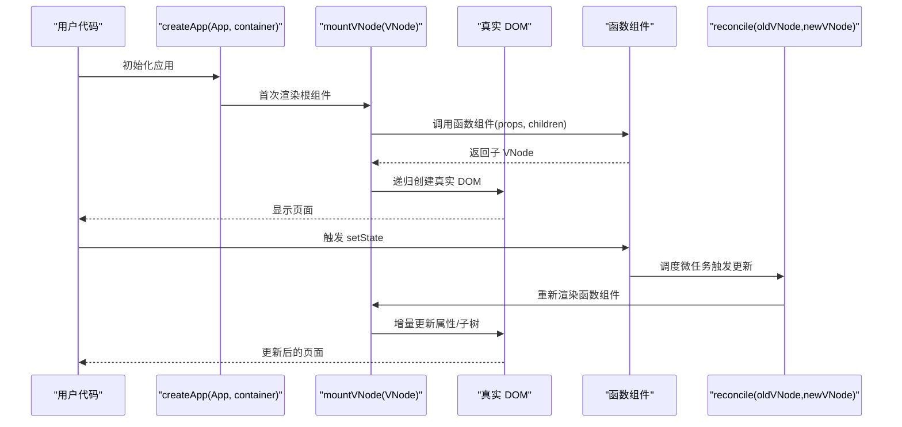
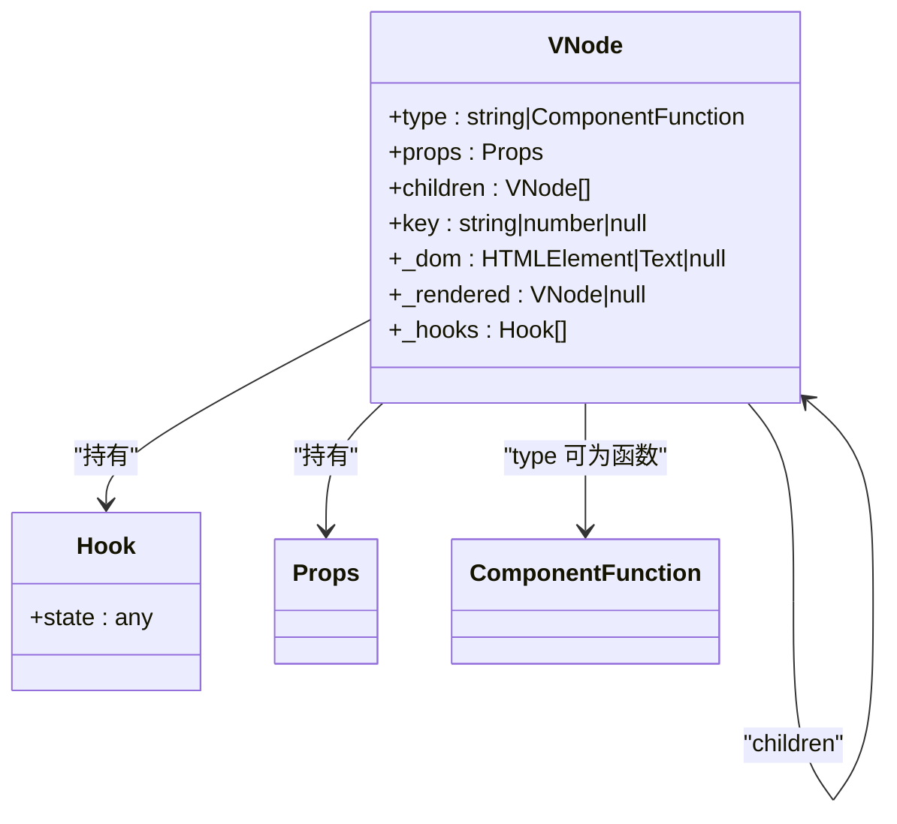
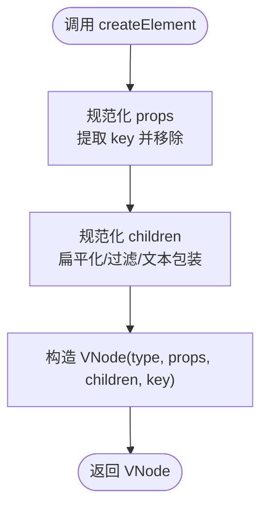
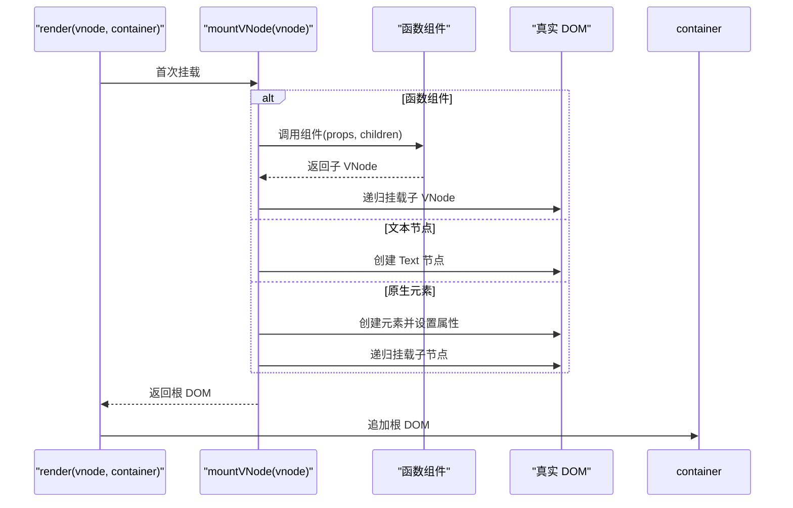
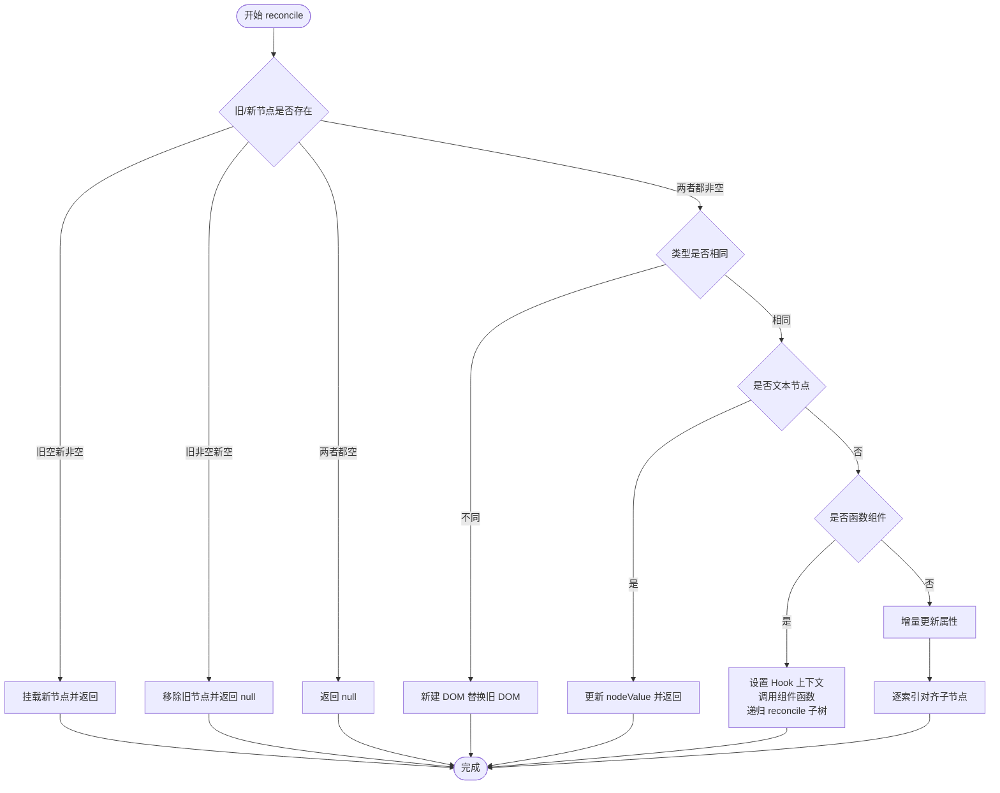
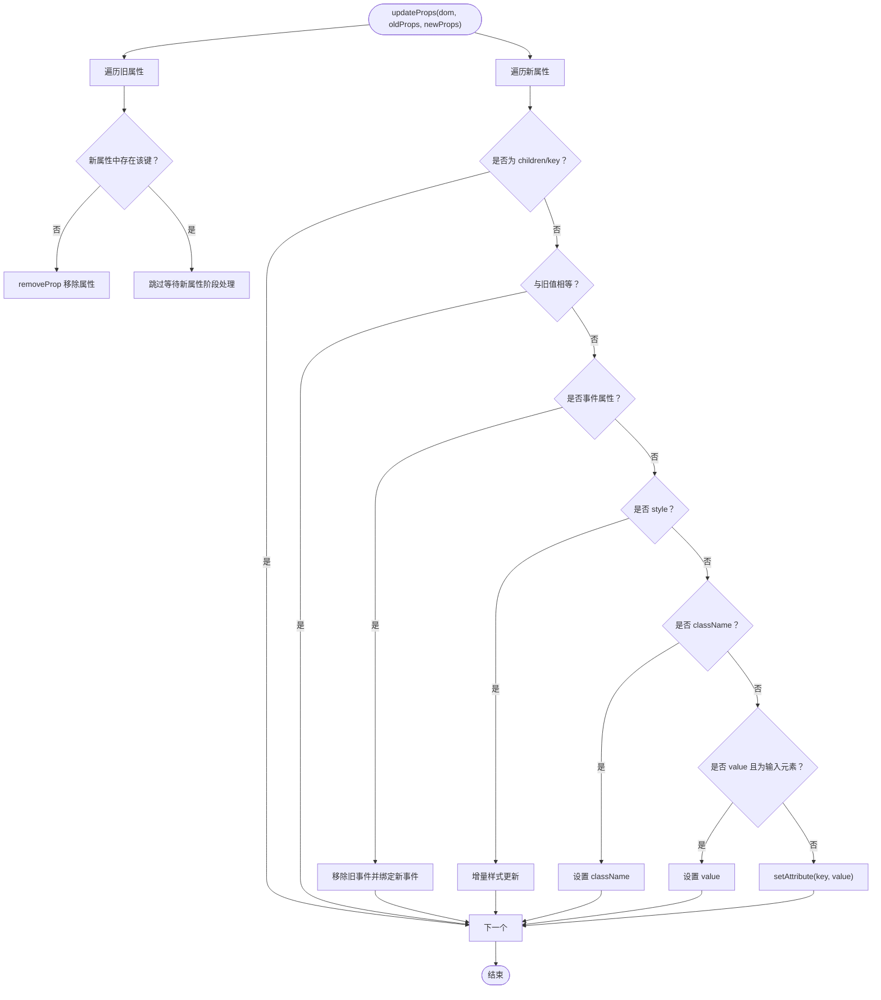
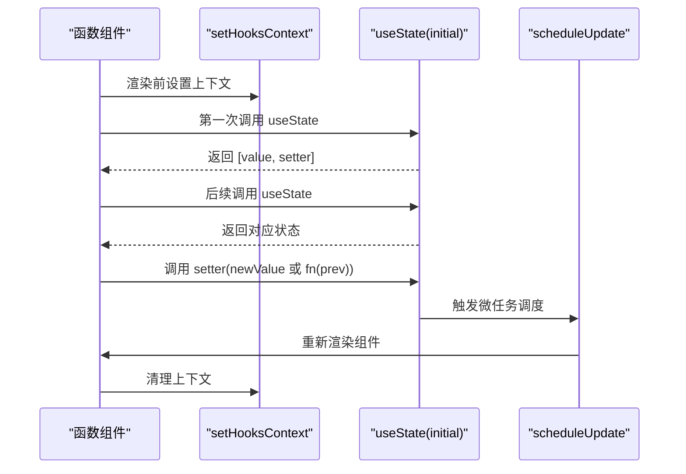
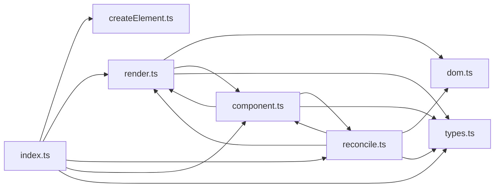

# 虚拟 DOM 系统

<cite>
**本文引用的文件**
- [src/mini-react/index.ts](file://src/mini-react/index.ts)
- [src/mini-react/createElement.ts](file://src/mini-react/createElement.ts)
- [src/mini-react/types.ts](file://src/mini-react/types.ts)
- [src/mini-react/render.ts](file://src/mini-react/render.ts)
- [src/mini-react/reconcile.ts](file://src/mini-react/reconcile.ts)
- [src/mini-react/dom.ts](file://src/mini-react/dom.ts)
- [src/mini-react/component.ts](file://src/mini-react/component.ts)
- [src/app/App.tsx](file://src/app/App.tsx)
- [src/app/Counter.tsx](file://src/app/Counter.tsx)
- [src/app/TodoList.tsx](file://src/app/TodoList.tsx)
- [src/main.tsx](file://src/main.tsx)
- [package.json](file://package.json)
</cite>

## 目录
1. [简介](#简介)
2. [项目结构](#项目结构)
3. [核心组件](#核心组件)
4. [架构总览](#架构总览)
5. [详细组件分析](#详细组件分析)
6. [依赖关系分析](#依赖关系分析)
7. [性能考量](#性能考量)
8. [故障排查指南](#故障排查指南)
9. [结论](#结论)
10. [附录](#附录)

## 简介
本项目是一个轻量级的虚拟 DOM 实现，目标是演示 React 风格的 JSX 到虚拟 DOM 的转换、虚拟节点树的构建与规范化、以及基于调和（diff/reconcile）的增量更新机制。系统包含以下关键能力：
- JSX 到 VNode 的转换（createElement）
- VNode 数据结构设计（元素、文本、组件）
- 首次渲染与增量更新（mountVNode 与 reconcile）
- 属性与事件的增量更新（updateProps）
- 函数组件与 useState Hook 的最小实现
- 应用实例管理与调度（createApp、scheduleUpdate）

## 项目结构
项目采用按功能模块划分的组织方式，核心代码集中在 src/mini-react 目录，示例应用位于 src/app，入口文件在 src/main.tsx。

图表来源
- [src/main.tsx:1-6](file://src/main.tsx#L1-L6)
- [src/app/App.tsx:1-33](file://src/app/App.tsx#L1-L33)
- [src/mini-react/index.ts:1-12](file://src/mini-react/index.ts#L1-L12)

章节来源
- [src/main.tsx:1-6](file://src/main.tsx#L1-L6)
- [src/app/App.tsx:1-33](file://src/app/App.tsx#L1-L33)
- [src/mini-react/index.ts:1-12](file://src/mini-react/index.ts#L1-L12)

## 核心组件
- VNode 数据模型：统一描述元素、文本、组件三类节点，包含 type、props、children、key 以及运行时字段（_dom、_rendered、_hooks）。
- JSX 到 VNode：通过 createElement 完成 JSX 工厂函数职责，规范化 children、处理 key、生成文本 VNode。
- 首次渲染：mountVNode 递归创建真实 DOM 并填充 _dom。
- 调和更新：reconcile 对比新旧 VNode，执行替换、文本更新、函数组件渲染、属性更新与子节点对齐。
- 属性与事件：updateProps 增量更新属性、事件绑定与解绑。
- 组件与 Hook：函数组件渲染、useState 状态复用与批量调度更新。
- 应用实例：createApp 首次渲染，scheduleUpdate 微任务批处理更新。

章节来源
- [src/mini-react/types.ts:1-26](file://src/mini-react/types.ts#L1-L26)
- [src/mini-react/createElement.ts:1-58](file://src/mini-react/createElement.ts#L1-L58)
- [src/mini-react/render.ts:1-49](file://src/mini-react/render.ts#L1-L49)
- [src/mini-react/reconcile.ts:1-110](file://src/mini-react/reconcile.ts#L1-L110)
- [src/mini-react/dom.ts:1-97](file://src/mini-react/dom.ts#L1-L97)
- [src/mini-react/component.ts:1-137](file://src/mini-react/component.ts#L1-L137)

## 架构总览
系统以“JSX → VNode → 真实 DOM”的路径为核心，配合 reconcile 实现增量更新。组件层通过函数组件与 useState 提供状态管理，应用层通过 createApp 管理根组件与容器。

图表来源
- [src/mini-react/component.ts:96-137](file://src/mini-react/component.ts#L96-L137)
- [src/mini-react/render.ts:9-40](file://src/mini-react/render.ts#L9-L40)
- [src/mini-react/reconcile.ts:14-81](file://src/mini-react/reconcile.ts#L14-L81)

## 详细组件分析

### VNode 数据结构与类型定义
- 设计要点
  - type 支持字符串标签或函数组件，统一抽象。
  - props 为通用键值映射，children 为 VNode 数组。
  - key 用于子节点对齐与稳定标识。
  - 运行时字段：_dom 指向真实 DOM；_rendered 记录函数组件上次渲染结果；_hooks 存放 Hook 状态数组。
- 关键接口
  - VNode：包含 type、props、children、key 及运行时字段。
  - Props：任意键值对象。
  - ComponentFunction：函数组件签名。
  - Hook：单个 Hook 的状态容器。

图表来源
- [src/mini-react/types.ts:7-26](file://src/mini-react/types.ts#L7-L26)

章节来源
- [src/mini-react/types.ts:1-26](file://src/mini-react/types.ts#L1-L26)

### JSX 到 VNode 的转换：createElement
- 功能概述
  - 接收 type、props、可变长 children。
  - 规范化 props：提取 key 并从 props 中移除，避免传递给组件。
  - 规范化 children：扁平化、过滤无效值、将字符串/数字转为文本 VNode。
  - 返回标准化的 VNode。
- 参数处理
  - key：若存在则作为 VNode.key，但不会出现在 props 中。
  - children：支持数组展开、条件渲染片段、文本节点自动包装。
- 文本节点
  - createTextVNode 使用常量 TEXT_ELEMENT 作为 type，props 包含 nodeValue。

图表来源
- [src/mini-react/createElement.ts:9-25](file://src/mini-react/createElement.ts#L9-L25)
- [src/mini-react/createElement.ts:33-48](file://src/mini-react/createElement.ts#L33-L48)
- [src/mini-react/createElement.ts:50-57](file://src/mini-react/createElement.ts#L50-L57)

章节来源
- [src/mini-react/createElement.ts:1-58](file://src/mini-react/createElement.ts#L1-L58)

### 首次渲染：mountVNode
- 流程概览
  - 函数组件：设置 Hook 上下文，调用组件函数得到子 VNode，递归挂载，记录 _rendered 与 _dom。
  - 文本节点：创建 Text 节点，设置 _dom。
  - 原生元素：创建 DOM，一次性设置属性，递归挂载子节点，设置 _dom。
- 与渲染入口 render 的关系
  - render 调用 mountVNode 获取根 DOM，追加到容器中。

图表来源
- [src/mini-react/render.ts:9-40](file://src/mini-react/render.ts#L9-L40)
- [src/mini-react/render.ts:45-48](file://src/mini-react/render.ts#L45-L48)

章节来源
- [src/mini-react/render.ts:1-49](file://src/mini-react/render.ts#L1-L49)

### 调和更新：reconcile
- 核心策略
  - 新增：旧节点为空，直接挂载新节点。
  - 删除：新节点为空，移除旧节点对应的真实 DOM。
  - 类型不同：直接替换整棵子树。
  - 文本节点：仅更新 nodeValue。
  - 函数组件：设置 Hook 上下文，调用组件函数得到新子树，递归 reconcile。
  - 原生元素：增量更新属性，逐索引对齐子节点。
- 子节点对齐
  - reconcileChildren 以最大长度循环，逐项 reconcile，支持插入、删除、移动等场景。

图表来源
- [src/mini-react/reconcile.ts:14-81](file://src/mini-react/reconcile.ts#L14-L81)
- [src/mini-react/reconcile.ts:86-99](file://src/mini-react/reconcile.ts#L86-L99)
- [src/mini-react/reconcile.ts:105-109](file://src/mini-react/reconcile.ts#L105-L109)

章节来源
- [src/mini-react/reconcile.ts:1-110](file://src/mini-react/reconcile.ts#L1-L110)

### 属性与事件的增量更新：updateProps
- 设计原则
  - 仅处理非 children、非 key 的属性。
  - 事件：以 onXxx 识别，先移除旧事件再绑定新事件。
  - 特殊属性：style、className、value 等进行专门处理。
  - 未变更的属性跳过更新，减少 DOM 操作。
- 删除逻辑
  - removeProp 统一处理事件、style、className 的清空。

图表来源
- [src/mini-react/dom.ts:19-53](file://src/mini-react/dom.ts#L19-L53)
- [src/mini-react/dom.ts:55-65](file://src/mini-react/dom.ts#L55-L65)
- [src/mini-react/dom.ts:67-86](file://src/mini-react/dom.ts#L67-L86)
- [src/mini-react/dom.ts:88-96](file://src/mini-react/dom.ts#L88-L96)

章节来源
- [src/mini-react/dom.ts:1-97](file://src/mini-react/dom.ts#L1-L97)

### 函数组件与 Hook：useState
- Hook 上下文
  - setHooksContext/clearHooksContext 在渲染前后设置/清理上下文，保证 useState 能定位当前组件与游标。
- 状态复用
  - 首次渲染初始化，后续渲染从旧 VNode._hooks 复用状态槽位。
- 状态更新与调度
  - setter 支持函数式更新，内部调用 scheduleUpdate，通过微任务批量合并多次 setState。

图表来源
- [src/mini-react/component.ts:22-32](file://src/mini-react/component.ts#L22-L32)
- [src/mini-react/component.ts:51-83](file://src/mini-react/component.ts#L51-L83)
- [src/mini-react/component.ts:122-136](file://src/mini-react/component.ts#L122-L136)

章节来源
- [src/mini-react/component.ts:1-137](file://src/mini-react/component.ts#L1-L137)

### 应用实例与入口：createApp、render
- createApp
  - 创建应用实例，保存根组件、容器、当前 VNode 与更新标记。
  - 首次渲染：调用根组件得到 VNode，清空容器，挂载并追加根 DOM。
- render
  - 首次渲染入口，调用 mountVNode 并追加到容器。

章节来源
- [src/mini-react/component.ts:96-117](file://src/mini-react/component.ts#L96-L117)
- [src/mini-react/render.ts:45-48](file://src/mini-react/render.ts#L45-L48)

### 示例应用：Counter 与 TodoList
- Counter
  - 使用 useState 维护 count，按钮点击触发 setCount，支持函数式更新。
- TodoList
  - 使用 useState 维护 todos 与输入框值，支持添加、删除、回车提交、显示总数。

章节来源
- [src/app/Counter.tsx:1-52](file://src/app/Counter.tsx#L1-L52)
- [src/app/TodoList.tsx:1-113](file://src/app/TodoList.tsx#L1-L113)

## 依赖关系分析
- 导出与入口
  - index.ts 汇总导出 createElement、render、reconcile、createApp、useState、TEXT_ELEMENT 与类型。
  - main.tsx 通过 createApp 启动应用。
- 模块耦合
  - render 依赖 dom.updateProps 与 component.setHooksContext/clearHooksContext。
  - reconcile 依赖 dom.createDom/updateProps、render.mountVNode、component.setHooksContext/clearHooksContext。
  - component 依赖 render、reconcile、types。

图表来源
- [src/mini-react/index.ts:1-12](file://src/mini-react/index.ts#L1-L12)
- [src/mini-react/render.ts:1-4](file://src/mini-react/render.ts#L1-L4)
- [src/mini-react/reconcile.ts:1-5](file://src/mini-react/reconcile.ts#L1-L5)
- [src/mini-react/component.ts:1-4](file://src/mini-react/component.ts#L1-L4)

章节来源
- [src/mini-react/index.ts:1-12](file://src/mini-react/index.ts#L1-L12)
- [src/mini-react/render.ts:1-49](file://src/mini-react/render.ts#L1-L49)
- [src/mini-react/reconcile.ts:1-110](file://src/mini-react/reconcile.ts#L1-L110)
- [src/mini-react/component.ts:1-137](file://src/mini-react/component.ts#L1-L137)

## 性能考量
- 增量更新
  - reconcile 仅在必要时替换节点，文本节点直接更新 nodeValue，原生元素增量更新属性，减少不必要的 DOM 操作。
- 批处理更新
  - scheduleUpdate 使用微任务队列合并多次 setState，降低重渲染频率。
- 属性更新优化
  - updateProps 跳过未变更属性，事件属性先移除旧监听再绑定新监听，避免重复绑定。
- 子节点对齐
  - reconcileChildren 以索引对齐，适合频繁插入/删除的场景，但未实现 key 优先匹配，复杂场景建议显式提供 key。

## 故障排查指南
- 未在函数组件内调用 useState
  - 症状：抛出错误提示必须在函数组件内调用。
  - 处理：确保 useState 在函数组件渲染期间调用，且由 setHooksContext 建立上下文。
  - 参考位置：[src/mini-react/component.ts:54-56](file://src/mini-react/component.ts#L54-L56)
- 事件绑定异常
  - 症状：事件未触发或重复绑定。
  - 处理：确认事件名以 onXxx 命名，updateProps 会自动移除旧事件并绑定新事件。
  - 参考位置：[src/mini-react/dom.ts:38-42](file://src/mini-react/dom.ts#L38-L42)
- 样式更新不生效
  - 症状：style 对象更新后样式未变化。
  - 处理：updateProps 会移除旧 style 中不存在的属性并设置新属性，检查 style 键名与值。
  - 参考位置：[src/mini-react/dom.ts:72-85](file://src/mini-react/dom.ts#L72-L85)
- 条件渲染导致子节点错位
  - 症状：条件渲染片段（如 && 表达式）导致子节点顺序变化。
  - 处理：createElement 已过滤 null/boolean，但建议为列表项提供稳定 key。
  - 参考位置：[src/mini-react/createElement.ts:36-39](file://src/mini-react/createElement.ts#L36-L39)

章节来源
- [src/mini-react/component.ts:54-56](file://src/mini-react/component.ts#L54-L56)
- [src/mini-react/dom.ts:38-42](file://src/mini-react/dom.ts#L38-L42)
- [src/mini-react/dom.ts:72-85](file://src/mini-react/dom.ts#L72-L85)
- [src/mini-react/createElement.ts:36-39](file://src/mini-react/createElement.ts#L36-L39)

## 结论
本虚拟 DOM 系统以简洁清晰的方式实现了 JSX 到 VNode 的转换、VNode 树的构建与规范化、以及基于调和的增量更新。通过函数组件与最小化的 Hook 实现，系统具备了现代前端框架的核心能力：声明式 UI、状态驱动更新与高效渲染。在保持可读性的同时，系统提供了良好的扩展点，例如引入 key 优先匹配、更丰富的 Hook、以及更完善的事件与属性处理。

## 附录
- 快速上手
  - 安装依赖：使用包管理器安装开发依赖（TypeScript、Vite）。
  - 启动开发：运行 dev 脚本启动本地服务。
  - 构建产物：运行 build 脚本生成生产构建。
- 相关文件
  - 入口与示例：[src/main.tsx:1-6](file://src/main.tsx#L1-L6)、[src/app/App.tsx:1-33](file://src/app/App.tsx#L1-L33)、[src/app/Counter.tsx:1-52](file://src/app/Counter.tsx#L1-L52)、[src/app/TodoList.tsx:1-113](file://src/app/TodoList.tsx#L1-L113)
  - 核心实现：[src/mini-react/index.ts:1-12](file://src/mini-react/index.ts#L1-L12)、[src/mini-react/createElement.ts:1-58](file://src/mini-react/createElement.ts#L1-L58)、[src/mini-react/render.ts:1-49](file://src/mini-react/render.ts#L1-L49)、[src/mini-react/reconcile.ts:1-110](file://src/mini-react/reconcile.ts#L1-L110)、[src/mini-react/dom.ts:1-97](file://src/mini-react/dom.ts#L1-L97)、[src/mini-react/component.ts:1-137](file://src/mini-react/component.ts#L1-L137)

章节来源
- [package.json:1-17](file://package.json#L1-L17)
- [src/main.tsx:1-6](file://src/main.tsx#L1-L6)
- [src/app/App.tsx:1-33](file://src/app/App.tsx#L1-L33)
- [src/mini-react/index.ts:1-12](file://src/mini-react/index.ts#L1-L12)
- [src/mini-react/createElement.ts:1-58](file://src/mini-react/createElement.ts#L1-L58)
- [src/mini-react/render.ts:1-49](file://src/mini-react/render.ts#L1-L49)
- [src/mini-react/reconcile.ts:1-110](file://src/mini-react/reconcile.ts#L1-L110)
- [src/mini-react/dom.ts:1-97](file://src/mini-react/dom.ts#L1-L97)
- [src/mini-react/component.ts:1-137](file://src/mini-react/component.ts#L1-L137)