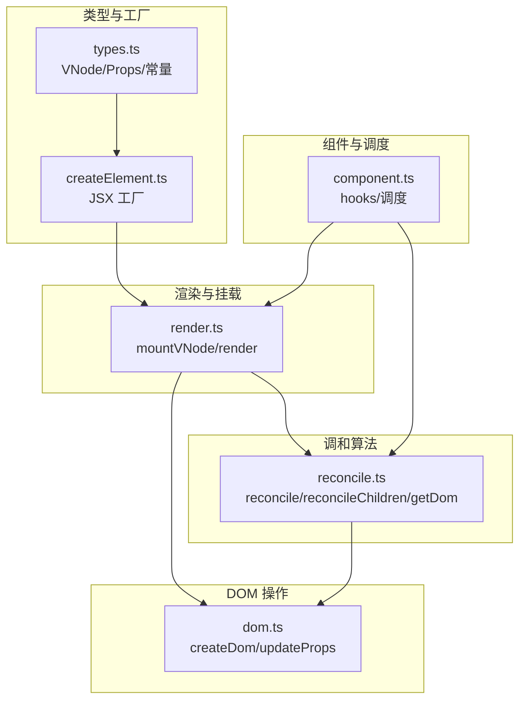
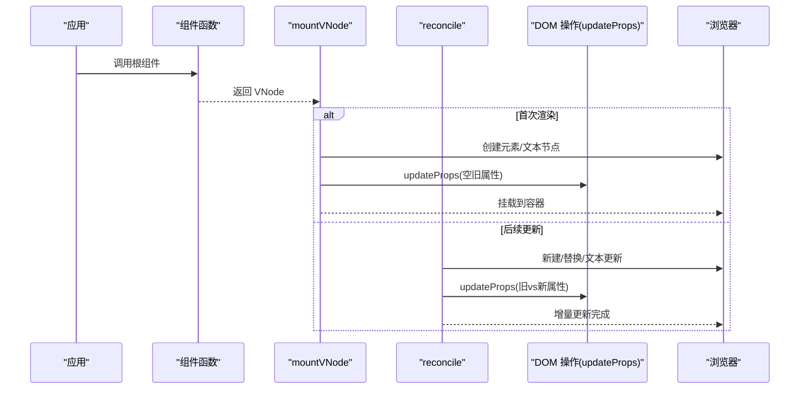
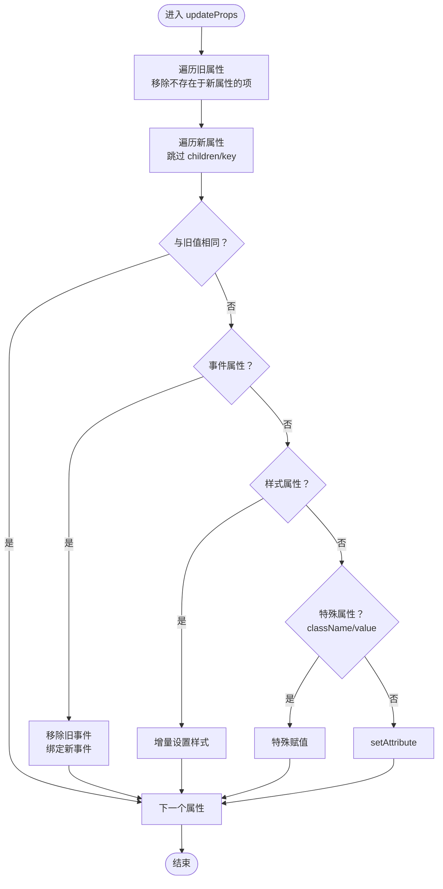
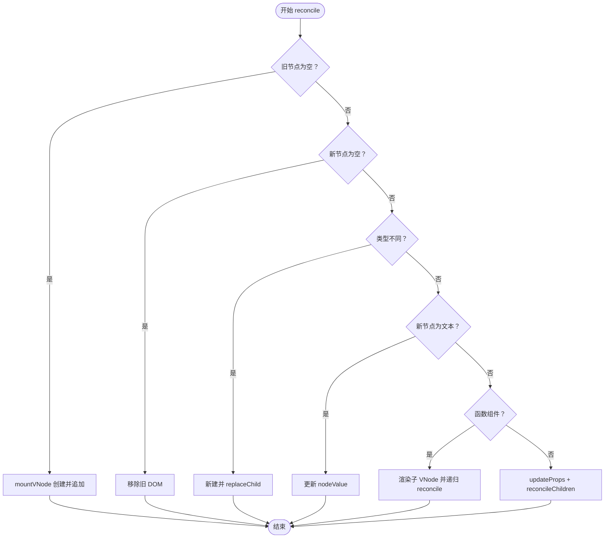
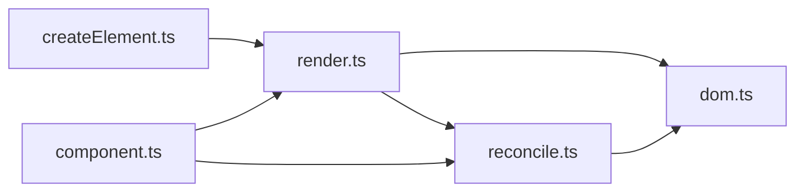

# DOM 操作机制

<cite>
**本文档引用的文件**
- [dom.ts](file://src/mini-react/dom.ts)
- [reconcile.ts](file://src/mini-react/reconcile.ts)
- [render.ts](file://src/mini-react/render.ts)
- [createElement.ts](file://src/mini-react/createElement.ts)
- [types.ts](file://src/mini-react/types.ts)
- [component.ts](file://src/mini-react/component.ts)
- [index.ts](file://src/mini-react/index.ts)
- [App.tsx](file://src/app/App.tsx)
- [main.tsx](file://src/main.tsx)
</cite>

## 目录
1. [简介](#简介)
2. [项目结构](#项目结构)
3. [核心组件](#核心组件)
4. [架构总览](#架构总览)
5. [详细组件分析](#详细组件分析)
6. [依赖关系分析](#依赖关系分析)
7. [性能考虑](#性能考虑)
8. [故障排除指南](#故障排除指南)
9. [结论](#结论)
10. [附录](#附录)

## 简介
本文件围绕 DOM 操作机制进行深入技术文档编写，重点解释以下方面：
- 元素创建：基于 VNode 类型创建不同 DOM 元素的策略
- 属性设置：updateProps 的增量更新机制，包括事件、样式、特殊属性等
- 事件绑定：事件监听器的绑定与解绑流程
- 样式与特殊属性：样式对象的增量更新、className/value 等特殊属性处理
- 调和与渲染：mountVNode 与 reconcile 的配合，以及首次渲染与更新的区别
- 性能优化与内存管理：批处理、最小化 DOM 操作、事件清理等最佳实践

## 项目结构
该项目采用“功能模块化 + 类型定义”的组织方式，核心文件如下：
- 类型定义：VNode、Props、ComponentFunction 等
- DOM 操作：createDom、updateProps、样式与事件辅助函数
- 渲染与挂载：mountVNode、render
- 调和算法：reconcile 及其子过程 reconcileChildren
- 组件与调度：函数组件上下文、useState、createApp、调度器
- 工厂函数：createElement 与 JSX 支持

图表来源
- [types.ts:1-26](file://src/mini-react/types.ts#L1-L26)
- [createElement.ts:1-58](file://src/mini-react/createElement.ts#L1-L58)
- [render.ts:1-49](file://src/mini-react/render.ts#L1-L49)
- [dom.ts:1-97](file://src/mini-react/dom.ts#L1-L97)
- [reconcile.ts:1-110](file://src/mini-react/reconcile.ts#L1-L110)
- [component.ts:1-137](file://src/mini-react/component.ts#L1-L137)

章节来源
- [types.ts:1-26](file://src/mini-react/types.ts#L1-L26)
- [createElement.ts:1-58](file://src/mini-react/createElement.ts#L1-L58)
- [render.ts:1-49](file://src/mini-react/render.ts#L1-L49)
- [dom.ts:1-97](file://src/mini-react/dom.ts#L1-L97)
- [reconcile.ts:1-110](file://src/mini-react/reconcile.ts#L1-L110)
- [component.ts:1-137](file://src/mini-react/component.ts#L1-L137)

## 核心组件
本节聚焦 DOM 操作的核心实现，包括 createDom 与 updateProps 的职责与协作。

- createDom：根据 VNode 类型创建真实 DOM 节点，文本节点与原生元素分别处理；创建后立即调用 updateProps 完成初始属性设置。
- updateProps：增量更新策略，按需移除旧属性、绑定新事件、设置样式与特殊属性，避免全量替换带来的性能损耗。
- reconcile：对比新旧 VNode，决定新增、删除、替换、文本更新或同类型元素的增量更新；对函数组件进行渲染并递归调和。
- mountVNode：首次挂载时的递归创建与子节点挂载，文本节点与原生元素分支处理。

章节来源
- [dom.ts:6-14](file://src/mini-react/dom.ts#L6-L14)
- [dom.ts:19-53](file://src/mini-react/dom.ts#L19-L53)
- [reconcile.ts:14-81](file://src/mini-react/reconcile.ts#L14-L81)
- [render.ts:9-40](file://src/mini-react/render.ts#L9-L40)

## 架构总览
下面的序列图展示了从 VNode 到真实 DOM 的完整流程，涵盖首次渲染与后续更新的差异路径。

图表来源
- [render.ts:45-48](file://src/mini-react/render.ts#L45-L48)
- [render.ts:9-40](file://src/mini-react/render.ts#L9-L40)
- [reconcile.ts:14-81](file://src/mini-react/reconcile.ts#L14-L81)
- [dom.ts:19-53](file://src/mini-react/dom.ts#L19-L53)

## 详细组件分析

### createDom：根据 VNode 类型创建 DOM
- 文本节点：当 type 为 TEXT_ELEMENT 时，直接创建 Text 节点并返回。
- 原生元素：创建对应标签的 HTMLElement，并立即调用 updateProps 完成初始属性设置。
- 关键点：createDom 不负责递归子节点，子节点由上层 mountVNode 或 reconcileChildren 递归处理。

章节来源
- [dom.ts:6-14](file://src/mini-react/dom.ts#L6-L14)

### updateProps：增量属性更新与事件处理
- 移除旧属性：遍历旧属性，跳过 children 与 key，若新属性中不存在则移除（事件使用 removeEventListener，样式与 className 使用特定清理逻辑，其他属性使用 removeAttribute）。
- 设置新属性：遍历新属性，跳过 children 与 key，若与旧值相同则跳过；事件先移除旧监听再绑定新监听；样式使用 setStyle 增量更新；className/value 等特殊属性走专用分支；其余属性使用 setAttribute。
- 事件处理：以 on 开头的属性视为事件，eventName 将 onClick 转换为 click 并进行 add/removeEventListener。
- 样式处理：setStyle 先清理旧样式中不存在于新样式的属性，再设置新样式，避免残留。

图表来源
- [dom.ts:19-53](file://src/mini-react/dom.ts#L19-L53)
- [dom.ts:55-65](file://src/mini-react/dom.ts#L55-L65)
- [dom.ts:67-86](file://src/mini-react/dom.ts#L67-L86)
- [dom.ts:88-96](file://src/mini-react/dom.ts#L88-L96)

章节来源
- [dom.ts:19-53](file://src/mini-react/dom.ts#L19-L53)
- [dom.ts:55-65](file://src/mini-react/dom.ts#L55-L65)
- [dom.ts:67-86](file://src/mini-react/dom.ts#L67-L86)
- [dom.ts:88-96](file://src/mini-react/dom.ts#L88-L96)

### reconcile：调和算法与 DOM 更新
- 新增：旧节点为空而新节点存在时，mountVNode 创建并追加到父节点。
- 删除：旧节点存在而新节点为空时，移除对应真实 DOM。
- 类型不同：直接替换，新建新节点并 replaceChild。
- 文本节点：直接更新 nodeValue。
- 函数组件：设置 hooks 上下文，渲染子 VNode，递归 reconcile。
- 同类型原生元素：复用真实 DOM，调用 updateProps 增量更新属性，并逐索引 reconcile 子节点。

图表来源
- [reconcile.ts:14-81](file://src/mini-react/reconcile.ts#L14-L81)
- [reconcile.ts:86-99](file://src/mini-react/reconcile.ts#L86-L99)
- [reconcile.ts:105-109](file://src/mini-react/reconcile.ts#L105-L109)

章节来源
- [reconcile.ts:14-81](file://src/mini-react/reconcile.ts#L14-L81)
- [reconcile.ts:86-99](file://src/mini-react/reconcile.ts#L86-L99)
- [reconcile.ts:105-109](file://src/mini-react/reconcile.ts#L105-L109)

### mountVNode：首次挂载与递归子节点
- 函数组件：设置 hooks 上下文，渲染得到子 VNode，递归挂载，记录 _dom。
- 文本节点：创建 Text 节点并记录 _dom。
- 原生元素：创建 HTMLElement，updateProps 初始化属性，递归挂载所有子节点，记录 _dom。

章节来源
- [render.ts:9-40](file://src/mini-react/render.ts#L9-L40)

### createElement：JSX 工厂与 children 规范化
- 接收 type、props 与可变参数 children，规范化 children：扁平化数组、字符串/数字转文本 VNode、过滤 null/undefined/boolean。
- 从 props 中移除 key，避免传递给组件；保留 key 用于 reconcile 的稳定标识。

章节来源
- [createElement.ts:9-25](file://src/mini-react/createElement.ts#L9-L25)
- [createElement.ts:33-48](file://src/mini-react/createElement.ts#L33-L48)
- [createElement.ts:50-57](file://src/mini-react/createElement.ts#L50-L57)

### 组件与调度：hooks、createApp 与批量更新
- hooks 上下文：setHooksContext/clearHooksContext 在函数组件渲染前后设置与清理，保证 useState 索引正确。
- useState：按调用顺序分配 hook slot，首次初始化状态，再次渲染从旧 VNode 复用状态；setter 通过 scheduleUpdate 触发微任务批量更新。
- createApp：创建应用实例，清空容器，首次渲染根组件并挂载到容器。
- 调度：queueMicrotask 合并多次 setState，避免重复渲染。

章节来源
- [component.ts:22-32](file://src/mini-react/component.ts#L22-L32)
- [component.ts:51-83](file://src/mini-react/component.ts#L51-L83)
- [component.ts:99-117](file://src/mini-react/component.ts#L99-L117)
- [component.ts:122-136](file://src/mini-react/component.ts#L122-L136)

## 依赖关系分析
DOM 操作与渲染/调和之间的耦合关系如下：
- render.ts 依赖 dom.ts 的 createDom 与 updateProps，负责首次挂载。
- reconcile.ts 依赖 dom.ts 的 updateProps，负责增量更新与事件处理。
- component.ts 提供 hooks 上下文与调度，间接影响 DOM 更新时机。
- createElement.ts 生成标准化的 VNode，为后续 mountVNode/reconcile 提供输入。

图表来源
- [createElement.ts:1-58](file://src/mini-react/createElement.ts#L1-L58)
- [render.ts:1-49](file://src/mini-react/render.ts#L1-L49)
- [dom.ts:1-97](file://src/mini-react/dom.ts#L1-L97)
- [reconcile.ts:1-110](file://src/mini-react/reconcile.ts#L1-L110)
- [component.ts:1-137](file://src/mini-react/component.ts#L1-L137)

章节来源
- [render.ts:1-49](file://src/mini-react/render.ts#L1-L49)
- [dom.ts:1-97](file://src/mini-react/dom.ts#L1-L97)
- [reconcile.ts:1-110](file://src/mini-react/reconcile.ts#L1-L110)
- [component.ts:1-137](file://src/mini-react/component.ts#L1-L137)

## 性能考虑
- 批处理更新：通过微任务队列合并多次 setState，减少不必要的 reconcile 循环。
- 增量更新：updateProps 仅对变更的属性执行操作，避免全量替换 DOM 属性。
- 事件监听：事件属性遵循“移除旧监听再绑定新监听”的策略，防止重复绑定导致内存泄漏。
- 样式更新：setStyle 采用增量方式，先清理旧样式再设置新样式，避免遗留样式污染。
- 文本节点：文本节点直接更新 nodeValue，避免重建 DOM。
- 子节点对比：reconcileChildren 逐索引对比，尽量减少 DOM 操作次数。

## 故障排除指南
- 事件未触发或重复触发
  - 检查事件属性命名是否以 on 开头且大小写正确
  - 确认事件处理器在更新过程中被正确移除与重新绑定
  - 参考事件处理流程与 removeProp 实现
  - 章节来源
    - [dom.ts:38-42](file://src/mini-react/dom.ts#L38-L42)
    - [dom.ts:55-64](file://src/mini-react/dom.ts#L55-L64)
- 样式异常
  - 确保样式对象为键值对形式
  - 检查旧样式中不再出现的属性是否被正确清理
  - 章节来源
    - [dom.ts:67-86](file://src/mini-react/dom.ts#L67-L86)
- className 或 value 未更新
  - className 与 value 属于特殊属性，需走专用分支赋值
  - 章节来源
    - [dom.ts:45-48](file://src/mini-react/dom.ts#L45-L48)
- 文本节点内容未更新
  - 文本节点类型为 TEXT_ELEMENT，需在 reconcile 中直接更新 nodeValue
  - 章节来源
    - [reconcile.ts:48-54](file://src/mini-react/reconcile.ts#L48-L54)
- 函数组件渲染异常
  - 确保 hooks 上下文在渲染前后正确设置与清理
  - 章节来源
    - [component.ts:22-32](file://src/mini-react/component.ts#L22-L32)
    - [component.ts:51-83](file://src/mini-react/component.ts#L51-L83)

## 结论
该 DOM 操作机制通过 createDom 与 updateProps 的协同，实现了对不同 VNode 类型的高效创建与增量更新。reconcile 将首次挂载与后续更新统一为增量策略，结合组件 hooks 与微任务调度，有效降低了 DOM 操作成本并提升了用户体验。事件、样式与特殊属性的专门处理进一步增强了系统的健壮性与易用性。

## 附录
- 使用示例与最佳实践
  - 首次渲染：通过 createApp 传入根组件与容器，内部自动调用 render/mountVNode 完成挂载
    - 章节来源
      - [main.tsx:1-6](file://src/main.tsx#L1-L6)
      - [component.ts:99-117](file://src/mini-react/component.ts#L99-L117)
  - JSX 语法：使用默认导出的 MiniReact.createElement 工厂函数，children 会经过规范化处理
    - 章节来源
      - [index.ts:8-11](file://src/mini-react/index.ts#L8-L11)
      - [createElement.ts:33-48](file://src/mini-react/createElement.ts#L33-L48)
  - 事件绑定：以 on 开头的属性名会被识别为事件，如 onClick、onFocus 等
    - 章节来源
      - [dom.ts:88-96](file://src/mini-react/dom.ts#L88-L96)
  - 样式与特殊属性：style 采用增量更新，className/value 走专用赋值分支
    - 章节来源
      - [dom.ts:43-51](file://src/mini-react/dom.ts#L43-L51)
      - [dom.ts:67-86](file://src/mini-react/dom.ts#L67-L86)