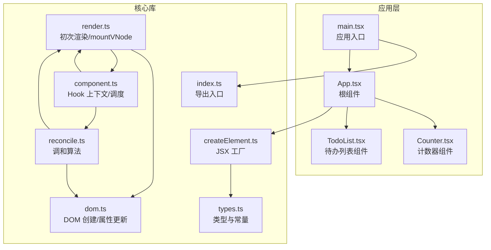
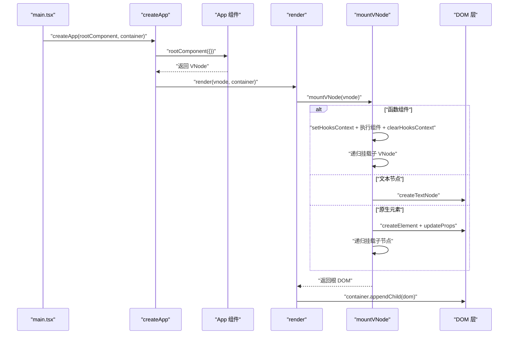
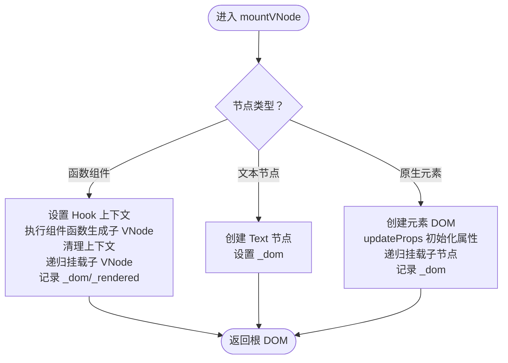
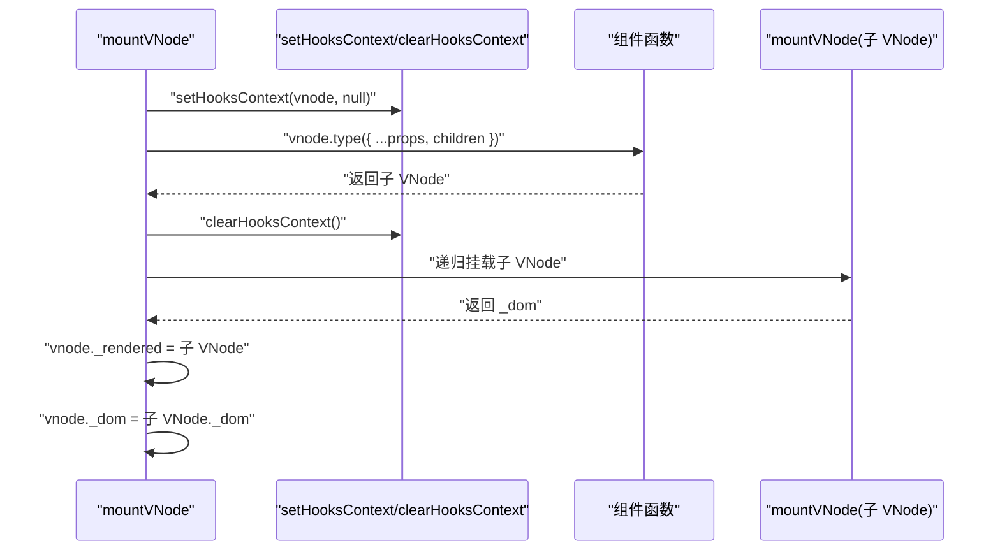
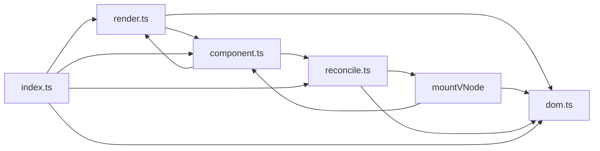

# 初次渲染流程

<cite>
**本文引用的文件**
- [render.ts](file://src/mini-react/render.ts)
- [reconcile.ts](file://src/mini-react/reconcile.ts)
- [dom.ts](file://src/mini-react/dom.ts)
- [component.ts](file://src/mini-react/component.ts)
- [createElement.ts](file://src/mini-react/createElement.ts)
- [types.ts](file://src/mini-react/types.ts)
- [index.ts](file://src/mini-react/index.ts)
- [main.tsx](file://src/main.tsx)
- [App.tsx](file://src/app/App.tsx)
- [Counter.tsx](file://src/app/Counter.tsx)
- [TodoList.tsx](file://src/app/TodoList.tsx)
</cite>

## 目录
1. [简介](#简介)
2. [项目结构](#项目结构)
3. [核心组件](#核心组件)
4. [架构总览](#架构总览)
5. [详细组件分析](#详细组件分析)
6. [依赖关系分析](#依赖关系分析)
7. [性能考量](#性能考量)
8. [故障排查指南](#故障排查指南)
9. [结论](#结论)
10. [附录](#附录)

## 简介
本文聚焦于 mini-react 的“初次渲染”流程，系统性阐述从 VNode 到真实 DOM 的完整转换过程，重点解析 render 函数与 mountVNode 的实现机制，覆盖三类节点的处理策略：函数组件、文本节点与原生 HTML 元素；并结合 Hook 上下文、属性更新与 DOM 操作进行深入说明。同时提供时序图与关键路径引用，帮助读者快速掌握从虚拟 DOM 到真实 DOM 的工作原理。

## 项目结构
该仓库采用按功能模块划分的组织方式：
- mini-react 核心库：负责 VNode 定义、渲染、调和、DOM 操作与 Hook 支持
- app 示例应用：演示函数组件、状态管理与复杂嵌套结构
- 入口文件：通过 createApp 驱动应用首次渲染

图表来源
- [main.tsx:1-6](file://src/main.tsx#L1-L6)
- [index.ts:1-12](file://src/mini-react/index.ts#L1-L12)
- [types.ts:1-26](file://src/mini-react/types.ts#L1-L26)
- [createElement.ts:1-58](file://src/mini-react/createElement.ts#L1-L58)
- [render.ts:1-49](file://src/mini-react/render.ts#L1-L49)
- [reconcile.ts:1-110](file://src/mini-react/reconcile.ts#L1-L110)
- [dom.ts:1-97](file://src/mini-react/dom.ts#L1-L97)
- [component.ts:1-137](file://src/mini-react/component.ts#L1-L137)

章节来源
- [main.tsx:1-6](file://src/main.tsx#L1-L6)
- [index.ts:1-12](file://src/mini-react/index.ts#L1-L12)
- [types.ts:1-26](file://src/mini-react/types.ts#L1-L26)

## 核心组件
- VNode 类型与常量：定义虚拟节点结构、文本元素标识与组件函数类型
- JSX 工厂 createElement：规范化 children、生成 VNode
- 初次渲染 render 与 mountVNode：将 VNode 递归挂载为真实 DOM
- DOM 操作 createDom/updateProps：创建节点与增量更新属性
- 调和 reconcile：对比新旧 VNode，增量更新真实 DOM（用于后续更新）
- 组件与 Hook：函数组件渲染、Hook 上下文、状态调度

章节来源
- [types.ts:1-26](file://src/mini-react/types.ts#L1-L26)
- [createElement.ts:1-58](file://src/mini-react/createElement.ts#L1-L58)
- [render.ts:1-49](file://src/mini-react/render.ts#L1-L49)
- [dom.ts:1-97](file://src/mini-react/dom.ts#L1-L97)
- [reconcile.ts:1-110](file://src/mini-react/reconcile.ts#L1-L110)
- [component.ts:1-137](file://src/mini-react/component.ts#L1-L137)

## 架构总览
初次渲染的关键路径如下：
- 应用入口 createApp 调用根组件生成 VNode
- render 调用 mountVNode 递归挂载
- mountVNode 分支处理函数组件、文本节点与原生元素
- DOM 层 createDom 与 updateProps 完成真实 DOM 创建与属性更新
- 最终将根 DOM 插入容器

图表来源
- [main.tsx:1-6](file://src/main.tsx#L1-L6)
- [component.ts:96-117](file://src/mini-react/component.ts#L96-L117)
- [render.ts:42-49](file://src/mini-react/render.ts#L42-L49)
- [render.ts:9-40](file://src/mini-react/render.ts#L9-L40)
- [dom.ts:3-14](file://src/mini-react/dom.ts#L3-L14)

## 详细组件分析

### render 与 mountVNode：从 VNode 到真实 DOM 的递归挂载
- render 是初次渲染入口，接收 VNode 与容器，调用 mountVNode 生成根 DOM，并将其追加到容器中
- mountVNode 是核心递归挂载函数，依据节点类型分三路处理：
  - 函数组件：设置 Hook 上下文、执行组件函数生成子 VNode、清理上下文、递归挂载子树、记录 _dom 与 _rendered
  - 文本节点：创建 Text 节点，填充 nodeValue，记录 _dom
  - 原生元素：创建对应 DOM，调用 updateProps 初始化属性，递归挂载子节点，记录 _dom

图表来源
- [render.ts:9-40](file://src/mini-react/render.ts#L9-L40)
- [dom.ts:19-53](file://src/mini-react/dom.ts#L19-L53)

章节来源
- [render.ts:42-49](file://src/mini-react/render.ts#L42-L49)
- [render.ts:9-40](file://src/mini-react/render.ts#L9-L40)

### 函数组件渲染：Hook 上下文、组件执行与子 VNode 生成
- 在 mountVNode 中，对函数组件节点：
  - setHooksContext(vnode, null) 设置当前渲染上下文（无旧 VNode）
  - 执行组件函数，传入 props 与 children，得到子 VNode
  - clearHooksContext 清理上下文
  - 递归挂载子 VNode 并将结果作为 _dom
  - 将子 VNode 记录为 _rendered，便于后续 reconcile 复用

图表来源
- [render.ts:10-19](file://src/mini-react/render.ts#L10-L19)
- [component.ts:22-32](file://src/mini-react/component.ts#L22-L32)

章节来源
- [render.ts:10-19](file://src/mini-react/render.ts#L10-L19)
- [component.ts:22-32](file://src/mini-react/component.ts#L22-L32)

### 文本节点创建：从 VNode 到 Text DOM
- 文本节点类型为常量标识，mountVNode 中直接创建 Text 节点，填充 nodeValue，并记录 _dom
- 文本节点不会产生子节点，也不参与属性更新

章节来源
- [render.ts:21-26](file://src/mini-react/render.ts#L21-L26)
- [dom.ts:6-9](file://src/mini-react/dom.ts#L6-L9)
- [types.ts:1-3](file://src/mini-react/types.ts#L1-L3)

### 原生 HTML 元素：DOM 创建与属性增量更新
- 对于字符串类型的 type，mountVNode 创建对应元素，随后调用 updateProps 完成初始属性设置
- updateProps 会：
  - 移除旧属性（不在新属性中的键）
  - 为事件属性绑定/解绑
  - 处理 style、className、value 等特殊属性
  - 其他属性通过 setAttribute/removeAttribute 管理
- 之后递归挂载所有子节点并追加到父 DOM

章节来源
- [render.ts:28-40](file://src/mini-react/render.ts#L28-L40)
- [dom.ts:19-53](file://src/mini-react/dom.ts#L19-L53)

### JSX 工厂与 VNode 规范化
- createElement 将 JSX 转换为 VNode，处理 key、children 规范化
- normalizeChildren 支持扁平化数组、字符串/数字转文本节点、过滤 null/undefined/boolean
- createTextVNode 生成文本 VNode

章节来源
- [createElement.ts:9-58](file://src/mini-react/createElement.ts#L9-L58)
- [types.ts:7-18](file://src/mini-react/types.ts#L7-L18)

### Hook 上下文与状态调度
- setHooksContext 与 clearHooksContext 在函数组件渲染前后设置/清理上下文
- useState 在当前上下文中按 hookIndex 读取/初始化状态，setter 触发 scheduleUpdate
- scheduleUpdate 通过微任务批量合并多次 setState，触发 reconcile

章节来源
- [component.ts:16-32](file://src/mini-react/component.ts#L16-L32)
- [component.ts:51-83](file://src/mini-react/component.ts#L51-L83)
- [component.ts:122-136](file://src/mini-react/component.ts#L122-L136)

## 依赖关系分析
- render 依赖 mountVNode、dom.createDom 与 dom.updateProps
- mountVNode 依赖 component.setHooksContext/clearHooksContext 与 dom.updateProps
- reconcile 依赖 mountVNode、dom.createDom、dom.updateProps 与 getDom 辅助函数
- component 提供 Hook 上下文、useState 与 createApp 调度
- index 统一导出 API，供应用层使用

图表来源
- [render.ts:1-49](file://src/mini-react/render.ts#L1-L49)
- [reconcile.ts:1-110](file://src/mini-react/reconcile.ts#L1-L110)
- [dom.ts:1-97](file://src/mini-react/dom.ts#L1-L97)
- [component.ts:1-137](file://src/mini-react/component.ts#L1-L137)
- [index.ts:1-12](file://src/mini-react/index.ts#L1-L12)

章节来源
- [index.ts:1-12](file://src/mini-react/index.ts#L1-L12)

## 性能考量
- 递归挂载的时间复杂度为 O(N)，N 为 VNode 节点总数
- updateProps 通过比较新旧属性，仅执行必要变更，避免全量重绘
- 微任务批量调度减少重复渲染次数，提升交互响应性
- 文本节点与原生元素的创建成本较低，建议合理拆分组件以降低不必要的重渲染

## 故障排查指南
- 函数组件内误用 Hook：若未在函数组件内调用 useState，将抛出错误。请确保在组件顶层调用，且遵循顺序不变原则
  - 参考路径：[component.ts:54-56](file://src/mini-react/component.ts#L54-L56)
- 事件绑定异常：事件属性需以 on 开头，否则不会被识别为事件；更新时会自动解绑旧事件再绑定新事件
  - 参考路径：[dom.ts:88-96](file://src/mini-react/dom.ts#L88-L96)
- 属性更新不生效：某些属性如 className/value/style 需要特殊处理；确认传入的 props 是否正确
  - 参考路径：[dom.ts:43-51](file://src/mini-react/dom.ts#L43-L51)
- 文本节点内容未更新：文本节点在初次渲染后不会再次进入 mountVNode，后续更新由 reconcile 的文本分支处理
  - 参考路径：[reconcile.ts:47-55](file://src/mini-react/reconcile.ts#L47-L55)
- 子节点顺序问题：reconcileChildren 通过索引对比子节点，建议为列表项提供稳定 key，避免不必要的替换
  - 参考路径：[reconcile.ts:86-99](file://src/mini-react/reconcile.ts#L86-L99)

## 结论
mini-react 的初次渲染通过 render 与 mountVNode 实现从 VNode 到真实 DOM 的高效转换。其设计将函数组件、文本节点与原生元素的处理逻辑清晰分离，并通过 Hook 上下文与增量属性更新保障了可扩展性与性能。配合 reconcile 的调和算法，系统能够以最小代价完成后续更新。建议在实际开发中：
- 正确使用 Hook，保持渲染顺序稳定
- 为列表提供 key，优化 diff 行为
- 合理拆分组件，减少不必要的重渲染
- 注意事件属性命名与特殊属性的处理

## 附录
- 应用入口与根组件示例
  - [main.tsx:1-6](file://src/main.tsx#L1-L6)
  - [App.tsx:1-33](file://src/app/App.tsx#L1-L33)
- 示例组件（含 useState 与事件处理）
  - [Counter.tsx:1-52](file://src/app/Counter.tsx#L1-L52)
  - [TodoList.tsx:1-113](file://src/app/TodoList.tsx#L1-L113)