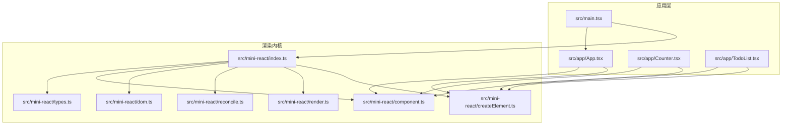
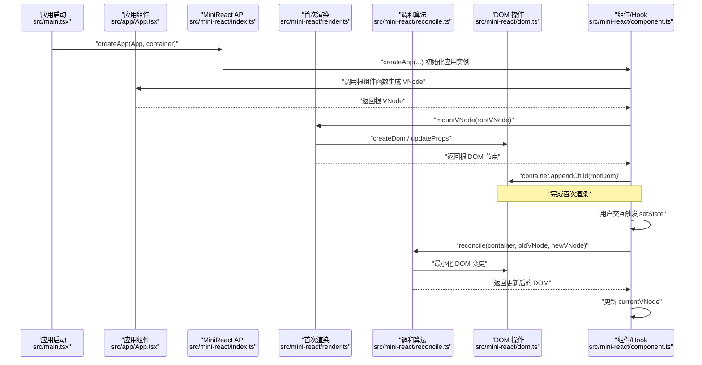
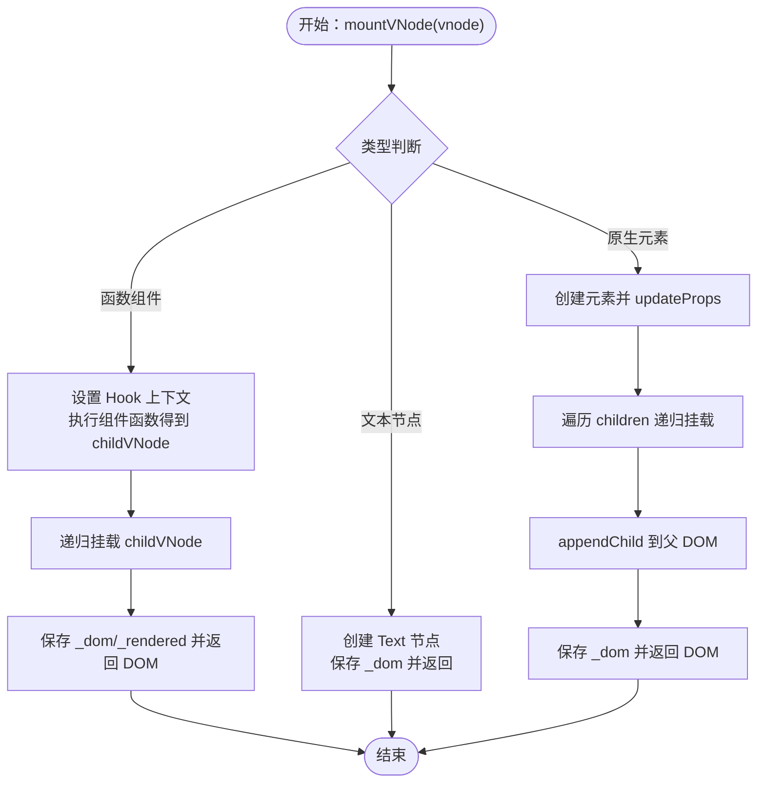
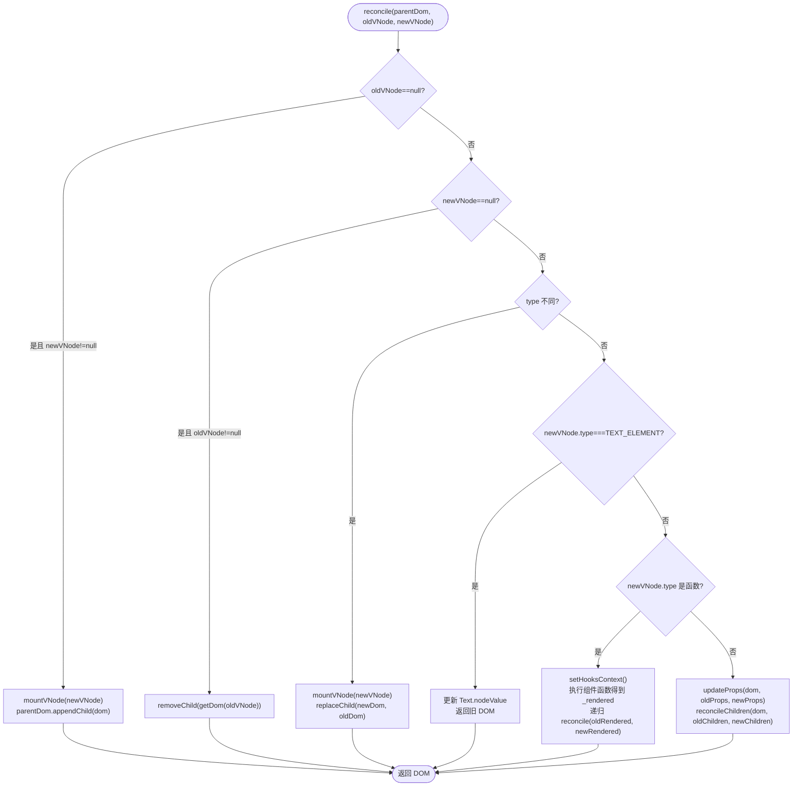
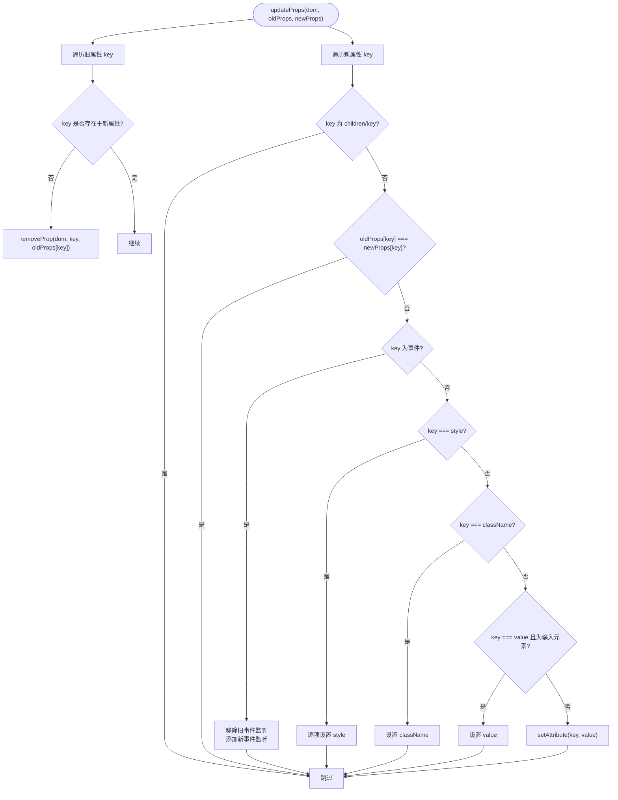
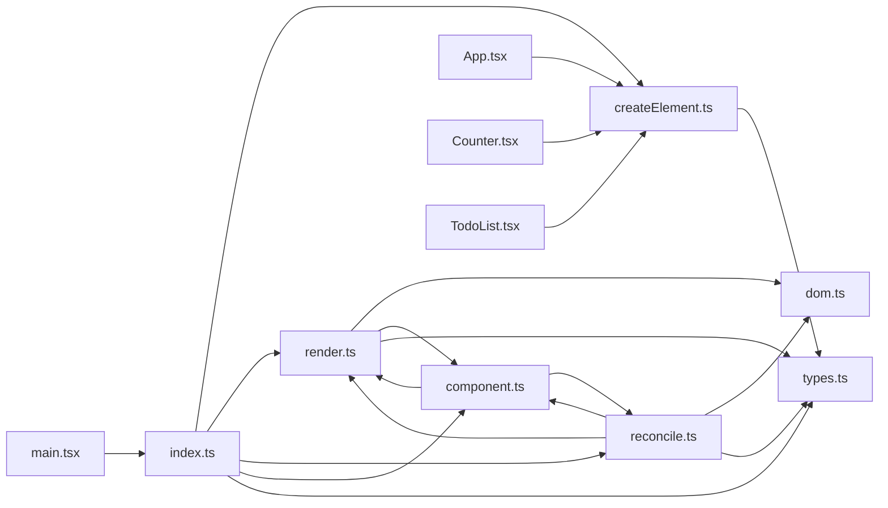

# 渲染系统

<cite>
**本文引用的文件**
- [src/mini-react/index.ts](file://src/mini-react/index.ts)
- [src/mini-react/render.ts](file://src/mini-react/render.ts)
- [src/mini-react/reconcile.ts](file://src/mini-react/reconcile.ts)
- [src/mini-react/dom.ts](file://src/mini-react/dom.ts)
- [src/mini-react/createElement.ts](file://src/mini-react/createElement.ts)
- [src/mini-react/component.ts](file://src/mini-react/component.ts)
- [src/mini-react/types.ts](file://src/mini-react/types.ts)
- [src/main.tsx](file://src/main.tsx)
- [src/app/App.tsx](file://src/app/App.tsx)
- [src/app/Counter.tsx](file://src/app/Counter.tsx)
- [src/app/TodoList.tsx](file://src/app/TodoList.tsx)
- [tsconfig.json](file://tsconfig.json)
</cite>

## 目录
1. [简介](#简介)
2. [项目结构](#项目结构)
3. [核心组件](#核心组件)
4. [架构总览](#架构总览)
5. [详细组件分析](#详细组件分析)
6. [依赖关系分析](#依赖关系分析)
7. [性能考量](#性能考量)
8. [故障排查指南](#故障排查指南)
9. [结论](#结论)
10. [附录](#附录)

## 简介
本文件面向“渲染系统”的技术文档，围绕从虚拟 DOM 到真实 DOM 的完整渲染流程进行深入解析，覆盖以下关键主题：
- 首次渲染的完整时序与控制流
- render 函数的实现细节：根节点处理、递归渲染与 DOM 挂载机制
- DOM 操作系统：元素创建、属性设置与事件绑定
- 组件渲染：函数式组件执行、Hook 初始化与状态设置
- 错误处理与边界情况
- 性能优化建议与最佳实践

## 项目结构
该仓库采用按功能模块划分的组织方式，核心渲染逻辑集中在 src/mini-react 目录中，应用示例位于 src/app，入口文件位于 src/main.tsx。TypeScript 配置通过 tsconfig.json 指定 JSX 工厂为 MiniReact.createElement，从而将 JSX 编译为对内部 createElement 的调用。

图表来源
- [src/main.tsx:1-6](file://src/main.tsx#L1-L6)
- [src/app/App.tsx:1-33](file://src/app/App.tsx#L1-L33)
- [src/mini-react/index.ts:1-12](file://src/mini-react/index.ts#L1-L12)

章节来源
- [src/main.tsx:1-6](file://src/main.tsx#L1-L6)
- [tsconfig.json:1-19](file://tsconfig.json#L1-L19)

## 核心组件
- 虚拟 DOM 与类型定义：VNode、Props、ComponentFunction、Hook 等，统一描述 JSX 节点结构与函数组件签名。
- JSX 工厂：createElement 将 JSX 编译为 VNode，负责规范化 children、文本节点包装与 key 处理。
- 首次渲染：mountVNode 递归构建真实 DOM，render 将根节点挂载至容器。
- 调和算法：reconcile 对比新旧 VNode，执行最小化 DOM 变更（新增、删除、替换、属性更新、子树对比）。
- DOM 操作：createDom 与 updateProps 实现元素创建与属性/事件更新。
- 组件与 Hook：setHooksContext/clearHooksContext 管理函数组件渲染上下文；useState 提供状态与调度。
- 应用实例：createApp 首次渲染入口；scheduleUpdate 微任务批量调度。

章节来源
- [src/mini-react/types.ts:1-26](file://src/mini-react/types.ts#L1-L26)
- [src/mini-react/createElement.ts:1-58](file://src/mini-react/createElement.ts#L1-L58)
- [src/mini-react/render.ts:1-49](file://src/mini-react/render.ts#L1-L49)
- [src/mini-react/reconcile.ts:1-110](file://src/mini-react/reconcile.ts#L1-L110)
- [src/mini-react/dom.ts:1-97](file://src/mini-react/dom.ts#L1-L97)
- [src/mini-react/component.ts:1-137](file://src/mini-react/component.ts#L1-L137)
- [src/mini-react/index.ts:1-12](file://src/mini-react/index.ts#L1-L12)

## 架构总览
渲染系统由“编译期 JSX → 虚拟 DOM → 首次渲染/增量调和 → DOM 操作”四层构成。TypeScript 通过 tsconfig.json 将 JSX 工厂指向 MiniReact.createElement，使 JSX 语法与内部 VNode 结构解耦。

图表来源
- [src/main.tsx:1-6](file://src/main.tsx#L1-L6)
- [src/app/App.tsx:1-33](file://src/app/App.tsx#L1-L33)
- [src/mini-react/index.ts:1-12](file://src/mini-react/index.ts#L1-L12)
- [src/mini-react/render.ts:45-49](file://src/mini-react/render.ts#L45-L49)
- [src/mini-react/reconcile.ts:14-81](file://src/mini-react/reconcile.ts#L14-L81)
- [src/mini-react/dom.ts:6-53](file://src/mini-react/dom.ts#L6-L53)
- [src/mini-react/component.ts:99-136](file://src/mini-react/component.ts#L99-L136)

## 详细组件分析

### 首次渲染流程（从 VNode 到真实 DOM）
- 控制流
  - 应用启动：createApp 调用根组件函数生成 VNode，清空容器并调用 mountVNode 完成根节点挂载。
  - mountVNode 递归处理：函数组件、文本节点、原生元素三类分支分别处理。
  - DOM 挂载：render 将根 DOM 节点追加到容器中。
- 关键点
  - 函数组件：设置 Hook 上下文，执行组件函数得到子 VNode，递归挂载，记录 _dom 与 _rendered。
  - 文本节点：创建 Text 节点，记录 _dom。
  - 原生元素：创建元素、updateProps 设置属性与事件、递归挂载子节点。
- 边界情况
  - children 规范化：字符串/数字转文本节点，过滤 null/undefined/boolean，扁平化数组。
  - key 处理：createElement 移除 props.key 并作为 VNode.key，用于后续 reconcile 对齐。

图表来源
- [src/mini-react/render.ts:9-40](file://src/mini-react/render.ts#L9-L40)
- [src/mini-react/dom.ts:19-53](file://src/mini-react/dom.ts#L19-L53)
- [src/mini-react/createElement.ts:33-48](file://src/mini-react/createElement.ts#L33-L48)

章节来源
- [src/mini-react/render.ts:9-49](file://src/mini-react/render.ts#L9-L49)
- [src/mini-react/createElement.ts:9-58](file://src/mini-react/createElement.ts#L9-L58)
- [src/mini-react/dom.ts:6-53](file://src/mini-react/dom.ts#L6-L53)

### 调和算法（reconcile）与增量更新
- 功能目标：对比新旧 VNode，最小化真实 DOM 变更，支持新增、删除、替换、文本节点更新、函数组件与原生元素的属性/子树更新。
- 流程要点
  - 新增/删除：当旧节点为空或新节点为空时，直接挂载或移除。
  - 类型不同：直接替换整棵子树。
  - 文本节点：仅更新 nodeValue。
  - 函数组件：设置 Hook 上下文，执行组件函数得到 _rendered，递归 reconcile。
  - 原生元素：updateProps 增量更新属性，逐索引 reconcileChildren。
- 子树对比：reconcileChildren 以最大长度为界，逐项对比，保证同索引位置的节点正确对齐。

图表来源
- [src/mini-react/reconcile.ts:14-81](file://src/mini-react/reconcile.ts#L14-L81)
- [src/mini-react/dom.ts:19-53](file://src/mini-react/dom.ts#L19-L53)
- [src/mini-react/render.ts:9-40](file://src/mini-react/render.ts#L9-L40)

章节来源
- [src/mini-react/reconcile.ts:14-110](file://src/mini-react/reconcile.ts#L14-L110)

### DOM 操作系统（元素创建、属性设置与事件绑定）
- createDom：根据 VNode 类型创建 Text 或 HTMLElement，调用 updateProps 设置初始属性。
- updateProps：增量更新策略
  - 移除：遍历旧属性，若新属性不存在则移除对应 DOM 属性/事件/样式/类名。
  - 设置：遍历新属性，事件属性先移除旧监听再绑定新监听；style 逐项覆盖；className/value 特殊处理；其他属性使用 setAttribute。
- 事件命名：以 "on" 开头的属性名映射为小写事件名（如 onClick → click），统一通过 addEventListener/removeEventListener 管理。

图表来源
- [src/mini-react/dom.ts:19-86](file://src/mini-react/dom.ts#L19-L86)

章节来源
- [src/mini-react/dom.ts:1-97](file://src/mini-react/dom.ts#L1-L97)

### 组件渲染与 Hook 系统
- 函数组件执行
  - setHooksContext 在渲染前建立上下文，记录当前 VNode、旧 VNode 与 hookIndex。
  - 渲染结束后 clearHooksContext 清理上下文。
  - 函数组件返回 VNode，mountVNode/reconcile 递归处理。
- useState 实现
  - 每个函数组件 VNode 维护 _hooks 数组，按 hookIndex 顺序存储状态。
  - 首次渲染：初始化状态并写入 _hooks[index]。
  - 复用：从旧 VNode._hooks[index] 复用状态。
  - setter 支持函数式更新，更新后调用 scheduleUpdate 触发微任务重渲染。
- 应用实例与调度
  - createApp 首次渲染后保存 currentVNode。
  - scheduleUpdate 通过 queueMicrotask 合并多次 setState，避免重复渲染。

```mermaid
classDiagram
class HooksContext {
+vnode : VNode
+oldVNode : VNode
+hookIndex : number
}
class VNode {
+type
+props
+children
+key
+_dom
+_rendered
+_hooks
}
class Hook {
+state : any
}
class ComponentSystem {
+setHooksContext(vnode, oldVNode)
+clearHooksContext()
+useState(initialValue)
+createApp(rootComponent, container)
}
HooksContext --> VNode : "关联"
VNode --> Hook : "持有"
ComponentSystem --> HooksContext : "管理"
ComponentSystem --> VNode : "读取/写入"
```

图表来源
- [src/mini-react/component.ts:7-32](file://src/mini-react/component.ts#L7-L32)
- [src/mini-react/types.ts:7-23](file://src/mini-react/types.ts#L7-L23)

章节来源
- [src/mini-react/component.ts:1-137](file://src/mini-react/component.ts#L1-L137)
- [src/mini-react/types.ts:1-26](file://src/mini-react/types.ts#L1-L26)

### 错误处理与边界情况
- useState 必须在函数组件内调用：未设置 Hook 上下文时抛出错误，防止误用。
- reconcile 的 DOM 获取：getDom 支持函数组件穿透到实际 DOM，避免空引用。
- children 规范化：createElement.normalizeChildren 过滤无效值、扁平化数组、将字符串/数字转为文本节点，保障渲染健壮性。
- 事件处理：updateProps 对事件属性进行统一处理，先移除旧监听再绑定新监听，避免重复绑定。
- 文本节点更新：reconcile 对 TEXT_ELEMENT 类型仅更新 nodeValue，避免不必要的 DOM 替换。

章节来源
- [src/mini-react/component.ts:54-56](file://src/mini-react/component.ts#L54-L56)
- [src/mini-react/reconcile.ts:105-109](file://src/mini-react/reconcile.ts#L105-L109)
- [src/mini-react/createElement.ts:33-48](file://src/mini-react/createElement.ts#L33-L48)
- [src/mini-react/dom.ts:38-42](file://src/mini-react/dom.ts#L38-L42)

## 依赖关系分析
- 模块耦合
  - render 依赖 dom.updateProps 与 component.setHooksContext/clearHooksContext。
  - reconcile 依赖 render.mountVNode、dom.updateProps、component.setHooksContext/clearHooksContext。
  - component.createApp 依赖 render.mountVNode 与 reconcile。
  - createElement 为上层 JSX 编译产物提供 VNode。
- 导出与入口
  - index.ts 统一导出 API，包含 createElement、render、reconcile、createApp、useState、VNode 等类型。

图表来源
- [src/mini-react/index.ts:1-12](file://src/mini-react/index.ts#L1-L12)
- [src/mini-react/render.ts:1-4](file://src/mini-react/render.ts#L1-L4)
- [src/mini-react/reconcile.ts:1-4](file://src/mini-react/reconcile.ts#L1-L4)
- [src/mini-react/component.ts:1-4](file://src/mini-react/component.ts#L1-L4)
- [src/mini-react/createElement.ts:1](file://src/mini-react/createElement.ts#L1)
- [src/mini-react/dom.ts:1](file://src/mini-react/dom.ts#L1)
- [src/mini-react/types.ts:1](file://src/mini-react/types.ts#L1)
- [src/main.tsx:1](file://src/main.tsx#L1)
- [src/app/App.tsx:1](file://src/app/App.tsx#L1)
- [src/app/Counter.tsx:1](file://src/app/Counter.tsx#L1)
- [src/app/TodoList.tsx:1](file://src/app/TodoList.tsx#L1)

章节来源
- [src/mini-react/index.ts:1-12](file://src/mini-react/index.ts#L1-L12)

## 性能考量
- 批处理与微任务：scheduleUpdate 使用 queueMicrotask 合并多次 setState，减少重渲染次数。
- 最小化 DOM 变更：reconcile 优先使用新增/删除/替换策略，避免不必要的属性更新；updateProps 仅对变化的属性进行更新。
- 文本节点优化：针对 TEXT_ELEMENT 仅更新 nodeValue，避免整树替换。
- 子树对齐：reconcileChildren 以索引对齐，避免无谓的节点移动。
- 事件绑定去重：updateProps 对事件属性先移除旧监听再绑定新监听，避免重复绑定导致的性能问题。

## 故障排查指南
- 报错“useState 必须在函数组件内调用”
  - 症状：在非函数组件中调用 useState。
  - 排查：确认调用位置处于函数组件内部，确保 setHooksContext 已被调用。
  - 参考路径：[src/mini-react/component.ts:54-56](file://src/mini-react/component.ts#L54-L56)
- 事件未生效或重复绑定
  - 症状：点击事件无效或多次触发。
  - 排查：检查事件属性命名是否以 "on" 开头，确认 updateProps 正确移除旧监听并绑定新监听。
  - 参考路径：[src/mini-react/dom.ts:38-42](file://src/mini-react/dom.ts#L38-L42)
- 文本节点未更新
  - 症状：文本内容变更但界面未刷新。
  - 排查：确认新旧 VNode 类型均为 TEXT_ELEMENT，且 nodeValue 发生变化。
  - 参考路径：[src/mini-react/reconcile.ts:48-55](file://src/mini-react/reconcile.ts#L48-L55)
- 子节点错位或丢失
  - 症状：列表渲染时元素错位或消失。
  - 排查：为列表项提供稳定 key，确保 reconcileChildren 能正确对齐。
  - 参考路径：[src/mini-react/createElement.ts:15-20](file://src/mini-react/createElement.ts#L15-L20)

## 结论
本渲染系统以简洁的 VNode 结构为核心，通过 mountVNode 与 reconcile 实现从虚拟 DOM 到真实 DOM 的高效转换。配合 DOM 操作系统与 Hook 系统，实现了函数式组件的状态管理与事件处理。通过增量更新与微任务批处理，系统在保持可读性的同时兼顾了性能与稳定性。建议在实际项目中遵循 key 稳定、事件命名规范与最小化属性更新等最佳实践，以获得更佳的渲染体验。

## 附录
- JSX 工厂配置
  - tsconfig.json 指定 jsxFactory 为 MiniReact.createElement，确保 JSX 编译为对内部工厂函数的调用。
  - 参考路径：[tsconfig.json:7-8](file://tsconfig.json#L7-L8)
- 入口与示例
  - 应用入口：src/main.tsx 调用 createApp(App, container) 完成首次渲染。
  - 示例组件：App.tsx、Counter.tsx、TodoList.tsx 展示了函数组件、useState 与事件绑定的典型用法。
  - 参考路径：
    - [src/main.tsx:1-6](file://src/main.tsx#L1-L6)
    - [src/app/App.tsx:1-33](file://src/app/App.tsx#L1-L33)
    - [src/app/Counter.tsx:1-52](file://src/app/Counter.tsx#L1-L52)
    - [src/app/TodoList.tsx:1-113](file://src/app/TodoList.tsx#L1-L113)