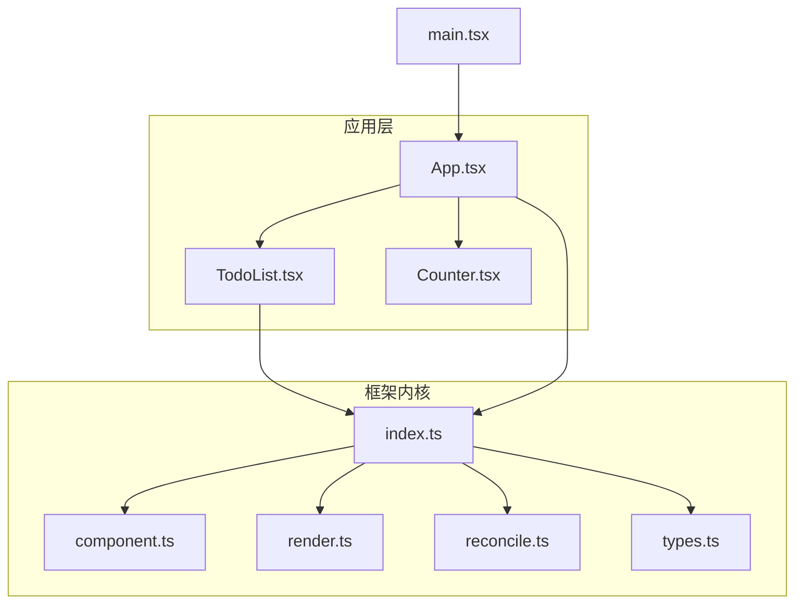
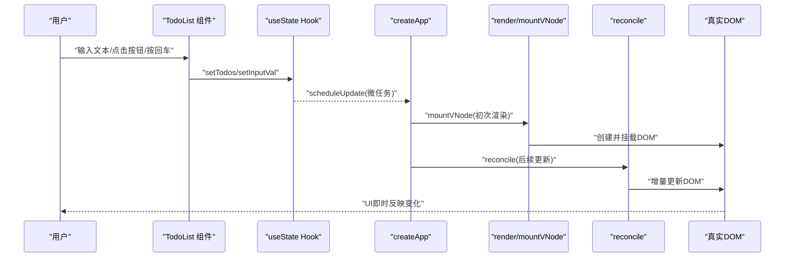
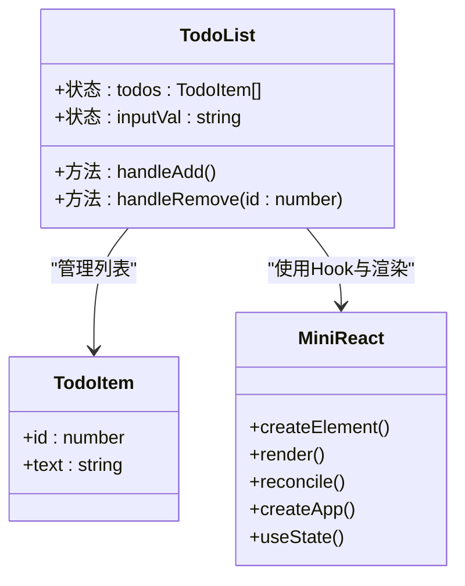
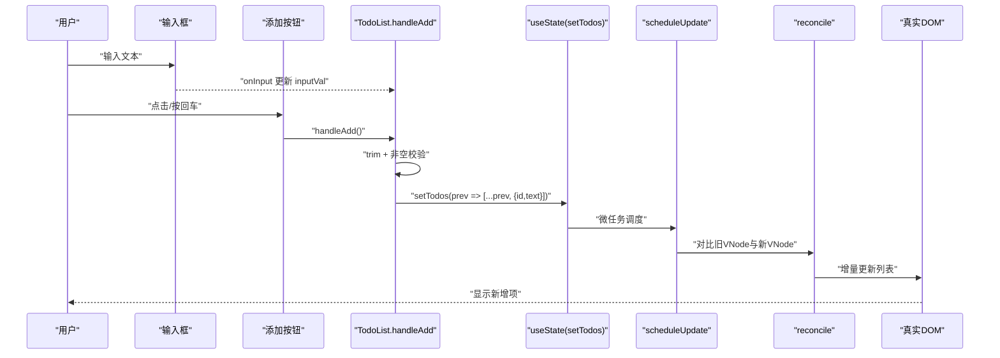
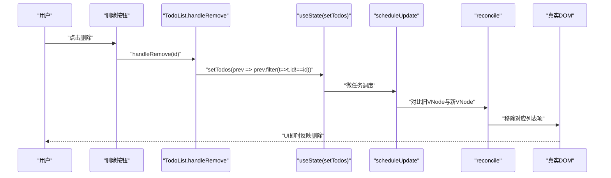
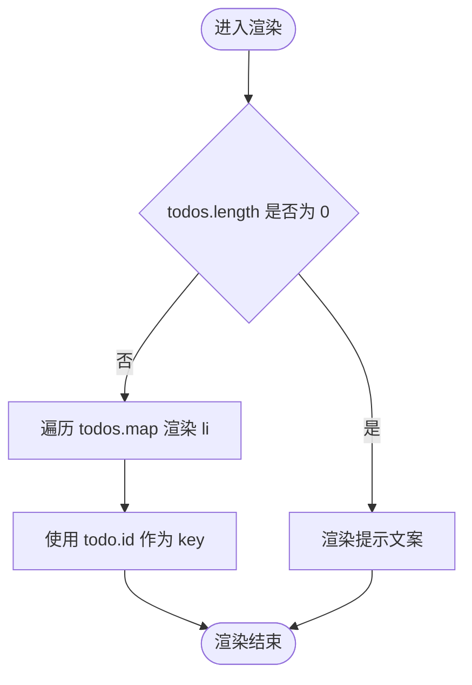
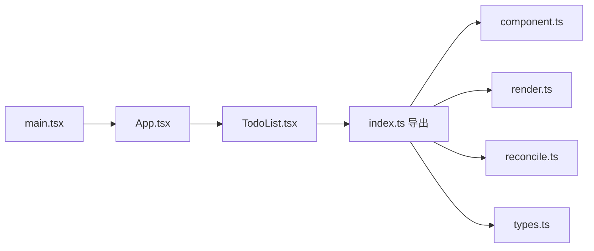

# 待办事项组件

<cite>
**本文引用的文件**
- [src/app/TodoList.tsx](file://src/app/TodoList.tsx)
- [src/app/App.tsx](file://src/app/App.tsx)
- [src/app/Counter.tsx](file://src/app/Counter.tsx)
- [src/main.tsx](file://src/main.tsx)
- [src/mini-react/index.ts](file://src/mini-react/index.ts)
- [src/mini-react/component.ts](file://src/mini-react/component.ts)
- [src/mini-react/render.ts](file://src/mini-react/render.ts)
- [src/mini-react/reconcile.ts](file://src/mini-react/reconcile.ts)
- [src/mini-react/types.ts](file://src/mini-react/types.ts)
- [index.html](file://index.html)
- [package.json](file://package.json)
</cite>

## 目录
1. [简介](#简介)
2. [项目结构](#项目结构)
3. [核心组件](#核心组件)
4. [架构总览](#架构总览)
5. [组件详细分析](#组件详细分析)
6. [依赖关系分析](#依赖关系分析)
7. [性能考量](#性能考量)
8. [故障排查指南](#故障排查指南)
9. [结论](#结论)
10. [附录](#附录)

## 简介
本文件围绕 TodoList.tsx 组件进行系统化技术文档编写，重点覆盖以下方面：
- 复杂状态管理：多状态协调、列表数据处理、动态内容渲染
- CRUD 操作实现：添加、删除（当前版本）、编辑与完成状态切换（扩展建议）
- 数据结构设计与状态更新策略
- 用户交互处理：输入验证、键盘快捷键、批量操作（扩展建议）
- 性能优化技巧：最小化重渲染、批处理更新
- 扩展方案：分类标签、优先级排序、本地存储等
- 最佳实践与使用场景

该仓库采用自研 mini-react 框架，基于虚拟 DOM + Diff/Reconcile 的机制，TodoList 作为函数式组件，使用自定义 useState Hook 实现状态管理，并通过调度器进行微任务批处理更新。

## 项目结构
项目采用“功能模块 + 自研框架内核”的分层组织方式：
- 应用层：App.tsx、TodoList.tsx、Counter.tsx
- 框架内核：mini-react 目录下的核心文件（createElement、render、reconcile、component、types）
- 入口与配置：main.tsx、index.html、package.json

图表来源
- [src/app/App.tsx:1-33](file://src/app/App.tsx#L1-L33)
- [src/app/TodoList.tsx:1-113](file://src/app/TodoList.tsx#L1-L113)
- [src/app/Counter.tsx:1-52](file://src/app/Counter.tsx#L1-L52)
- [src/main.tsx:1-6](file://src/main.tsx#L1-L6)
- [src/mini-react/index.ts:1-12](file://src/mini-react/index.ts#L1-L12)
- [src/mini-react/component.ts:1-137](file://src/mini-react/component.ts#L1-L137)
- [src/mini-react/render.ts:1-49](file://src/mini-react/render.ts#L1-L49)
- [src/mini-react/reconcile.ts:1-110](file://src/mini-react/reconcile.ts#L1-L110)
- [src/mini-react/types.ts:1-26](file://src/mini-react/types.ts#L1-L26)

章节来源
- [src/app/App.tsx:1-33](file://src/app/App.tsx#L1-L33)
- [src/app/TodoList.tsx:1-113](file://src/app/TodoList.tsx#L1-L113)
- [src/app/Counter.tsx:1-52](file://src/app/Counter.tsx#L1-L52)
- [src/main.tsx:1-6](file://src/main.tsx#L1-L6)
- [src/mini-react/index.ts:1-12](file://src/mini-react/index.ts#L1-L12)
- [src/mini-react/component.ts:1-137](file://src/mini-react/component.ts#L1-L137)
- [src/mini-react/render.ts:1-49](file://src/mini-react/render.ts#L1-L49)
- [src/mini-react/reconcile.ts:1-110](file://src/mini-react/reconcile.ts#L1-L110)
- [src/mini-react/types.ts:1-26](file://src/mini-react/types.ts#L1-L26)
- [index.html:1-17](file://index.html#L1-L17)
- [package.json:1-17](file://package.json#L1-L17)

## 核心组件
本节聚焦 TodoList.tsx 的状态结构、事件处理与渲染逻辑。

- 数据结构
  - TodoItem 接口包含 id 与 text 字段；nextId 作为全局自增主键生成器
  - 状态数组 todos 存放所有待办项；inputVal 用于输入框双向绑定

- 状态管理
  - useState 初始化 todos 为空数组，inputVal 为空字符串
  - handleAdd：去除空白字符后校验，非空则追加新项并重置输入框
  - handleRemove：根据 id 过滤出新数组，触发重新渲染

- 渲染策略
  - 条件渲染：无待办时显示提示文案；有数据时以 ul/li 列表渲染
  - 动态样式：通过内联样式对象控制布局与视觉
  - 键值：列表项使用 todo.id 作为 key，保证列表更新稳定性

- 交互行为
  - 输入框 onInput 双向绑定 inputVal
  - 回车键触发添加：onKeyDown 中监听 Enter
  - 删除按钮点击触发 handleRemove

章节来源
- [src/app/TodoList.tsx:4-24](file://src/app/TodoList.tsx#L4-L24)
- [src/app/TodoList.tsx:26-112](file://src/app/TodoList.tsx#L26-L112)

## 架构总览
TodoList 的运行链路贯穿自定义 mini-react 框架内核，形成“应用 -> 虚拟DOM -> 调度 -> 调和 -> 真实DOM”的完整流程。

图表来源
- [src/app/TodoList.tsx:1-113](file://src/app/TodoList.tsx#L1-L113)
- [src/mini-react/component.ts:119-136](file://src/mini-react/component.ts#L119-L136)
- [src/mini-react/render.ts:9-40](file://src/mini-react/render.ts#L9-L40)
- [src/mini-react/reconcile.ts:14-81](file://src/mini-react/reconcile.ts#L14-L81)
- [src/main.tsx:1-6](file://src/main.tsx#L1-L6)

## 组件详细分析

### TodoList 组件类图
展示 TodoList 的内部状态、方法与依赖关系。

图表来源
- [src/app/TodoList.tsx:4-24](file://src/app/TodoList.tsx#L4-L24)
- [src/mini-react/index.ts:1-12](file://src/mini-react/index.ts#L1-L12)

章节来源
- [src/app/TodoList.tsx:1-113](file://src/app/TodoList.tsx#L1-L113)
- [src/mini-react/index.ts:1-12](file://src/mini-react/index.ts#L1-L12)

### 添加待办流程（序列图）
演示输入校验、状态更新与渲染的完整时序。

图表来源
- [src/app/TodoList.tsx:15-20](file://src/app/TodoList.tsx#L15-L20)
- [src/mini-react/component.ts:122-136](file://src/mini-react/component.ts#L122-L136)
- [src/mini-react/reconcile.ts:14-81](file://src/mini-react/reconcile.ts#L14-L81)

章节来源
- [src/app/TodoList.tsx:15-20](file://src/app/TodoList.tsx#L15-L20)
- [src/mini-react/component.ts:122-136](file://src/mini-react/component.ts#L122-L136)
- [src/mini-react/reconcile.ts:14-81](file://src/mini-react/reconcile.ts#L14-L81)

### 删除待办流程（序列图）
演示按键触发、过滤更新与渲染的时序。

图表来源
- [src/app/TodoList.tsx:22-24](file://src/app/TodoList.tsx#L22-L24)
- [src/mini-react/component.ts:122-136](file://src/mini-react/component.ts#L122-L136)
- [src/mini-react/reconcile.ts:14-81](file://src/mini-react/reconcile.ts#L14-L81)

章节来源
- [src/app/TodoList.tsx:22-24](file://src/app/TodoList.tsx#L22-L24)
- [src/mini-react/component.ts:122-136](file://src/mini-react/component.ts#L122-L136)
- [src/mini-react/reconcile.ts:14-81](file://src/mini-react/reconcile.ts#L14-L81)

### 列表渲染与键值策略（流程图）
说明列表渲染、键值选择与条件渲染的决策流程。

图表来源
- [src/app/TodoList.tsx:72-105](file://src/app/TodoList.tsx#L72-L105)

章节来源
- [src/app/TodoList.tsx:72-105](file://src/app/TodoList.tsx#L72-L105)

### 当前实现与扩展建议
- 已实现
  - 添加：handleAdd + 输入校验 + 状态追加
  - 删除：handleRemove + 过滤更新
  - 渲染：条件渲染 + 列表渲染 + 键值策略
  - 交互：输入框双向绑定 + 回车快捷键
- 待扩展（建议）
  - 编辑：双击进入编辑模式，支持就地修改
  - 完成状态切换：增加 completed 字段与切换逻辑
  - 分类标签：新增 tag 字段与筛选
  - 优先级排序：priority 字段与排序 UI
  - 本地存储：localStorage 同步持久化
  - 批量操作：全选/反选、批量删除

章节来源
- [src/app/TodoList.tsx:15-24](file://src/app/TodoList.tsx#L15-L24)

## 依赖关系分析
- 组件依赖
  - TodoList 依赖自定义 MiniReact（createElement、useState、createApp）
  - App 将 TodoList 与其他组件组合
- 框架内核依赖
  - component.ts 提供 useState、createApp、调度器
  - render.ts 负责初次挂载
  - reconcile.ts 负责增量更新
  - types.ts 定义 VNode、Hook 等核心类型

图表来源
- [src/app/TodoList.tsx:1-2](file://src/app/TodoList.tsx#L1-L2)
- [src/mini-react/index.ts:1-12](file://src/mini-react/index.ts#L1-L12)
- [src/mini-react/component.ts:1-137](file://src/mini-react/component.ts#L1-L137)
- [src/mini-react/render.ts:1-49](file://src/mini-react/render.ts#L1-L49)
- [src/mini-react/reconcile.ts:1-110](file://src/mini-react/reconcile.ts#L1-L110)
- [src/mini-react/types.ts:1-26](file://src/mini-react/types.ts#L1-L26)
- [src/app/App.tsx:1-33](file://src/app/App.tsx#L1-L33)
- [src/main.tsx:1-6](file://src/main.tsx#L1-L6)

章节来源
- [src/app/TodoList.tsx:1-2](file://src/app/TodoList.tsx#L1-L2)
- [src/mini-react/index.ts:1-12](file://src/mini-react/index.ts#L1-L12)
- [src/mini-react/component.ts:1-137](file://src/mini-react/component.ts#L1-L137)
- [src/mini-react/render.ts:1-49](file://src/mini-react/render.ts#L1-L49)
- [src/mini-react/reconcile.ts:1-110](file://src/mini-react/reconcile.ts#L1-L110)
- [src/mini-react/types.ts:1-26](file://src/mini-react/types.ts#L1-L26)
- [src/app/App.tsx:1-33](file://src/app/App.tsx#L1-L33)
- [src/main.tsx:1-6](file://src/main.tsx#L1-L6)

## 性能考量
- 微任务批处理
  - scheduleUpdate 通过微任务队列合并多次 setState，避免重复渲染
- 虚拟 DOM 调和
  - reconcile 仅对比新旧 VNode，执行最小化 DOM 操作
- 列表渲染键值
  - 使用稳定 key（todo.id）提升列表更新效率
- 状态粒度
  - 将输入框与列表状态分离，减少无关渲染
- 建议优化
  - 对于大型列表：考虑虚拟滚动
  - 对频繁输入：可引入防抖
  - 对复杂筛选：将计算结果 memo 化

章节来源
- [src/mini-react/component.ts:122-136](file://src/mini-react/component.ts#L122-L136)
- [src/mini-react/reconcile.ts:14-81](file://src/mini-react/reconcile.ts#L14-L81)
- [src/app/TodoList.tsx:76-104](file://src/app/TodoList.tsx#L76-L104)

## 故障排查指南
- 症状：点击添加无效
  - 检查 handleAdd 是否被正确绑定到按钮与回车事件
  - 确认输入值 trim 后是否为空
- 症状：删除不生效
  - 检查 handleRemove 的 id 参数是否匹配
  - 确认过滤逻辑是否返回新数组并触发更新
- 症状：列表闪烁或错位
  - 检查 key 是否稳定且唯一（建议使用 id）
- 症状：输入框无法输入
  - 检查 onInput 是否正确更新 inputVal
- 症状：样式异常
  - 检查内联样式的拼接与单位

章节来源
- [src/app/TodoList.tsx:15-24](file://src/app/TodoList.tsx#L15-L24)
- [src/app/TodoList.tsx:38-70](file://src/app/TodoList.tsx#L38-L70)
- [src/app/TodoList.tsx:76-104](file://src/app/TodoList.tsx#L76-L104)

## 结论
TodoList 组件以简洁的接口实现了基础的待办管理能力，配合自定义 mini-react 框架的虚拟 DOM 与调度机制，具备良好的可扩展性。当前版本聚焦于添加与删除，后续可在保持现有状态管理模式的基础上，逐步引入编辑、完成状态、分类与优先级等特性，同时结合本地存储与批量操作提升用户体验。

## 附录
- 使用场景
  - 快速记录临时任务
  - 作为学习自研框架的示例组件
  - 作为扩展功能（编辑、完成、筛选、排序）的起点
- 最佳实践
  - 保持状态单一职责：输入与列表分离
  - 使用稳定键值：避免列表重排抖动
  - 事件处理函数尽量轻量化：将复杂逻辑抽离
  - 利用微任务批处理：避免频繁重渲染
- 扩展清单（建议）
  - 编辑：双击进入编辑模式，失焦或回车保存
  - 完成：新增 completed 字段，支持切换与样式区分
  - 分类：新增 tag 字段，支持筛选与颜色标识
  - 排序：新增 priority 字段，支持拖拽排序
  - 本地存储：使用 localStorage 同步持久化
  - 批量：全选/反选、批量删除、清空已完成