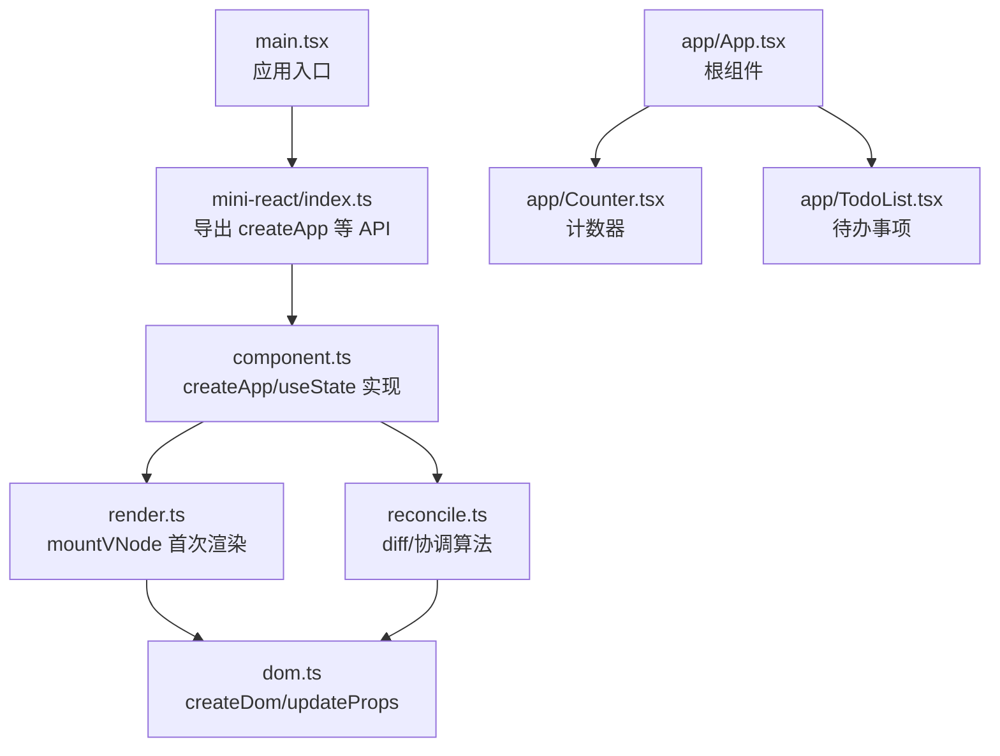
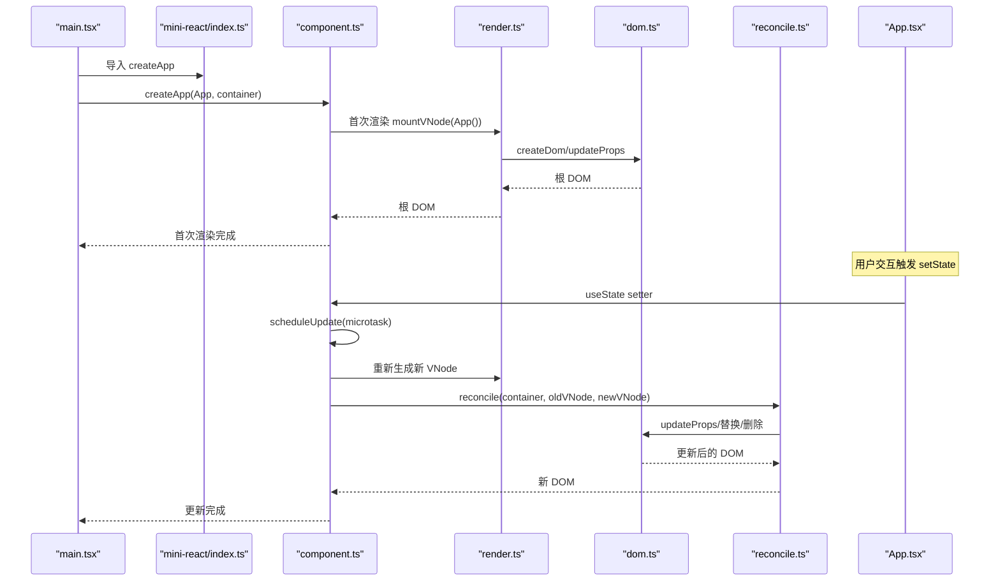
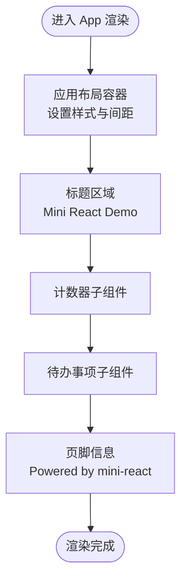
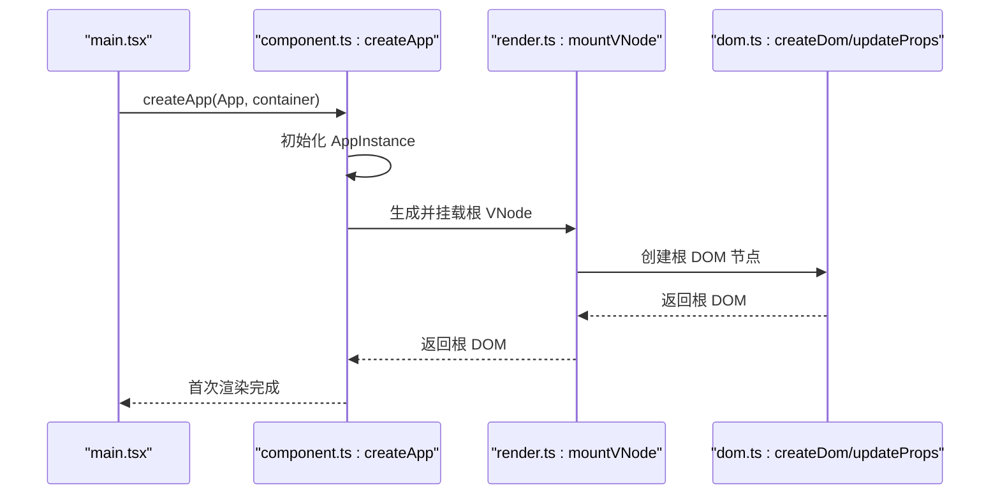
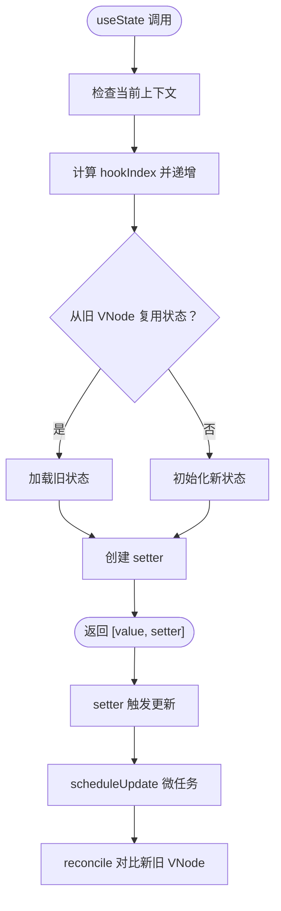
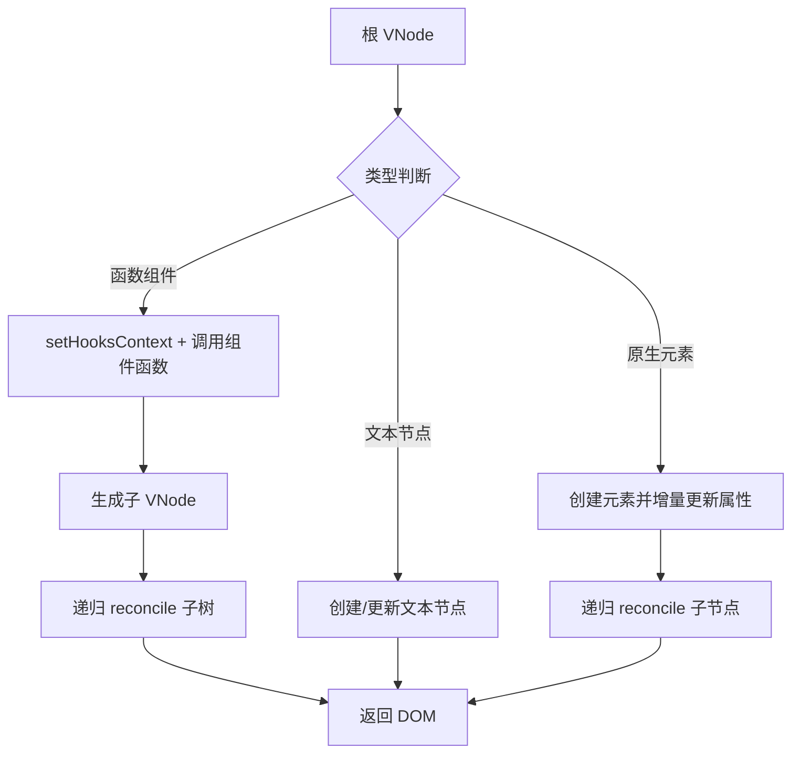
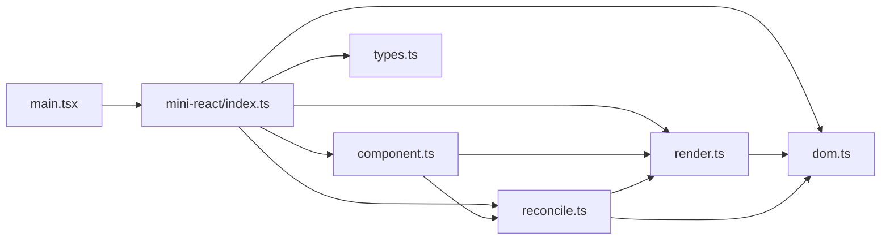

# 根组件设计

<cite>
**本文档引用的文件**
- [main.tsx](file://src/main.tsx)
- [App.tsx](file://src/app/App.tsx)
- [index.ts](file://src/mini-react/index.ts)
- [component.ts](file://src/mini-react/component.ts)
- [render.ts](file://src/mini-react/render.ts)
- [reconcile.ts](file://src/mini-react/reconcile.ts)
- [dom.ts](file://src/mini-react/dom.ts)
- [types.ts](file://src/mini-react/types.ts)
- [Counter.tsx](file://src/app/Counter.tsx)
- [TodoList.tsx](file://src/app/TodoList.tsx)
</cite>

## 目录
1. [简介](#简介)
2. [项目结构](#项目结构)
3. [核心组件](#核心组件)
4. [架构总览](#架构总览)
5. [详细组件分析](#详细组件分析)
6. [依赖关系分析](#依赖关系分析)
7. [性能考虑](#性能考虑)
8. [故障排除指南](#故障排除指南)
9. [结论](#结论)

## 简介
本项目是一个极简版 React 实现，重点展示了根组件 App.tsx 的设计与实现。根组件作为应用的容器，负责组织子组件、管理全局状态，并通过自定义的渲染与协调机制实现高效的虚拟 DOM 更新。本文将深入解析从入口点 main.tsx 到 createApp 的完整初始化流程，以及根组件如何整合 Counter 和 TodoList 等子组件，同时提供可扩展的设计模式与最佳实践。

## 项目结构
项目采用按功能分层的组织方式：
- src/main.tsx：应用入口，负责导入 MiniReact、根组件并调用 createApp 完成初始化渲染
- src/app/App.tsx：根组件，作为应用容器，组织子组件并提供全局样式
- src/mini-react/*：迷你 React 核心库，包含虚拟 DOM、渲染、协调、DOM 操作与类型定义
- src/app/Counter.tsx 与 src/app/TodoList.tsx：示例子组件，演示状态管理与交互

图表来源
- [main.tsx:1-6](file://src/main.tsx#L1-L6)
- [index.ts:1-12](file://src/mini-react/index.ts#L1-L12)
- [component.ts:99-117](file://src/mini-react/component.ts#L99-L117)
- [render.ts:45-48](file://src/mini-react/render.ts#L45-L48)
- [dom.ts:6-14](file://src/mini-react/dom.ts#L6-L14)
- [reconcile.ts:14-81](file://src/mini-react/reconcile.ts#L14-L81)
- [App.tsx:5-32](file://src/app/App.tsx#L5-L32)

章节来源
- [main.tsx:1-6](file://src/main.tsx#L1-L6)
- [index.ts:1-12](file://src/mini-react/index.ts#L1-L12)

## 核心组件
本节聚焦根组件 App.tsx 的实现与职责：
- 组件结构：返回一个包含标题、计数器、待办事项列表与页脚的布局
- 子组件组织：通过嵌套 JSX 结构引入 Counter 与 TodoList
- 全局样式：为根容器设置最大宽度、居中与间距等基础样式
- 作为容器：根组件承担应用的顶层布局与状态聚合职责

章节来源
- [App.tsx:1-33](file://src/app/App.tsx#L1-L33)

## 架构总览
从入口到渲染的完整流程如下：
1. main.tsx 导入 MiniReact、createApp 与根组件 App
2. 调用 createApp(App, container)，创建应用实例并触发首次渲染
3. render 首次将 VNode 挂载为真实 DOM
4. 用户交互触发 useState 更新，scheduleUpdate 调度微任务批量重渲染
5. reconcile 对比新旧 VNode，执行最小化 DOM 变更

图表来源
- [main.tsx:5](file://src/main.tsx#L5)
- [index.ts:4](file://src/mini-react/index.ts#L4)
- [component.ts:99-136](file://src/mini-react/component.ts#L99-L136)
- [render.ts:9-48](file://src/mini-react/render.ts#L9-L48)
- [dom.ts:19-53](file://src/mini-react/dom.ts#L19-L53)
- [reconcile.ts:14-81](file://src/mini-react/reconcile.ts#L14-L81)

## 详细组件分析

### 根组件 App.tsx 分析
- 设计定位：应用顶层容器，统一布局与样式，组织业务子组件
- 组织方式：通过 JSX 嵌套引入 Counter 与 TodoList，形成清晰的功能分区
- 渲染逻辑：返回静态布局与动态子组件，配合 useState 在子组件内部管理局部状态
- 生命周期：该实现未提供显式生命周期钩子；状态更新通过 useState 触发调度重渲染

图表来源
- [App.tsx:5-32](file://src/app/App.tsx#L5-L32)

章节来源
- [App.tsx:1-33](file://src/app/App.tsx#L1-L33)

### 初始化流程与 createApp 实现
- 入口点：main.tsx 仅一行调用 createApp(App, container)
- 应用实例：createApp 创建 AppInstance，保存根组件、容器与当前 VNode
- 首次渲染：生成根 VNode 并通过 mountVNode 挂载为真实 DOM
- 调度机制：scheduleUpdate 使用微任务队列合并多次 setState，避免频繁重渲染

图表来源
- [main.tsx:5](file://src/main.tsx#L5)
- [component.ts:99-117](file://src/mini-react/component.ts#L99-L117)
- [render.ts:9-40](file://src/mini-react/render.ts#L9-L40)
- [dom.ts:6-14](file://src/mini-react/dom.ts#L6-L14)

章节来源
- [main.tsx:1-6](file://src/main.tsx#L1-L6)
- [component.ts:99-136](file://src/mini-react/component.ts#L99-L136)

### 状态管理模式与 useState 实现
- Hooks 上下文：setHooksContext/clearHooksContext 在函数组件渲染前后维护上下文
- 状态存储：每个函数组件 VNode 维护 _hooks 数组，按 hookIndex 存取状态
- 状态复用：reconcile 时从旧 VNode 复用 hooks 状态，保证组件更新不丢失本地状态
- 更新调度：setter 内部调用 scheduleUpdate，通过微任务批量重渲染

图表来源
- [component.ts:22-83](file://src/mini-react/component.ts#L22-L83)
- [component.ts:122-136](file://src/mini-react/component.ts#L122-L136)
- [reconcile.ts:58-71](file://src/mini-react/reconcile.ts#L58-L71)

章节来源
- [component.ts:1-137](file://src/mini-react/component.ts#L1-L137)

### 渲染与协调机制
- 首次渲染：mountVNode 支持函数组件、文本节点与原生元素，递归挂载子节点
- DOM 属性：updateProps 增量更新属性，支持事件绑定、样式与表单控件
- 协调算法：reconcile 对比新旧 VNode，执行新增、删除、替换与子节点对齐
- DOM 穿透：函数组件通过 _rendered 字段指向实际 DOM，getDom 实现穿透查找

图表来源
- [render.ts:9-40](file://src/mini-react/render.ts#L9-L40)
- [dom.ts:19-53](file://src/mini-react/dom.ts#L19-L53)
- [reconcile.ts:14-81](file://src/mini-react/reconcile.ts#L14-L81)
- [types.ts:7-18](file://src/mini-react/types.ts#L7-L18)

章节来源
- [render.ts:1-49](file://src/mini-react/render.ts#L1-L49)
- [dom.ts:1-97](file://src/mini-react/dom.ts#L1-L97)
- [reconcile.ts:1-110](file://src/mini-react/reconcile.ts#L1-L110)
- [types.ts:1-26](file://src/mini-react/types.ts#L1-L26)

### 子组件组织与交互
- 计数器 Counter：展示 useState 的基本用法，支持递增递减
- 待办事项 TodoList：展示复杂状态管理，包括输入框、列表渲染与删除操作
- 交互模式：通过事件处理器触发 setter，触发微任务调度与协调更新

章节来源
- [Counter.tsx:1-52](file://src/app/Counter.tsx#L1-L52)
- [TodoList.tsx:1-113](file://src/app/TodoList.tsx#L1-L113)

## 依赖关系分析
- 入口依赖：main.tsx 依赖 mini-react/index.ts 提供的 createApp
- 核心依赖：component.ts 依赖 render.ts 与 reconcile.ts，同时导出 createApp 与 useState
- 渲染依赖：render.ts 依赖 dom.ts 与 component.ts（上下文），reconcile.ts 依赖 dom.ts 与 render.ts
- 类型依赖：所有模块共享 types.ts 中的 VNode、Props、Hook 等类型定义

图表来源
- [main.tsx:1-6](file://src/main.tsx#L1-L6)
- [index.ts:1-12](file://src/mini-react/index.ts#L1-L12)
- [component.ts:1-4](file://src/mini-react/component.ts#L1-L4)
- [render.ts:1-3](file://src/mini-react/render.ts#L1-L3)
- [reconcile.ts:1-4](file://src/mini-react/reconcile.ts#L1-L4)
- [dom.ts:1](file://src/mini-react/dom.ts#L1)
- [types.ts:1-26](file://src/mini-react/types.ts#L1-L26)

章节来源
- [index.ts:1-12](file://src/mini-react/index.ts#L1-L12)
- [component.ts:1-4](file://src/mini-react/component.ts#L1-L4)

## 性能考虑
- 批处理更新：通过微任务队列合并多次 setState，减少不必要的重渲染
- 增量更新：updateProps 仅更新变化的属性，避免全量重绘
- 协调策略：reconcile 优先复用 DOM，仅在必要时进行替换或删除
- 最佳实践建议：
  - 将大型状态拆分为多个独立的 useState，降低重渲染范围
  - 合理使用 key，提升列表项的复用效率
  - 控制组件粒度，避免过度细碎导致协调成本上升

## 故障排除指南
- 错误：在非函数组件内调用 useState
  - 现象：抛出异常提示必须在函数组件内调用
  - 排查：确认 useState 调用位置是否处于函数组件内部
  - 参考路径：[component.ts:54-56](file://src/mini-react/component.ts#L54-L56)
- 症状：事件未生效或重复绑定
  - 现象：点击无响应或事件被重复绑定
  - 排查：检查事件属性命名（如 onClick）与 updateProps 的事件处理逻辑
  - 参考路径：[dom.ts:38-42](file://src/mini-react/dom.ts#L38-L42)
- 症状：样式未正确应用
  - 现象：内联样式未生效
  - 排查：确认 style 属性的增量更新逻辑
  - 参考路径：[dom.ts:67-86](file://src/mini-react/dom.ts#L67-L86)
- 症状：列表删除后状态错乱
  - 现象：删除项后其他项状态异常
  - 排查：确保列表项提供稳定 key，避免索引作为 key
  - 参考路径：[reconcile.ts:86-99](file://src/mini-react/reconcile.ts#L86-L99)

章节来源
- [component.ts:54-56](file://src/mini-react/component.ts#L54-L56)
- [dom.ts:38-42](file://src/mini-react/dom.ts#L38-L42)
- [dom.ts:67-86](file://src/mini-react/dom.ts#L67-L86)
- [reconcile.ts:86-99](file://src/mini-react/reconcile.ts#L86-L99)

## 结论
本项目以 App.tsx 为核心，构建了从入口到渲染、从状态到协调的完整链路。通过 createApp 初始化应用实例，配合 render 与 reconcile 实现高效更新，根组件承担布局与状态聚合职责，子组件通过 useState 独立管理局部状态。该设计模式简洁清晰，便于扩展新的功能模块：新增组件只需遵循函数组件规范，利用 useState 管理状态并通过 JSX 组织到根组件中即可完成集成。