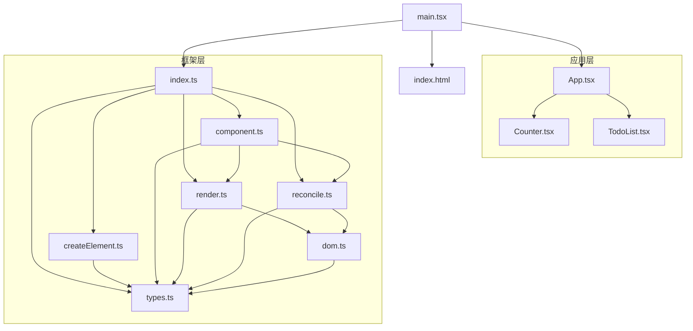
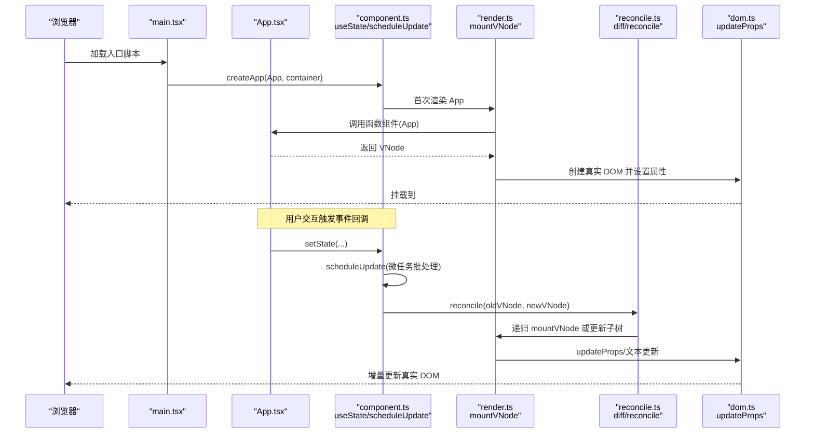
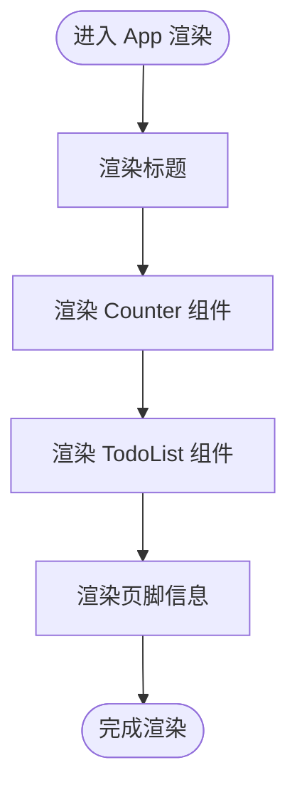
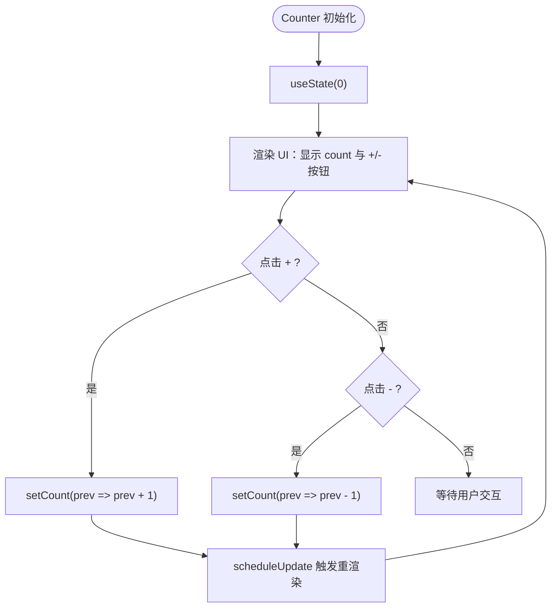
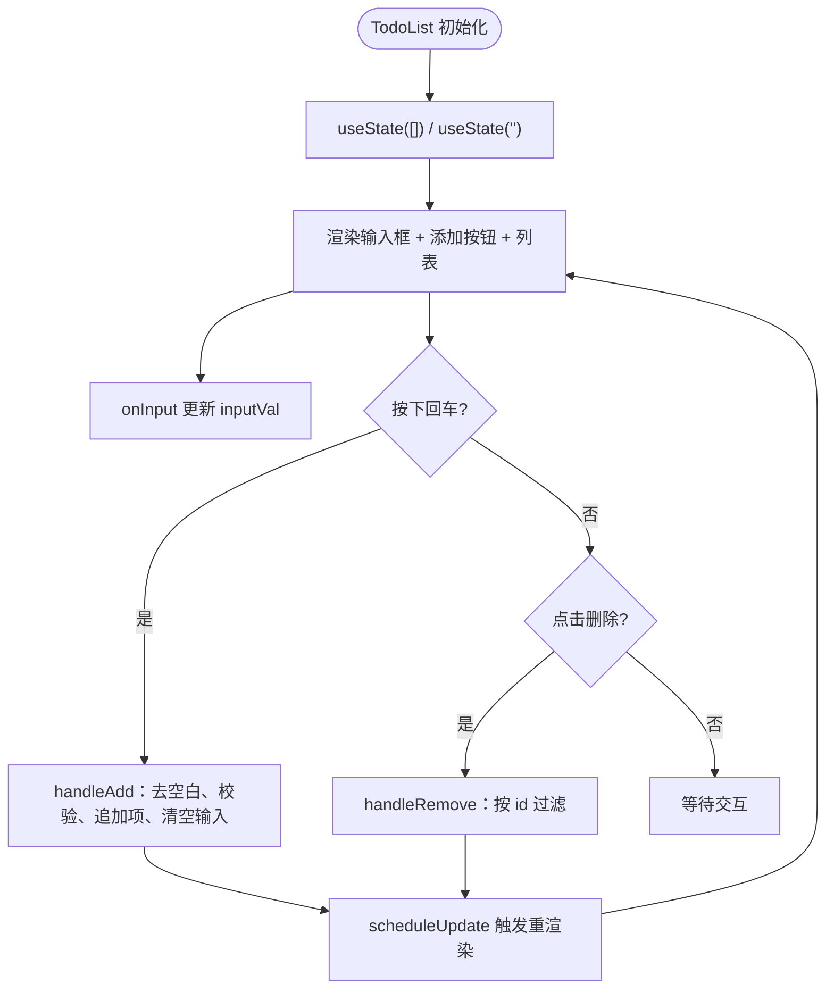
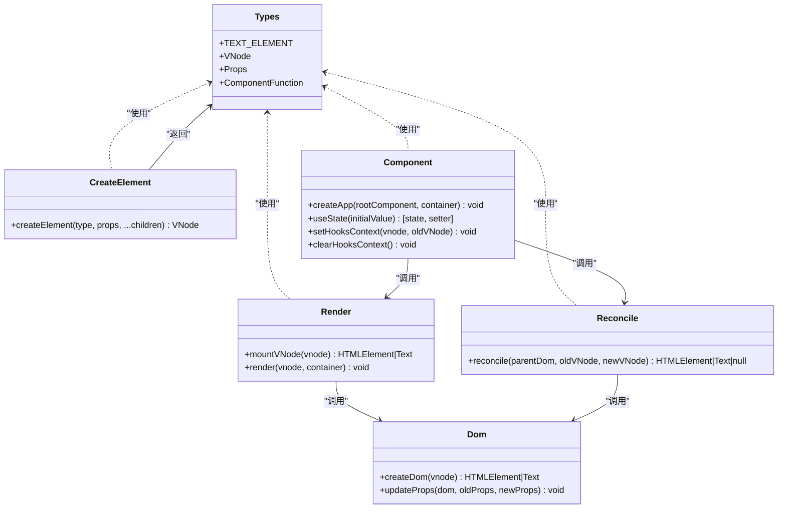
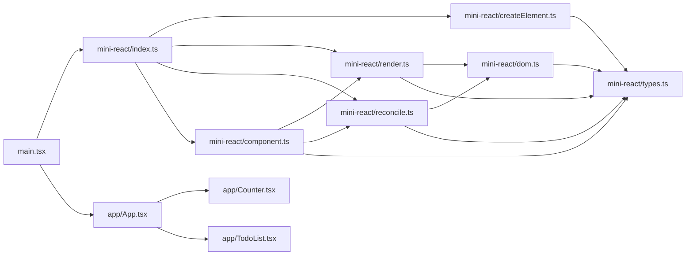

# 示例应用

<cite>
**本文引用的文件**
- [src/app/App.tsx](file://src/app/App.tsx)
- [src/app/Counter.tsx](file://src/app/Counter.tsx)
- [src/app/TodoList.tsx](file://src/app/TodoList.tsx)
- [src/main.tsx](file://src/main.tsx)
- [src/mini-react/index.ts](file://src/mini-react/index.ts)
- [src/mini-react/component.ts](file://src/mini-react/component.ts)
- [src/mini-react/createElement.ts](file://src/mini-react/createElement.ts)
- [src/mini-react/render.ts](file://src/mini-react/render.ts)
- [src/mini-react/reconcile.ts](file://src/mini-react/reconcile.ts)
- [src/mini-react/dom.ts](file://src/mini-react/dom.ts)
- [src/mini-react/types.ts](file://src/mini-react/types.ts)
- [index.html](file://index.html)
- [vite.config.ts](file://vite.config.ts)
- [package.json](file://package.json)
</cite>

## 目录
1. [简介](#简介)
2. [项目结构](#项目结构)
3. [核心组件](#核心组件)
4. [架构总览](#架构总览)
5. [详细组件分析](#详细组件分析)
6. [依赖关系分析](#依赖关系分析)
7. [性能考量](#性能考量)
8. [故障排查指南](#故障排查指南)
9. [结论](#结论)
10. [附录](#附录)

## 简介
本示例应用演示了一个轻量级 React 风格的前端框架实现，以及两个典型 UI 组件：计数器与待办事项列表。应用通过自定义的虚拟 DOM、调和算法与简单的状态钩子，展示了从组件创建、状态管理到视图更新的完整流程。读者可以基于该示例快速理解组件化、状态驱动与最小化 diff 的原理，并在此基础上扩展新的功能与组件。

## 项目结构
项目采用“应用层 + 自研 mini-react 框架”的分层组织：
- 应用层：src/app 下包含根组件与业务组件（App、Counter、TodoList）
- 框架层：src/mini-react 实现了虚拟 DOM、JSX 工厂、渲染与调和、DOM 属性更新、状态钩子等核心能力
- 入口与配置：src/main.tsx 作为应用入口；index.html 提供挂载容器；vite.config.ts 配置 JSX 编译；package.json 管理脚本与依赖

图表来源
- [src/main.tsx:1-6](file://src/main.tsx#L1-L6)
- [src/app/App.tsx:1-33](file://src/app/App.tsx#L1-L33)
- [src/app/Counter.tsx:1-52](file://src/app/Counter.tsx#L1-L52)
- [src/app/TodoList.tsx:1-113](file://src/app/TodoList.tsx#L1-L113)
- [src/mini-react/index.ts:1-12](file://src/mini-react/index.ts#L1-L12)
- [src/mini-react/component.ts:1-137](file://src/mini-react/component.ts#L1-L137)
- [src/mini-react/createElement.ts:1-58](file://src/mini-react/createElement.ts#L1-L58)
- [src/mini-react/render.ts:1-49](file://src/mini-react/render.ts#L1-L49)
- [src/mini-react/reconcile.ts:1-110](file://src/mini-react/reconcile.ts#L1-L110)
- [src/mini-react/dom.ts:1-97](file://src/mini-react/dom.ts#L1-L97)
- [src/mini-react/types.ts:1-26](file://src/mini-react/types.ts#L1-L26)
- [index.html:1-17](file://index.html#L1-L17)

章节来源
- [src/main.tsx:1-6](file://src/main.tsx#L1-L6)
- [src/app/App.tsx:1-33](file://src/app/App.tsx#L1-L33)
- [src/mini-react/index.ts:1-12](file://src/mini-react/index.ts#L1-L12)
- [index.html:1-17](file://index.html#L1-L17)

## 核心组件
本节聚焦三个核心文件：根组件 App.tsx、计数器组件 Counter.tsx、待办事项组件 TodoList.tsx。它们共同构成应用的 UI 结构与交互逻辑。

- 根组件 App.tsx
  - 负责页面布局与标题展示，承载子组件区域
  - 通过导入 Counter 与 TodoList 并在模板中渲染，形成两级组件树
  - 通过内联样式控制整体宽度、居中与页脚信息

- 计数器组件 Counter.tsx
  - 使用自定义 useState 钩子管理数值状态
  - 提供加减按钮，点击触发状态更新
  - 使用函数式组件风格，返回结构化的虚拟 DOM

- 待办事项组件 TodoList.tsx
  - 使用自定义 useState 钩子管理待办项数组与输入框值
  - 支持输入框回车提交、按钮点击添加、列表项删除
  - 通过 map 渲染列表项，使用 key 标识唯一性

章节来源
- [src/app/App.tsx:1-33](file://src/app/App.tsx#L1-L33)
- [src/app/Counter.tsx:1-52](file://src/app/Counter.tsx#L1-L52)
- [src/app/TodoList.tsx:1-113](file://src/app/TodoList.tsx#L1-L113)

## 架构总览
应用采用“自研 mini-react 框架 + 应用组件”的双层架构。框架层负责：
- JSX 工厂与虚拟 DOM 节点创建
- 首次渲染与增量调和
- DOM 属性与事件的高效更新
- 简单的状态钩子与调度机制

应用层负责：
- 组合业务组件，构建页面结构
- 通过事件回调驱动状态变更
- 以最小代价更新视图

图表来源
- [src/main.tsx:1-6](file://src/main.tsx#L1-L6)
- [src/mini-react/component.ts:99-136](file://src/mini-react/component.ts#L99-L136)
- [src/mini-react/render.ts:9-40](file://src/mini-react/render.ts#L9-L40)
- [src/mini-react/reconcile.ts:14-81](file://src/mini-react/reconcile.ts#L14-L81)
- [src/mini-react/dom.ts:19-53](file://src/mini-react/dom.ts#L19-L53)

## 详细组件分析

### 根组件 App.tsx 分析
- 组件职责
  - 页面级布局：标题、内容区、页脚
  - 子组件集成：引入并渲染 Counter 与 TodoList
  - 样式控制：统一的宽度、间距与颜色主题
- 数据与状态
  - 无内部状态，仅作为容器组件
- 交互设计
  - 通过子组件内部事件回调改变自身状态
- 可扩展性
  - 可继续引入更多业务组件，保持单一职责

图表来源
- [src/app/App.tsx:5-31](file://src/app/App.tsx#L5-L31)

章节来源
- [src/app/App.tsx:1-33](file://src/app/App.tsx#L1-L33)

### 计数器组件 Counter.tsx 分析
- 组件职责
  - 展示数值与加减操作
  - 通过 useState 管理本地状态
- 状态管理
  - 使用函数式 setter，接收上一状态并返回新状态
  - 保证并发更新时的正确性
- 事件处理
  - 点击事件绑定到按钮，触发状态更新
- 列表渲染
  - 无列表渲染需求
- 可扩展性
  - 可增加步长、清零、范围限制等功能

图表来源
- [src/app/Counter.tsx:4-51](file://src/app/Counter.tsx#L4-L51)
- [src/mini-react/component.ts:51-83](file://src/mini-react/component.ts#L51-L83)

章节来源
- [src/app/Counter.tsx:1-52](file://src/app/Counter.tsx#L1-L52)
- [src/mini-react/component.ts:34-83](file://src/mini-react/component.ts#L34-L83)

### 待办事项组件 TodoList.tsx 分析
- 组件职责
  - 输入新增、列表展示、单项删除
  - 统计总数
- 状态管理
  - todos：数组，保存 {id, text} 结构
  - inputVal：字符串，受控输入框值
- 事件处理
  - 输入框 onInput 更新 inputVal
  - 回车键触发新增
  - 删除按钮按 id 过滤移除
- 列表渲染
  - 条件渲染：空列表提示
  - 列表渲染：map 渲染 li，并使用 key 标识
- 可扩展性
  - 可增加编辑、完成状态、过滤、持久化等

图表来源
- [src/app/TodoList.tsx:11-112](file://src/app/TodoList.tsx#L11-L112)
- [src/mini-react/component.ts:51-83](file://src/mini-react/component.ts#L51-L83)

章节来源
- [src/app/TodoList.tsx:1-113](file://src/app/TodoList.tsx#L1-L113)
- [src/mini-react/component.ts:34-83](file://src/mini-react/component.ts#L34-L83)

### 框架层组件关系与职责
- 导出入口
  - index.ts 汇总导出 createElement、render、reconcile、createApp、useState 等
  - 同时提供默认 MiniReact 对象，便于 JSX 工厂使用
- 组件与状态
  - component.ts 实现 useState、createApp、调度更新 scheduleUpdate
  - 通过 hooks 上下文在渲染期间维护状态槽位
- 虚拟 DOM 与渲染
  - createElement.ts 规范化 children，生成 VNode
  - render.ts 递归挂载函数组件与原生元素
  - reconcile.ts 对比新旧 VNode，执行增量更新
- DOM 属性更新
  - dom.ts 负责事件监听、样式、类名、值等属性的增删改

图表来源
- [src/mini-react/types.ts:1-26](file://src/mini-react/types.ts#L1-L26)
- [src/mini-react/createElement.ts:9-25](file://src/mini-react/createElement.ts#L9-L25)
- [src/mini-react/render.ts:9-40](file://src/mini-react/render.ts#L9-L40)
- [src/mini-react/reconcile.ts:14-81](file://src/mini-react/reconcile.ts#L14-L81)
- [src/mini-react/dom.ts:6-53](file://src/mini-react/dom.ts#L6-L53)
- [src/mini-react/component.ts:1-137](file://src/mini-react/component.ts#L1-L137)

章节来源
- [src/mini-react/index.ts:1-12](file://src/mini-react/index.ts#L1-L12)
- [src/mini-react/types.ts:1-26](file://src/mini-react/types.ts#L1-L26)
- [src/mini-react/createElement.ts:1-58](file://src/mini-react/createElement.ts#L1-L58)
- [src/mini-react/render.ts:1-49](file://src/mini-react/render.ts#L1-L49)
- [src/mini-react/reconcile.ts:1-110](file://src/mini-react/reconcile.ts#L1-L110)
- [src/mini-react/dom.ts:1-97](file://src/mini-react/dom.ts#L1-L97)
- [src/mini-react/component.ts:1-137](file://src/mini-react/component.ts#L1-L137)

## 依赖关系分析
- 应用入口依赖框架导出的 createApp 与组件 App
- 组件内部依赖框架导出的 useState 与 JSX 工厂
- 框架内部模块之间存在清晰的职责边界：类型定义、VNode 创建、渲染、调和、DOM 更新、状态钩子
- 构建配置通过 Vite 的 oxc 插件启用 classic JSX，指定 JSX 工厂为 MiniReact.createElement

图表来源
- [src/main.tsx:1-6](file://src/main.tsx#L1-L6)
- [src/mini-react/index.ts:1-12](file://src/mini-react/index.ts#L1-L12)
- [src/app/App.tsx:1-3](file://src/app/App.tsx#L1-L3)
- [src/mini-react/types.ts:1-26](file://src/mini-react/types.ts#L1-L26)

章节来源
- [src/main.tsx:1-6](file://src/main.tsx#L1-L6)
- [src/mini-react/index.ts:1-12](file://src/mini-react/index.ts#L1-L12)
- [vite.config.ts:1-12](file://vite.config.ts#L1-L12)

## 性能考量
- 批处理更新
  - 框架通过微任务队列合并多次 setState，避免重复渲染
  - 适合高频交互场景（如连续点击）
- 增量调和
  - reconcile 仅对比新旧 VNode，减少 DOM 操作
  - 文本节点与同类型元素的属性更新采用最小化策略
- 列表渲染
  - 使用稳定 key（id）有助于 diff 精准定位，提升性能
- 样式与事件
  - 事件统一通过 addEventListener/removeEventListener 管理，避免重复绑定
  - 样式更新采用逐属性对比，减少不必要的重排

[本节为通用性能建议，无需特定文件引用]

## 故障排查指南
- 未在函数组件内调用 useState
  - 现象：抛出错误
  - 原因：useState 必须在函数组件渲染期间调用
  - 解决：确认调用位置与组件类型

- 事件未生效
  - 现象：点击无效
  - 排查：检查事件名大小写（onClick → click）、是否被覆盖
  - 解决：确保事件名以 on 开头且符合小驼峰规范

- 列表渲染错乱或闪烁
  - 现象：删除项导致其他项错位
  - 排查：是否提供稳定 key
  - 解决：为列表项提供唯一 key（如 id）

- 输入框无法受控
  - 现象：输入无效或值异常
  - 排查：onInput 是否同步更新状态；value 是否来自状态
  - 解决：确保受控输入框的双向绑定

章节来源
- [src/mini-react/component.ts:54-56](file://src/mini-react/component.ts#L54-L56)
- [src/mini-react/dom.ts:37-52](file://src/mini-react/dom.ts#L37-L52)
- [src/app/TodoList.tsx:39-46](file://src/app/TodoList.tsx#L39-L46)

## 结论
该示例应用以极简实现展示了现代前端框架的关键机制：虚拟 DOM、JSX 工厂、渲染与调和、状态钩子与调度。通过 App、Counter、TodoList 三个文件，读者可以快速掌握组件化思想、状态驱动与最小化更新的工程实践。框架层的设计具备良好的可扩展性，便于后续添加新功能与组件。

[本节为总结性内容，无需特定文件引用]

## 附录

### 使用示例与效果说明
- 运行与构建
  - 开发：执行开发服务器命令，自动热更新
  - 构建：打包生产资源
- 访问地址
  - 浏览器打开页面，根容器为 #root
- 效果示意
  - 根组件：页面标题、计数器区域、待办事项区域、页脚信息
  - 计数器：点击 + 或 - 更新数值
  - 待办事项：输入文本并回车或点击添加，列表展示；点击删除移除对应项；统计总数

章节来源
- [package.json:7-11](file://package.json#L7-L11)
- [index.html:12-14](file://index.html#L12-L14)

### 扩展性设计与最佳实践
- 添加新组件
  - 在 src/app 下新建组件文件，使用 useState 管理状态
  - 在 App 中引入并渲染
- 新增功能
  - 在现有组件中扩展事件与状态，遵循受控输入与稳定 key 的原则
- 调试技巧
  - 利用微任务批处理特性观察多次 setState 的合并效果
  - 通过最小化更新策略定位性能瓶颈
  - 使用稳定的 key 优化列表渲染

[本节为通用指导，无需特定文件引用]