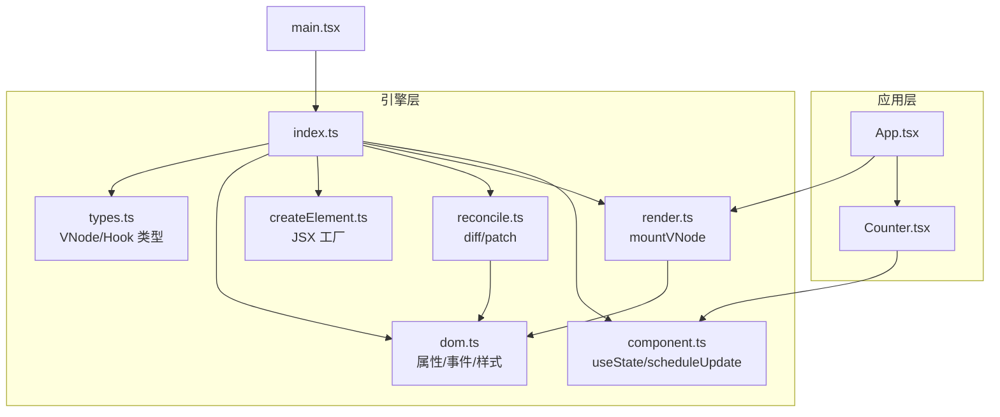
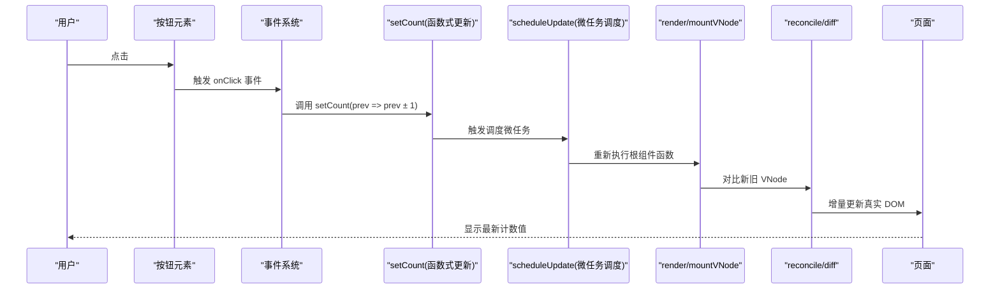
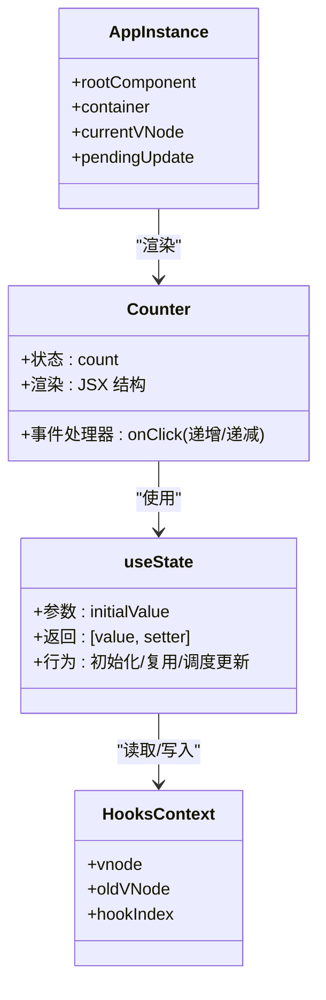
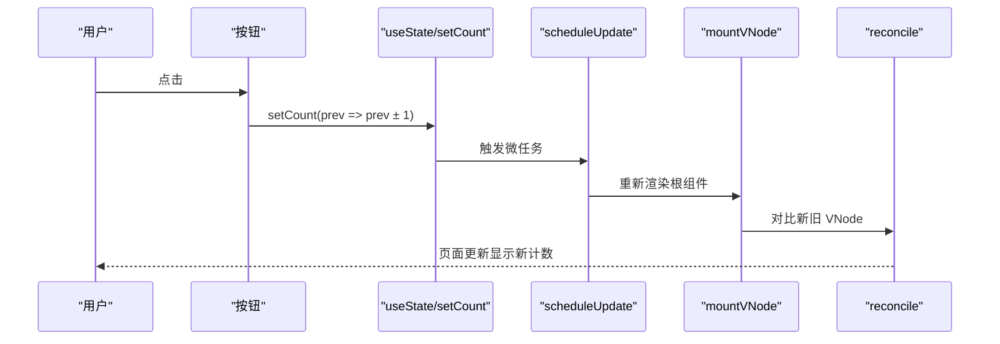
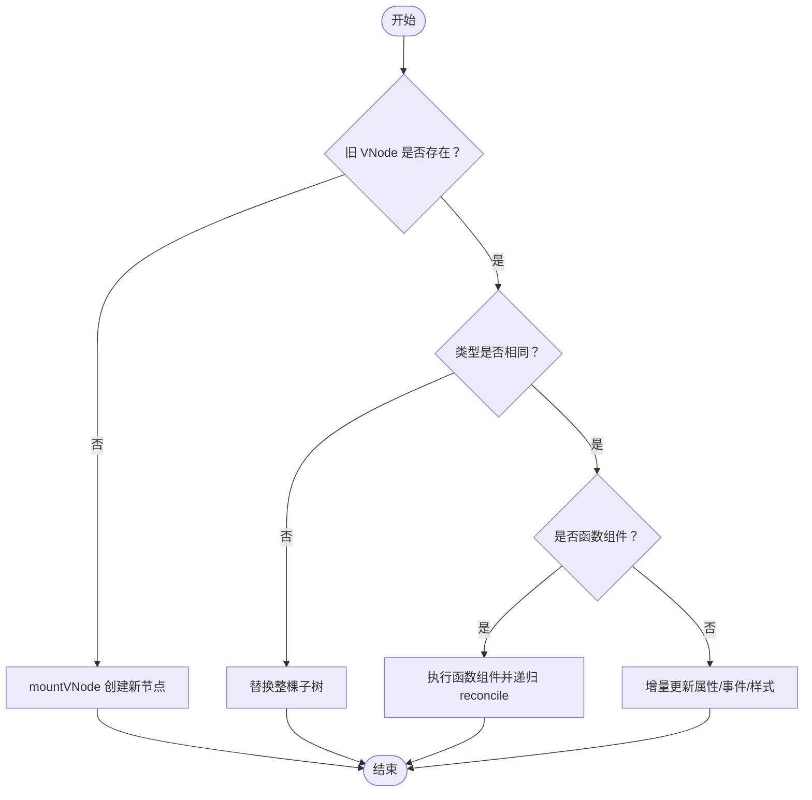
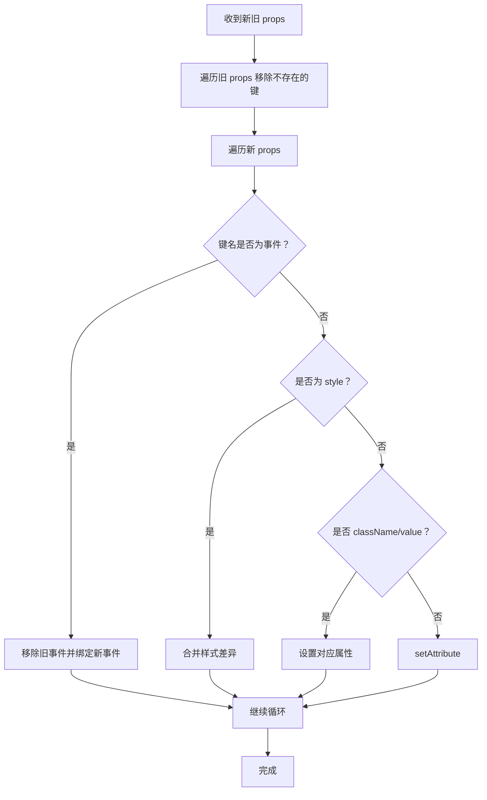
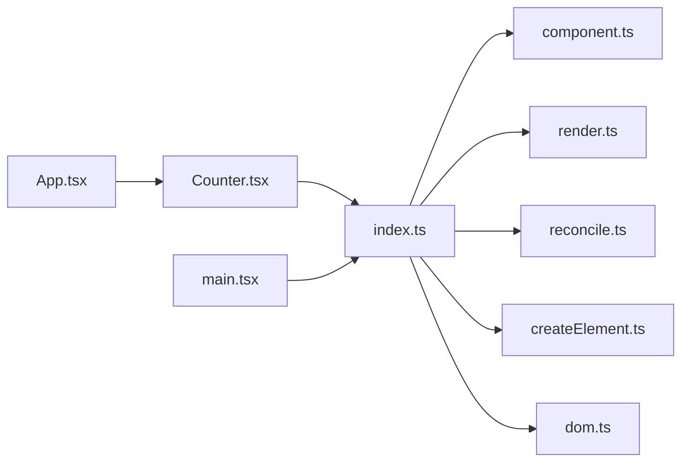

# 计数器组件

<cite>
**本文引用的文件**
- [Counter.tsx](file://src/app/Counter.tsx)
- [App.tsx](file://src/app/App.tsx)
- [main.tsx](file://src/main.tsx)
- [index.ts](file://src/mini-react/index.ts)
- [component.ts](file://src/mini-react/component.ts)
- [render.ts](file://src/mini-react/render.ts)
- [reconcile.ts](file://src/mini-react/reconcile.ts)
- [createElement.ts](file://src/mini-react/createElement.ts)
- [dom.ts](file://src/mini-react/dom.ts)
- [types.ts](file://src/mini-react/types.ts)
</cite>

## 目录
1. [简介](#简介)
2. [项目结构](#项目结构)
3. [核心组件](#核心组件)
4. [架构总览](#架构总览)
5. [详细组件分析](#详细组件分析)
6. [依赖关系分析](#依赖关系分析)
7. [性能考量](#性能考量)
8. [故障排查指南](#故障排查指南)
9. [结论](#结论)
10. [附录](#附录)

## 简介
本文件围绕计数器组件 Counter.tsx 的实现进行系统性解析，重点覆盖以下方面：
- 状态管理：useState Hook 的使用、状态更新逻辑与事件处理机制
- 交互流程：从用户点击按钮到状态更新再到重新渲染的完整过程
- 渲染与调度：虚拟 DOM、调和算法与批量更新策略
- 样式设计与用户体验：内联样式的组织与可访问性考虑
- 与父组件通信：当前实现为自包含组件，状态提升最佳实践建议
- 扩展方案：重置功能、步长控制等增强功能的设计思路
- 调试技巧：基于源码的定位与验证方法

## 项目结构
该项目采用“应用层 + 自研 mini-react 引擎”的分层架构：
- 应用层：src/app 下包含 App.tsx、Counter.tsx、TodoList.tsx 等业务组件
- 引擎层：src/mini-react 实现了虚拟 DOM、渲染、调和、事件绑定与 Hook 支持
- 入口：src/main.tsx 负责创建应用实例并挂载根组件

图表来源
- [main.tsx:1-6](file://src/main.tsx#L1-L6)
- [index.ts:1-12](file://src/mini-react/index.ts#L1-L12)
- [component.ts:1-137](file://src/mini-react/component.ts#L1-L137)
- [render.ts:1-49](file://src/mini-react/render.ts#L1-L49)
- [reconcile.ts:1-110](file://src/mini-react/reconcile.ts#L1-L110)
- [createElement.ts:1-58](file://src/mini-react/createElement.ts#L1-L58)
- [dom.ts:1-97](file://src/mini-react/dom.ts#L1-L97)
- [types.ts:1-26](file://src/mini-react/types.ts#L1-L26)

章节来源
- [main.tsx:1-6](file://src/main.tsx#L1-L6)
- [index.ts:1-12](file://src/mini-react/index.ts#L1-L12)

## 核心组件
本节聚焦 Counter.tsx 的状态管理与交互实现。

- 状态声明与初始化
  - 使用 useState 初始化计数状态，初始值为 0
  - 返回值为 [count, setCount]，其中 count 为当前值，setCount 为更新器

- 事件处理
  - 左侧按钮：点击触发 setCount(prev => prev - 1)，实现递减
  - 右侧按钮：点击触发 setCount(prev => prev + 1)，实现递增
  - 使用函数式更新器保证在并发场景下的正确性

- 渲染逻辑
  - 外层容器提供基础布局与阴影效果
  - 中间文本区域展示当前计数值，使用字符串转换以确保显示一致性
  - 两侧按钮具备基础样式与交互反馈

- 样式设计
  - 内联样式集中定义，便于组件自包含
  - 包含圆角、边框、背景色与阴影，提升视觉层次
  - 文字大小与间距统一，保证良好的可读性

- 用户体验
  - 按钮具备鼠标指针样式，提示可点击
  - 文本居中显示，便于快速识别当前值
  - 整体布局紧凑，减少视觉负担

章节来源
- [Counter.tsx:1-52](file://src/app/Counter.tsx#L1-L52)

## 架构总览
从用户交互到界面更新的完整链路如下：

图表来源
- [component.ts:72-83](file://src/mini-react/component.ts#L72-L83)
- [component.ts:122-136](file://src/mini-react/component.ts#L122-L136)
- [render.ts:9-40](file://src/mini-react/render.ts#L9-L40)
- [reconcile.ts:14-81](file://src/mini-react/reconcile.ts#L14-L81)
- [dom.ts:19-53](file://src/mini-react/dom.ts#L19-L53)

## 详细组件分析

### 组件类图（Counter.tsx 与 Hook 上下文）

图表来源
- [Counter.tsx:4-51](file://src/app/Counter.tsx#L4-L51)
- [component.ts:51-83](file://src/mini-react/component.ts#L51-L83)
- [component.ts:87-92](file://src/mini-react/component.ts#L87-L92)

章节来源
- [Counter.tsx:4-51](file://src/app/Counter.tsx#L4-L51)
- [component.ts:51-83](file://src/mini-react/component.ts#L51-L83)

### 交互流程与状态更新（序列图）

图表来源
- [Counter.tsx:19-47](file://src/app/Counter.tsx#L19-L47)
- [component.ts:72-83](file://src/mini-react/component.ts#L72-L83)
- [component.ts:122-136](file://src/mini-react/component.ts#L122-L136)
- [render.ts:9-18](file://src/mini-react/render.ts#L9-L18)
- [reconcile.ts:58-71](file://src/mini-react/reconcile.ts#L58-L71)

章节来源
- [Counter.tsx:19-47](file://src/app/Counter.tsx#L19-L47)
- [component.ts:72-83](file://src/mini-react/component.ts#L72-L83)
- [component.ts:122-136](file://src/mini-react/component.ts#L122-L136)
- [render.ts:9-18](file://src/mini-react/render.ts#L9-L18)
- [reconcile.ts:58-71](file://src/mini-react/reconcile.ts#L58-L71)

### 状态提升与父子通信（概念性说明）
- 当前 Counter.tsx 为自包含组件，内部维护自身状态
- 若需与父组件共享状态或跨组件同步计数，推荐“状态提升”：
  - 将计数状态上移到父组件（例如 App.tsx）
  - 通过 props 将当前计数值传递给 Counter
  - 通过回调函数（如 onIncrement/onDecrement）通知父组件更新
- 该模式有利于：
  - 统一数据源
  - 多处联动显示
  - 测试与调试更清晰

（本节为概念性内容，不直接分析具体文件）

### 渲染与调和（流程图）

图表来源
- [reconcile.ts:14-81](file://src/mini-react/reconcile.ts#L14-L81)
- [render.ts:9-40](file://src/mini-react/render.ts#L9-L40)
- [dom.ts:19-53](file://src/mini-react/dom.ts#L19-L53)

章节来源
- [reconcile.ts:14-81](file://src/mini-react/reconcile.ts#L14-L81)
- [render.ts:9-40](file://src/mini-react/render.ts#L9-L40)
- [dom.ts:19-53](file://src/mini-react/dom.ts#L19-L53)

### 事件绑定与属性更新（流程图）

图表来源
- [dom.ts:19-53](file://src/mini-react/dom.ts#L19-L53)

章节来源
- [dom.ts:19-53](file://src/mini-react/dom.ts#L19-L53)

## 依赖关系分析
- Counter.tsx 依赖 mini-react 的 useState 与默认导出的 createElement
- 引擎层通过 index.ts 汇总导出，main.tsx 通过 createApp 完成应用初始化
- 组件渲染与调和由 render.ts 与 reconcile.ts 协作完成
- DOM 属性与事件由 dom.ts 提供统一处理

图表来源
- [Counter.tsx:1-2](file://src/app/Counter.tsx#L1-L2)
- [index.ts:1-12](file://src/mini-react/index.ts#L1-L12)
- [main.tsx:1-3](file://src/main.tsx#L1-L3)

章节来源
- [Counter.tsx:1-2](file://src/app/Counter.tsx#L1-L2)
- [index.ts:1-12](file://src/mini-react/index.ts#L1-L12)
- [main.tsx:1-3](file://src/main.tsx#L1-L3)

## 性能考量
- 批量更新与微任务调度
  - setCount 通过 scheduleUpdate 在微任务队列中批量合并多次更新，避免频繁重渲染
  - 适合高频点击场景，降低主线程压力
- 函数式更新器
  - 使用 (prev => ...) 形式可确保读取到最新状态，避免闭包陷阱
- 调和策略
  - reconcile 仅对变更部分进行增量更新，减少不必要的 DOM 操作
- 样式内联
  - 内联样式在小组件中便于维护，但不利于缓存与复用；可在大型项目中考虑 CSS Modules 或 styled-components

（本节提供通用指导，不直接分析具体文件）

## 故障排查指南
- 常见问题与定位
  - “在函数组件外部调用 useState”
    - 现象：抛出错误
    - 原因：useState 必须在函数组件内部调用
    - 解决：确认调用位置在组件函数体内
    - 参考路径：[component.ts:54-56](file://src/mini-react/component.ts#L54-L56)
  - 点击无响应
    - 现象：按钮点击无效
    - 排查：检查 onClick 绑定是否正确，事件名大小写与命名规范
    - 参考路径：[dom.ts:89-96](file://src/mini-react/dom.ts#L89-L96)
  - 计数异常
    - 现象：计数不按预期变化
    - 排查：确认 setCount 使用函数式更新器，避免闭包导致的旧值
    - 参考路径：[Counter.tsx:20](file://src/app/Counter.tsx#L20)、[Counter.tsx:36](file://src/app/Counter.tsx#L36)
  - 渲染未更新
    - 现象：界面未反映最新状态
    - 排查：确认 scheduleUpdate 是否被触发；检查微任务队列是否被阻塞
    - 参考路径：[component.ts:122-136](file://src/mini-react/component.ts#L122-L136)
- 调试技巧
  - 在 setCount 内部打印当前状态与新值，验证函数式更新器是否生效
  - 在 reconcile 中打断点，观察新旧 VNode 的差异与 DOM 更新范围
  - 使用浏览器开发者工具的事件监听器面板，确认事件绑定是否成功

章节来源
- [component.ts:54-56](file://src/mini-react/component.ts#L54-L56)
- [dom.ts:89-96](file://src/mini-react/dom.ts#L89-L96)
- [Counter.tsx:20](file://src/app/Counter.tsx#L20)
- [Counter.tsx:36](file://src/app/Counter.tsx#L36)
- [component.ts:122-136](file://src/mini-react/component.ts#L122-L136)

## 结论
Counter.tsx 以简洁的函数式组件展示了状态管理与事件处理的核心模式。借助 mini-react 的 Hook、渲染与调和机制，实现了高效的增量更新与良好的用户体验。对于更复杂的业务场景，建议采用状态提升与回调通信的方式，以实现多组件间的协同与统一数据源。

（本节为总结性内容，不直接分析具体文件）

## 附录

### 扩展方案与最佳实践
- 添加重置功能
  - 在 Counter 中新增“重置”按钮，调用 setCount(0)
  - 或通过父组件暴露 reset 回调，子组件只负责触发
- 步长控制
  - 将固定 ±1 改为可配置步长，通过 props 传入
  - 在 setCount 中使用步长计算新值
- 边界保护
  - 限制最小/最大值，防止溢出或越界
  - 在 setCount 中加入边界判断
- 可访问性
  - 为按钮添加 aria-label，明确语义
  - 支持键盘操作（Enter/Space 触发）
- 性能优化
  - 对于复杂计算，使用 useMemo 缓存结果
  - 对高频事件使用防抖/节流

（本节为概念性内容，不直接分析具体文件）

### 使用方法与示例路径
- 在应用中引入并使用 Counter
  - 在 App.tsx 中渲染 <Counter />
  - 参考路径：[App.tsx:18](file://src/app/App.tsx#L18)
- 创建应用实例
  - 通过 createApp(App, container) 初始化
  - 参考路径：[main.tsx:5](file://src/main.tsx#L5)
- 导出与导入
  - 通过 index.ts 汇总导出 createApp、useState 等
  - 参考路径：[index.ts:1-12](file://src/mini-react/index.ts#L1-L12)

章节来源
- [App.tsx:18](file://src/app/App.tsx#L18)
- [main.tsx:5](file://src/main.tsx#L5)
- [index.ts:1-12](file://src/mini-react/index.ts#L1-L12)