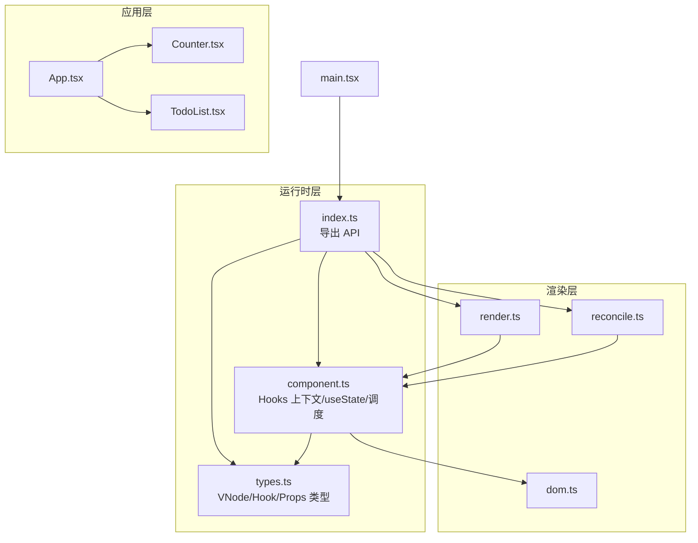
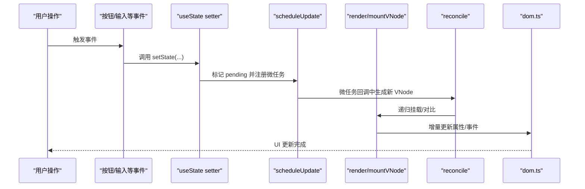
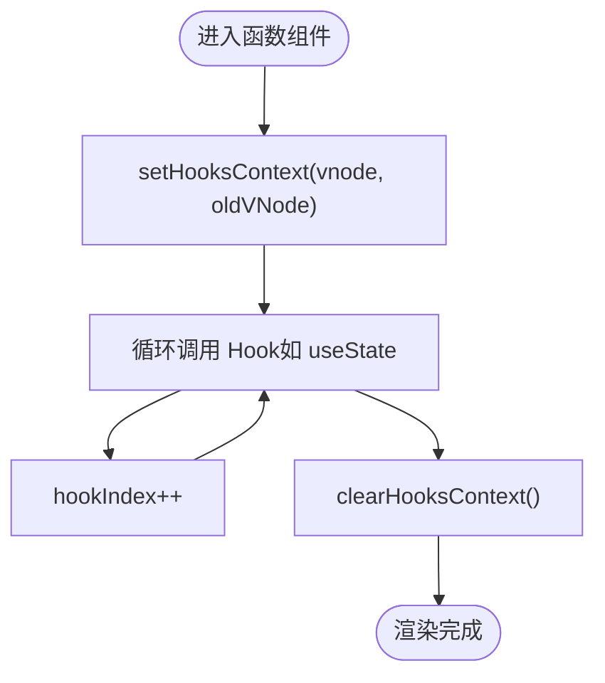
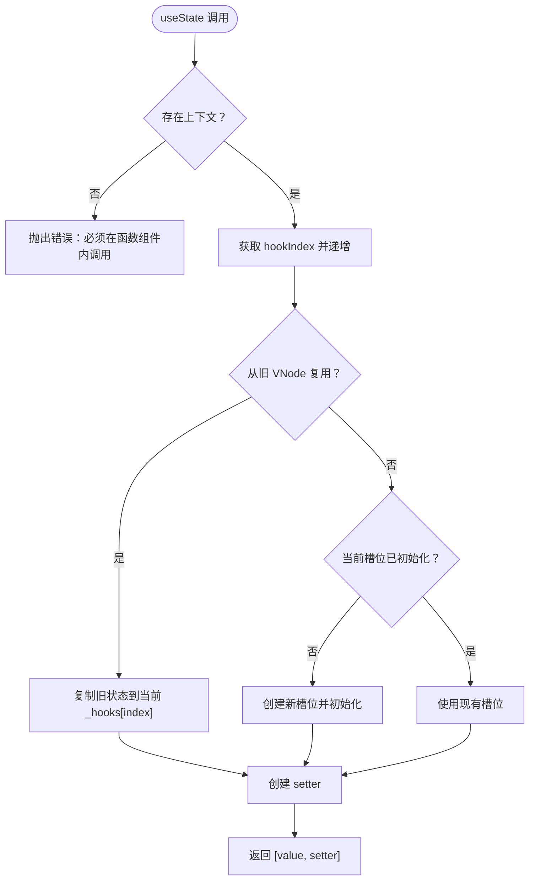
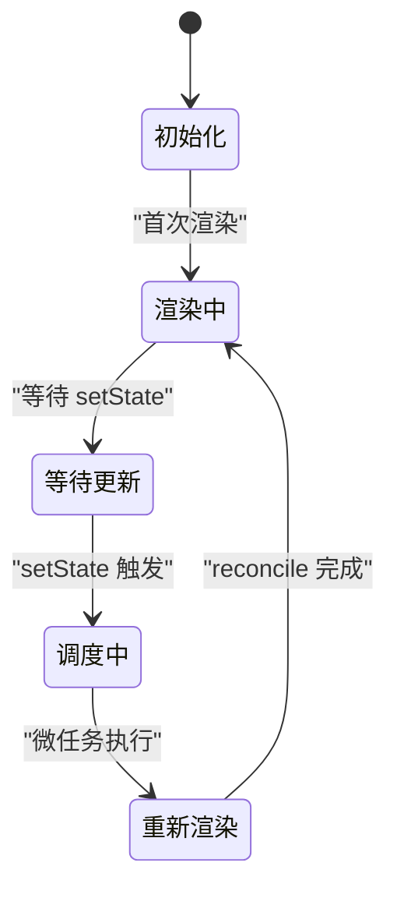
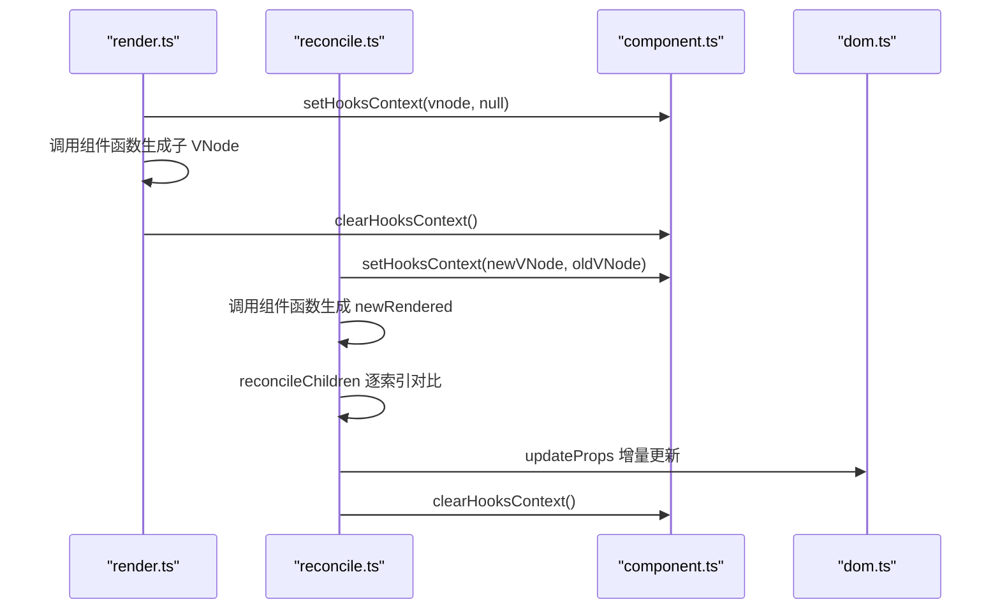
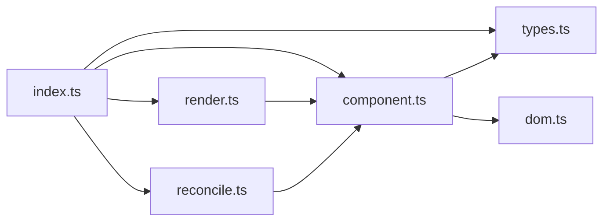

# Hook 系统设计

<cite>
**本文引用的文件**
- [src/mini-react/index.ts](file://src/mini-react/index.ts)
- [src/mini-react/component.ts](file://src/mini-react/component.ts)
- [src/mini-react/reconcile.ts](file://src/mini-react/reconcile.ts)
- [src/mini-react/render.ts](file://src/mini-react/render.ts)
- [src/mini-react/dom.ts](file://src/mini-react/dom.ts)
- [src/mini-react/types.ts](file://src/mini-react/types.ts)
- [src/app/App.tsx](file://src/app/App.tsx)
- [src/app/Counter.tsx](file://src/app/Counter.tsx)
- [src/app/TodoList.tsx](file://src/app/TodoList.tsx)
- [src/main.tsx](file://src/main.tsx)
</cite>

## 目录
1. [简介](#简介)
2. [项目结构](#项目结构)
3. [核心组件](#核心组件)
4. [架构总览](#架构总览)
5. [详细组件分析](#详细组件分析)
6. [依赖关系分析](#依赖关系分析)
7. [性能考量](#性能考量)
8. [故障排查指南](#故障排查指南)
9. [结论](#结论)
10. [附录](#附录)

## 简介
本文件围绕 mini-react 的 Hook 系统进行系统化技术文档梳理，重点阐述以下方面：
- Hook 的核心概念与设计理念：状态管理、副作用处理（本仓库以 useState 为主）、性能优化策略
- useState Hook 的完整实现：状态初始化、状态更新、状态复用机制
- Hook 执行上下文管理：hooks 上下文的设置、清除与状态保持
- Hook 索引机制与执行顺序：保证每次渲染中 Hook 的正确调用
- 生命周期管理：初始化、更新与清理流程
- 与渲染系统和协调算法的集成：与 render、reconcile 的协作
- 最佳实践：自定义 Hook 设计模式与性能优化策略
- 具体示例与使用场景：通过 Counter 与 TodoList 组件展示 Hook 的正确用法

## 项目结构
该项目采用“功能模块化 + 类型定义”的组织方式，核心目录与职责如下：
- src/mini-react：核心运行时与渲染管线
  - index.ts：导出 API（createElement、render、reconcile、createApp、useState 等）
  - component.ts：Hook 运行时（上下文、useState、调度）
  - render.ts：初次挂载与递归挂载
  - reconcile.ts：调和算法（对比新旧 VNode，增量更新 DOM）
  - dom.ts：DOM 属性增删改与事件绑定
  - types.ts：VNode、Hook、Props 等类型定义
- src/app：示例组件
  - App.tsx：应用根组件
  - Counter.tsx：演示 useState 的计数器
  - TodoList.tsx：演示多个 useState 的复杂交互
- src/main.tsx：应用入口，创建应用实例并挂载根组件

图表来源
- [src/mini-react/index.ts:1-12](file://src/mini-react/index.ts#L1-L12)
- [src/mini-react/component.ts:1-137](file://src/mini-react/component.ts#L1-L137)
- [src/mini-react/render.ts:1-49](file://src/mini-react/render.ts#L1-L49)
- [src/mini-react/reconcile.ts:1-110](file://src/mini-react/reconcile.ts#L1-L110)
- [src/mini-react/dom.ts:1-97](file://src/mini-react/dom.ts#L1-L97)
- [src/mini-react/types.ts:1-26](file://src/mini-react/types.ts#L1-L26)
- [src/app/App.tsx:1-33](file://src/app/App.tsx#L1-L33)
- [src/app/Counter.tsx:1-52](file://src/app/Counter.tsx#L1-L52)
- [src/app/TodoList.tsx:1-113](file://src/app/TodoList.tsx#L1-L113)
- [src/main.tsx:1-6](file://src/main.tsx#L1-L6)

章节来源
- [src/mini-react/index.ts:1-12](file://src/mini-react/index.ts#L1-L12)
- [src/mini-react/types.ts:1-26](file://src/mini-react/types.ts#L1-L26)
- [src/main.tsx:1-6](file://src/main.tsx#L1-L6)

## 核心组件
本节聚焦 Hook 系统的核心实现与数据结构，包括：
- Hooks 上下文（setHooksContext/clearHooksContext）
- useState Hook 的状态初始化、更新与复用
- 调度与批量更新（scheduleUpdate）
- 类型系统（VNode、Hook、Props）

要点：
- 每个函数组件 VNode 维护一个 _hooks 数组，按索引存储 Hook 状态
- 每次渲染开始时设置上下文，结束时清理；useState 通过游标递增保证顺序一致性
- 首次渲染初始化状态，后续渲染从旧 VNode 复用状态
- setState 通过微任务批量触发重新渲染，避免频繁更新

章节来源
- [src/mini-react/component.ts:7-32](file://src/mini-react/component.ts#L7-L32)
- [src/mini-react/component.ts:51-83](file://src/mini-react/component.ts#L51-L83)
- [src/mini-react/component.ts:122-136](file://src/mini-react/component.ts#L122-L136)
- [src/mini-react/types.ts:7-23](file://src/mini-react/types.ts#L7-L23)

## 架构总览
Hook 系统与渲染管线的协作关系如下：
- render.ts 在挂载函数组件时设置上下文，调用组件函数生成子 VNode，再递归挂载
- reconcile.ts 在对比新旧 VNode 时同样设置上下文，调用组件函数进行子树对比
- reconcileChildren 逐索引对比子节点，确保兄弟节点的 Hook 顺序一致
- component.ts 的 useState 读取/写入当前上下文中的状态槽位，setter 触发调度
- scheduleUpdate 通过微任务合并多次 setState，统一触发一次 reconcile

图表来源
- [src/mini-react/render.ts:9-40](file://src/mini-react/render.ts#L9-L40)
- [src/mini-react/reconcile.ts:14-81](file://src/mini-react/reconcile.ts#L14-L81)
- [src/mini-react/component.ts:122-136](file://src/mini-react/component.ts#L122-L136)
- [src/mini-react/dom.ts:19-53](file://src/mini-react/dom.ts#L19-L53)

## 详细组件分析

### Hooks 上下文与索引机制
- 上下文结构：包含当前 VNode、旧 VNode、hookIndex 游标
- 设置与清理：在函数组件渲染前后分别调用 setHooksContext/clearHooksContext
- 索引规则：每次调用 useState，hookIndex 自增，确保同一次渲染中 Hook 的顺序稳定
- 状态槽位：每个 VNode 的 _hooks 数组按索引存放 Hook 状态

图表来源
- [src/mini-react/component.ts:22-32](file://src/mini-react/component.ts#L22-L32)
- [src/mini-react/render.ts:11-18](file://src/mini-react/render.ts#L11-L18)
- [src/mini-react/reconcile.ts:60-66](file://src/mini-react/reconcile.ts#L60-L66)

章节来源
- [src/mini-react/component.ts:7-32](file://src/mini-react/component.ts#L7-L32)
- [src/mini-react/render.ts:11-18](file://src/mini-react/render.ts#L11-L18)
- [src/mini-react/reconcile.ts:60-66](file://src/mini-react/reconcile.ts#L60-L66)

### useState Hook 完整实现
- 初始化：若旧 VNode 无对应索引的状态，则以 initialValue 初始化；否则复用旧状态
- 读取：返回当前状态值
- 更新：支持函数式更新；内部将新值写入当前状态槽位，并触发调度
- 调度：通过微任务批量合并多次 setState，统一触发一次 reconcile

图表来源
- [src/mini-react/component.ts:51-83](file://src/mini-react/component.ts#L51-L83)

章节来源
- [src/mini-react/component.ts:51-83](file://src/mini-react/component.ts#L51-L83)

### 生命周期管理
- 初始化：首次渲染时，每个 useState 在当前 VNode 的 _hooks 中创建槽位并初始化
- 更新：setter 写入状态后，scheduleUpdate 注册微任务；微任务中生成新 VNode 并触发 reconcile
- 清理：render/reconcile 在渲染前后分别设置/清理上下文，避免跨组件状态污染

图表来源
- [src/mini-react/component.ts:122-136](file://src/mini-react/component.ts#L122-L136)
- [src/mini-react/render.ts:11-18](file://src/mini-react/render.ts#L11-L18)
- [src/mini-react/reconcile.ts:60-66](file://src/mini-react/reconcile.ts#L60-L66)

章节来源
- [src/mini-react/component.ts:122-136](file://src/mini-react/component.ts#L122-L136)
- [src/mini-react/render.ts:11-18](file://src/mini-react/render.ts#L11-L18)
- [src/mini-react/reconcile.ts:60-66](file://src/mini-react/reconcile.ts#L60-L66)

### 与渲染系统和协调算法的集成
- 初次渲染：render.ts 在挂载函数组件时设置上下文，调用组件函数生成子 VNode，再递归挂载
- 协调阶段：reconcile.ts 在对比新旧 VNode 时设置上下文，调用组件函数生成新的子 VNode，然后递归 reconcile 子节点
- 子节点对比：reconcileChildren 逐索引对比兄弟节点，确保兄弟节点的 Hook 顺序一致
- DOM 增量更新：dom.ts 增量更新属性、事件与样式，减少不必要的 DOM 操作

图表来源
- [src/mini-react/render.ts:11-18](file://src/mini-react/render.ts#L11-L18)
- [src/mini-react/reconcile.ts:58-71](file://src/mini-react/reconcile.ts#L58-L71)
- [src/mini-react/reconcile.ts:86-99](file://src/mini-react/reconcile.ts#L86-L99)
- [src/mini-react/dom.ts:19-53](file://src/mini-react/dom.ts#L19-L53)

章节来源
- [src/mini-react/render.ts:11-18](file://src/mini-react/render.ts#L11-L18)
- [src/mini-react/reconcile.ts:58-71](file://src/mini-react/reconcile.ts#L58-L71)
- [src/mini-react/reconcile.ts:86-99](file://src/mini-react/reconcile.ts#L86-L99)
- [src/mini-react/dom.ts:19-53](file://src/mini-react/dom.ts#L19-L53)

### 示例与使用场景
- 计数器（Counter）：演示单个 useState 的初始化与函数式更新
- 待办列表（TodoList）：演示多个 useState 的组合使用，包括数组状态与输入框双向绑定

章节来源
- [src/app/Counter.tsx:4-51](file://src/app/Counter.tsx#L4-L51)
- [src/app/TodoList.tsx:11-112](file://src/app/TodoList.tsx#L11-L112)

## 依赖关系分析
- 导出与入口
  - index.ts 导出 createElement、render、reconcile、createApp、useState 等 API，并默认导出 MiniReact
  - main.tsx 通过 createApp 创建应用实例并挂载根组件
- 运行时与渲染
  - component.ts 依赖 types.ts 的类型定义，提供 Hooks 上下文与 useState
  - render.ts 与 reconcile.ts 依赖 component.ts 的上下文管理与 DOM 工具
  - dom.ts 提供属性增删改与事件绑定能力
- 组件示例
  - Counter 与 TodoList 通过 useState 实现状态管理

图表来源
- [src/mini-react/index.ts:1-12](file://src/mini-react/index.ts#L1-L12)
- [src/mini-react/component.ts:1-4](file://src/mini-react/component.ts#L1-L4)
- [src/mini-react/render.ts:1-4](file://src/mini-react/render.ts#L1-L4)
- [src/mini-react/reconcile.ts:1-4](file://src/mini-react/reconcile.ts#L1-L4)
- [src/mini-react/dom.ts:1-2](file://src/mini-react/dom.ts#L1-L2)
- [src/mini-react/types.ts:1-4](file://src/mini-react/types.ts#L1-L4)

章节来源
- [src/mini-react/index.ts:1-12](file://src/mini-react/index.ts#L1-L12)
- [src/mini-react/component.ts:1-4](file://src/mini-react/component.ts#L1-L4)
- [src/mini-react/render.ts:1-4](file://src/mini-react/render.ts#L1-L4)
- [src/mini-react/reconcile.ts:1-4](file://src/mini-react/reconcile.ts#L1-L4)
- [src/mini-react/dom.ts:1-2](file://src/mini-react/dom.ts#L1-L2)
- [src/mini-react/types.ts:1-4](file://src/mini-react/types.ts#L1-L4)

## 性能考量
- 批处理更新：通过微任务队列合并多次 setState，减少重复渲染次数
- 增量更新：dom.ts 的属性增删改仅针对变更项，避免全量替换
- 索引驱动：useState 严格按索引访问状态槽位，避免额外查找开销
- 复用策略：reconcile 阶段优先复用旧 VNode 的 _hooks，降低初始化成本
- 子节点对比：reconcileChildren 逐索引对比，避免不必要的深度遍历

[本节为通用性能建议，无需特定文件引用]

## 故障排查指南
- 错误：在函数组件外调用 useState
  - 现象：抛出异常，提示必须在函数组件内调用
  - 排查：确认调用位置是否处于函数组件内部
  - 参考路径：[src/mini-react/component.ts:54-56](file://src/mini-react/component.ts#L54-L56)
- 症状：状态未更新或更新异常
  - 现象：点击按钮后 UI 未变化
  - 排查：确认 setter 是否被调用；检查是否使用了函数式更新；确认微任务是否执行
  - 参考路径：[src/mini-react/component.ts:73-80](file://src/mini-react/component.ts#L73-L80)
- 症状：兄弟节点 Hook 顺序错乱
  - 现象：不同兄弟节点共享了错误的状态
  - 排查：确保兄弟节点中 Hook 的调用顺序与数量一致；不要在条件分支中改变 Hook 调用顺序
  - 参考路径：[src/mini-react/render.ts:11-18](file://src/mini-react/render.ts#L11-L18), [src/mini-react/reconcile.ts:86-99](file://src/mini-react/reconcile.ts#L86-L99)
- 症状：事件未生效或重复绑定
  - 现象：点击无效或事件重复触发
  - 排查：检查事件属性命名（如 onClick）与 dom.ts 的事件处理逻辑
  - 参考路径：[src/mini-react/dom.ts:37-52](file://src/mini-react/dom.ts#L37-L52)

章节来源
- [src/mini-react/component.ts:54-56](file://src/mini-react/component.ts#L54-L56)
- [src/mini-react/component.ts:73-80](file://src/mini-react/component.ts#L73-L80)
- [src/mini-react/render.ts:11-18](file://src/mini-react/render.ts#L11-L18)
- [src/mini-react/reconcile.ts:86-99](file://src/mini-react/reconcile.ts#L86-L99)
- [src/mini-react/dom.ts:37-52](file://src/mini-react/dom.ts#L37-L52)

## 结论
本仓库实现了与 React useState 行为一致的 Hook 运行时，具备以下特点：
- 明确的执行上下文与索引机制，确保 Hook 调用顺序与状态槽位一一对应
- 通过微任务批处理与 VNode 复用，实现高效的更新与渲染
- 与渲染与协调算法紧密耦合，形成完整的前端框架骨架
- 示例组件清晰展示了单个与多个 useState 的典型用法

未来可扩展方向：
- 引入更多内置 Hook（如 useEffect、useMemo、useRef 等）
- 支持 Hook 的依赖追踪与自动跳过
- 增强错误边界与调试工具链

[本节为总结性内容，无需特定文件引用]

## 附录
- API 导出与入口
  - 入口：main.tsx 通过 createApp 挂载根组件
  - 导出：index.ts 暴露 createElement、render、reconcile、createApp、useState 等
- 类型系统
  - VNode：包含 type、props、children、key、_dom、_rendered、_hooks 等字段
  - Hook：最小化存储状态的对象
  - Props：通用属性记录

章节来源
- [src/main.tsx:1-6](file://src/main.tsx#L1-L6)
- [src/mini-react/index.ts:1-12](file://src/mini-react/index.ts#L1-L12)
- [src/mini-react/types.ts:7-23](file://src/mini-react/types.ts#L7-L23)