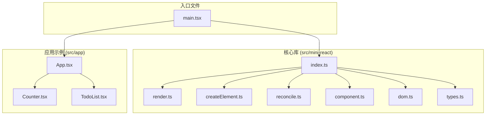
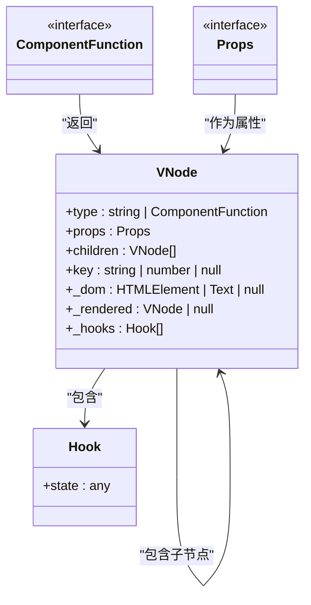
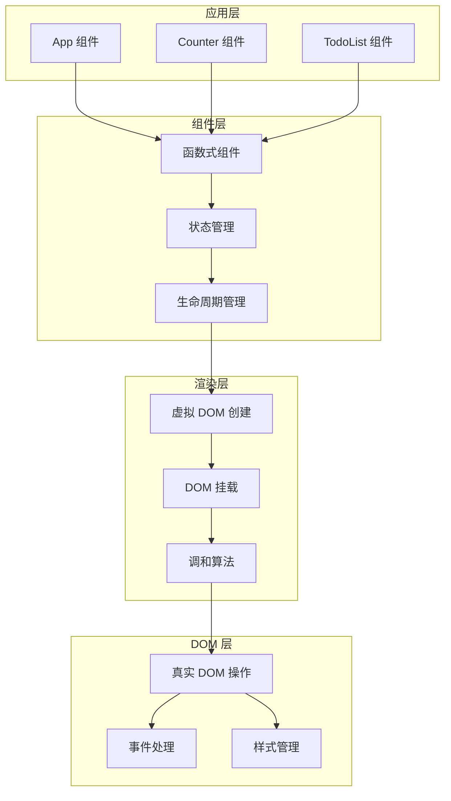
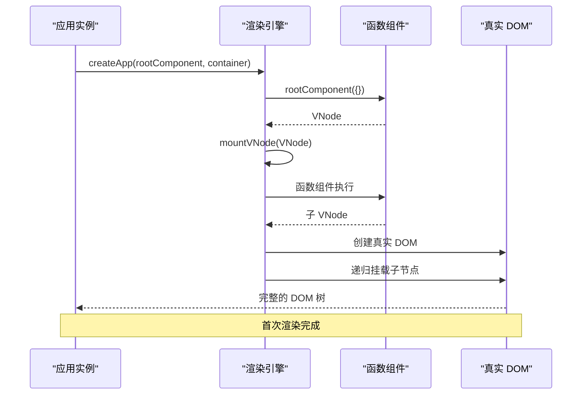
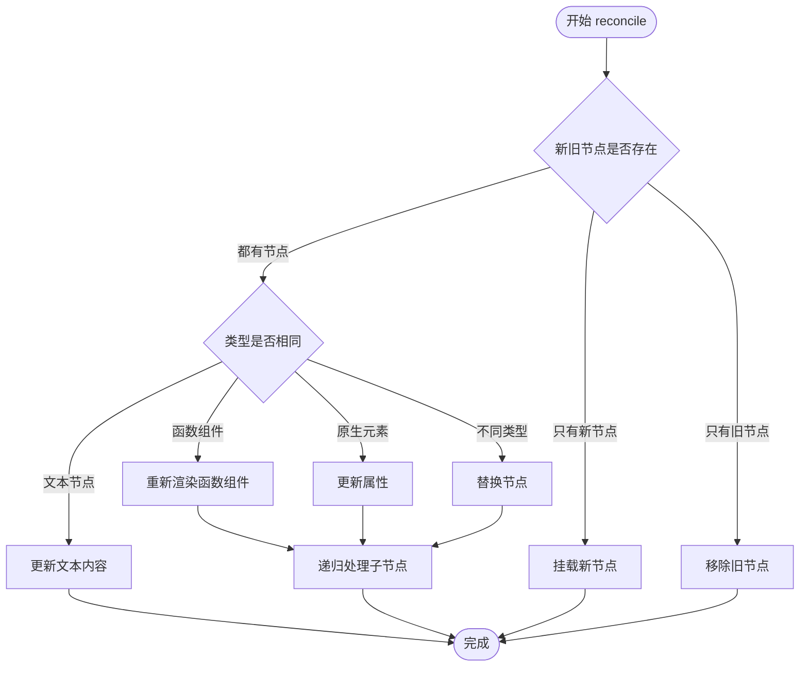
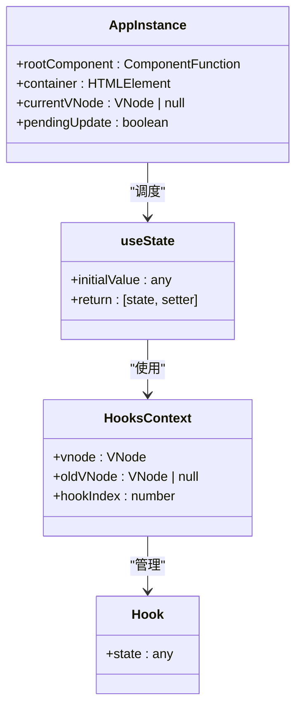
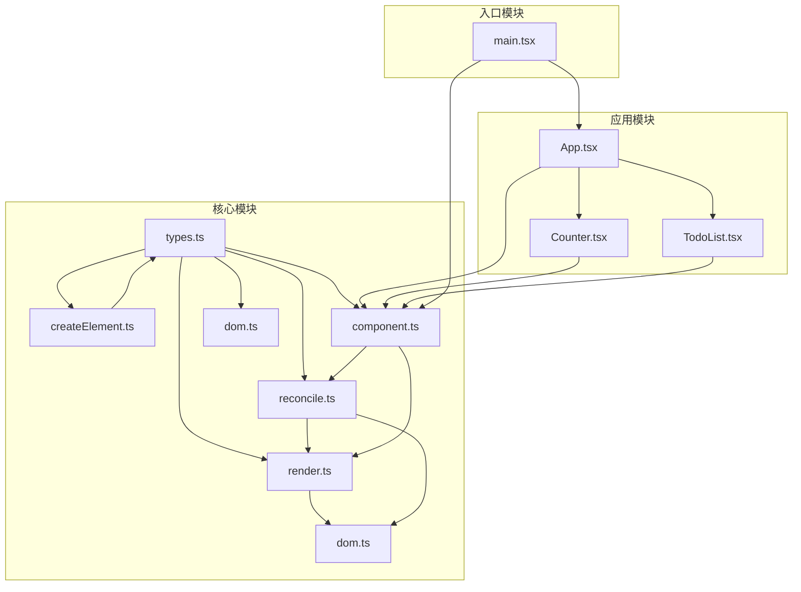

# 函数式组件实现

<cite>
**本文档引用的文件**
- [src/mini-react/index.ts](file://src/mini-react/index.ts)
- [src/mini-react/render.ts](file://src/mini-react/render.ts)
- [src/mini-react/createElement.ts](file://src/mini-react/createElement.ts)
- [src/mini-react/reconcile.ts](file://src/mini-react/reconcile.ts)
- [src/mini-react/component.ts](file://src/mini-react/component.ts)
- [src/mini-react/dom.ts](file://src/mini-react/dom.ts)
- [src/mini-react/types.ts](file://src/mini-react/types.ts)
- [src/app/App.tsx](file://src/app/App.tsx)
- [src/app/Counter.tsx](file://src/app/Counter.tsx)
- [src/app/TodoList.tsx](file://src/app/TodoList.tsx)
- [src/main.tsx](file://src/main.tsx)
</cite>

## 目录
1. [简介](#简介)
2. [项目结构](#项目结构)
3. [核心组件](#核心组件)
4. [架构概览](#架构概览)
5. [详细组件分析](#详细组件分析)
6. [依赖关系分析](#依赖关系分析)
7. [性能考虑](#性能考虑)
8. [故障排除指南](#故障排除指南)
9. [结论](#结论)

## 简介

这是一个基于 TypeScript 实现的轻量级函数式组件框架，模拟了现代前端框架（如 React）的核心概念。该实现展示了函数式组件的设计原理、虚拟 DOM 架构、调和算法以及状态管理机制。通过这个项目，开发者可以深入理解函数式组件的工作原理，包括组件渲染流程、生命周期管理和组件间组合模式。

## 项目结构

该项目采用模块化的文件组织方式，主要分为两个核心目录：

**图表来源**
- [src/mini-react/index.ts:1-12](file://src/mini-react/index.ts#L1-L12)
- [src/mini-react/render.ts:1-49](file://src/mini-react/render.ts#L1-L49)
- [src/mini-react/createElement.ts:1-58](file://src/mini-react/createElement.ts#L1-L58)
- [src/mini-react/reconcile.ts:1-110](file://src/mini-react/reconcile.ts#L1-L110)
- [src/mini-react/component.ts:1-137](file://src/mini-react/component.ts#L1-L137)
- [src/mini-react/dom.ts:1-97](file://src/mini-react/dom.ts#L1-L97)
- [src/mini-react/types.ts:1-26](file://src/mini-react/types.ts#L1-L26)
- [src/app/App.tsx:1-33](file://src/app/App.tsx#L1-L33)
- [src/app/Counter.tsx:1-52](file://src/app/Counter.tsx#L1-L52)
- [src/app/TodoList.tsx:1-113](file://src/app/TodoList.tsx#L1-L113)
- [src/main.tsx:1-6](file://src/main.tsx#L1-L6)

**章节来源**
- [src/mini-react/index.ts:1-12](file://src/mini-react/index.ts#L1-L12)
- [src/mini-react/types.ts:1-26](file://src/mini-react/types.ts#L1-L26)

## 核心组件

### 虚拟 DOM 类型系统

系统的核心是虚拟 DOM 类型定义，提供了统一的数据结构来描述组件树：

**图表来源**
- [src/mini-react/types.ts:7-26](file://src/mini-react/types.ts#L7-L26)

### 组件工厂函数

`createElement` 函数是 JSX 编译器的工厂函数，负责创建虚拟 DOM 节点：

**章节来源**
- [src/mini-react/createElement.ts:9-25](file://src/mini-react/createElement.ts#L9-L25)
- [src/mini-react/createElement.ts:33-48](file://src/mini-react/createElement.ts#L33-L48)

## 架构概览

该系统采用分层架构设计，从底层 DOM 操作到上层组件抽象形成了清晰的层次结构：

**图表来源**
- [src/mini-react/render.ts:9-40](file://src/mini-react/render.ts#L9-L40)
- [src/mini-react/reconcile.ts:14-81](file://src/mini-react/reconcile.ts#L14-L81)
- [src/mini-react/dom.ts:6-53](file://src/mini-react/dom.ts#L6-L53)

## 详细组件分析

### 函数式组件渲染流程

函数式组件的渲染过程是一个递归的虚拟 DOM 创建和挂载过程：

**图表来源**
- [src/mini-react/render.ts:9-40](file://src/mini-react/render.ts#L9-L40)
- [src/mini-react/component.ts:99-117](file://src/mini-react/component.ts#L99-L117)

### 调和算法实现

调和算法是该框架的核心，负责高效地更新 DOM：

**图表来源**
- [src/mini-react/reconcile.ts:14-81](file://src/mini-react/reconcile.ts#L14-L81)
- [src/mini-react/reconcile.ts:86-99](file://src/mini-react/reconcile.ts#L86-L99)

### 状态管理系统

框架实现了类似 React 的 useState Hook，支持函数式组件的状态管理：

**图表来源**
- [src/mini-react/component.ts:7-32](file://src/mini-react/component.ts#L7-L32)
- [src/mini-react/component.ts:51-83](file://src/mini-react/component.ts#L51-L83)
- [src/mini-react/component.ts:87-92](file://src/mini-react/component.ts#L87-L92)

**章节来源**
- [src/mini-react/component.ts:51-83](file://src/mini-react/component.ts#L51-L83)
- [src/mini-react/component.ts:122-136](file://src/mini-react/component.ts#L122-L136)

### DOM 操作优化

DOM 层实现了高效的属性更新和事件处理机制：

**章节来源**
- [src/mini-react/dom.ts:19-53](file://src/mini-react/dom.ts#L19-L53)
- [src/mini-react/dom.ts:67-86](file://src/mini-react/dom.ts#L67-L86)

## 依赖关系分析

系统各模块之间的依赖关系清晰明确，遵循单一职责原则：

**图表来源**
- [src/mini-react/index.ts:1-6](file://src/mini-react/index.ts#L1-L6)
- [src/mini-react/render.ts:1-4](file://src/mini-react/render.ts#L1-L4)
- [src/mini-react/reconcile.ts:1-4](file://src/mini-react/reconcile.ts#L1-L4)
- [src/mini-react/component.ts:1-4](file://src/mini-react/component.ts#L1-L4)

**章节来源**
- [src/mini-react/index.ts:1-6](file://src/mini-react/index.ts#L1-L6)

## 性能考虑

### 批处理更新机制

框架实现了微任务批处理机制，避免频繁的 DOM 更新：

**章节来源**
- [src/mini-react/component.ts:122-136](file://src/mini-react/component.ts#L122-L136)

### 虚拟 DOM 优化

通过虚拟 DOM 的 diff 算法，只更新发生变化的部分：

**章节来源**
- [src/mini-react/reconcile.ts:14-81](file://src/mini-react/reconcile.ts#L14-L81)

### 内存管理

每个函数组件维护独立的 hooks 状态数组，支持状态复用和清理：

**章节来源**
- [src/mini-react/types.ts:20-23](file://src/mini-react/types.ts#L20-L23)

## 故障排除指南

### 常见问题及解决方案

1. **useState 必须在函数组件内部调用**
   - 错误原因：在函数组件外部调用 useState
   - 解决方案：确保 useState 只在组件函数内部调用

2. **组件渲染异常**
   - 检查组件函数是否返回有效的 VNode
   - 确保 props 数据类型正确

3. **事件处理失效**
   - 检查事件名称格式（必须以 on 开头）
   - 确认事件处理器函数正确绑定

**章节来源**
- [src/mini-react/component.ts:54-56](file://src/mini-react/component.ts#L54-L56)

## 结论

这个函数式组件实现展示了现代前端框架的核心机制，包括：

- **简洁的 API 设计**：通过简单的函数式接口实现复杂的组件系统
- **高效的渲染机制**：虚拟 DOM + 调和算法确保最小化 DOM 操作
- **完善的生命周期管理**：支持组件的挂载、更新和卸载
- **灵活的状态管理**：Hook 系统提供类似 React 的状态管理模式

该实现为学习函数式编程和虚拟 DOM 技术提供了优秀的参考案例，适合开发者深入理解前端框架的工作原理。