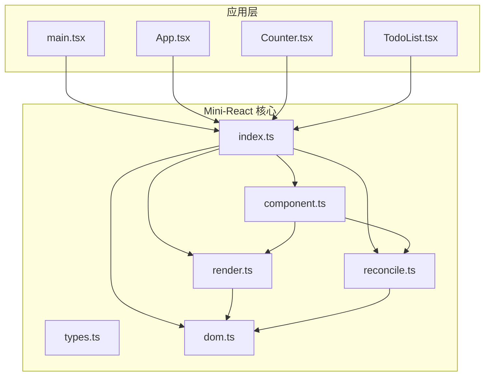
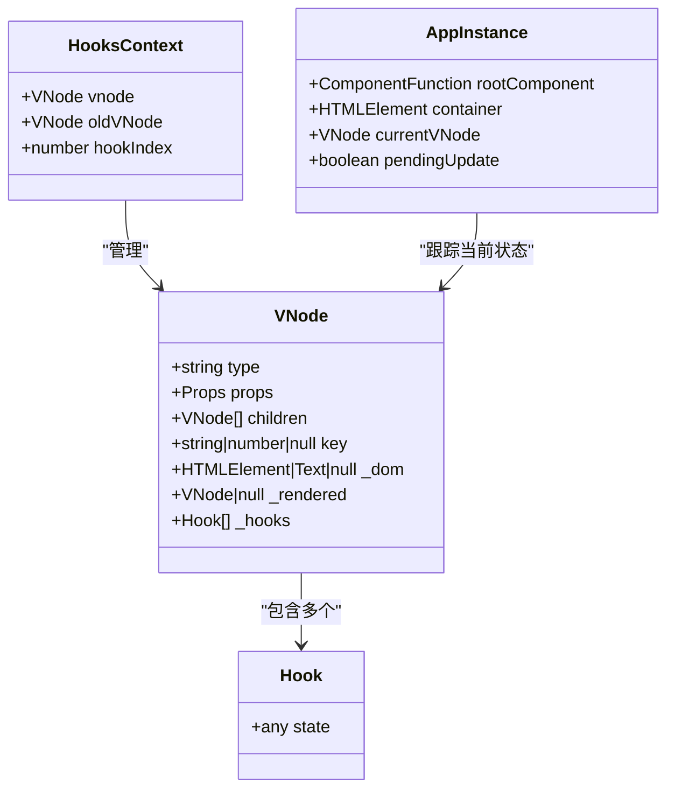
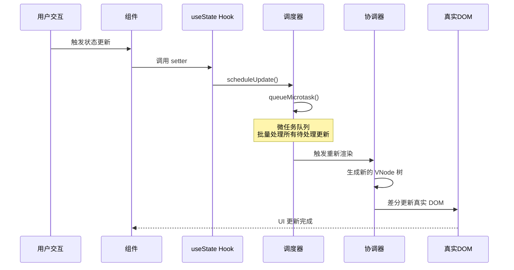
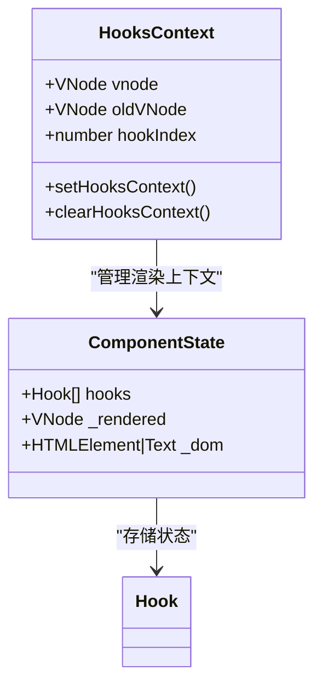
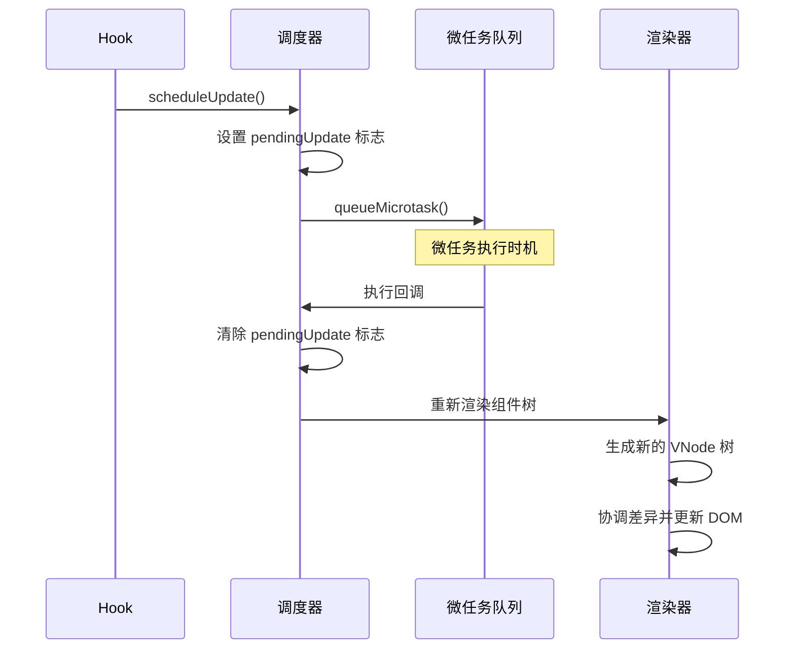
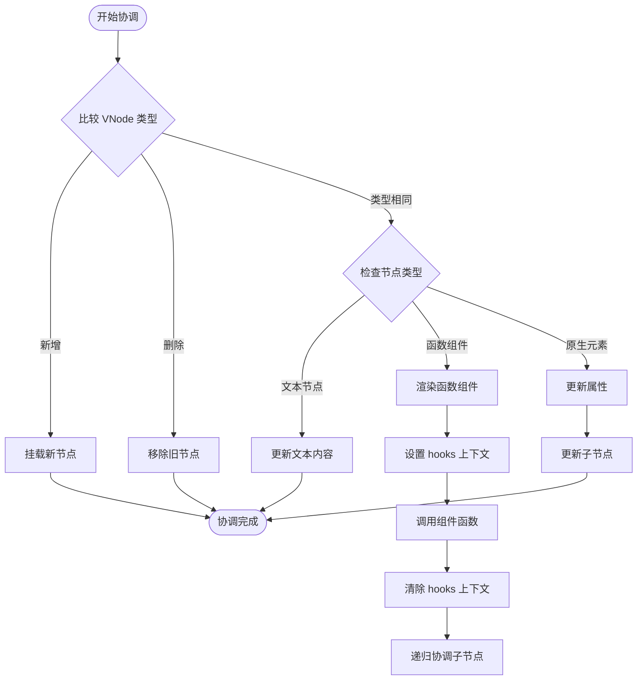
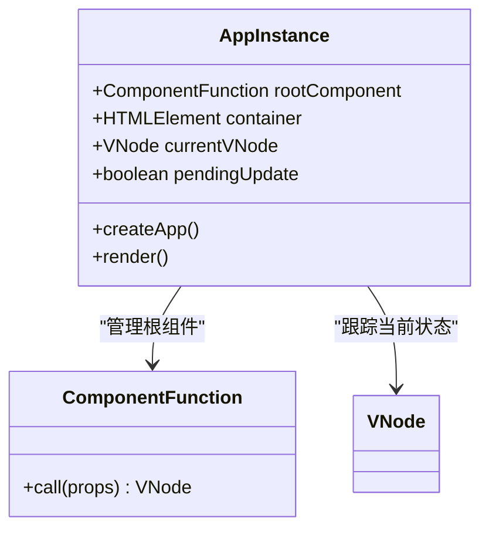
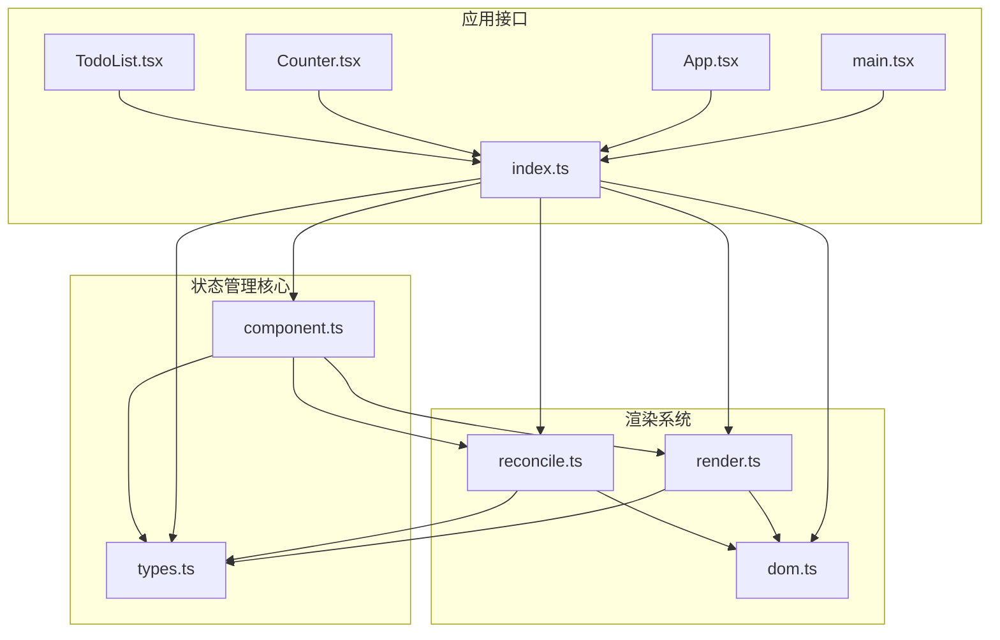

# 状态管理机制

<cite>
**本文档引用的文件**
- [reconcile.ts](file://src/mini-react/reconcile.ts)
- [render.ts](file://src/mini-react/render.ts)
- [component.ts](file://src/mini-react/component.ts)
- [dom.ts](file://src/mini-react/dom.ts)
- [types.ts](file://src/mini-react/types.ts)
- [index.ts](file://src/mini-react/index.ts)
- [main.tsx](file://src/main.tsx)
- [Counter.tsx](file://src/app/Counter.tsx)
- [TodoList.tsx](file://src/app/TodoList.tsx)
</cite>

## 目录
1. [简介](#简介)
2. [项目结构](#项目结构)
3. [核心组件](#核心组件)
4. [架构概览](#架构概览)
5. [详细组件分析](#详细组件分析)
6. [依赖关系分析](#依赖关系分析)
7. [性能考虑](#性能考虑)
8. [故障排除指南](#故障排除指南)
9. [结论](#结论)
10. [附录](#附录)

## 简介

本项目是一个简化版的 React 实现，专注于展示虚拟 DOM、协调算法和状态管理的核心机制。本文档深入分析了状态管理机制的实现原理，包括状态存储、状态更新和状态同步机制，详细解释了微任务队列的使用和批量更新策略，以及状态更新从触发到重新渲染的完整流程。

该实现提供了完整的函数式组件状态管理能力，包括 useState Hook 的完整实现，支持状态持久化和复用机制，以及高效的更新调度系统。

## 项目结构

项目采用模块化的架构设计，主要分为以下几个核心模块：



**图表来源**
- [index.ts:1-12](file://src/mini-react/index.ts#L1-L12)
- [main.tsx:1-6](file://src/main.tsx#L1-L6)

**章节来源**
- [index.ts:1-12](file://src/mini-react/index.ts#L1-L12)
- [main.tsx:1-6](file://src/main.tsx#L1-L6)

## 核心组件

### 状态管理核心架构

状态管理机制围绕以下核心组件构建：

1. **Hooks 上下文管理器** - 管理函数组件的渲染上下文
2. **useState Hook 实现** - 提供状态存储和更新功能
3. **调度系统** - 基于微任务的批量更新机制
4. **协调算法** - 状态变更后的 DOM 更新协调

### 数据结构设计

状态管理系统使用以下关键数据结构：



**图表来源**
- [types.ts:7-23](file://src/mini-react/types.ts#L7-L23)
- [component.ts:7-14](file://src/mini-react/component.ts#L7-L14)
- [component.ts:87-92](file://src/mini-react/component.ts#L87-L92)

**章节来源**
- [types.ts:1-26](file://src/mini-react/types.ts#L1-L26)
- [component.ts:1-137](file://src/mini-react/component.ts#L1-L137)

## 架构概览

状态管理的整体架构遵循 React 的设计理念，通过虚拟 DOM 和协调算法实现高效的状态更新：



**图表来源**
- [component.ts:122-136](file://src/mini-react/component.ts#L122-L136)
- [reconcile.ts:14-81](file://src/mini-react/reconcile.ts#L14-L81)

## 详细组件分析

### Hooks 上下文管理系统

Hooks 上下文管理系统是状态管理的核心基础设施，负责在函数组件渲染过程中维护状态信息。

#### 上下文结构



**图表来源**
- [component.ts:7-32](file://src/mini-react/component.ts#L7-L32)

#### 状态存储机制

每个函数组件的 VNode 对象维护一个 `_hooks` 数组来存储状态：

- **首次渲染**：初始化状态并存储在 `_hooks[index]`
- **后续渲染**：从旧 VNode 的 `_hooks` 数组中复用状态
- **状态持久化**：通过 `oldVNode._hooks[index]` 实现跨渲染的状态保持

**章节来源**
- [component.ts:22-32](file://src/mini-react/component.ts#L22-L32)
- [component.ts:63-67](file://src/mini-react/component.ts#L63-L67)

### useState Hook 实现详解

useState Hook 是状态管理的核心实现，提供了与 React 完全兼容的状态管理能力。

#### 状态初始化流程

```mermaid
flowchart TD
Start([调用 useState]) --> CheckContext{检查上下文}
CheckContext --> |无上下文| ThrowError[抛出错误]
CheckContext --> |有上下文| GetIndex[获取 hook 索引]
GetIndex --> CheckOldVNode{检查旧 VNode}
CheckOldVNode --> |存在且可复用| ReuseState[复用旧状态]
CheckOldVNode --> |不存在| InitState[初始化新状态]
ReuseState --> CreateSetter[创建 setter 函数]
InitState --> CreateSetter
CreateSetter --> ReturnTuple[返回 [value, setter]]
ThrowError --> End([结束])
ReturnTuple --> End
```

**图表来源**
- [component.ts:51-83](file://src/mini-react/component.ts#L51-L83)

#### 状态更新机制

状态更新通过以下步骤实现：

1. **状态捕获**：setter 函数捕获当前 hook 引用
2. **状态计算**：支持函数式更新 `(prev) => newValue`
3. **调度触发**：调用 `scheduleUpdate()` 触发批量更新
4. **微任务处理**：在微任务队列中统一处理所有更新

**章节来源**
- [component.ts:73-83](file://src/mini-react/component.ts#L73-L83)

### 调度系统与批量更新

调度系统是状态管理机制的关键组件，实现了基于微任务的批量更新策略。

#### 调度流程



**图表来源**
- [component.ts:122-136](file://src/mini-react/component.ts#L122-L136)

#### 批量更新策略

调度系统采用以下批量更新策略：

- **去重机制**：通过 `pendingUpdate` 标志避免重复调度
- **微任务合并**：所有状态更新在单个微任务中处理
- **统一渲染**：批量更新后进行一次完整的重新渲染

**章节来源**
- [component.ts:122-136](file://src/mini-react/component.ts#L122-L136)

### 协调算法与状态同步

协调算法负责将状态变更转换为 DOM 更新，确保 UI 与状态保持同步。

#### 协调流程



**图表来源**
- [reconcile.ts:14-81](file://src/mini-react/reconcile.ts#L14-L81)

#### 状态同步机制

状态同步通过以下机制实现：

- **函数组件状态**：通过 `setHooksContext` 和 `clearHooksContext` 在渲染期间传递
- **属性更新**：使用 `updateProps` 函数精确更新 DOM 属性
- **子节点协调**：递归协调子节点树，确保层级状态正确传递

**章节来源**
- [reconcile.ts:58-71](file://src/mini-react/reconcile.ts#L58-L71)
- [dom.ts:19-53](file://src/mini-react/dom.ts#L19-L53)

### 应用实例管理

应用实例管理器负责整个应用的生命周期管理，包括首次渲染和后续更新。

#### 应用实例结构



**图表来源**
- [component.ts:87-117](file://src/mini-react/component.ts#L87-L117)

#### 首次渲染流程

应用实例的首次渲染包含以下步骤：

1. **创建实例**：初始化应用实例状态
2. **生成 VNode**：调用根组件函数生成虚拟 DOM
3. **挂载 DOM**：将 VNode 挂载为真实 DOM
4. **初始化完成**：应用进入正常更新模式

**章节来源**
- [component.ts:99-117](file://src/mini-react/component.ts#L99-L117)

## 依赖关系分析

状态管理机制的依赖关系体现了清晰的模块化设计：



**图表来源**
- [index.ts:1-6](file://src/mini-react/index.ts#L1-L6)
- [component.ts:1-4](file://src/mini-react/component.ts#L1-L4)

**章节来源**
- [index.ts:1-12](file://src/mini-react/index.ts#L1-L12)
- [component.ts:1-4](file://src/mini-react/component.ts#L1-L4)

## 性能考虑

状态管理机制在设计时充分考虑了性能优化：

### 状态缓存与复用

- **状态持久化**：通过 `oldVNode._hooks` 实现状态跨渲染持久化
- **索引映射**：基于 hook 调用顺序的稳定索引映射
- **内存优化**：避免不必要的状态对象创建

### 更新去重技术

- **调度去重**：`pendingUpdate` 标志防止重复调度
- **微任务批处理**：合并多次状态更新为单次渲染
- **属性增量更新**：仅更新发生变化的 DOM 属性

### 渲染优化策略

- **最小化 DOM 操作**：通过协调算法减少真实 DOM 更新
- **文本节点优化**：直接更新 `nodeValue` 而非重建节点
- **事件委托**：统一的事件处理机制

## 故障排除指南

### 常见问题与解决方案

#### useState 使用错误

**问题**：在非函数组件环境中调用 `useState`

**解决方案**：
- 确保在函数组件内部调用 `useState`
- 检查组件是否正确声明为函数组件

**章节来源**
- [component.ts:54-56](file://src/mini-react/component.ts#L54-L56)

#### 状态更新不生效

**问题**：状态更新后 UI 未刷新

**解决方案**：
- 确认状态更新通过 `useState` 返回的 setter 函数
- 检查是否有多个状态更新被正确批处理
- 验证组件是否正确重新渲染

#### 性能问题

**问题**：频繁状态更新导致性能下降

**解决方案**：
- 使用函数式更新 `(prev) => newValue`
- 避免在同一事件循环中触发过多状态更新
- 考虑使用 `useMemo` 或 `useCallback` 进行优化

## 结论

本状态管理机制实现了 React 核心理念的简化版本，通过以下关键技术实现了高效的状态管理：

1. **基于 Hook 的状态管理**：提供与 React 兼容的状态管理 API
2. **微任务调度系统**：实现批量更新和性能优化
3. **虚拟 DOM 协调算法**：确保 UI 与状态的准确同步
4. **状态持久化机制**：通过 VNode 复用实现状态保持

该实现展示了现代前端框架的核心机制，为理解复杂框架的状态管理提供了清晰的学习路径。

## 附录

### 最佳实践指南

#### 状态设计原则

1. **单一职责**：每个状态变量只负责单一功能领域
2. **状态提升**：共享状态应提升到最近的共同祖先组件
3. **不可变性**：优先使用不可变更新模式

#### 更新策略

1. **批量更新**：利用微任务机制进行批量状态更新
2. **函数式更新**：使用 `(prev) => newValue` 形式确保状态一致性
3. **条件更新**：在 setter 中添加必要的条件判断

#### 性能优化技巧

1. **避免过度渲染**：合理组织组件结构，减少不必要的重新渲染
2. **状态分片**：将大对象状态分解为更小的独立状态
3. **记忆化**：对昂贵的计算结果进行缓存

### 使用示例

#### 计数器组件示例

计数器组件展示了基本的状态管理用法：

- 使用 `useState(0)` 初始化状态
- 通过 `setCount` 更新状态
- 支持函数式更新模式

#### 待办事项组件示例

待办事项组件展示了复杂状态管理：

- 管理数组状态
- 实现添加和删除操作
- 使用函数式更新处理数组操作

这些示例展示了状态管理机制在实际应用中的各种使用场景和最佳实践。