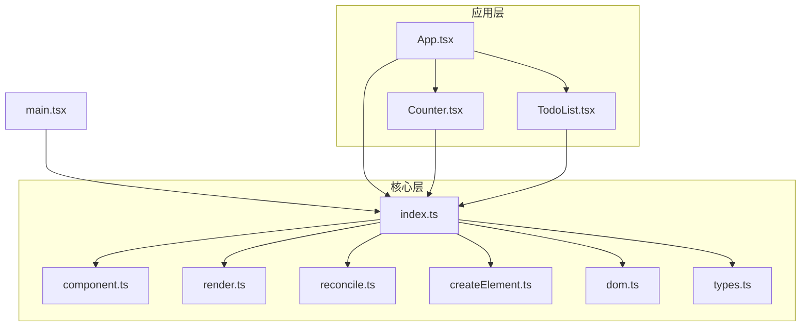
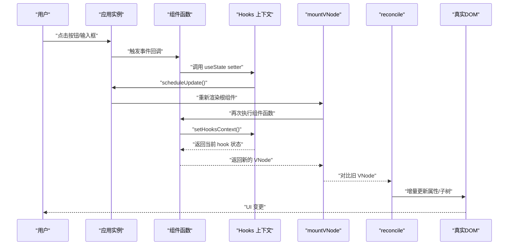
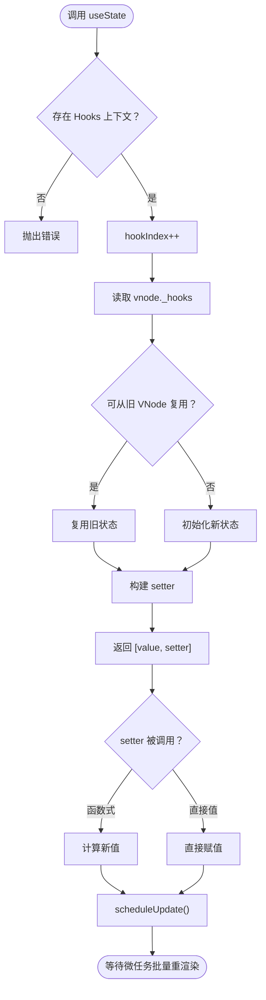
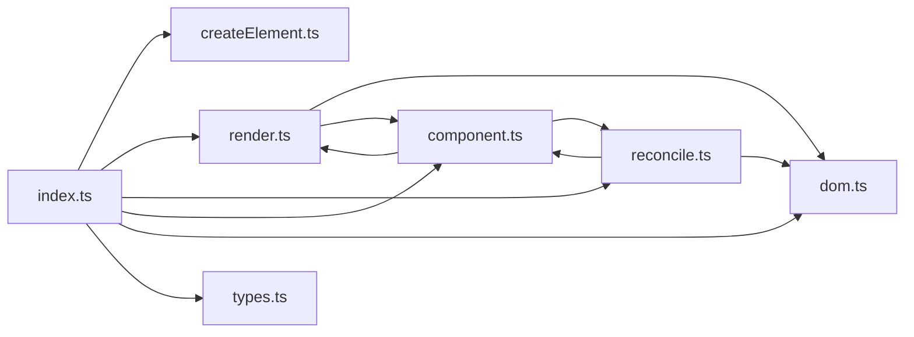

# 组件系统

<cite>
**本文引用的文件**
- [src/mini-react/index.ts](file://src/mini-react/index.ts)
- [src/mini-react/component.ts](file://src/mini-react/component.ts)
- [src/mini-react/reconcile.ts](file://src/mini-react/reconcile.ts)
- [src/mini-react/render.ts](file://src/mini-react/render.ts)
- [src/mini-react/createElement.ts](file://src/mini-react/createElement.ts)
- [src/mini-react/dom.ts](file://src/mini-react/dom.ts)
- [src/mini-react/types.ts](file://src/mini-react/types.ts)
- [src/app/App.tsx](file://src/app/App.tsx)
- [src/app/Counter.tsx](file://src/app/Counter.tsx)
- [src/app/TodoList.tsx](file://src/app/TodoList.tsx)
- [src/main.tsx](file://src/main.tsx)
</cite>

## 目录
1. [简介](#简介)
2. [项目结构](#项目结构)
3. [核心组件](#核心组件)
4. [架构总览](#架构总览)
5. [详细组件分析](#详细组件分析)
6. [依赖关系分析](#依赖关系分析)
7. [性能考量](#性能考量)
8. [故障排查指南](#故障排查指南)
9. [结论](#结论)
10. [附录](#附录)

## 简介
本项目是一个轻量级的函数式组件与 Hook 系统实现，采用虚拟 DOM + 调和（diff/reconcile）算法，提供与 React 类似的函数组件与 useState Hook 能力。系统通过 JSX 工厂函数创建 VNode，通过 mountVNode 与 reconcile 实现首次挂载与增量更新，通过调度器批量合并状态更新，保证渲染性能与一致性。

## 项目结构
- mini-react 核心层：负责 VNode 定义、JSX 工厂、DOM 操作、渲染与调和、Hook 上下文与调度。
- app 示例层：提供 Counter 与 TodoList 两个函数式组件示例，演示 useState 的使用与 props 传递。
- 入口层：main.tsx 通过 createApp 初始化应用并挂载根组件。

图表来源
- [src/main.tsx:1-6](file://src/main.tsx#L1-L6)
- [src/mini-react/index.ts:1-12](file://src/mini-react/index.ts#L1-L12)
- [src/mini-react/component.ts:1-137](file://src/mini-react/component.ts#L1-L137)
- [src/mini-react/render.ts:1-49](file://src/mini-react/render.ts#L1-L49)
- [src/mini-react/reconcile.ts:1-110](file://src/mini-react/reconcile.ts#L1-L110)
- [src/mini-react/createElement.ts:1-58](file://src/mini-react/createElement.ts#L1-L58)
- [src/mini-react/dom.ts:1-97](file://src/mini-react/dom.ts#L1-L97)
- [src/mini-react/types.ts:1-26](file://src/mini-react/types.ts#L1-L26)
- [src/app/App.tsx:1-33](file://src/app/App.tsx#L1-L33)
- [src/app/Counter.tsx:1-52](file://src/app/Counter.tsx#L1-L52)
- [src/app/TodoList.tsx:1-113](file://src/app/TodoList.tsx#L1-L113)

章节来源
- [src/main.tsx:1-6](file://src/main.tsx#L1-L6)
- [src/mini-react/index.ts:1-12](file://src/mini-react/index.ts#L1-L12)

## 核心组件
- VNode 类型与常量：定义虚拟节点结构、文本节点标识与组件函数类型，支撑整套渲染与调和逻辑。
- JSX 工厂：将 JSX 转换为 VNode，规范化 children，支持 key、事件等属性。
- DOM 操作：创建真实 DOM、增量更新属性（含事件绑定/解绑）、样式与 className 处理。
- 渲染与挂载：mountVNode 递归挂载 VNode 树；render 首次挂载入口。
- 调和算法：对比新旧 VNode，按需新增、删除、替换、更新属性与子节点。
- Hook 系统：useState 实现、Hooks 上下文管理、调度器合并多次更新。
- 应用实例：createApp 初始化应用、记录当前 VNode、触发调度与调和。

章节来源
- [src/mini-react/types.ts:1-26](file://src/mini-react/types.ts#L1-L26)
- [src/mini-react/createElement.ts:1-58](file://src/mini-react/createElement.ts#L1-L58)
- [src/mini-react/dom.ts:1-97](file://src/mini-react/dom.ts#L1-L97)
- [src/mini-react/render.ts:1-49](file://src/mini-react/render.ts#L1-L49)
- [src/mini-react/reconcile.ts:1-110](file://src/mini-react/reconcile.ts#L1-L110)
- [src/mini-react/component.ts:1-137](file://src/mini-react/component.ts#L1-L137)

## 架构总览
整体架构围绕“VNode → DOM”的映射展开，函数组件通过 JSX 工厂创建 VNode，并由 mountVNode 递归挂载；后续状态更新通过调度器触发重新渲染，reconcile 对比新旧 VNode，仅进行必要的 DOM 增量更新。

图表来源
- [src/mini-react/component.ts:119-136](file://src/mini-react/component.ts#L119-L136)
- [src/mini-react/render.ts:9-40](file://src/mini-react/render.ts#L9-L40)
- [src/mini-react/reconcile.ts:14-81](file://src/mini-react/reconcile.ts#L14-L81)
- [src/mini-react/dom.ts:19-53](file://src/mini-react/dom.ts#L19-L53)

## 详细组件分析

### 函数式组件与 JSX 工厂
- JSX 工厂负责将 JSX 转为 VNode，规范化 children（扁平化、文本节点转换、过滤无效值），并处理 key。
- 函数组件接收 props（含 children），返回 VNode，作为后续 mountVNode/reconcile 的输入。

章节来源
- [src/mini-react/createElement.ts:9-25](file://src/mini-react/createElement.ts#L9-L25)
- [src/mini-react/createElement.ts:33-48](file://src/mini-react/createElement.ts#L33-L48)
- [src/app/Counter.tsx:4-51](file://src/app/Counter.tsx#L4-L51)
- [src/app/TodoList.tsx:11-112](file://src/app/TodoList.tsx#L11-L112)

### 渲染与挂载（mountVNode）
- 递归挂载：函数组件设置 Hooks 上下文，执行组件函数得到子 VNode，再递归挂载；原生元素创建 DOM 并更新属性；文本节点创建文本节点。
- 首次渲染入口 render 直接挂载根 VNode 至容器。

章节来源
- [src/mini-react/render.ts:9-40](file://src/mini-react/render.ts#L9-L40)
- [src/mini-react/dom.ts:6-14](file://src/mini-react/dom.ts#L6-L14)
- [src/mini-react/dom.ts:19-53](file://src/mini-react/dom.ts#L19-L53)

### 调和算法（reconcile）
- 新增/删除/替换：当旧节点为空或新节点为空，或类型不同时，分别执行新增、删除或替换。
- 文本节点：直接更新 nodeValue。
- 函数组件：设置 Hooks 上下文，执行组件函数得到新子 VNode，递归调和其渲染结果。
- 原生元素：增量更新属性，逐索引对比子节点列表。

章节来源
- [src/mini-react/reconcile.ts:14-81](file://src/mini-react/reconcile.ts#L14-L81)
- [src/mini-react/reconcile.ts:86-99](file://src/mini-react/reconcile.ts#L86-L99)
- [src/mini-react/reconcile.ts:105-109](file://src/mini-react/reconcile.ts#L105-L109)

### Hook 系统与 useState 实现
- Hooks 上下文：setHooksContext 在函数组件渲染前设置当前 VNode 与旧 VNode，以及 hookIndex；clearHooksContext 在渲染完成后清除。
- useState：
  - 首次渲染：根据初始值初始化 hook 状态并写入 _hooks 数组。
  - 后续渲染：从旧 VNode 的 _hooks 复用对应索引的状态。
  - setter 支持函数式更新与直接值更新，内部调用 scheduleUpdate 触发批量重渲染。
- 调度器：通过微任务队列合并多次 setState，避免重复渲染。

图表来源
- [src/mini-react/component.ts:51-83](file://src/mini-react/component.ts#L51-L83)
- [src/mini-react/component.ts:122-136](file://src/mini-react/component.ts#L122-L136)

章节来源
- [src/mini-react/component.ts:7-32](file://src/mini-react/component.ts#L7-L32)
- [src/mini-react/component.ts:51-83](file://src/mini-react/component.ts#L51-L83)
- [src/mini-react/component.ts:122-136](file://src/mini-react/component.ts#L122-L136)

### 组件间通信：props 与事件
- props 传递：函数组件接收 props（含 children），通过 JSX 工厂规范化 children，支持 key 与事件属性。
- 事件处理：DOM 层对以 on 开头的属性进行事件绑定/解绑，自动转换为标准事件名；组件内通过 onClick/onInput 等属性传递回调。

章节来源
- [src/mini-react/createElement.ts:9-25](file://src/mini-react/createElement.ts#L9-L25)
- [src/mini-react/dom.ts:37-52](file://src/mini-react/dom.ts#L37-L52)
- [src/mini-react/dom.ts:88-96](file://src/mini-react/dom.ts#L88-L96)
- [src/app/Counter.tsx:19-47](file://src/app/Counter.tsx#L19-L47)
- [src/app/TodoList.tsx:39-69](file://src/app/TodoList.tsx#L39-L69)

### 应用实例与生命周期
- createApp：创建应用实例，保存根组件、容器、当前 VNode 与更新标记；首次渲染后挂载至容器。
- 生命周期语义：
  - 初始化：首次渲染，函数组件执行，Hooks 上下文建立，完成初次挂载。
  - 更新：状态变更触发 scheduleUpdate，微任务中重新渲染，reconcile 对比新旧 VNode，增量更新。
  - 清理：当前实现未提供 Hook 清理（如 useEffect 清理），但可通过扩展在合适的生命周期钩子中实现。

章节来源
- [src/mini-react/component.ts:87-117](file://src/mini-react/component.ts#L87-L117)
- [src/mini-react/component.ts:119-136](file://src/mini-react/component.ts#L119-L136)

### 示例组件分析
- Counter：演示 useState 的基本用法与函数式 setter；按钮点击触发状态更新。
- TodoList：演示多状态管理（todos 与 inputVal），事件处理与条件渲染，map 渲染列表并使用 key。

章节来源
- [src/app/Counter.tsx:4-51](file://src/app/Counter.tsx#L4-L51)
- [src/app/TodoList.tsx:11-112](file://src/app/TodoList.tsx#L11-L112)

## 依赖关系分析
- 导出入口：index.ts 统一导出 createElement、render、reconcile、createApp、useState 与类型，便于外部使用。
- 渲染链路：render 依赖 mountVNode；mountVNode 依赖 DOM 操作与 Hooks 上下文；reconcile 依赖 mountVNode 与 DOM 操作。
- Hook 链路：useState 依赖 Hooks 上下文与调度器；调度器依赖应用实例与 reconcile。

图表来源
- [src/mini-react/index.ts:1-12](file://src/mini-react/index.ts#L1-L12)
- [src/mini-react/render.ts:1-49](file://src/mini-react/render.ts#L1-L49)
- [src/mini-react/reconcile.ts:1-110](file://src/mini-react/reconcile.ts#L1-L110)
- [src/mini-react/component.ts:1-137](file://src/mini-react/component.ts#L1-L137)
- [src/mini-react/dom.ts:1-97](file://src/mini-react/dom.ts#L1-L97)
- [src/mini-react/types.ts:1-26](file://src/mini-react/types.ts#L1-L26)

章节来源
- [src/mini-react/index.ts:1-12](file://src/mini-react/index.ts#L1-L12)

## 性能考量
- 批量更新：通过微任务队列合并多次 setState，减少重复渲染次数。
- 增量更新：reconcile 仅对比新旧 VNode，按需新增/删除/替换，避免全量重绘。
- 属性更新：DOM 层只更新变化的属性，事件绑定/解绑按需进行，降低开销。
- children 规范化：扁平化与过滤无效值，减少不必要的渲染节点。

章节来源
- [src/mini-react/component.ts:122-136](file://src/mini-react/component.ts#L122-L136)
- [src/mini-react/reconcile.ts:14-81](file://src/mini-react/reconcile.ts#L14-L81)
- [src/mini-react/dom.ts:19-53](file://src/mini-react/dom.ts#L19-L53)
- [src/mini-react/createElement.ts:33-48](file://src/mini-react/createElement.ts#L33-L48)

## 故障排查指南
- 错误：在非函数组件中调用 useState
  - 现象：抛出异常，提示必须在函数组件内调用。
  - 排查：确认调用位置是否处于函数组件内部，或是否正确设置了 Hooks 上下文。
  - 参考路径：[src/mini-react/component.ts:54-56](file://src/mini-react/component.ts#L54-L56)
- 现象：事件未生效
  - 现象：onClick 等事件未触发。
  - 排查：检查属性名是否以 on 开头且首字母大写，DOM 层会将其转换为标准事件名；确认事件处理器是否正确传入。
  - 参考路径：[src/mini-react/dom.ts:88-96](file://src/mini-react/dom.ts#L88-L96)
- 现象：样式/类名未更新
  - 现象：style 或 className 未按预期更新。
  - 排查：确认传入的是 style 对象而非字符串；className 会被直接赋值，注意空值处理。
  - 参考路径：[src/mini-react/dom.ts:43-51](file://src/mini-react/dom.ts#L43-L51)
- 现象：列表渲染错乱
  - 现象：列表项顺序变化时出现错位。
  - 排查：为每个列表项提供稳定 key，确保 reconcile 能正确识别节点。
  - 参考路径：[src/mini-react/createElement.ts:14-24](file://src/mini-react/createElement.ts#L14-L24)

章节来源
- [src/mini-react/component.ts:54-56](file://src/mini-react/component.ts#L54-L56)
- [src/mini-react/dom.ts:88-96](file://src/mini-react/dom.ts#L88-L96)
- [src/mini-react/dom.ts:43-51](file://src/mini-react/dom.ts#L43-L51)
- [src/mini-react/createElement.ts:14-24](file://src/mini-react/createElement.ts#L14-L24)

## 结论
该组件系统以简洁的 API 提供了函数式组件与 Hook 能力，结合虚拟 DOM 与增量调和，实现了高效的 UI 更新。通过微任务批量更新与属性增量更新，系统在性能与易用性之间取得平衡。未来可扩展 useEffect 等生命周期钩子，进一步完善 Hook 生态。

## 附录
- 入口与示例
  - 应用入口：通过 createApp 初始化应用并挂载根组件。
  - 示例组件：Counter 展示基础状态与事件；TodoList 展示复杂状态与列表渲染。
- 最佳实践
  - 使用 key 标识列表项，避免错位与重复渲染。
  - 事件处理器统一在组件内定义，避免闭包导致的性能问题。
  - 使用函数式 setter 处理基于旧值的更新，保证并发安全。
  - 合理拆分组件，保持单一职责，便于复用与测试。

章节来源
- [src/main.tsx:1-6](file://src/main.tsx#L1-L6)
- [src/app/App.tsx:5-32](file://src/app/App.tsx#L5-L32)
- [src/app/Counter.tsx:4-51](file://src/app/Counter.tsx#L4-L51)
- [src/app/TodoList.tsx:11-112](file://src/app/TodoList.tsx#L11-L112)