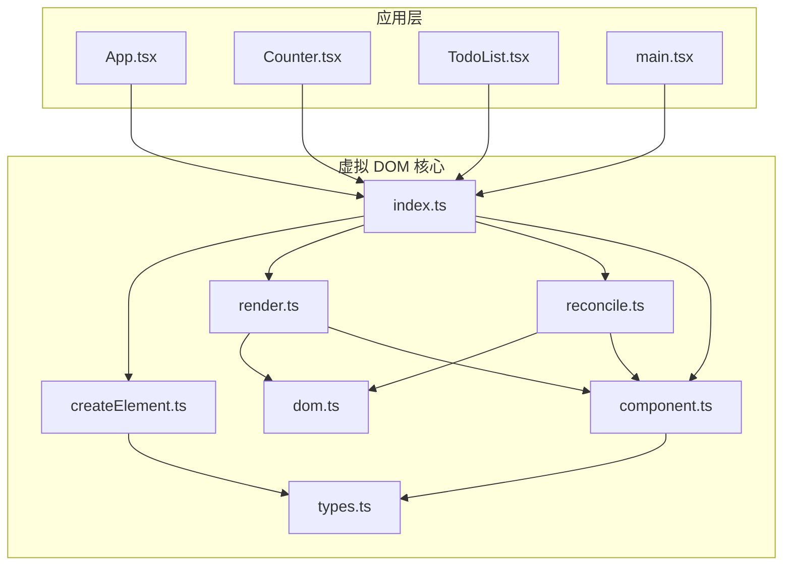
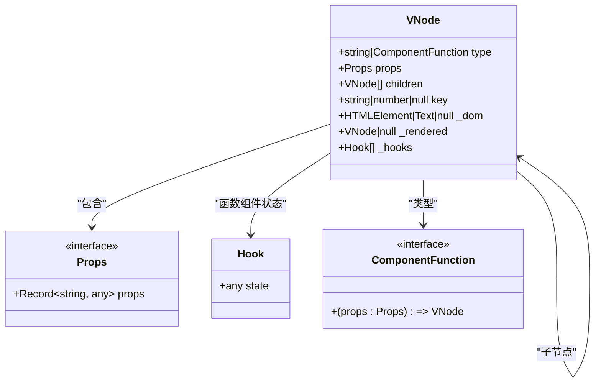
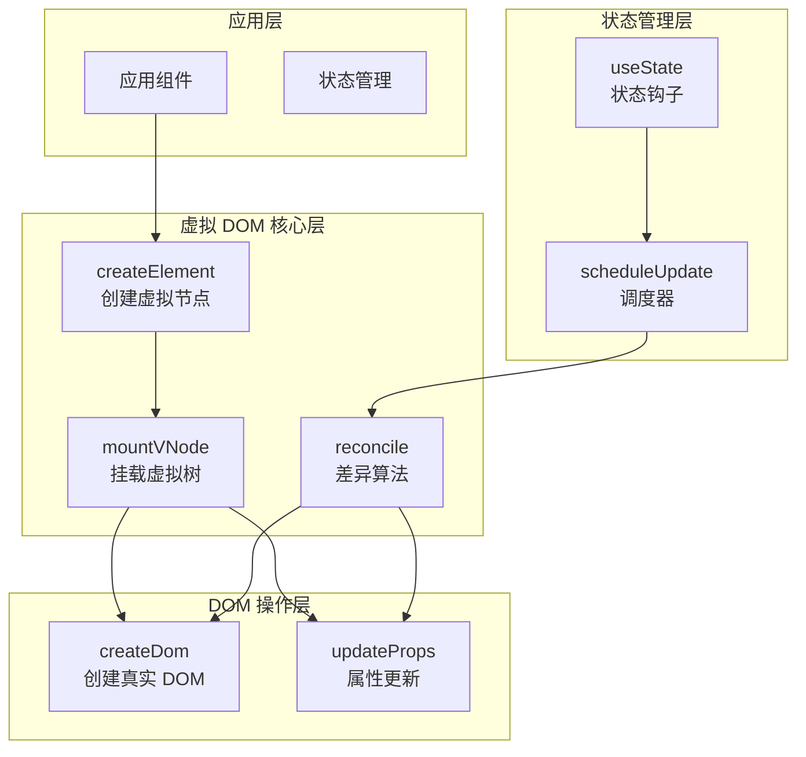
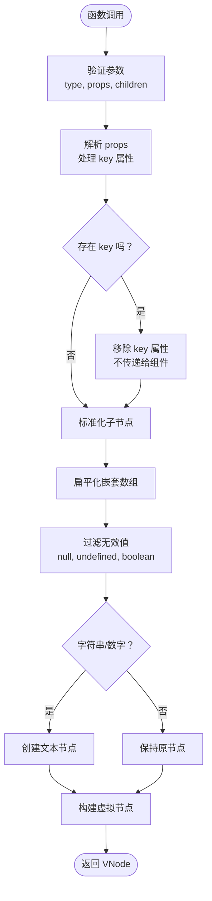
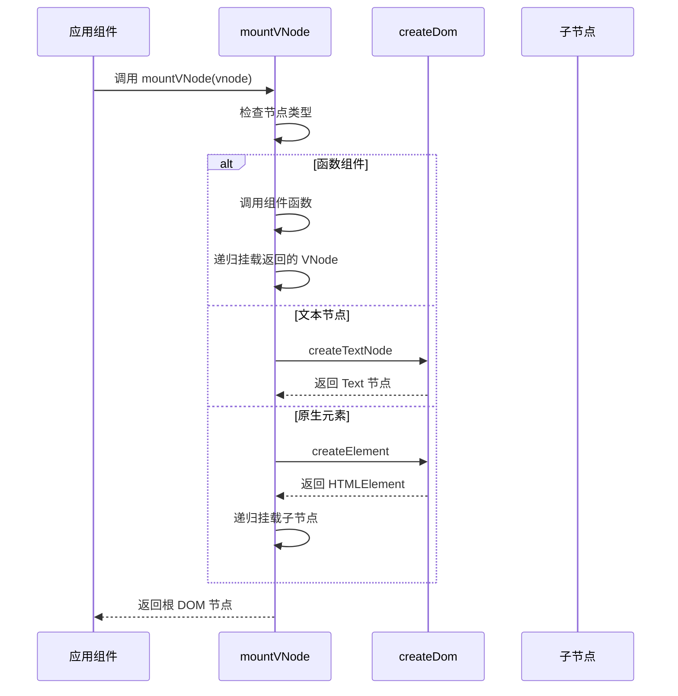
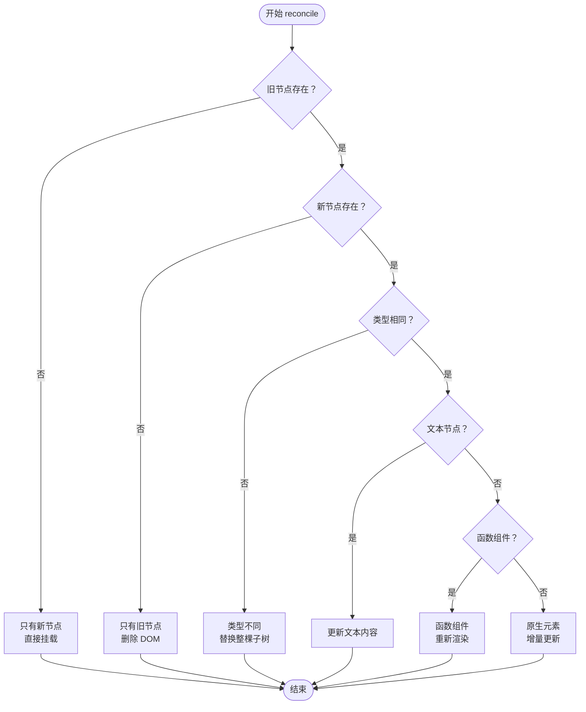
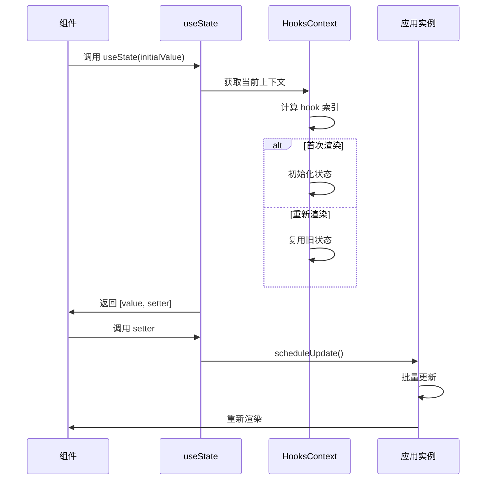
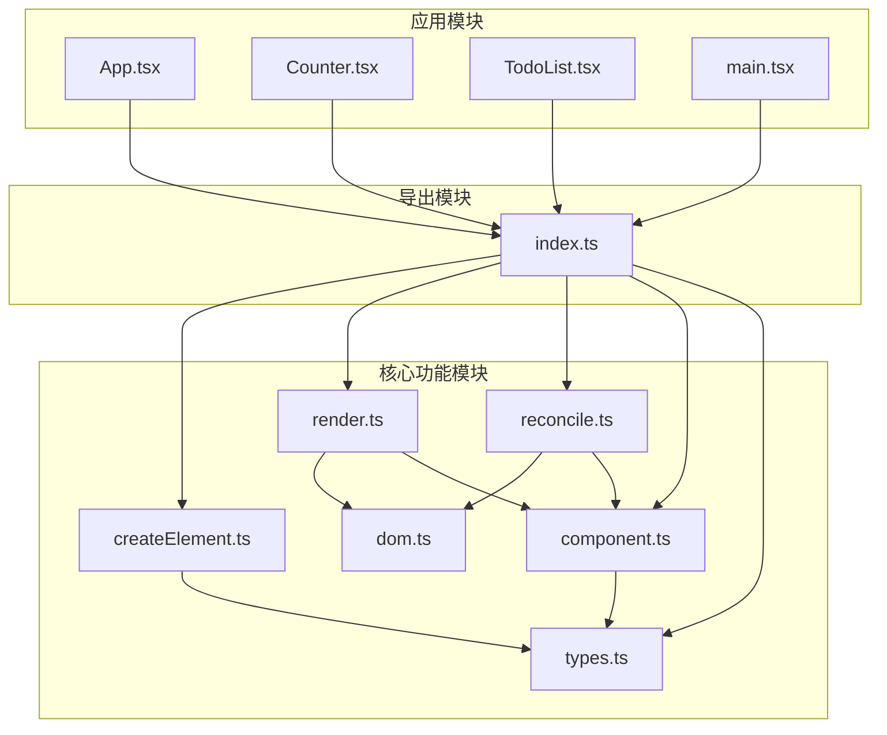

# 虚拟 DOM 系统

<cite>
**本文档引用的文件**
- [src/mini-react/index.ts](file://src/mini-react/index.ts)
- [src/mini-react/createElement.ts](file://src/mini-react/createElement.ts)
- [src/mini-react/types.ts](file://src/mini-react/types.ts)
- [src/mini-react/reconcile.ts](file://src/mini-react/reconcile.ts)
- [src/mini-react/render.ts](file://src/mini-react/render.ts)
- [src/mini-react/dom.ts](file://src/mini-react/dom.ts)
- [src/mini-react/component.ts](file://src/mini-react/component.ts)
- [src/app/App.tsx](file://src/app/App.tsx)
- [src/app/Counter.tsx](file://src/app/Counter.tsx)
- [src/app/TodoList.tsx](file://src/app/TodoList.tsx)
- [src/main.tsx](file://src/main.tsx)
</cite>

## 目录
1. [简介](#简介)
2. [项目结构](#项目结构)
3. [核心组件](#核心组件)
4. [架构概览](#架构概览)
5. [详细组件分析](#详细组件分析)
6. [依赖关系分析](#依赖关系分析)
7. [性能考虑](#性能考虑)
8. [故障排除指南](#故障排除指南)
9. [结论](#结论)

## 简介

虚拟 DOM 系统是一种将真实 DOM 抽象化的轻量级实现，旨在解决传统直接操作 DOM 带来的性能问题。该系统通过在内存中维护一棵虚拟树来描述用户界面，然后通过高效的差异算法将变更最小化地应用到真实 DOM 上。

### 为什么需要虚拟 DOM

1. **性能优化**：避免频繁的 DOM 操作导致的重排和重绘
2. **开发体验**：提供声明式编程模型，简化复杂 UI 的管理
3. **跨平台兼容**：抽象出平台特定的 DOM 实现细节
4. **状态管理**：通过虚拟树跟踪组件状态变化

### 解决的核心问题

- **DOM 操作成本高**：直接操作真实 DOM 非常昂贵
- **状态同步复杂**：手动维护 UI 与数据状态的一致性困难
- **批量更新缺失**：单次状态变更可能导致多次不必要的 DOM 更新
- **事件处理繁琐**：需要手动绑定和解绑事件监听器

## 项目结构

该项目采用模块化设计，将虚拟 DOM 系统的核心功能分解为独立的模块：

**图表来源**
- [src/mini-react/index.ts:1-12](file://src/mini-react/index.ts#L1-L12)
- [src/mini-react/createElement.ts:1-58](file://src/mini-react/createElement.ts#L1-L58)
- [src/mini-react/types.ts:1-26](file://src/mini-react/types.ts#L1-L26)

**章节来源**
- [src/mini-react/index.ts:1-12](file://src/mini-react/index.ts#L1-L12)
- [src/mini-react/types.ts:1-26](file://src/mini-react/types.ts#L1-L26)

## 核心组件

### 虚拟节点数据结构

虚拟节点是整个系统的核心数据结构，它以轻量级对象的形式描述了真实 DOM 的结构和状态：

**图表来源**
- [src/mini-react/types.ts:7-26](file://src/mini-react/types.ts#L7-L26)

### 关键常量定义

系统使用常量来标识特殊类型的虚拟节点：

- `TEXT_ELEMENT`: 用于标识文本节点的特殊类型标记
- 支持字符串标签和函数组件两种类型

**章节来源**
- [src/mini-react/types.ts:1-26](file://src/mini-react/types.ts#L1-L26)

## 架构概览

虚拟 DOM 系统采用分层架构设计，从上到下分为应用层、核心层和基础设施层：

**图表来源**
- [src/mini-react/createElement.ts:9-25](file://src/mini-react/createElement.ts#L9-L25)
- [src/mini-react/render.ts:9-40](file://src/mini-react/render.ts#L9-L40)
- [src/mini-react/reconcile.ts:14-81](file://src/mini-react/reconcile.ts#L14-L81)

## 详细组件分析

### createElement 函数实现

`createElement` 是整个虚拟 DOM 系统的入口函数，负责将 JSX 语法转换为虚拟节点对象：

#### 核心实现逻辑

**图表来源**
- [src/mini-react/createElement.ts:9-25](file://src/mini-react/createElement.ts#L9-L25)
- [src/mini-react/createElement.ts:33-48](file://src/mini-react/createElement.ts#L33-L48)

#### JSX 到虚拟 DOM 的转换机制

系统通过以下步骤实现 JSX 到虚拟 DOM 的转换：

1. **参数解析**：提取组件类型、属性和子节点
2. **Key 处理**：从 props 中分离 key 属性，不传递给组件
3. **子节点标准化**：处理嵌套数组、文本节点和条件渲染
4. **虚拟节点构建**：创建包含完整信息的 VNode 对象

**章节来源**
- [src/mini-react/createElement.ts:1-58](file://src/mini-react/createElement.ts#L1-L58)

### 虚拟节点树的创建过程

#### 递归挂载流程

**图表来源**
- [src/mini-react/render.ts:9-40](file://src/mini-react/render.ts#L9-L40)
- [src/mini-react/dom.ts:6-14](file://src/mini-react/dom.ts#L6-L14)

#### 属性合并和类型判断

系统实现了智能的属性处理机制：

1. **事件处理**：自动识别 `on` 开头的属性作为事件监听器
2. **样式处理**：专门处理 `style` 对象的属性更新
3. **类名处理**：统一处理 `className` 属性
4. **表单元素**：特殊处理 `value` 属性

**章节来源**
- [src/mini-react/dom.ts:19-53](file://src/mini-react/dom.ts#L19-L53)

### 调和算法实现

#### 差异比较策略

**图表来源**
- [src/mini-react/reconcile.ts:14-81](file://src/mini-react/reconcile.ts#L14-L81)

#### 子节点对比算法

系统使用索引对齐的方式进行子节点对比：

1. **长度计算**：取新旧子节点的最大长度
2. **逐项对比**：按相同索引位置进行递归 reconcile
3. **边界处理**：处理新增和删除的子节点

**章节来源**
- [src/mini-react/reconcile.ts:86-99](file://src/mini-react/reconcile.ts#L86-L99)

### 状态管理和 Hooks 系统

#### useState Hook 实现

**图表来源**
- [src/mini-react/component.ts:51-83](file://src/mini-react/component.ts#L51-L83)
- [src/mini-react/component.ts:122-136](file://src/mini-react/component.ts#L122-L136)

**章节来源**
- [src/mini-react/component.ts:1-137](file://src/mini-react/component.ts#L1-L137)

## 依赖关系分析

### 模块间依赖图

**图表来源**
- [src/mini-react/index.ts:1-12](file://src/mini-react/index.ts#L1-L12)
- [src/mini-react/createElement.ts:1](file://src/mini-react/createElement.ts#L1)
- [src/mini-react/render.ts:1](file://src/mini-react/render.ts#L1)
- [src/mini-react/reconcile.ts:1](file://src/mini-react/reconcile.ts#L1)
- [src/mini-react/dom.ts:1](file://src/mini-react/dom.ts#L1)
- [src/mini-react/component.ts:1](file://src/mini-react/component.ts#L1)

### 关键依赖关系

1. **createElement** 依赖 **types** 提供类型定义
2. **render** 依赖 **dom** 和 **component** 模块
3. **reconcile** 依赖 **dom**、**component** 和 **render** 模块
4. **component** 依赖 **types** 和 **reconcile** 模块

**章节来源**
- [src/mini-react/index.ts:1-12](file://src/mini-react/index.ts#L1-L12)

## 性能考虑

### 优化策略

1. **批量更新**：通过微任务队列合并多次状态更新
2. **增量更新**：只更新发生变化的 DOM 属性
3. **子节点复用**：通过 key 属性优化列表渲染
4. **内存管理**：及时清理不再使用的 DOM 节点引用

### 性能特征

- **时间复杂度**：O(n) 每次更新，其中 n 是需要更新的节点数
- **空间复杂度**：O(n) 存储虚拟节点树
- **更新延迟**：通过微任务实现批处理，减少重绘次数

## 故障排除指南

### 常见问题及解决方案

#### 1. 状态钩子使用错误

**问题**：在非函数组件中调用 `useState`
**解决方案**：确保只在函数组件内部调用状态钩子

#### 2. 子节点 key 缺失

**问题**：列表渲染时缺少 key 属性
**解决方案**：为每个列表项提供唯一且稳定的 key

#### 3. 事件处理异常

**问题**：事件监听器无法正常工作
**解决方案**：检查事件名称格式（如 `onClick` 而非 `onclick`）

#### 4. DOM 更新不生效

**问题**：属性更新后 UI 未反映变化
**解决方案**：确认属性名称正确且值已发生变化

**章节来源**
- [src/mini-react/component.ts:54-56](file://src/mini-react/component.ts#L54-L56)

## 结论

这个虚拟 DOM 系统展示了现代前端框架的核心思想和技术实现。通过精心设计的数据结构和算法，系统实现了高效的 UI 更新机制，同时保持了良好的开发体验。

### 主要成就

1. **完整的生命周期**：从虚拟节点创建到真实 DOM 更新的完整链路
2. **智能的差异算法**：高效的子树对比和增量更新
3. **状态管理集成**：内置的 Hooks 系统支持复杂的状态逻辑
4. **类型安全**：完整的 TypeScript 类型定义确保开发时的类型安全

### 技术亮点

- **模块化设计**：清晰的职责分离和依赖关系
- **性能优化**：批处理更新和增量更新策略
- **易用性**：简洁的 API 设计和直观的使用方式
- **可扩展性**：为未来功能扩展预留了良好基础

这个系统为理解现代前端框架的工作原理提供了优秀的学习材料，展示了如何在保证性能的同时提供简洁的开发体验。