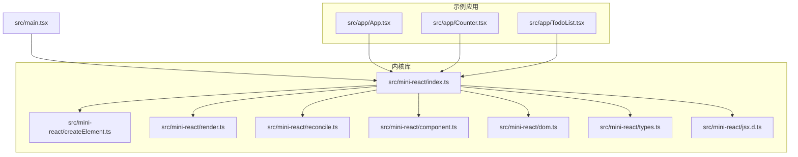
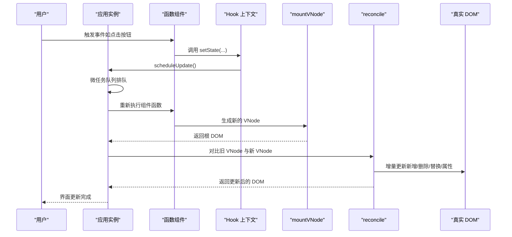
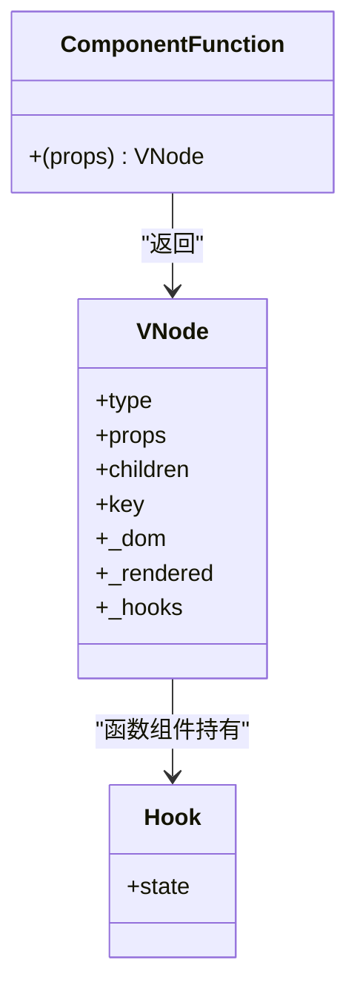
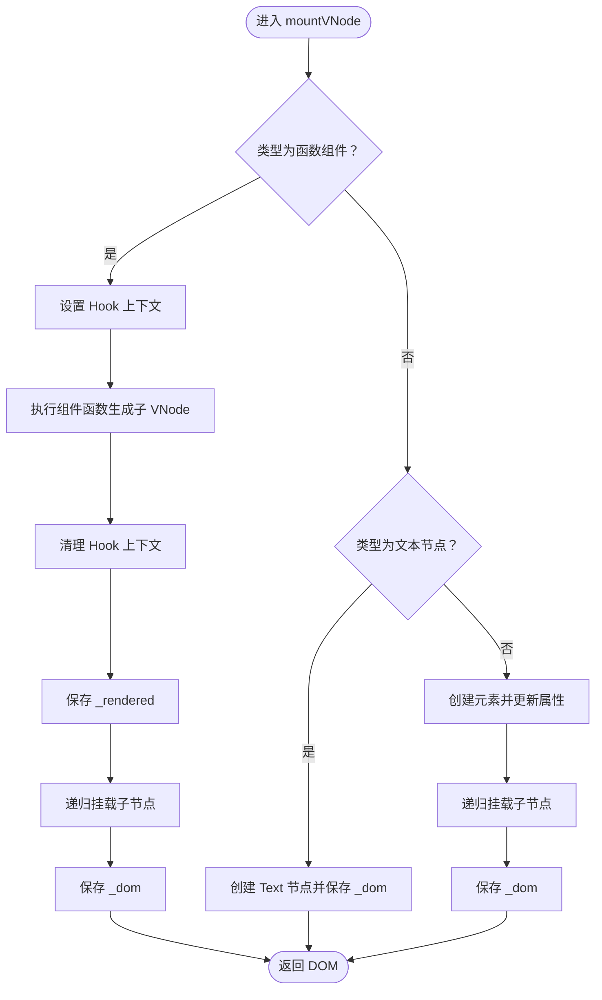
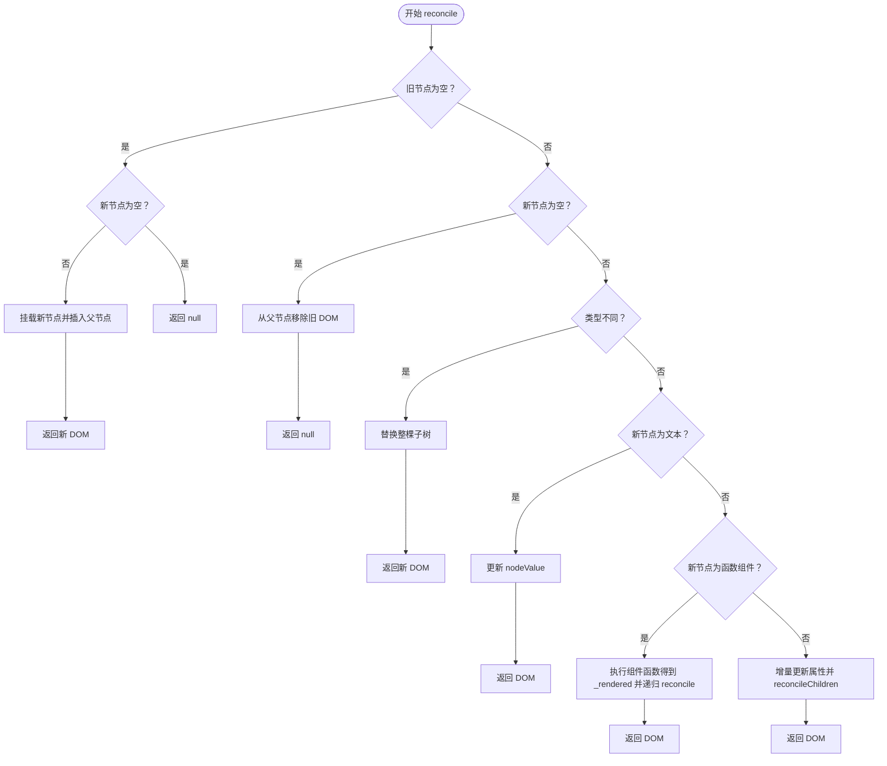
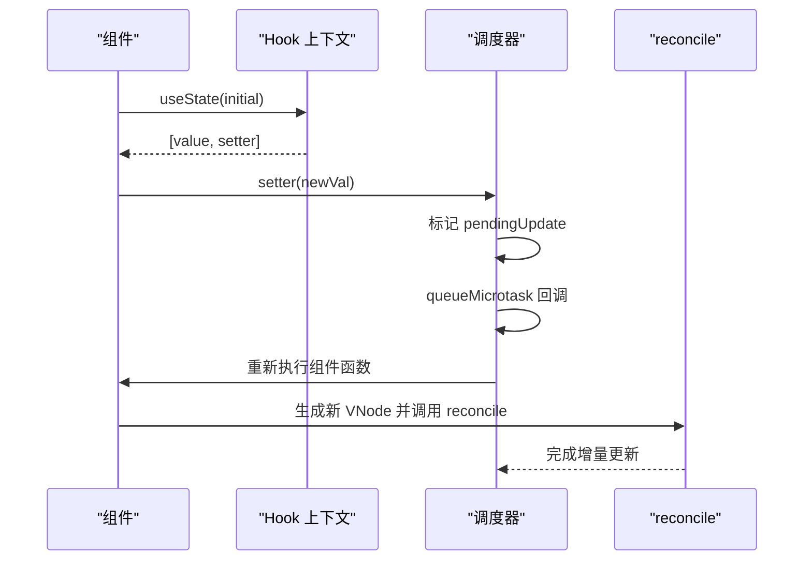
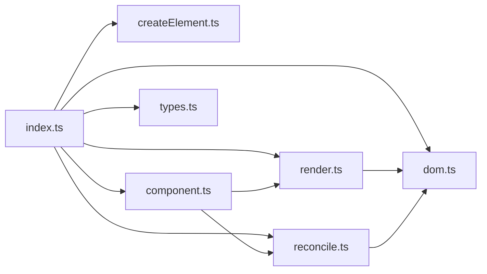

# 项目概述

<cite>
**本文档引用的文件**
- [src/main.tsx](file://src/main.tsx)
- [src/app/App.tsx](file://src/app/App.tsx)
- [src/app/Counter.tsx](file://src/app/Counter.tsx)
- [src/app/TodoList.tsx](file://src/app/TodoList.tsx)
- [src/mini-react/index.ts](file://src/mini-react/index.ts)
- [src/mini-react/createElement.ts](file://src/mini-react/createElement.ts)
- [src/mini-react/render.ts](file://src/mini-react/render.ts)
- [src/mini-react/reconcile.ts](file://src/mini-react/reconcile.ts)
- [src/mini-react/component.ts](file://src/mini-react/component.ts)
- [src/mini-react/dom.ts](file://src/mini-react/dom.ts)
- [src/mini-react/types.ts](file://src/mini-react/types.ts)
- [src/mini-react/jsx.d.ts](file://src/mini-react/jsx.d.ts)
- [tsconfig.json](file://tsconfig.json)
- [vite.config.ts](file://vite.config.ts)
- [package.json](file://package.json)
- [index.html](file://index.html)
</cite>

## 目录
1. [简介](#简介)
2. [项目结构](#项目结构)
3. [核心组件](#核心组件)
4. [架构总览](#架构总览)
5. [详细组件分析](#详细组件分析)
6. [依赖关系分析](#依赖关系分析)
7. [性能考量](#性能考量)
8. [故障排查指南](#故障排查指南)
9. [结论](#结论)
10. [附录](#附录)

## 简介
mini-react 是一个基于 TypeScript 的轻量级 React 教学实现，目标是用极简代码演示现代前端框架的核心概念，帮助学习者深入理解虚拟 DOM、函数式组件、Hook 系统、调和（diff/reconcile）算法与增量更新等关键技术。项目采用最小可行实现，保留与真实 React 一致的 API 语义与行为，便于对照学习。

本项目适合以下学习场景：
- 理解虚拟 DOM 的设计动机与实现思路
- 掌握 diff/reconcile 算法的基本原理与边界处理
- 学习函数式组件与 Hook 的调度与状态管理
- 了解从 VNode 到真实 DOM 的挂载与更新流程
- 对比学习与主流 React 生态的差异与取舍

## 项目结构
项目采用“示例应用 + 内核库”的分层组织方式：
- 示例应用位于 src/app，包含 App、Counter、TodoList 等组件，演示函数式组件与 useState 的使用
- 内核库位于 src/mini-react，包含 JSX 工厂、VNode 类型、DOM 操作、渲染与调和逻辑、Hook 与应用调度等模块
- 构建与类型配置位于根目录的构建与编译配置文件中

图表来源
- [src/main.tsx:1-6](file://src/main.tsx#L1-L6)
- [src/app/App.tsx:1-33](file://src/app/App.tsx#L1-L33)
- [src/mini-react/index.ts:1-12](file://src/mini-react/index.ts#L1-L12)

章节来源
- [src/main.tsx:1-6](file://src/main.tsx#L1-L6)
- [src/app/App.tsx:1-33](file://src/app/App.tsx#L1-L33)
- [src/mini-react/index.ts:1-12](file://src/mini-react/index.ts#L1-L12)

## 核心组件
- JSX 工厂与类型系统
  - createElement：将 JSX 语法转换为 VNode，规范化 children，支持文本节点与键值处理
  - 类型定义：VNode、Props、ComponentFunction、Hook 等，统一虚拟节点结构
- 渲染与挂载
  - render：首次渲染入口，将 VNode 挂载到容器
  - mountVNode：递归挂载，支持函数组件、文本节点与原生元素
- 调和与增量更新
  - reconcile：对比新旧 VNode，执行新增、删除、替换、文本更新、函数组件内部 reconcile 与子节点对齐
  - reconcileChildren：按索引对齐子节点，递归调和
- DOM 操作
  - createDom：创建真实 DOM 节点（不递归）
  - updateProps：增量更新属性，含事件绑定、样式、className、value 等
- Hook 与应用调度
  - useState：与 React 一致的 Hook，按渲染顺序复用状态槽位
  - createApp：应用实例管理，首次渲染与批量调度更新
  - scheduleUpdate：微任务批处理，避免重复渲染

章节来源
- [src/mini-react/createElement.ts:1-58](file://src/mini-react/createElement.ts#L1-L58)
- [src/mini-react/render.ts:1-49](file://src/mini-react/render.ts#L1-L49)
- [src/mini-react/reconcile.ts:1-110](file://src/mini-react/reconcile.ts#L1-L110)
- [src/mini-react/dom.ts:1-97](file://src/mini-react/dom.ts#L1-L97)
- [src/mini-react/component.ts:1-137](file://src/mini-react/component.ts#L1-L137)
- [src/mini-react/types.ts:1-26](file://src/mini-react/types.ts#L1-L26)

## 架构总览
mini-react 的运行时由“应用实例 → 首次渲染 → 调度循环 → 调和更新”构成。应用通过 createApp 初始化，首次渲染生成真实 DOM；用户交互触发 useState setter，触发微任务调度，重新渲染并调和更新。

图表来源
- [src/mini-react/component.ts:99-137](file://src/mini-react/component.ts#L99-L137)
- [src/mini-react/render.ts:9-40](file://src/mini-react/render.ts#L9-L40)
- [src/mini-react/reconcile.ts:14-81](file://src/mini-react/reconcile.ts#L14-L81)
- [src/mini-react/dom.ts:19-53](file://src/mini-react/dom.ts#L19-L53)

## 详细组件分析

### JSX 工厂与类型系统
- createElement
  - 功能：将 JSX 转换为 VNode，规范化 children（扁平化、过滤无效值、文本节点包装），处理 key 并从 props 中剔除
  - 关键点：文本节点以常量标识区分，便于后续快速路径优化
- 类型系统
  - VNode：统一描述原生元素、函数组件、文本节点，附加 _dom、_rendered、_hooks 等运行时字段
  - Props：任意属性对象
  - ComponentFunction：函数组件签名
  - Hook：状态槽位存储

图表来源
- [src/mini-react/types.ts:7-26](file://src/mini-react/types.ts#L7-L26)

章节来源
- [src/mini-react/createElement.ts:9-58](file://src/mini-react/createElement.ts#L9-L58)
- [src/mini-react/types.ts:1-26](file://src/mini-react/types.ts#L1-L26)

### 渲染与挂载（mountVNode）
- 流程
  - 函数组件：设置 Hook 上下文，执行组件函数生成子 VNode，清理上下文，递归挂载
  - 文本节点：创建 Text 节点并缓存 _dom
  - 原生元素：创建 DOM，更新属性，递归挂载子节点
- 设计要点
  - 递归挂载保证树形结构完整
  - _dom 缓存减少 DOM 查询成本
  - 函数组件渲染结果保存在 _rendered，供 reconcile 使用

图表来源
- [src/mini-react/render.ts:9-40](file://src/mini-react/render.ts#L9-L40)

章节来源
- [src/mini-react/render.ts:1-49](file://src/mini-react/render.ts#L1-L49)

### 调和与增量更新（reconcile）
- 策略
  - 新增：旧节点为空，直接挂载新节点并插入父节点
  - 删除：新节点为空，移除旧节点对应的真实 DOM
  - 类型不同：直接替换整棵子树
  - 文本节点：仅更新 nodeValue
  - 函数组件：执行组件函数得到新 _rendered，递归 reconcile
  - 原生元素：增量更新属性，逐索引 reconcile 子节点
- 子节点对齐
  - reconcileChildren 按最大长度遍历，逐项 reconcile，支持插入、删除、移动等场景

图表来源
- [src/mini-react/reconcile.ts:14-110](file://src/mini-react/reconcile.ts#L14-L110)

章节来源
- [src/mini-react/reconcile.ts:1-110](file://src/mini-react/reconcile.ts#L1-L110)

### DOM 操作（createDom 与 updateProps）
- createDom：根据类型创建 Text 或 HTMLElement，并应用初始属性
- updateProps：增量更新策略
  - 移除：旧属性存在而新属性不存在
  - 更新：事件属性先移除旧监听再绑定新监听；样式按需清空多余属性并设置新值；className/value 特殊处理；其他属性使用 setAttribute/removeAttribute
- 设计要点
  - 事件统一前缀处理，避免内存泄漏
  - 样式与 className/value 提供细粒度控制

章节来源
- [src/mini-react/dom.ts:1-97](file://src/mini-react/dom.ts#L1-L97)

### Hook 与应用调度（useState 与 createApp）
- useState
  - 通过全局 Hook 上下文按渲染顺序分配状态槽位，首次渲染初始化，后续渲染从旧 VNode 复用
  - setter 支持函数式更新，触发微任务调度
- 应用实例
  - createApp：保存根组件、容器、当前 VNode 与更新状态，首次渲染清空容器并挂载
  - scheduleUpdate：微任务批处理，避免多次 setState 导致的重复渲染

图表来源
- [src/mini-react/component.ts:51-83](file://src/mini-react/component.ts#L51-L83)
- [src/mini-react/component.ts:99-137](file://src/mini-react/component.ts#L99-L137)

章节来源
- [src/mini-react/component.ts:1-137](file://src/mini-react/component.ts#L1-L137)

### 示例应用（App、Counter、TodoList）
- App：组合 Counter 与 TodoList，并展示项目标语
- Counter：演示 useState 基本用法与函数式 setter
- TodoList：演示复杂状态管理、输入处理、键盘事件与列表渲染

章节来源
- [src/app/App.tsx:1-33](file://src/app/App.tsx#L1-L33)
- [src/app/Counter.tsx:1-52](file://src/app/Counter.tsx#L1-L52)
- [src/app/TodoList.tsx:1-113](file://src/app/TodoList.tsx#L1-L113)

## 依赖关系分析
- 模块耦合
  - index.ts 作为统一出口，聚合导出 createElement、render、reconcile、createApp、useState 等
  - render 与 reconcile 互相协作：render 负责首次挂载，reconcile 负责后续增量更新
  - component 与 reconcile 协作：通过 setHooksContext/clearHooksContext 在函数组件渲染期间注入 Hook 上下文
  - dom.ts 为底层 DOM 操作抽象，被 render 与 reconcile 复用
- 外部依赖
  - 构建：Vite（含 oxc 配置）
  - 类型：TypeScript（启用 JSX，指定工厂函数）

图表来源
- [src/mini-react/index.ts:1-12](file://src/mini-react/index.ts#L1-L12)
- [src/mini-react/render.ts:1-49](file://src/mini-react/render.ts#L1-L49)
- [src/mini-react/reconcile.ts:1-110](file://src/mini-react/reconcile.ts#L1-L110)
- [src/mini-react/component.ts:1-137](file://src/mini-react/component.ts#L1-L137)
- [src/mini-react/dom.ts:1-97](file://src/mini-react/dom.ts#L1-L97)

章节来源
- [src/mini-react/index.ts:1-12](file://src/mini-react/index.ts#L1-L12)
- [tsconfig.json:1-19](file://tsconfig.json#L1-L19)
- [vite.config.ts:1-12](file://vite.config.ts#L1-L12)
- [package.json:1-17](file://package.json#L1-L17)

## 性能考量
- 批处理更新
  - 通过微任务队列合并多次 setState，降低重渲染频率
- 增量更新
  - reconcile 仅对变更部分进行 DOM 操作，避免全量重建
- 状态槽位复用
  - Hook 按渲染顺序复用，避免额外的查找与分配开销
- 注意事项
  - 当前实现未包含 key 优化与跨层级移动处理，建议在学习 diff 算法时重点对比有无 key 的差异
  - 事件处理采用统一前缀与替换策略，避免重复绑定导致的内存泄漏风险

## 故障排查指南
- 报错：在函数组件外调用 useState
  - 现象：抛出错误提示必须在函数组件内调用
  - 原因：Hook 上下文未设置
  - 解决：确保在函数组件顶层调用
- 事件未生效
  - 现象：onClick 等事件不触发
  - 原因：事件名大小写或前缀不匹配
  - 解决：确认事件名以 on 开头且符合 updateProps 的解析规则
- 样式或 className 不生效
  - 现象：内联样式或类名未更新
  - 原因：updateProps 对样式与 className/value 的特殊处理
  - 解决：检查传入的 style、className、value 是否为期望值
- 列表渲染异常
  - 现象：列表项更新错位或闪烁
  - 原因：未提供 key 或 key 不稳定
  - 解决：为每个列表项提供稳定 key，便于 reconcile 正确对齐

章节来源
- [src/mini-react/component.ts:54-56](file://src/mini-react/component.ts#L54-L56)
- [src/mini-react/dom.ts:37-52](file://src/mini-react/dom.ts#L37-L52)
- [src/mini-react/reconcile.ts:90-99](file://src/mini-react/reconcile.ts#L90-L99)

## 结论
mini-react 以极简实现完整呈现了现代前端框架的关键机制：虚拟 DOM、函数式组件、Hook 状态管理与增量调和。通过对照学习，读者可以深入理解 React 的内部工作原理，并具备迁移至真实生态的能力。项目在教学价值与可读性上具有突出优势，适合作为进阶学习的脚手架与参考实现。

## 附录
- 构建与运行
  - 开发：npm run dev
  - 构建：npm run build
  - 类型检查：npm run typecheck
- TypeScript 与 JSX 配置
  - tsconfig.json 指定 JSX 工厂与片段工厂，启用严格模式
  - vite.config.ts 配置 oxc 的 JSX 运行时与工厂函数
- 入口与页面
  - index.html 提供挂载点
  - main.tsx 通过 createApp 启动应用

章节来源
- [package.json:7-11](file://package.json#L7-L11)
- [tsconfig.json:7-16](file://tsconfig.json#L7-L16)
- [vite.config.ts:3-11](file://vite.config.ts#L3-L11)
- [index.html:12-16](file://index.html#L12-L16)
- [src/main.tsx:1-6](file://src/main.tsx#L1-L6)