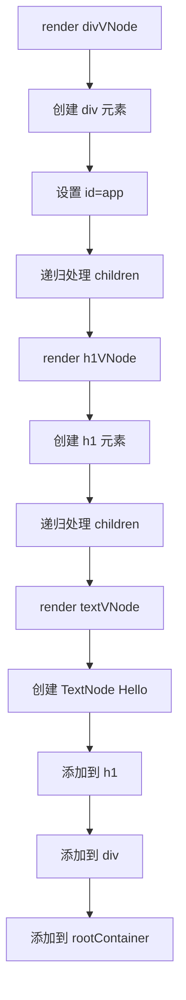

# React 原理（一）：JSX、虚拟 DOM 与挂载

## 一、从 Hello World 说起

先用react写一个hello world

```jsx
function App() {
  return <h1>Hello, World!</h1>;
}

const root = ReactDOM.createRoot(document.getElementById('root'));
root.render(<App />);
```

但如果你把这段代码复制到浏览器控制台运行，会得到一个报错：

```
Uncaught SyntaxError: Unexpected token '<'
```

浏览器不认识 `<h1>` 这种语法——它只认识标准的 JavaScript。

**那么问题来了：这段代码是怎么在页面上显示出 "Hello, World!" 的？**

本文将一步步揭开这个过程：上面的 JSX 代码，要经历哪些转换，最终才能在浏览器中运行起来。

## 二、JSX介绍
JSX要转换成js代码，才能在浏览器中运行，我们可以利用babel来完成这个转换，上述JSX代码经过babel的转化后
```js
function App() {
  return React.createElement("h1", null, "Hello, World!");
}
const root = ReactDOM.createRoot(document.getElementById('root'));
root.render(React.createElement(App, null));
```
可以[在这里](https://babeljs.io/repl#?config_lz=N4IgZglgNgpgdgQwLYxALhAJxgBygOgCsBnADxABoQdtiYAXY9AbWZHgDdLR6FMBzBkwwATGGAQBXKIwoACOAHt6ciDDkBGDfKUq1AfSSKARpo2UQRkdJjCJUOlWOT-kUrfT1MkmAF8AuhRs2AgAxvTcWJJw9BAo6CChUAjExBChIAFBIMS8ggC0AEyRYqGKmAj05cQAajCYaYpwCYUADIUAzPlaFjgQODBQEHAwAAqYijiKxAhQCQAWYQDWmf6BOYqSmKEwACoAngMJVjaZQA&code_lz=GYVwdgxgLglg9mABAQQA6oBQEpEG8CwAUIogE4CmUIpSAPABYCMAfABLkA2HcANIgOpxSHACYBCWgHomzANxEAvkSIQEAZyhk4cTQF5EAJXIBDaABEA8gFkAdBArGo5A9qgYRcCCAC25MFBsAc0oAUQ5yX38AIQBPAEkRDAByUlckrCx5QlSdGwowEXJSDFo0VERJZkygA&lineWrap=true&version=7.29.2)直接尝试

### React 17 的新转换方式

从 React 17 开始，JSX 的转换方式变了。上面代码将转换成

```javascript
import { jsx as _jsx } from "react/jsx-runtime";
function App() {
  return /*#__PURE__*/_jsx("h1", {
    children: "Hello, World!"
  });
}
const root = ReactDOM.createRoot(document.getElementById('root'));
root.render(/*#__PURE__*/_jsx(App, {}));
```

**`_jsx` 和 `createElement` 本质一样**，都是接收参数、返回虚拟 DOM 对象。

值得注意的是： Babel 会自动处理 import：
- 旧方式：你需要手动写 `import React from 'react'`
- 新方式：Babel 自动插入 `import { jsx as _jsx } from "react/jsx-runtime"`

这个 `react/jsx-runtime` 是 React 17 新增的模块，专门提供 `_jsx` 函数。

所以虽然看起来变了，但核心逻辑没变：**JSX → 函数调用 → 虚拟 DOM**。理解 `React.createElement` 仍然有助于理解 React 的工作原理。

通过配置 `runtime` 参数，可以控制 Babel 的转换方式：

| runtime 值 | 转换结果 | 是否需要 import React |
|-----------|---------|---------------------|
| `"classic"` | `React.createElement(...)` | 需要 |
| `"automatic"` | `import { jsx as _jsx } from "react/jsx-runtime"` + `_jsx(...)` | 不需要 |

例如，使用 `"classic"` 模式：

```json
{
  "presets": [
    ["@babel/preset-react", { "runtime": "classic" }]
  ]
}
```

这样 JSX 会转换成 `React.createElement` 调用。


## 三、JSX 转换的原理

> 为了简单起见，以下示例都以转换成 `React.createElement` 为例（即 `runtime: "classic"` 模式）。`runtime: "automatic"` 模式的转换逻辑相同，只是函数名不同。

JSX 转换的核心规则很简单：**把标签语法转换成 `createElement` 函数调用**。

`createElement` 的函数签名是：

```javascript
React.createElement(type, props, ...children)
```

| 参数 | 含义 | 示例 |
|-----|------|------|
| `type` | 标签名或组件 | `'div'`、`Card` |
| `props` | 属性对象 | `{ className: 'container' }` |
| `...children` | 子节点（可变参数） | 字符串、其他元素等 |

转换器就是按照这个签名，把 JSX 的各部分映射到对应的参数上。

### 例子 1：基础标签

```jsx
// 你写的 JSX
<div className="container">Hello</div>
```

```javascript
// 转换后
React.createElement('div', { className: 'container' }, 'Hello')
```

- `type` → `'div'`（标签名字符串）
- `props` → `{ className: 'container' }`（属性对象）
- `children` → `'Hello'`（文本子节点）

### 例子 2：嵌套结构

```jsx
// 你写的 JSX
<div>
  <h1>Title</h1>
  <p>Content</p>
</div>
```

```javascript
// 转换后
React.createElement('div', null,
  React.createElement('h1', null, 'Title'),
  React.createElement('p', null, 'Content')
)
```

子标签也被转换成 `createElement` 调用，作为父标签的参数。

### 例子 3：组件

```jsx
// 你写的 JSX
<Card title="Hello">
  <Text>World</Text>
</Card>
```

```javascript
// 转换后
React.createElement(Card, { title: 'Hello' },
  React.createElement(Text, null, 'World')
)
```

大写字母开头的标签被识别为组件，直接作为变量传入，而不是字符串。

### 例子 4：JavaScript 表达式

大括号 `{}` 里的内容会被原样保留为 JavaScript 表达式：

```jsx
// 简单表达式
<div>{count + 1}</div>
// → React.createElement('div', null, count + 1)

// 条件渲染
<div>{show && <span>显示</span>}</div>
// → React.createElement('div', null, show && React.createElement('span', null, '显示'))

// 列表渲染
<ul>{items.map(item => <li>{item.name}</li>)}</ul>
// → React.createElement('ul', null, items.map(item => React.createElement('li', null, item.name)))
```

**规则**：`{}` 里的代码原样保留，只对其中出现的标签进行转换。

### 例子 5：函数组件中的代码

```jsx
// 你写的 JSX
function Counter() {
  const count = 1 + 1;  // 这行不会转换
  console.log(count);    // 这行不会转换
  
  return <div>{count}</div>;  // 只有这里会转换
}
```

```javascript
// 转换后
function Counter() {
  const count = 1 + 1;  // 原样保留
  console.log(count);    // 原样保留
  
  return React.createElement('div', null, count);  // 只有 return 被转换
}
```

**关键点**：JSX 转换器只处理标签语法，函数组件中的其他 JavaScript 代码（变量声明、函数调用、条件判断等）完全原样保留。

### 转换的本质

从上面的例子可以看出，JSX 转换器只做一件事：**把类 HTML 的语法转换成 `createElement` 函数调用**。

它只关注：
- 标签名 → `type` 参数
- 属性 → `props` 对象
- 子节点 → `children` 参数

其他所有代码（变量、表达式、逻辑控制等）都原样保留，留给 JavaScript 引擎在运行时处理。

## 四、构建与运行

经过 Babel 转换，我们得到了可以在浏览器中运行的 JavaScript 代码。怎么让它在页面中运行起来？

### 手动集成（理解原理）

最简单的方式：直接在 HTML 中引入转换后的代码。

```html
<!DOCTYPE html>
<html>
<head>
  <!-- 引入 React -->
  <script src="https://unpkg.com/react@18/umd/react.development.js"></script>
  <script src="https://unpkg.com/react-dom@18/umd/react-dom.development.js"></script>
</head>
<body>
  <div id="root"></div>
  
  <script>
    // 这里是 Babel 转换后的代码
    function App() {
      return React.createElement('h1', null, 'Hello, World!');
    }
    
    const root = ReactDOM.createRoot(document.getElementById('root'));
    root.render(React.createElement(App));
  </script>
</body>
</html>
```

这种方式没有构建步骤，适合学习理解原理，但实际开发中很少这样用。

### 现代前端工程化方案

实际项目中，构建工具负责把 JSX 代码转换并集成到 HTML 中。主流方案对比如下：

| 打包工具 | JSX 转换器 | 特点 |
|---------|-----------|------|
| Webpack | Babel（JavaScript） | 配置灵活，插件生态丰富，可定制性强 |
| Vite 6+ | Oxc（Rust） | 极速，内置优化 |
| Vite 5 及以下 | esbuild（Go） | 快速，无需配置 |
| Parcel | SWC（Rust） | 零配置，开箱即用 |

以 Vite 运行 Hello World 为例，核心流程如下：

```
App.tsx ──Oxc转换──→ App.js ──Vite服务器──→ 浏览器
   │                      │
   │                      └── 注入 React，打包模块
   └── <h1>Hello, World!</h1>
       转换为 React.createElement('h1', null, 'Hello, World!')
```

**第一步：Oxc 转换 JSX**

Vite 6+ 使用 Oxc（Rust 编写）在开发时实时转换 JSX：

```jsx
// 你写的 App.tsx
function App() {
  return <h1>Hello, World!</h1>;
}
```

```javascript
// Oxc 转换后的代码（内存中，无文件落地）
function App() {
  return React.createElement('h1', null, 'Hello, World!');
}
```

**第二步：Vite 集成到 HTML**

Vite 自动处理模块导入，并注入到 HTML：

```html
<!-- index.html -->
<!DOCTYPE html>
<html>
  <body>
    <div id="root"></div>
    <script type="module" src="/src/main.tsx"></script>
  </body>
</html>
```

```javascript
// main.tsx
import React from 'react';
import ReactDOM from 'react-dom/client';
import App from './App';

ReactDOM.createRoot(document.getElementById('root')!).render(
  React.createElement(App)
);
```

Vite 开发服务器会：
1. 拦截请求，实时用 Oxc 转换 JSX
2. 处理 `import` 语句，找到对应的模块
3. 把所有代码打包发送给浏览器

配置非常简单（可选）：

```javascript
// vite.config.ts
export default {
  // Vite 6+ 默认使用 Oxc 转换 JSX，一般无需配置
}
```

## 五、React 做了什么？

现在我们已经知道：
1. JSX 被转换成 `React.createElement` 调用
2. 构建工具（如 Vite）把转换后的代码打包并注入到 HTML

但还有一个关键问题：**`React.createElement` 返回什么？浏览器怎么知道该渲染什么？**

让我们先思考几个问题：

> **问题 1**：`createElement('h1', null, 'Hello')` 返回一个对象，这个对象长什么样？

> **问题 2**：React 怎么把这个对象变成真实的 DOM 元素？

> **问题 3**：如果组件嵌套多层，React 怎么处理这种树形结构？

> **问题 4**：当数据变化时，React 怎么知道该更新哪个 DOM 元素？

这些问题的答案，就是 React 的核心原理所在。直接阅读 React 源码会很复杂，因为要考虑各种边界情况和性能优化。

**更好的学习方式：实现一个迷你版 React（mini-react）。**

通过自己动手实现，我们可以：
- 剥离复杂细节，抓住核心逻辑
- 真正理解每个设计决策背后的原因
- 建立对 React 原理的直观认知

在接下来的章节中，我们将一步步实现 mini-react，回答上面的四个问题。

## 六、createElement 与虚拟 DOM

我们先来回答第一个问题：**`createElement` 返回什么？**

### createElement 的实现

根据前面介绍的函数签名 `createElement(type, props, ...children)`，我们可以写出最简单的实现：

```javascript
function createElement(type, props, ...children) {
  return {
    type,      // 标签名或组件函数
    props: {
      ...props,
      children  // 子节点数组
    }
  };
}
```

测试一下：

```javascript
const element = createElement('h1', { className: 'title' }, 'Hello');

// 返回结果：
{
  type: 'h1',
  props: {
    className: 'title',
    children: ['Hello']
  }
}
```

这就是**虚拟 DOM（Virtual DOM）**——一个用 JavaScript 对象描述的 DOM 结构。

### 为什么叫"虚拟"DOM？

| 对比 | 真实 DOM | 虚拟 DOM |
|-----|---------|---------|
| 类型 | 浏览器内置对象 | 普通 JavaScript 对象 |
| 操作成本 | 高（触发重排重绘） | 低（纯内存操作） |
| 创建方式 | `document.createElement` | `createElement` 函数 |

**虚拟 DOM 的本质**：用轻量级的 JS 对象来描述 UI 结构，避免直接操作昂贵的真实 DOM。

### 嵌套结构的表示

组件嵌套时，虚拟 DOM 会形成树形结构：

```jsx
// JSX
<div>
  <h1>Title</h1>
  <p>Content</p>
</div>
```

```javascript
// 转换后的虚拟 DOM
{
  type: 'div',
  props: {
    children: [
      { type: 'h1', props: { children: ['Title'] } },
      { type: 'p', props: { children: ['Content'] } }
    ]
  }
}
```

这就是一个**树结构**，每个节点都有 `type` 和 `props.children`。

### 完善 createElement

实际实现中，我们还需要处理一些细节：

```javascript
function createElement(type, props, ...children) {
  return {
    type,
    props: {
      ...props,
      children: children.flat().map(child => {
        // 把字符串/数字包装成文本节点
        if (typeof child === 'string' || typeof child === 'number') {
          return { type: 'TEXT_NODE', props: { nodeValue: child, children: [] } };
        }
        return child;
      })
    }
  };
}
```

**为什么要处理文本节点？**

因为真实 DOM 中，文本也是节点（`Text` 节点）。为了保持虚拟 DOM 和真实 DOM 结构一致，我们把字符串也包装成对象。

现在我们已经知道 `createElement` 返回什么了——**一个描述 UI 的 JavaScript 对象，也就是虚拟 DOM**。

## 七、Mount：虚拟 DOM 变成真实 DOM

现在来回答第二个问题：**怎么把虚拟 DOM 变成真实的 DOM 元素？**

这个过程叫做**挂载（Mount）**。为了理解它，我们先看一个具体的例子。

### 从例子出发

假设我们要渲染这个组件：

```jsx
function App() {
  return (
    <div id="app">
      <h1 className="title">Hello</h1>
      <p>World</p>
    </div>
  );
}
```

使用 `<App />` 时，JSX 会转换成 `createElement(App)`。注意这里的 `type` 是函数 `App`，而不是字符串：

```javascript
const vnode = {
  type: App,  // 函数组件
  props: { children: [] }
};
```

### 函数组件的处理

组件不是真实的 DOM 节点，它只是一个**返回虚拟 DOM 的函数**。渲染时需要先执行它：

```javascript
function render(vnode, container) {
  // 处理函数组件
  if (typeof vnode.type === 'function') {
    // 执行组件函数，得到返回的虚拟 DOM
    const childVNode = vnode.type(vnode.props);
    // 递归渲染返回的结果
    render(childVNode, container);
    return;
  }
  
  // ... 处理原生元素
}
```

执行 `App()` 后，得到它返回的虚拟 DOM：

```javascript
{
  type: 'div',
  props: {
    id: 'app',
    children: [
      {
        type: 'h1',
        props: {
          className: 'title',
          children: [{ type: 'TEXT_NODE', props: { nodeValue: 'Hello', children: [] } }]
        }
      },
      {
        type: 'p',
        props: {
          children: [{ type: 'TEXT_NODE', props: { nodeValue: 'World', children: [] } }]
        }
      }
    ]
  }
}
```
```

### 挂载的核心流程

把这个虚拟 DOM 变成真实 DOM，需要经历三个阶段：


我们用代码逐步实现。

### 第一步：创建 DOM 节点

根据 `vnode.type` 决定创建什么类型的节点：

```javascript
function createDOM(vnode) {
  // 文本节点：type 为 TEXT_NODE
  if (vnode.type === 'TEXT_NODE') {
    return document.createTextNode(vnode.props.nodeValue);
  }
  
  // 普通元素节点：type 为标签名字符串，如 'div'、'h1'
  return document.createElement(vnode.type);
}
```

**为什么要区分文本节点？**

因为浏览器中，文本也是独立的节点类型（`Text` 节点），需要用 `document.createTextNode` 专门创建。

### 第二步：设置属性

创建好 DOM 节点后，需要把 `props` 中的属性设置上去：

```javascript
function updateProps(dom, props) {
  Object.keys(props).forEach(key => {
    // children 是子节点，不是 DOM 属性，跳过
    if (key === 'children') return;
    
    // 事件处理：onClick → click
    if (key.startsWith('on')) {
      const event = key.slice(2).toLowerCase();
      dom.addEventListener(event, props[key]);
    }
    // 普通属性：className、id、style 等
    else {
      dom[key] = props[key];
    }
  });
}
```

**注意**：`className` 在 DOM 中就是 `className` 属性，不是 `class`（虽然 HTML 属性是 `class`）。

### 第三步：递归挂载子节点

虚拟 DOM 是树形结构，子节点需要递归处理：

```javascript
function render(vnode, container) {
  // 1. 创建真实 DOM 节点
  const dom = createDOM(vnode);
  
  // 2. 设置属性
  updateProps(dom, vnode.props);
  
  // 3. 递归挂载子节点
  vnode.props.children.forEach(child => {
    render(child, dom);  // 注意：子节点的容器是当前 dom
  });
  
  // 4. 添加到父容器
  container.appendChild(dom);
}
```

**关键点**：子节点的 `container` 是当前创建的 `dom`，这样它们才会成为父子关系。

### 完整执行过程

以 `<div id="app"><h1>Hello</h1></div>` 为例，执行流程如下：



### 测试完整流程

```javascript
// 定义组件
function App() {
  return createElement('div', { id: 'app' },
    createElement('h1', { className: 'title' }, 'Hello'),
    createElement('p', null, 'World')
  );
}

// 创建虚拟 DOM
const appVNode = createElement(App);

// 挂载到页面
const root = document.getElementById('root');
render(appVNode, root);
```

最终生成的 HTML 结构：

```html
<div id="root">
  <div id="app">
    <h1 class="title">Hello</h1>
    <p>World</p>
  </div>
</div>
```

### 小结

挂载过程可以概括为：

1. **创建**：根据 `type` 创建对应的真实 DOM 节点
2. **设置**：把 `props` 应用到 DOM 节点上
3. **递归**：对 `children` 重复上述过程
4. **组装**：把创建好的 DOM 添加到父容器中

这个过程是**深度优先**的——先创建父节点，再递归创建所有子节点，最后才添加到页面。这样确保了当节点插入 DOM 树时，它的所有子节点都已经准备好了。