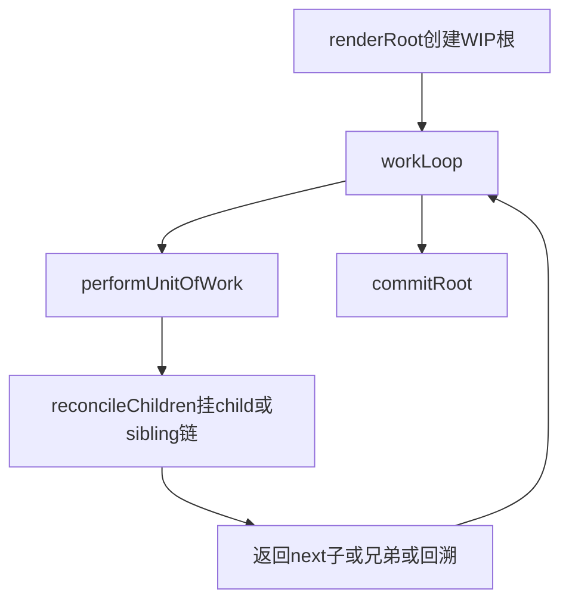
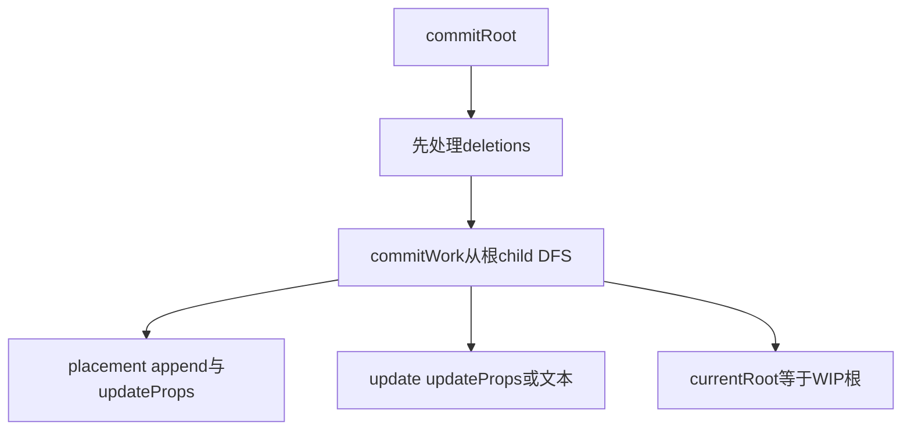
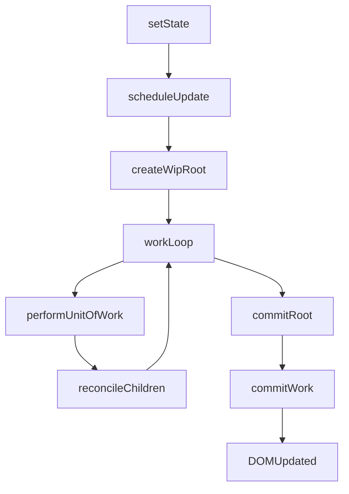

# React 原理（三）：Fiber 与协调（入门）

这篇不追求“完整 React 源码级细节”，只做一件事：  
**把 Fiber 为什么出现、它到底是什么、更新时怎么工作，讲到你能自己复述。**

你可以把阅读目标定成 3 句：

1. `VNode` 是描述，`Fiber` 是执行期工作单元。  
2. 渲染分成两阶段：`render/reconcile`（算）和 `commit`（改 DOM）。  
3. `useState` 的状态挂在函数组件 Fiber 上，而不是全局变量。

---

## 一、先抓主要矛盾：为什么要 Fiber

先看没有 Fiber 时，最容易踩的坑：

- 递归渲染把“树结构”和“执行过程”绑死，流程不清晰；
- 新旧树对齐时，缺少稳定节点承载运行期信息；
- 状态、DOM、更新标记散落在不同地方，难以组织更新。

Fiber 的作用就是把这些信息统一收口成一张“可遍历、可对齐、可提交”的工作树。

一句话：  
**Fiber 不是新的 UI 描述格式，而是渲染引擎的内部工作结构。**

---

## 二、VNode 与 Fiber：到底差在哪

### VNode（你写 JSX 后得到的）

- 关注“长什么样”：
  - `type`
  - `props`
  - `children`

它是“静态描述”。

### Fiber（渲染引擎工作时创建）

- 在 VNode 基础上加“执行信息”：
  - **结构关系**：`parent / child / sibling`
  - **旧树关联**：`alternate`
  - **真实 DOM 引用**：`stateNode`
  - **本轮动作**：`effectTag`（插入/更新/删除）
  - **函数组件状态**：`hooks`

它是“动态工作单元”。

可以类比为：

- VNode：产品设计稿
- Fiber：施工任务卡（带上级、同级、历史版本、施工动作）

---

## 三、Fiber 最小数据结构（逐字段解释）

```ts
type Fiber = {
  type: VNodeType | "ROOT";
  tag: "root" | "function" | "host" | "text";
  props: Props;

  parent: Fiber | null;
  child: Fiber | null;
  sibling: Fiber | null;

  alternate: Fiber | null;
  stateNode: Node | null;
  effectTag?: "placement" | "update" | "deletion";

  hooks: unknown[];
};
```

重点记这 5 组：

1. **`type/tag`**：我是谁（函数组件？宿主 DOM？文本？根？）
2. **`parent/child/sibling`**：我和别人什么关系
3. **`alternate`**：上一次同位置是谁（用于新旧对齐）
4. **`stateNode`**：我对应的真实 DOM（函数组件通常是 `null`）
5. **`hooks`**：函数组件的状态槽位数组

---

## 四、Fiber 树是怎么 build 起来的（首次 `render`）

可以把「建树」理解成：**从根 VNode 出发，用工作循环按深度优先顺序，一边走一边挂 `child/sibling` 链表**。

### 4.1 入口：先造一棵「正在施工」的根

首次调用 `render(vnode, container)` 时（仓库里对应 `renderRoot`）：

1. 记下 `rootVNode` 和容器 `rootContainer`。
2. 创建 **`workInProgressRoot`（WIP 根 Fiber）**：
   - `type: "ROOT"`，`stateNode` 指向真实容器 DOM；
   - **`alternate`**：若还没有上一棵已提交树，则为 `null`；若有，则指向 **`currentRoot`**（更新场景见下一节）。
3. 把 `nextUnitOfWork` 指向这个根，进入 `workLoop`。

### 4.2 `workLoop`：同步把整棵树「走一遍」

教学实现里是 **同步 while**：只要还有 `nextUnitOfWork`，就反复调用 `performUnitOfWork`。

这一步**不提交 DOM**（或说：宿主节点可能先 `createDOM` 出节点，但真正插入多数发生在 commit），核心是：**把子 Fiber 链表搭出来，并打上 `placement` 等标记**。

### 4.3 `performUnitOfWork`：对一个 Fiber 做「begin」类工作

根据 `tag` 分支（与 `reconciler.ts` 一致）：

| `tag` | 做什么 |
|-------|--------|
| `function` | `setHooksContext(fiber)` → 执行 `fiber.type(props)` 得到 **一个子 VNode** → `reconcileChildren(fiber, [childVNode])` |
| `host` / `text` | 若没有 `stateNode` 则 `createDOM`；再 `reconcileChildren` 处理子 VNode 列表（文本没有子） |
| `root` | 当作宿主类处理：`reconcileChildren` 用 `props.children`（一般是 `[App]`） |

**`reconcileChildren` 才是「把 VNode 变成子 Fiber 链表」的地方**：按子下标，把新 child 与 `fiber.alternate?.child` 为头结点的 **旧子 Fiber 链**对齐，生成新子 Fiber，并串成 `child → sibling → sibling`。

### 4.4 深度优先：下一个工作单元是谁？

`performUnitOfWork` 返回的下一个 Fiber：

1. 若有 **`child`**，下一个先走子（往深处）。
2. 否则尝试 **`sibling`**（同一层下一个兄弟）。
3. 再否则沿 **`parent`** 向上回溯，直到找到有 sibling 的祖先（标准 DFS 回溯）。

整棵 WIP 树建完后，`nextUnitOfWork` 变空，`workLoop` 末尾调用 **`commitRoot`**（见第六节）。

### 4.5 小结（一句话）

**Build = `renderRoot` 创建 WIP 根 + `workLoop` 反复 `performUnitOfWork`，在每个节点上 `reconcileChildren` 把 VNode 展开成 Fiber 链表。**



---

## 五、Fiber 树是怎么更新的（`setState` 之后再跑一轮）

更新与首次挂载共用同一套 `workLoop`，差别在于：**此时已经有一棵「上一棵已提交树」`currentRoot`**，`alternate` 不再为空。

### 5.1 触发：`setState` → `scheduleUpdate` → `scheduleFiberUpdate`

1. `setState` 改的是**当前函数 Fiber** 上 `hooks[i]` 里保存的状态。
2. 调度函数再次调用 `renderRoot` 的兄弟逻辑：`scheduleFiberUpdate`。
3. 新建 **WIP 根**，且 **`alternate: currentRoot`** —— 表示「我这棵新树要和上一棵已提交树对齐」。

根 Fiber 的 `props.children` 仍指向**同一个根 VNode 元素**（例如仍是 `<App />`），但执行 `App` 时读到的 state 已是新值，因此 **`App` 返回的新子 VNode 树会变**。

### 5.2 `reconcileChildren` 如何「更新」子链

对每个父 Fiber，用 **同下标** 把 **新 child VNode** 与 **oldFiber（从 `alternate.child` 开始沿 sibling 走）**比较：

- **`type` 相同**：复用旧 Fiber 上的 **`stateNode`（DOM）** 和 **`hooks`**，新 Fiber `effectTag: "update"`。
- **`type` 不同** 或旧的多出来：旧子树标 **`deletion`** 放进待删列表；新的需要新建 DOM 则 **`placement`**。

因此：**更新阶段 build 出来的 WIP 树，既可能复用节点，也可能插入新节点、标记删除旧节点**——这些都要靠 `alternate` + `effectTag` 表达。

### 5.3 小结（一句话）

**更新 = 再建一棵 WIP Fiber 树，但用 `alternate` 指向旧树，在 `reconcileChildren` 里决定复用 / 新建 / 删除，并打上 effectTag。**

---

## 六、commit：如何把 effectTag 落到真实 DOM

Render 阶段结束时调用 **`commitRoot`**（`workLoop` 末尾）。可以把它理解成：**只读 WIP 树上的标记，执行 DOM 副作用**。

### 6.1 顺序：先处理「删除」，再处理「子树提交」

实现里（`commitRoot`）：

1. **`deletions` 列表先逐个 `commitWork`**：把标了 `deletion` 的节点从父 DOM 上卸掉（有 `stateNode` 则 `removeChild`，否则往子树找 DOM）。
2. 再从 **`workInProgressRoot.child`** 开始做 **`commitWork` 深度优先遍历**（先子后兄弟）。

这样避免「父节点已删，子还在插」一类顺序问题（教学版仍简化）。

### 6.2 `commitWork` 对一个 Fiber 做什么

在拿到 **`parentDom`**（向上找第一个带 `stateNode` 的祖先）之后：

| `effectTag` | 行为（直觉） |
|-------------|----------------|
| `placement` | `appendChild(stateNode)`，再 **`updateProps(..., null)`** 做首次属性/事件 |
| `update` | 文本节点改 `nodeValue`；元素则 **`updateProps(next, prev)`** |
| `deletion` | 已在前面集中处理；此处可早退 |

**注意**：宿主 Fiber 在 `beginWork` 里往往已经 `createDOM` 了，commit 的 `placement` 负责「挂到树上」；更新则多数只改 props/文本。

### 6.3 收尾：`currentRoot = workInProgressRoot`

`commitRoot` 末尾把 **WIP 树提升为当前树**：`currentRoot = workInProgressRoot`，清空 WIP 指针。  
下一轮更新时，新的 WIP 根继续 `alternate: currentRoot`。

### 6.4 小结（一句话）

**Commit = 按 `deletions` 与 WIP 子树遍历，根据 `effectTag` 执行插入 / 更新 / 删除，最后把 WIP 树变成新的 `currentRoot`。**



---

## 七、为什么要分 render 与 commit 两阶段

### render/reconcile（计算阶段）

- 目标：算出“应该怎么变”
- 行为：构建 WIP Fiber 树，打标记
- 特点：不直接改 DOM

### commit（提交阶段）

- 目标：把计算结果落实到 DOM
- 行为：执行插入、更新、删除
- 特点：只做副作用，不再做树形决策

这样分层的好处：

- 思维上清晰：先决定，再执行
- 结构上可扩展：将来接优先级、时间切片不会推翻模型

---

## 八、协调（reconcile）到底在比什么

教学版先用最简单规则：**按同层下标对齐**。

对于某个父 Fiber：

- 新 children 有、旧 fiber 也有，且 `type` 相同 -> `update`
- 新 children 有、旧 fiber 没有 -> `placement`
- 新 children 没有、旧 fiber 有 -> `deletion`

> 这版故意不展开 key。  
> 缺点是列表重排会出错；但它足够帮助你先理解“新旧对齐 + 打标记 + commit”主线。

---

## 九、useState 在 Fiber 架构里怎么落位

`useState` 本质没变，还是“按顺序复用槽位”。  
变化是：槽位不在全局，而在当前函数 Fiber 上。

关键点：

1. 进入函数组件前：`setHooksContext(currentFunctionFiber)`
2. `useState` 读写 `hookContext.hooks[currentIndex]`
3. 每调用一次 `useState`，`currentIndex++`
4. 函数组件执行完：`setHooksContext(null)`

这就保证了：

- 同一个组件实例多次渲染：能复用正确状态
- 两个组件实例：状态互不串台

---

## 十、精简版 updateProps：只抓主要矛盾

本项目里 `updateProps` 只保留学习必需能力：

- `on*` 事件：更新时先 remove 再 add，避免重复绑定
- `className/class`
- `style`（字符串或简单对象）
- 普通属性赋值/删除
- 跳过 `children/key`

故意不做的细节（注释级说明即可）：

- 完整事件系统（如 capture 全覆盖）
- SVG/命名空间细节
- 复杂表单边界行为

---

## 十一、一张流程图收束整篇



你现在只要能说清下面这段话，就算真正入门 Fiber 了：

> 我们先把新旧树协调成一棵带更新标记的 WIP Fiber 树（render 阶段），  
> 再统一按标记提交到 DOM（commit 阶段）。  
> `useState` 状态挂在函数 Fiber 的 hooks 上，通过 hookContext + 游标按顺序复用。

---

## 十二、下一步看什么

按学习顺序建议：

1. 先把“按下标对齐”的 reconcile 手动推 2~3 个例子（新增、删除、同型更新）
2. 再引入 key，理解为什么“按下标”会在重排场景出错
3. 最后再看 `useEffect`，因为它本质属于 commit 阶段副作用管理

先把这篇吃透，再看完整 diff 会轻松很多。

